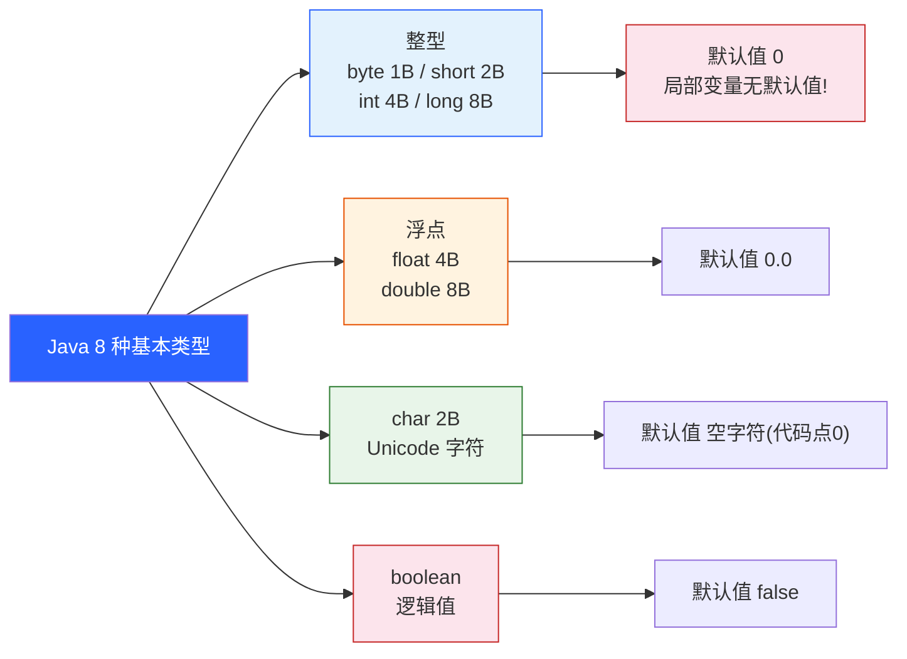
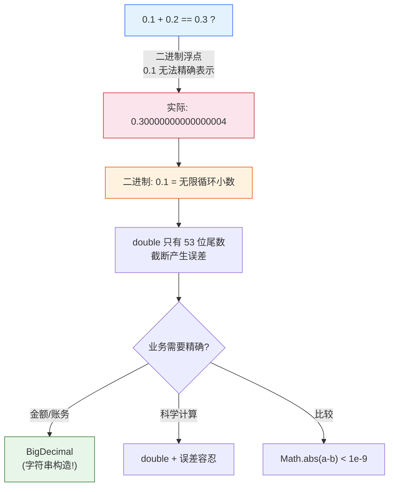
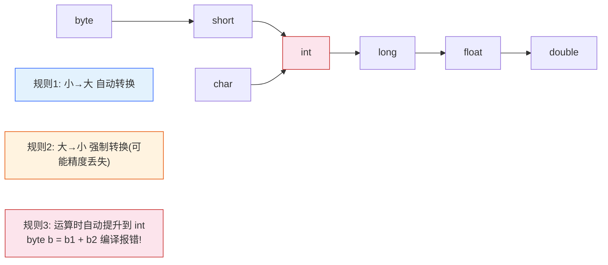
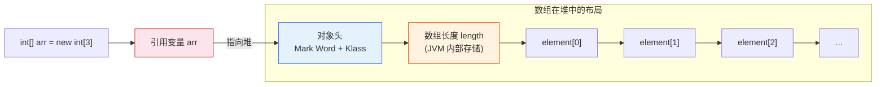
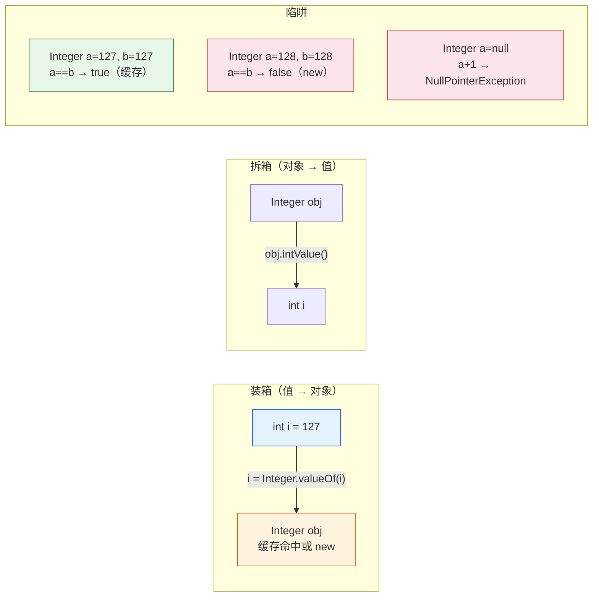
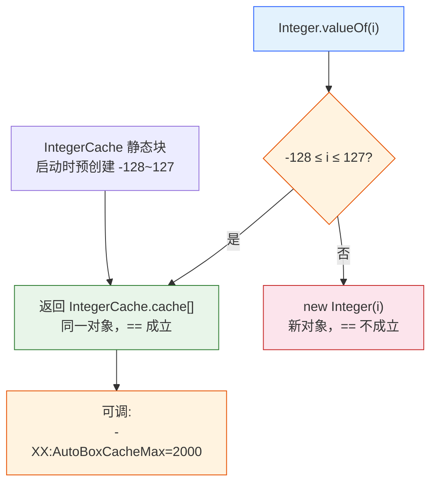

# 基础语法与数据类型

> 前置篇目：无（本篇是 Java 语言地基，不依赖其他篇目）。包装类缓存的源码深挖见《02-源码解析-IntegerCache与装箱拆箱》；字符串底层见《06-String家族源码》；泛型对基本类型的限制见《01-泛型擦除原理》块 24。
>
> 本篇知识点清单（31 项，按知识面五层标注，也是本篇出题的锚点）：
>
> **基础使用**：1. 8 种基本类型 · 2. 字面量规则 · 3. 默认值与局部变量 · 4. 变量种类与作用域 · 5. 运算符全览与优先级 · 6. 表达式/语句/块 · 7. 控制流 · 8. 字符串拼接入门
> **机制原理**：9. 补码表示 · 10. IEEE 754 浮点布局 · 11. 0.1+0.2≠0.3 的真相 · 12. 类型转换与复合赋值隐式强转 · 13. 运算数值提升 · 14. 数组内存布局 · 15. 装箱拆箱字节码 · 16. 包装类缓存机制 · 17. 各包装类缓存范围差异
> **高级进阶**：18. 位运算全集 · 19. 整数溢出回绕 · 20. BigInteger · 21. BigDecimal 三大坑
> **实战技能**：22. 浮点比较三姿势 · 23. 金额计算 · 24. Arrays 工具与复制 · 25. 多维数组与锯齿 · 26. == vs equals 四象限 · 27. 三目运算符拆箱 NPE · 28. 高频坑 6 连 · 29. 除法与取模
> **设计权衡**：30. 基本类型 vs 包装类 · 31. float/double/BigDecimal 三选一 · 32. char 为什么是 2 字节

---

## 8 种基本类型：每种多大、能存什么？

**本块讲什么**：Java 的 8 种基本类型各自占多少位、取值范围多少、默认值是什么——这是所有运算的地基。

Java 有且只有 8 种基本类型（primitive type），其余全是引用类型：

| 类型 | 大小 | 取值范围 | 默认值 |
|---|---|---|---|
| `byte` | 1 字节 | -128 ~ 127 | 0 |
| `short` | 2 字节 | -32768 ~ 32767 | 0 |
| `int` | 4 字节 | -2³¹ ~ 2³¹-1（约 ±21 亿） | 0 |
| `long` | 8 字节 | -2⁶³ ~ 2⁶³-1 | 0L |
| `float` | 4 字节 | ±3.4e38，约 7 位有效数字 | 0.0f |
| `double` | 8 字节 | ±1.8e308，约 15 位有效数字 | 0.0d |
| `char` | 2 字节 | 0 ~ 65535（Unicode 代码点） | '\u0000'（空字符） |
| `boolean` | 未定义 | true / false | false |



**两个容易想当然的点**：

1. **`char` 是 2 字节、无符号**——它存的是 Unicode 代码点，不是"字符的编码字节"。中文字符恰好在 0~65535 内占 1 个 char；emoji 超出这个范围，要 2 个 char（代理对），这是后面 String 篇的重点。
2. **`boolean` 大小规范没规定**——JLS 只定义了 true/false 两个值，JVM 规范说"boolean 数组每个元素占 1 字节，单独 boolean 变量编译后视作 int"。所以"boolean 占 1 bit"是错的。

> 边界：`int` 的范围约 ±21 亿，很多"看起来没问题"的运算（如 30 亿毫秒、文件大小字节数）会悄悄溢出——第 19 块专门讲溢出。`long` 的默认值是 0L 不是 0（字面量后缀），`float` 是 0.0f，写错后缀编译不过。

---

## 字面量：写数字、字符、字符串有什么规矩？

**本块讲什么**：源码里直接写的"值"叫字面量（literal），各种类型的字面量写法有严格规则，写错了直接编译报错。

**整数字面量**默认是 `int` 类型：

```java
int a = 100;            // 十进制
int b = 0x1F;           // 十六进制（0x 开头），= 31
int c = 0b1010;         // 二进制（0b 开头，JDK 7+），= 10
long d = 3000000000L;   // 必须加 L/l 后缀，否则编译报错！
long e = 3_000_000_000L; // 下划线分隔（JDK 7+），提高可读性
```

**实测证据**（JDK 8 编译）：`int i = 3000000000;` 直接报错 `错误: 过大的整数: 3000000000`——因为 30 亿超过 int 上限，不加 L 就编译不过。这就是为什么"时间戳秒数、文件大小"这类大数必须写 L。

**浮点字面量**默认是 `double`：

```java
double f = 3.14;      // 默认 double
float g = 3.14f;      // 必须加 f/F，否则编译报错（double 不能自动窄化）
double h = 3.14e10;   // 科学计数法 = 314 亿
```

**字符和字符串字面量**：

```java
char c1 = 'A';            // 单引号：字符
char c2 = '\n';           // 转义字符（\n \t \\ \' \" \uXXXX）
String s = "Hello";       // 双引号：字符串
```

> 边界：`byte b = 1000;` 编译报错（超出 byte 范围），但 `byte b = 100;` 可以——编译期常量在范围内允许"隐式窄化"（JLS 5.2 的常量表达式规则）。规则是：**变量间的窄化必须显式强转，编译期常量在范围内可以自动收窄**。

---

## 默认值 vs 局部变量：为什么字段可以不初始化？

**本块讲什么**：类的字段（成员变量）有默认值，方法的局部变量没有——用未初始化的局部变量直接编译报错。

**字段（成员变量）有默认值**（见第 1 块表格）：`int` 是 0，`boolean` 是 false，引用类型是 `null`。所以：

```java
class Counter {
    int count;        // 默认 0，可以直接用
    String name;      // 默认 null
}
```

**局部变量没有默认值**，必须显式初始化才能用：

```java
void f() {
    int x;
    int y = x + 1;    // ❌ 编译错误：可能尚未初始化变量 x
}
```

**实测证据**（JDK 8 编译）：上面的代码报 `错误: 可能尚未初始化变量x`。这是 JLS 的"明确赋值"（definite assignment）规则——编译器做数据流分析，能证明变量在使用前"所有路径都赋过值"才放行。

```java
void f(boolean flag) {
    int x;
    if (flag) {
        x = 1;
    }
    int y = x;    // ❌ 编译错误：flag=false 的路径没赋值
}
```

**为什么这么设计？** 字段有默认值是因为对象创建时 JVM 必须把内存清零（否则读到垃圾值）；局部变量在栈上，不强制清零是性能考虑，索性要求"不初始化不让用"——把"忘了初始化"这类 bug 消灭在编译期。

> 边界：数组元素是"字段"的待遇——`new int[5]` 后 5 个元素全是 0（实测：`int[] arr = new int[5]; arr[0]` 输出 0），因为数组元素的内存也会被清零。引用类型数组初始全是 null。

---

## 变量有四种：实例、类、局部、参数，作用域怎么算？

**本块讲什么**：Java 的"变量"分四种，作用域和生命周期完全不同；命名规范也是面试和 Code Review 的常客。

| 种类 | 声明位置 | 生命周期 | 作用域 |
|---|---|---|---|
| 实例变量（字段） | 类内、无 static | 随对象创建/回收 | 整个类（实例方法内） |
| 类变量（static 字段） | 类内、有 static | 随类加载/卸载，全局一份 | 整个类（含静态方法） |
| 局部变量 | 方法/块内 | 方法执行期间 | 声明点到所在块结束 |
| 参数 | 方法签名 | 方法调用期间 | 整个方法体 |

**命名规范**（Oracle 官方约定，代码审查会查）：

```java
int gearRatio;          // 变量：驼峰，首字母小写
static final int NUM_GEARS = 6;   // 常量：全大写 + 下划线
```

**作用域的一个经典坑——变量遮蔽（shadowing）**：

```java
class Scope {
    int x = 10;                    // 实例变量
    void f() {
        int x = 20;                // 局部变量遮蔽了实例变量
        System.out.println(x);     // 输出 20，不是 10！
        System.out.println(this.x); // 想访问实例变量必须 this.x
    }
}
```

局部变量和字段重名时，局部变量"遮蔽"字段，方法内裸写 `x` 访问到的是局部变量。**IDE 一般会提示 shadowing，但无声遮蔽照样能编译过**——这是隐蔽 bug 来源，规范上应避免重名。

> 边界：块（花括号）也形成作用域：`for (int i = 0; ...)` 的 `i` 在循环外不可见；JDK 不支持在嵌套块里声明同名局部变量（与 C 不同，Java 会编译报错）。

---

## 运算符全览：优先级怎么记不背错？

**本块讲什么**：Java 运算符分 7 大类约 40 个符号，优先级表是"查表"不是"背表"，但最高/最低几级必须记牢。

**分类总览**（Oracle 教程分类）：

| 类别 | 运算符 | 一句话 |
|---|---|---|
| 赋值 | `=` `+=` `-=` `*=` `/=` `%=` `<<=` `>>=` `>>>=` `&=` `^=` `|=` | 优先级最低 |
| 三元 | `? :` | 唯一三目运算符 |
| 逻辑 | `&&` `\|\|` `!` | 短路求值 |
| 关系 | `==` `!=` `<` `>` `<=` `>=` `instanceof` | 比较 |
| 位运算 | `&` `\|` `^` `~` `<<` `>>` `>>>` | 按位操作 |
| 一元 | `+` `-` `++` `--` `!` | 单操作数 |
| 算术 | `+` `-` `*` `/` `%` | 加减乘除取模 |

**优先级关键记忆**（从高到低，只记容易错的）：

```
后缀 ++/--  >  一元 ! ~ ++/--  >  乘除 %  >  加减  >  移位 << >> >>>
>  关系 < > >= <= instanceof  >  相等 == !=  >  位与 &  >  异或 ^  >  位或 |
>  逻辑与 &&  >  逻辑或 ||  >  三元 ?:  >  赋值 =
```

**最容易错的三处**：

1. **`==` 比 `!=` 优先级高？不——它们在同级**，从左到右；真正的高危组合是 `&`/`^`/`|` 高于 `&&`/`||`，导致 `a & b == c` 先算 `b == c`。
2. **`<<` 高于 `&`**：`1 << 4 & 0xFF` 先移位后按位与——写"标志位+掩码"组合表达式时必须加括号，靠优先级会读错。
3. **赋值是右结合**：`a = b = c = 1` 从右往左赋，链式赋值合法。

**前缀/后缀 `++` 的差异**（Oracle 官方例子）：

```java
int i = 3;
System.out.println(++i);   // 4（先加后用）
System.out.println(i++);   // 4（先用后加），之后 i 是 5
```

> 边界：`instanceof` 的左侧操作数必须是引用类型，`null instanceof X` 恒为 false 且不报错。`==` 用于引用类型比较的是"引用是否同一"，不是内容——详见第 25 块。

---

## 表达式、语句和块是什么关系？

**本块讲什么**：Java 程序的三个结构层次——表达式算值、语句执行动作、块分组；理解这个层次才能读懂"什么地方能放什么"。

```
表达式（Expression）: 1 + 2、a > b、obj.method() —— 能算出"值"
语句（Statement）   : x = 1;、if (...) ...;、return; —— 执行"动作"
块（Block）         : { 语句... } —— 一组语句，构成作用域
```

**三个容易混淆的事实**：

1. **表达式加上分号就是"表达式语句"**：`i++;` `x = 1;` `obj.method();` 合法；但 `1 + 2;` 也能编译过（无副作用，会有警告）——"表达式语句"必须是赋值、自增自减、方法调用、new 这四类之一（JLS 14.8），`a > b;` 这种比较表达式单独成句是编译错误。
2. **赋值是表达式**（有值）：`int a; int b = (a = 5);` 合法，`a = 5` 的值是 5。这解释了链式赋值 `a = b = c = 1` 为什么成立。
3. **块既是分组也是作用域**：`{ int x = 1; }` 里的 x 出块即失效（见第 4 块）。

**表达式求值顺序的坑**（JLS 15.7）：Java 保证**从左到右**求值操作数，且"先算左侧操作数、再算右侧"：

```java
int i = 0;
int[] arr = new int[10];
arr[i++] = i++;        // 先求 arr[i++]（下标取 0，i 变 1），再求右侧 i++（取 1，i 变 2）
                       // 结果：arr[0] = 1，i = 2
```

> 边界：Java 的求值顺序是确定且规范的（区别于 C/C++ 未定义行为）——但靠它写"一行多个副作用"仍是坏味道，规则上"一行一个副作用"。

---

## 控制流：if / switch / 循环怎么选？

**本块讲什么**：Java 的控制流语句全集，重点在 switch 的类型限制和 for-each 的适用边界。

**分支**：

```java
if (score >= 90) {
    // ...
} else if (score >= 60) {
    // ...
} else {
    // ...
}

switch (day) {                    // 支持 int/char/byte/short/String/enum
    case 1: System.out.println("周一"); break;
    case 2:
    case 3: System.out.println("工作日"); break;   // 穿透：case 2 落入 case 3
    default: System.out.println("其他");
}
// JDK 14+ 箭头写法（不穿透、不用 break）
switch (day) {
    case 1 -> System.out.println("周一");
    default -> System.out.println("其他");
}
```

**switch 的类型限制（冷知识）**：支持 `int/char/byte/short`（及对应包装类）、`String`（JDK 7+）、`enum`（JDK 5+）；**不支持 `long/float/double/boolean`**——因为 switch 的字节码是 `tableswitch/lookupswitch`，只处理 int 类值，long/浮点比较需要复杂逻辑不划算。

**循环**：

```java
while (cond) { ... }          // 先判断后执行，可能一次都不执行
do { ... } while (cond);      // 先执行后判断，至少执行一次
for (int i = 0; i < n; i++) { ... }       // 经典计数循环
for (String s : list) { ... }             // for-each（JDK 5+）
for (;;) { ... }                          // 死循环
```

**for-each 的两个边界**（常考）：

1. 遍历时**不能增删集合元素**（快速失败机制见《11-集合框架体系》）；
2. **不能拿到下标**——需要下标必须退回经典 for，或 `List.indexOf`（O(n) 别用）。

> 边界：`break` 跳出当前循环，`continue` 跳过本次；带标签的 `break label:` 可以跳出嵌套循环（rarely used，但面试可能问）。`return` 终止整个方法。

---

## 字符串拼接入门：+ 为什么能拼字符串？

**本块讲什么**：`+` 是 Java 唯一"重载"的运算符（对 String 而言），拼接的底层是 StringBuilder——细节在 String 篇，这里打地基。

```java
String s = "Hello" + " " + "World";   // 字面量拼接：编译期就合成 "Hello World"
String t = "count=" + 42;             // 数字 + 字符串：数字先转字符串
```

**三个机制**（详细深挖见《06-String家族源码》）：

1. **字面量拼接是编译期常量折叠**：`"Hello" + " " + "World"` 在 javac 阶段就变成 `"Hello World"` 一个字符串常量，运行期零拼接。
2. **变量拼接走 StringBuilder**：`"count=" + n` 编译成 `new StringBuilder().append("count=").append(n).toString()`。
3. **字符串"相加"是唯一重载的运算符**：Java 不允许自定义运算符重载，`+` 对 String 的特权是语言内建的。

**一个隐藏性能坑**（String 篇展开）：循环里 `s += x` 每次循环都 new 一个 StringBuilder，10 万次循环慢 50 倍以上——循环拼接必须手动用 StringBuilder。

> 边界：`null + "str"` 结果是 `"nullstr"`（null 被转成字符串 "null"），不是 NPE 也不是空串——想拼接"空"要自己判 null。

---

## 整数在内存里怎么存？补码为什么能把减法变加法？

**本块讲什么**：整型在内存里是补码（two's complement）存储，这是"溢出回绕、负数位运算"等现象的总根源。

**三个码**（以 byte 的 -1 为例）：

| 编码 | -1 的 8 位表示 | 说明 |
|---|---|---|
| 原码 | 1000_0001 | 最高位符号位，其余绝对值 |
| 反码 | 1111_1110 | 原码除符号位按位取反 |
| 补码 | 1111_1111 | 反码 + 1 |

**补码的两大好处**：

1. **减法变加法**：`5 - 3` 在 CPU 里就是 `5 + (-3)`，而 -3 的补码 `1111_1101` 与 5 相加正好得 2（丢弃进位）——CPU 只需要加法器，硬件简单。
2. **0 只有一种表示**：原码里 `+0 = 0000_0000`、`-0 = 1000_0000` 两种表示浪费；补码统一为 0000_0000，省下的编码让 `int` 能多表示一个负数（-2³¹，比正数多 1 个）。

**用补码算一个负数右移**（第 18 块也会用到）：

```
-8 的 int 补码：1111_1111_1111_1111_1111_1111_1111_1000
>> 1（算术右移，符号位补 1）：..._1100 = -4  ✓（-8/2 = -4）
```

> 边界：`Integer.MIN_VALUE` 的补码是 1000...0000，对它取负（`-Integer.MIN_VALUE`）还是它自己——经典溢出。JLS 4.2.2 定义了整型的补码表示，这是所有整型行为的第一性原理。

---

## 浮点怎么存？IEEE 754 的符号/指数/尾数

**本块讲什么**：float/double 按 IEEE 754 标准存储：符号位 + 指数位 + 尾数位——"浮点"二字来自小数点可以浮动（由指数决定）。

| 类型 | 符号位 | 指数位 | 尾数位 | 有效数字 |
|---|---|---|---|---|
| float | 1 bit | 8 bit | 23 bit | 约 7 位 |
| double | 1 bit | 11 bit | 52 bit | 约 15 位 |

**一个 float 的拆解**（如 6.5）：

```
6.5 = 110.1₂ = 1.101₂ × 2²
符号位: 0（正）
指数:  2 + 127 = 129（存储时加偏置 127，为了比较方便）
尾数:  101（前导 1 不存，省 1 bit）
```

**特殊值**（实测 JDK 8）：

```java
System.out.println(1.0 / 0.0);   // Infinity（正无穷，不是异常！）
System.out.println(-1.0 / 0.0);  // -Infinity
System.out.println(0.0 / 0.0);   // NaN（Not a Number）
```

**两个反直觉事实**：

1. **整数除以 0 抛 ArithmeticException，浮点除以 0 得 Infinity**——浮点规范里除零是"合法运算"。
2. **NaN 不等于任何数，包括它自己**：`Double.NaN == Double.NaN` 是 false。判断 NaN 要用 `Double.isNaN(x)`。

> 边界：float 只有 7 位有效数字，`0.1f + 0.2f == 0.3f` 也是 false（float 精度更差）。记住"浮点数是近似值"这个前提，是第 11 块和第 22 块的起点。

---

## 为什么 0.1 + 0.2 ≠ 0.3？

**本块讲什么**：0.1 在二进制里是无限循环小数，double 只有 53 位尾数存不下——这是所有浮点误差的总根源。

**实测**（JDK 8）：

```java
System.out.println(0.1 + 0.2 == 0.3);   // false
System.out.println(0.1 + 0.2);           // 0.30000000000000004
```

**根因拆解**：

1. 十进制的 0.1 = 二进制的 `0.00011001100110011...`（无限循环）——就像 1/3 在十进制里无限循环一样，0.1 在二进制里**根本无法精确表示**；
2. double 只有 52 位尾数（加隐含位 53 位），无限循环只能截断存储 → 存储的"0.1"实际是 0.1000000000000000055511...；
3. 两个近似值相加，误差累积 → 0.30000000000000004。



**连带结论**：凡是"金额、计数、需要精确相等"的场景都不能用 double——第 21/22/23 块给出完整方案。

> 边界：不是"Java 的 bug"，是 IEEE 754 的固有属性，任何语言的 double 都一样（JavaScript 的 `0.1+0.2` 也是 0.30000000000000004）。用 BigDecimal（字符串构造）或整数单位（分）表达金额。

---

## 类型转换：宽化自动、窄化强转、复合赋值隐式强转

**本块讲什么**：小范围 → 大范围自动转（宽化），大范围 → 小范围必须强转（窄化），但复合赋值运算符自带一次隐式强转——这是最容易翻车的一条。

**宽化转换**（自动，无精度损失或可接受）：

```
byte → short → int → long → float → double
                ↑
               char（char → int 及以上自动）
```

**窄化转换**（必须显式强转，可能丢精度/丢符号）：

```java
long big = 3000000000L;
int i = (int) big;        // 必须 (int)，结果截断
double d = 3.99;
int j = (int) d;          // 3（向零截断，不是四舍五入！）
```

**复合赋值的隐式强转（最隐蔽的坑）**——实测（JDK 8）：

```java
byte bv = 100;
bv += 1000;               // bv = (byte)(bv + 1000)，自带强转！
System.out.println(bv);   // 76（1100 转 byte 溢出回绕）
```

`bv += 1000` 编译成 `bv = (byte)(bv + 1000)`（JLS 15.26.2），所以**不报编译错误**，但值悄悄回绕成 76。而等价写法 `bv = bv + 1000;` 会编译报错（int 不能赋给 byte）。**同一个意图，两种命运**——这就是复合赋值"太方便"的代价。



**实测编译证据**（JDK 8）：`byte b3 = b1 + b2;`（b1、b2 是 byte）报 `错误: 不兼容的类型: 从int转换到byte可能会有损失`——因为 byte 相加先提升为 int（第 13 块），结果赋回 byte 必须强转。

> 边界：`long → float` 也是"宽化"（float 指数范围更大），但**大 long 转 float 会丢精度**——"宽化不丢类型、但可能丢精度"，这是宽化表里唯一的例外，面试常考。

---

## 运算时的数值提升：byte + byte 为什么是 int？

**本块讲什么**：所有算术运算前，操作数会先按规则提升到"够大的类型"——这是无数编译错误和隐蔽 bug 的来源。

**二元数值提升规则**（JLS 5.6.2，按序）：

1. 有 double → 全提升 double；
2. 否则有 float → 全提升 float；
3. 否则有 long → 全提升 long；
4. **否则（只剩 byte/short/char/int）→ 全部提升 int**。

**实测**（JDK 8）：

```java
byte b1 = 100, b2 = 100;
int sum = b1 + b2;              // byte+byte 结果是 int，不是 byte！
System.out.println(sum);        // 200

char c = 'A';
System.out.println(c + 1);      // 66（char 提升 int）
System.out.println((char)(c + 1));  // 'B'

System.out.println(Integer.MAX_VALUE + 1L);   // 2147483648（int+long → long，不溢出）
```

**三组后果**：

1. `byte/short/char` 参与运算一律变 int——所以 `byte b3 = b1 + b2` 编译报错（第 12 块）；
2. `char` 参与算术变 int——`'A' + 1` 是 66 不是 'B'，想得字符必须强转回 char；
3. `int + long`、`int + float` 等"混搭"按提升表走，结果类型是较大者。

> 边界：**赋值时的提升**（把 int 赋给 long）和**运算时的提升**是两回事：赋值是宽化/窄化（第 12 块），运算是"先把操作数统一到较大类型再算"。`long x = Integer.MAX_VALUE + 1;` 没有 L 后缀，`Integer.MAX_VALUE + 1` 还是 int 运算 → 溢出为 -2147483648，赋给 long 也没救——先算后转，方向别搞反。

---

## 数组在内存里长什么样？length 是字段还是指令？

**本块讲什么**：数组是"定长、连续、协变"的引用类型对象，length 通过 JVM 专用指令访问——这决定了它的性能和限制。



**三个机制事实**：

1. **数组是对象**：堆里有对象头，元素连续排列——所以遍历数组对 CPU 缓存友好，比链表快一个量级（衔接《11-集合框架体系》ArrayList 就是数组）；
2. **length 不是字段、不是方法，是 JVM 指令**：`arr.length` 编译成 `arraylength` 指令（实测 javap：`1: arraylength / 2: ireturn`），一次内存读取，O(1)；
3. **元素有默认值**：`new int[5]` 后全 0、引用类型数组全 null（实测：`int[] arr = new int[5]; arr[0]` 输出 0）。

**协变与运行时检查**（衔接《01-泛型擦除原理》块 5）：数组是协变的（`String[]` 是 `Object[]` 的子类型），但赋值后运行时逐个检查元素类型——`Object[] o = new String[1]; o[0] = 1;` 编译通过、运行抛 `ArrayStoreException`。泛型数组被禁止正是为了躲开这个运行时检查。

> 边界：`int[] a = new int[0];` 合法（空数组），`new int[-1]` 抛 NegativeArraySizeException。数组长度是 int（最大约 21 亿），超过得用集合或分段。

---

## 装箱拆箱的字节码真相

**本块讲什么**：自动装箱拆箱不是 JVM 魔法，是 javac 生成的普通方法调用——看字节码就全明白了。

**源码**：

```java
Integer box = 100;    // 自动装箱
int unbox = box;      // 自动拆箱
```

**等价于**：

```java
Integer box = Integer.valueOf(100);   // 装箱 = valueOf 调用
int unbox = box.intValue();           // 拆箱 = intValue 调用
```

**实测字节码**（JDK 8 javap -c）：

```text
2: invokestatic  Integer.valueOf:(I)Ljava/lang/Integer;   // 装箱
...
7: invokevirtual Integer.intValue:()I                     // 拆箱
```

**两个推论**：

1. 装箱/拆箱各是一次方法调用 + 可能一次对象创建——**循环里装箱是性能杀手**（见源码解析文档第 7 节，10 万次装箱差 10 倍以上）；
2. `valueOf` 是装箱的统一入口，它的缓存逻辑（第 16 块）因此成为"同一个 `==` 两种结果"的总开关。



> 边界：JDK 9 起 `new Integer(int)` 标注 `@Deprecated`，官方注释："It is rarely appropriate to use this constructor."——所有装箱走 valueOf/自动装箱，显式 new 包装类是反模式（详细见《02-源码解析-IntegerCache与装箱拆箱》）。

---

## 包装类缓存：为什么 128 == 128 是 false？

**本块讲什么**：Integer 的 valueOf 对 -128~127 直接返回缓存对象，超出就 new——"同一个 == 两种结果"的完整机制。

**实测**（JDK 8）：

```java
Integer a = 100, b = 100;
System.out.println(a == b);    // true（同一个缓存对象）
Integer c = 200, d = 200;
System.out.println(c == d);    // false（两个新对象）
Integer e = 200;
System.out.println(e == 200);  // true（包装类 vs 基本类型：拆箱比数值）
```

**机制**（源码见《02-源码解析-IntegerCache与装箱拆箱》）：

```java
public static Integer valueOf(int i) {
    if (i >= IntegerCache.low && i <= IntegerCache.high)
        return IntegerCache.cache[i + (-IntegerCache.low)];  // 命中：同一对象
    return new Integer(i);                                   // 未命中：新对象
}
```

`IntegerCache` 是 `Integer` 的私有静态内部类，**类加载时静态块一次性 new 出 -128~127 共 256 个对象**；`high` 默认 127，可用 `-XX:AutoBoxCacheMax=2000` 调大（只能调大不能调小）。



**结论一句话**：包装类之间比相等**一律用 equals / Objects.equals，绝不 ==**——缓存只保证 -128~127 内是同一对象，超出范围行为就变了，靠 == 等于靠运气。

> 边界：IntegerCache 只缓存 Integer；`-XX:AutoBoxCacheMax` 影响 valueOf 和自动装箱（自动装箱也是 valueOf），但对 `new Integer()` 无效（new 永远新对象）。

---

## 各包装类缓存范围为什么不一样？

**本块讲什么**：8 个包装类里 5 个有缓存、范围各不相同，Float/Double 没有——范围选择背后是"值域大小 vs 命中率"的权衡。

| 包装类 | 缓存范围 | 为什么 |
|---|---|---|
| `Boolean` | TRUE / FALSE（就 2 个实例） | 值域只有 2，全缓存 |
| `Byte` | -128~127（全量） | byte 总共 256 个值，全缓存 |
| `Short` | -128~127 | 短整型常用区间 |
| `Integer` | -128~127（可调大） | 常规整数高频区间，AutoBoxCacheMax 可调 |
| `Long` | -128~127 | 同上 |
| `Character` | 0~127（只 ASCII） | 常用字符在 ASCII 区 |
| `Float` | 无 | 值域太大（2³² 个值），缓存无意义 |
| `Double` | 无 | 同上 |

**一个隐藏的设计细节**：`Character` 只缓存 0~127——因为"程序里写死的字符字面量"几乎都在 ASCII 区，缓存 0~65535 要 6 万多个对象，收益不成比例。**缓存范围的本质是"常见值区间"的工程判断**，不是标准强制。

**实测验证**（JDK 8）：

```java
Character c1 = 'A', c2 = 'A';
System.out.println(c1 == c2);    // true（0~127 缓存）
Character c3 = '中', c4 = '中';
System.out.println(c3 == c4);    // false（中文字符超出缓存！）
Boolean b1 = true, b2 = true;
System.out.println(b1 == b2);    // true（就俩实例）
Double d1 = 1.0, d2 = 1.0;
System.out.println(d1 == d2);    // false（无缓存）
```

> 边界：`Long` 缓存范围也是 -128~127，和 Integer 一样可遇不可求——面试问"哪些包装类有缓存"答案是 5 个（Boolean/Byte/Short/Integer/Long/Character 共 6 个有，Float/Double 无），其中 Boolean 是"逻辑上有缓存"。

---

## 位运算全集：& | ^ ~ << >> >>> 各是什么？

**本块讲什么**：6 种位运算的语义、算术右移与逻辑右移的区别、位运算的实战用途。

| 运算符 | 名称 | 作用 |
|---|---|---|
| `&` | 按位与 | 两个 1 才得 1（掩码） |
| `\|` | 按位或 | 一个 1 就得 1（置位） |
| `^` | 按位异或 | 不同得 1（翻转/交换） |
| `~` | 按位取反 | 0↔1（含符号位） |
| `<<` | 左移 | 低位补 0，等价 ×2ⁿ |
| `>>` | 算术右移 | 高位补符号位，等价 ÷2ⁿ |
| `>>>` | 逻辑右移 | 高位补 0（无符号视角） |

**实测**（JDK 8）：

```java
int x = -8;                       // 补码: ...1111_1000
System.out.println(x >> 1);       // -4   算术右移（高位补 1，保持负数）
System.out.println(x >>> 1);      // 2147483644  逻辑右移（高位补 0，变正数）
System.out.println(8 << 2);       // 32   左移 = ×4
System.out.println(0b1100 & 0b1010);  // 8   1100 & 1010 = 1000
System.out.println(0b1100 | 0b1010);  // 14  1100 | 1010 = 1110
System.out.println(0b1100 ^ 0b1010);  // 6   1100 ^ 1010 = 0110
```

**三个实战场景**：

1. **掩码取位**：`int low4 = value & 0x0F;` 取低 4 位；`boolean odd = (n & 1) == 1;` 判奇偶（比 `% 2` 快）；
2. **标志位打包**：用 int 的 32 位存 32 个开关，`flags |= 1 << 3;` 置位、`flags &= ~(1 << 3);` 清零、`(flags >> 3 & 1) == 1` 检查；
3. **异或交换**（经典但别用）：`a ^= b; b ^= a; a ^= b;`——无临时变量交换，纯炫技，可读性差。

> 边界：`<<` 的移位量对 int 取模 32（`1 << 32` 等于 `1 << 0`）、对 long 取模 64——移位数超范围不会报错，是隐蔽坑。`>>>` 对负数会得到大正数（实测 2147483644），只适用于无符号场景（如 hash 计算）。

---

## 整数溢出不是异常，是回绕

**本块讲什么**：Java 的整数运算溢出不抛异常，而是按补码"回绕"（wrap around）——理解这一点，才能主动防溢出。

**实测**（JDK 8）：

```java
int m = Integer.MAX_VALUE;      // 2147483647
System.out.println(m + 1);      // -2147483648（回绕到最小值！）
System.out.println(-m);         // -2147483647（注意：-MAX 不是 MIN）
```

**为什么 Java 不报错？** 三个原因：

1. **硬件层面**：CPU 的整数加法器就是回绕的，抛异常要加检查指令，每个算术运算都检查性能不可接受；
2. **语言设计**：Java 沿用 C 的行为（C 里无符号溢出回绕、有符号溢出是未定义行为，Java 把它规范化为"总是回绕"）；
3. **JLS 4.2.2 明确定义**："整数运算如果溢出，结果取数学结果的低 n 位（补码表示）"——**回绕是规范行为，不是 bug**。

**实战风险点**：

```java
// 典型事故：毫秒时间戳转秒
long seconds = System.currentTimeMillis() / 1000;  // 没问题

// 典型事故：两个 int 相乘
int width = 50000, height = 50000;
long area = width * height;       // ❌ 先按 int 相乘溢出，再转 long
long area2 = (long) width * height;  // ✅ 先提升 long 再乘
```

**主动防溢出**（JDK 8+）：

```java
int sum = Math.addExact(a, b);      // 溢出抛 ArithmeticException
long mul = Math.multiplyExact(a, b);
int max = Math.addExact(Integer.MAX_VALUE, 1);  // 抛异常
```

`Math.addExact/subtractExact/multiplyExact` 等一组方法，溢出即抛异常——**需要"宁可异常不可静默错"的场景用它**。

> 边界：浮点溢出不会抛异常，而是得 `Infinity`（第 10 块）；`Math.toIntExact(long)` 把 long 转 int 也带溢出检查。判断是否溢出，面试常考 `a + b < a`（同号相加异号即溢出）这类技巧，实际用 addExact 更可靠。

---

## BigInteger：超大整数什么时候用？

**本块讲什么**：long 也不够用时，用 BigInteger 做任意精度整数——代价是性能和一个"不可变对象地狱"。

**基本用法**：

```java
BigInteger big = new BigInteger("123456789012345678901234567890");
BigInteger two = big.multiply(BigInteger.valueOf(2));
System.out.println(two);          // 246913578024691357802469135780
```

**三个要点**：

1. **构造必须用字符串或 valueOf**：`new BigInteger(123)` 会编译报错（没有 int 构造器），`BigInteger.valueOf(long)` 也行；
2. **运算全是方法**：add/subtract/multiply/divide/remainder/pow——没有运算符，代码啰嗦；
3. **不可变**：每个运算都返回新对象——循环里 BigInteger 运算会产生大量中间对象，性能比 long 差 10 倍以上。

**什么时候用**：密码学（RSA 大数）、哈希碰撞测试、数学运算库——**业务代码里几乎不用**，能用 long（或拆分成两个 long）就别用 BigInteger。

> 边界：BigDecimal 是 BigInteger 的近亲（小数版），第 21 块详述。**面试题"Java 里最大的整数类型"答案不是 long，是 BigInteger**（理论上无限大，受内存限制）。

---

## BigDecimal 三大坑：double 构造 / scale / equals

**本块讲什么**：BigDecimal 是金额计算的唯一正道，但用错构造器、用错比较方法会得到"看似精确实则错误"的结果。

**坑 1：用 double 构造 = 没救**（实测 JDK 8）：

```java
new BigDecimal(0.1);          // 0.1000000000000000055511151231257827021181583404541015625
new BigDecimal("0.1");        // 0.1  ← 必须用字符串！
```

double 构造器把 double 的**二进制近似值**原样展开成十进制——误差反而"精确暴露"了。**永远用字符串构造**：`new BigDecimal("0.1")`。

**坑 2：equals 要求 scale 相同**：

```java
new BigDecimal("0.10").equals(new BigDecimal("0.1"));   // false！scale 不同（2 vs 1）
new BigDecimal("0.10").compareTo(new BigDecimal("0.1")); // 0（数值相等）
```

**比较数值一律用 compareTo**，equals 只在"值且精度都相同"时为 true——这不是 bug，是文档明确的行为。

**坑 3：divide 除不尽直接抛异常**：

```java
new BigDecimal("1").divide(new BigDecimal("3"));
// ❌ ArithmeticException: Non-terminating decimal expansion
// 必须指定精度和舍入模式
new BigDecimal("1").divide(new BigDecimal("3"), 4, RoundingMode.HALF_UP);  // 0.3333
```

**规范姿势**：

```java
BigDecimal price = new BigDecimal("19.90");
BigDecimal qty = new BigDecimal("3");
BigDecimal total = price.multiply(qty)
        .setScale(2, RoundingMode.HALF_UP);   // 金额统一 2 位小数 + 四舍五入
```

> 边界：BigDecimal 也继承自 Number，但**没有 doubleValue() 来回传**的坑——转回 double 会再次丢精度（`new BigDecimal("0.1").doubleValue()` 又是 0.1 的近似）。存数据库用 DECIMAL 列 + 字符串/整数分传输。

---

## 浮点比较三姿势：什么时候用哪种？

**本块讲什么**：浮点数不能 == 比较，三种替代方案各有适用场景——绝对差、相对差、BigDecimal。

**姿势 1：绝对误差（最快，最简单）**：

```java
double a = 0.1 + 0.2;
System.out.println(Math.abs(a - 0.3) < 1e-9);   // true
```

适用：两个值**量级相近**且误差可容忍的场景。缺陷：值很大时（如 1e12），1e-9 的绝对差永远不满足；值很小时又太宽松。

**姿势 2：相对误差（通用）**：

```java
double diff = Math.abs(a - b);
boolean eq = diff < 1e-9 * Math.max(Math.abs(a), Math.abs(b));
```

适用：值的量级未知或跨度大（科学计算）。**相对误差是"专业"的浮点比较**。

**姿势 3：BigDecimal（要精确相等/金额）**：

```java
BigDecimal a = new BigDecimal("0.1").add(new BigDecimal("0.2"));
boolean eq = a.compareTo(new BigDecimal("0.3")) == 0;   // true
```

适用：**必须精确**（金额、账务、对账）。代价：慢 10~100 倍，但钱的事不差这点。

**选择决策**：

| 场景 | 方案 |
|---|---|
| 物理/图形/科学计算 | double + 相对误差 |
| 阈值判断（信号、距离） | double + 绝对误差 |
| 金额/计数/精确相等 | BigDecimal（字符串构造 + compareTo） |
| 统计排序（只要大小关系） | double 直接比较（比较不涉及误差，排序没问题） |

> 边界：**排序、求最大最小、哈希**这些"只比大小"的操作用 double 没问题（误差影响的是相等判断，不是大小关系）；要精确相等的才上 BigDecimal。

---

## 金额计算：为什么必须 BigDecimal + 字符串构造？

**本块讲什么**：金额用 double 会累积误差导致对账不平——这是财务系统的经典事故源，方案是 BigDecimal + 字符串 + 明确舍入。

**事故复盘**（[示意] 行业典型模式，非亲身经历）：

> 某电商对账系统用 double 存金额，一个月的订单金额累加后比数据库 SUM 少 0.18 元——排查发现是 double 的 0.1+0.2 式误差在 10 万笔订单里累积。0.18 元不多，但对账不平意味着"要么系统有 bug，要么有人贪"，账务系统的信任崩塌。

**为什么 double 必然出错**：0.1 二进制无法精确表示（第 11 块），每笔金额的"存储值"和"真实值"都有微小偏差，10 万笔累加后偏差可见。

**金额计算五条铁律**：

```java
// 1. 构造：永远字符串
BigDecimal amount = new BigDecimal("19.90");

// 2. 运算：加减乘除全用 BigDecimal 方法
BigDecimal total = amount.multiply(new BigDecimal("3"));

// 3. 舍入：统一 setScale(2, HALF_UP)
total = total.setScale(2, RoundingMode.HALF_UP);

// 4. 比较：compareTo（不用 equals）
boolean ok = total.compareTo(new BigDecimal("59.70")) == 0;

// 5. 存储：数据库 DECIMAL(18,2)，传输用字符串
```

**扩展：更快的替代**——很多高并发系统用**整数分**存金额（long 存"分"），运算就是 long 加减乘除，快且精确；只有展示和跨系统传输时才换算成 BigDecimal。**"分"方案适合自研内部系统，BigDecimal 方案通用**。

> 边界：舍入模式不止 HALF_UP——银行"四舍六入五成双"用 HALF_EVEN（避免统计偏差），扣款场景可能用 CEILING/DOWN 保证不超扣。规则：**先定舍入策略再写代码**，上线后改舍入=数据事故。

---

## 数组实战：Arrays 工具、复制与 asList 的坑

**本块讲什么**：数组的常用操作——工具类全家桶、三种复制方式、浅拷贝陷阱——以及 Arrays.asList 的经典坑。

**Arrays 工具类**（java.util.Arrays）：

```java
int[] arr = {3, 1, 2};
Arrays.sort(arr);                      // 排序（双轴快排，基础类型）
Arrays.binarySearch(arr, 2);          // 二分查找（前提：已排序，否则结果未定义）
Arrays.fill(arr, 0);                   // 全部填充
int[] copy = Arrays.copyOf(arr, 5);    // 扩容式复制（多出的补 0）
boolean same = Arrays.equals(arr, copy);  // 内容比较（数组没有 equals！）
System.out.println(Arrays.toString(arr)); // [1, 2, 3]
```

**复制三种方式**（性能从高到低）：

| 方式 | 说明 |
|---|---|
| `System.arraycopy(src, 0, dst, 0, len)` | 原生方法（JNI），最快，用于同类型数组 |
| `Arrays.copyOf(src, newLen)` | 内部调 arraycopy + 扩容，最常用 |
| `clone()` | 返回同类型数组副本，不能指定范围 |

**复制是浅拷贝**：`String[]` 复制后元素引用共享——改副本的元素引用不影响原数组，但**改元素指向的对象内容会互相影响**（对象数组的浅拷贝陷阱）。

---

## 多维数组：矩形与锯齿，内存真相

**本块讲什么**：二维及更高维数组是"数组的数组"，不是连续大块内存——规则矩形与锯齿数组的差异，以及 deepEquals 的坑。

**多维数组 = 数组的数组**（实测 JDK 8）：

```java
int[][] grid = new int[3][4];   // 规则矩形：3 行 4 列
int[][] ragged = new int[2][];
ragged[0] = new int[5];
ragged[1] = new int[2];         // 锯齿数组：每行长度可不同
System.out.println(new int[2][][].length);  // 注意：new int[2][] 的 [0] 是 null（实测：ragged[0]==null → true，分配前）
```

内存上 `grid` 是一个"装着 3 个 int[] 引用的数组"，每个 int[] 又是独立的——**不是连续的一块内存**，遍历 `grid[i][j]` 有两次寻址。

**Arrays.asList 的坑**：

```java
List<Integer> list = Arrays.asList(1, 2, 3);
list.add(4);    // ❌ UnsupportedOperationException！返回的是固定大小列表
```

`Arrays.asList` 返回的是**数组的视图**（固定大小，不能增删），不是 ArrayList——想可变要 `new ArrayList<>(Arrays.asList(...))`。

> 边界：`Arrays.equals` 比内容；但二维数组 `Arrays.equals` 只比外层引用，要 `Arrays.deepEquals`。`List.of(...)`（JDK 9+）创建不可变列表，比 asList 更安全（null 都不允许）。

---

## == 与 equals 四象限：什么时候比数值、什么时候比引用？

**本块讲什么**：`==` 的行为取决于操作数类型——四种组合四种语义，这是 Java 面试第一高频。

| 组合 | == 的含义 | 示例 | 结果 |
|---|---|---|---|
| 基本类型 vs 基本类型 | 比数值 | `1 == 1.0` | true（int 提升 double） |
| 基本类型 vs 包装类 | 拆箱后比数值 | `new Integer(200) == 200` | true（实测） |
| 包装类 vs 包装类 | **比引用**（是否同一对象） | `Integer(200) == Integer(200)` | false（实测） |
| 引用类型 vs 引用类型 | 比引用（是否同一对象） | `"a" == new String("a")` | false |

**最容易错的一格**：包装类 vs 包装类。`Integer a = 100, b = 100; a == b` 是 true（缓存，第 16 块），`a = 200` 就变 false——**同一行代码，结果取决于值**，这就是为什么规则铁律是"包装类一律 equals"。

**equals 的正确姿势**：

```java
Integer a = 200, b = 200;
System.out.println(a.equals(b));          // true
System.out.println(Objects.equals(a, b)); // true（且 null 安全：null.equals(null) → true）
```

**冷知识**：`equals` 有个不对称陷阱——`a.equals(b)` 和 `b.equals(a)` 可能结果不同（如 `Integer(1).equals(long 1L)` 是 false，因为 Integer.equals 要求参数也是 Integer；反过来的 `Long.equals` 同样 false）。**比较不同类型数值用 `Objects.equals` 也是 false**，跨类型比较要自己转。

> 边界：`==` 用于 String 比较是经典事故——字符串字面量 `"a" == "a"` 因为常量池可能 true，`new String("a") == "a"` 必 false（详见《06-String家族源码》）。字符串比较唯一正确姿势是 `equals` 或 `Objects.equals`。

---

## 三目运算符的隐藏拆箱 NPE

**本块讲什么**：三目运算符会让 javac 悄悄拆箱，null 包装类在"类型统一"时被拆箱 → NPE——这是最贵、最隐蔽的装箱坑。

**实测**（JDK 8 运行）：

```java
Integer count = null;
boolean flag = true;
int result = flag ? count : 0;    // ❌ NullPointerException！
```

**为什么炸**：三目运算符要求两个分支"类型统一"（JLS 15.25 二进制数值提升）。这里一个分支是 `Integer`，一个是 `int`，javac 的决策是**把 Integer 拆箱成 int 再统一**——于是执行 `count.intValue()`，count 是 null → NPE。

**等价代码**（javac 实际生成的逻辑）：

```java
int result = flag ? count.intValue() : 0;   // 拆箱发生在求值前
```

**修复**：让两个分支同类型，别让编译器做拆箱选择：

```java
Integer result = flag ? count : Integer.valueOf(0);   // 两分支都是 Integer，不拆箱
```

**变体坑**：不是只有 null 才会炸——`flag ? count : 0L` 同样拆箱；方法参数 `Math.max(count, 0)` 也一样（Integer vs int 参数 → 拆箱）。**凡是"包装类 + 基本类型混用"的表达式，都要警惕编译器替你拆箱**。

> 边界：这个坑在真实事故里反复出现（如统计接口传 null 计数值直接 500），面试也常考"这段代码为什么 NPE"。判断口诀：**三目/方法参数里出现包装类 + 基本类型混用，null 就会炸**。

---

## 高频坑 6 连：每个都是编译或运行事故现场

**本块讲什么**：本篇最容易踩的 6 个坑集中演示——每条都给现场、根因和解法。

**坑 1：字面量忘后缀**

```java
long l = 3000000000;          // ❌ 编译错误：过大的整数
long l2 = 3000000000L;        // ✅
float f = 3.14;               // ❌ 编译错误：double 不能窄化到 float
float f2 = 3.14f;             // ✅
```

**坑 2：运算提升丢失**

```java
byte b1 = 100, b2 = 100;
byte b3 = b1 + b2;            // ❌ 编译错误：byte+byte 是 int
byte b4 = (byte) (b1 + b2);   // ✅ 显式强转
```

**坑 3：复合赋值静默回绕**

```java
byte b = 100;
b += 1000;                    // ❌ 不报错！(byte)(1100) = 76，静默错
b = (byte) (b + 1000);        // 明确强转后依然回绕，但至少是显式的
```

**坑 4：局部变量未初始化**

```java
int x;
System.out.println(x);        // ❌ 编译错误：可能尚未初始化
```

**坑 5：char 参与运算变 int**

```java
char c = 'A';
System.out.println(c + 1);    // 66，不是 'B'！
System.out.println((char)(c + 1));  // 'B' 需要强转
```

**坑 6：null 包装类拆箱**

```java
Integer n = null;
int x = n + 1;                // ❌ NPE（运行期，编译不报）
Integer m = null;
boolean eq = m == 0;          // ❌ NPE（比较也拆箱！）
```

> 边界：坑 3 和坑 6 是**编译期不报、运行期才炸**的类型，最危险；坑 1/2/4 是编译期就能拦住的。规则建议：**整型运算统一用 int/long，小类型只做存储不做运算**；包装类出现的地方先想"会不会被拆箱"。

---

## 除法与取模：向零取整、符号随被除数

**本块讲什么**：Java 的整数除法向零截断、取模符号随被除数——和数学里的向下取整/余数定义不同。

**实测**（JDK 8）：

```java
System.out.println(7 / 2);     // 3（截断，不是四舍五入）
System.out.println(-7 / 2);    // -3（向零截断！数学上 -3.5 向下取整是 -4）
System.out.println(7 % 2);     // 1
System.out.println(-7 % 2);    // -1（符号随被除数）
System.out.println(7 % -2);    // 1（还是随被除数 7）
```

**三个关键规则**：

1. **整数除法向零截断**（truncation）：`-7/2 = -3`，不是 -4——与数学"向下取整"不同，也与 Python（向下取整，-7//2 = -4）不同；
2. **取模符号随被除数**：`a % b` 的符号与 `a` 相同——`-7%2 = -1`，`7%-2 = 1`；
3. **浮点取模是余数不是取整**：`7.5 % 2 = 1.5`，`0.0 % 0.0 = NaN`（实测 0.0/0.0 也是 NaN）。

**工程后果**：**负数的除法和取模极易算错"归属"**——比如分页、环形索引、时间窗口划分，遇到负数下标要小心：

```java
// 环形缓冲（索引回绕）
int idx = (i % n + n) % n;    // 经典：先把负数修成正再取模，结果恒在 [0, n)
```

> 边界：`Math.floorDiv(-7, 2) = -4`（向下取整版）、`Math.floorMod(-7, 2) = 1`（正余数版）——JDK 8 提供"数学语义"的除法/取模，语义不对时用它，别自己改符号。

---

## 基本类型 vs 包装类：为什么优先基本类型？

**本块讲什么**：Effective Java 的经典建议——能用基本类型就不用包装类；包装类是"必要时"的选择，不是"更面向对象"的选择。

**EJ Item 61（Prefer primitive types to boxed primitives）的核心论据**：

1. **性能**：包装类每个运算都是方法调用 + 对象创建。实测（源码解析文档）：10 万次循环，`long` 累加约 0.2ms，`Long` 装箱累加约 2.5ms——差 10 倍以上；
2. **语义**：基本类型 `==` 比数值，包装类 `==` 比引用——包装类混用等于踩第 25 块的四象限雷；
3. **null 风险**：包装类可以是 null，一旦参与运算/比较就 NPE（第 26 块）；基本类型永不 null。

**什么时候必须用包装类**（别无选择才用）：

| 场景 | 原因 |
|---|---|
| 泛型参数 | `List<Integer>`，不能 `List<int>`（见《01-泛型擦除原理》块 24） |
| 需要 null 语义 | 数据库字段可为空、可选参数"未设置" |
| 需要放集合/Map | 集合只收对象 |
| 需要包装类方法 | `Integer.parseInt`、缓存、常量池 |

**一个反直觉点**：**优先基本类型 ≠ 处处基本类型**——"数字 100 是否等于 100"这种比较，包装类 equals 完全正确，只是别用 `==`。规则是"能基本就基本，用包装类必须知道为什么"。

> 边界：**装箱的"逃逸分析"优化**：HotSpot 的 JIT 有时能消除循环里的装箱（栈上分配），但这是"看运气"的优化，热路径别赌——源码解析文档第 7 节有 JMH 实测数字。

---

## float / double / BigDecimal：浮点三选一

**本块讲什么**：三个浮点家族怎么选——按"精度需求 × 性能需求"决策，不是拍脑袋。

| 维度 | float | double | BigDecimal |
|---|---|---|---|
| 精度 | 约 7 位有效数字 | 约 15 位 | 任意（指定 scale） |
| 性能 | 快 | 快 | 慢 10~100 倍 |
| 内存 | 4 字节 | 8 字节 | 对象 + 内部数组 |
| 精确表示 | 否（二进制） | 否（二进制） | 是（十进制） |
| 适用 | 图形/传感器/3D | 科学计算/统计 | 金额/账务/精确相等 |

**选型决策**：

```java
// 1. 图形、音频、传感器（精度要求低、量大）→ float
float x = 0.5f, y = 1.0f;    // 3D 坐标，7 位精度足够

// 2. 科学计算、统计、测量（要精度但容错）→ double
double distance = Math.sqrt(a*a + b*b);   // 15 位精度 + 相对误差比较

// 3. 金额、账务、需要精确相等 → BigDecimal
BigDecimal amount = new BigDecimal("19.90");  // 字符串构造
```

**两个容易选错的场景**：

1. **JSON/接口传输金额**：JSON 数字是 double 语义——金额字段要么传字符串（"19.90"），要么传整数分（1990），**绝不让接口序列化把 BigDecimal 转成 double**（Jackson 默认会把 BigDecimal 序列化成数字，收到端再转 double 就丢了精度）；
2. **数据库 DECIMAL 列**：JDBC 读 DECIMAL 默认返回 BigDecimal——**别转 double 再存回**，全程 BigDecimal 或字符串。

> 边界：float 和 double 之间别混用（`float f = 1.0f; double d = f;` 会把 float 的误差"继承"到 double，还假装更精确了）——同一系统统一 double。统计聚合（均值/方差）用 double + Kahan 补偿或直接 BigDecimal，别迷信 double 15 位。

---

## char 为什么是 2 字节？Unicode 的代理对

**本块讲什么**：char 的 2 字节是历史决策（Unicode 最初 16 位），现在装不下全部字符，用代理对表示——这解释了 String 的 length 与 emoji 的坑。

**历史**：1991 年 Unicode 1.0 设计时假定"16 位够装所有字符"（当时约 3 万字符），Java 1995 年设计 char 为 2 字节无符号——**假设了 16 位封顶**。1996 年 Unicode 2.0 扩充到 21 位，16 位不够了，但 Java 的 char 已经定型，只能打补丁。

**补丁方案：代理对（surrogate pair）**——超出 BMP（基本多文种平面，U+0000~U+FFFF）的字符用 2 个 char 表示：

```java
String s = "😀";                       // emoji U+1F600
System.out.println(s.length());       // 2！emoji 占 2 个 char（代理对）
System.out.println(s.codePointCount(0, s.length()));  // 1（真正的字符数）

String t = "中文";
System.out.println(t.length());       // 2（BMP 内，1 字符 1 char）
```

**工程后果**：

1. **`String.length()` 不是"字符数"**，是"char 数"——含 emoji 时两者不等，这是 String 篇的经典坑；
2. **`substring` 按 char 下标切**，切到代理对中间会得到半个字符（乱码）；
3. 遍历要按 code point（`codePoints()`）而不是 char。

**为什么现在还是 2 字节**：把 char 改 4 字节会破坏所有现有程序（String 内存翻倍、所有 char 运算变慢）——Java 选择兼容，代价是"字符串处理复杂了一些"。

> 边界：`Character.isSurrogate()` / `highSurrogate` / `lowSurrogate` 可判断代理对。**"字符数"在 Java 里永远用 code point 数，不是 length**——面试问"emoji 的 length 是几"答案就是 2。

> **一句话收尾**：基础语法篇就一件事——先把"类型"想清楚：基本类型比数值、包装类比引用、浮点不精确、运算会提升、溢出会回绕。把这几条刻进脑子里，本篇 80% 的坑都能自己推导出来，而不是踩过才知道。包装类缓存和三目 NPE 这两个"编译器悄悄帮你做事"的地方，是面试和事故的双重高发区，值得多看两遍。
