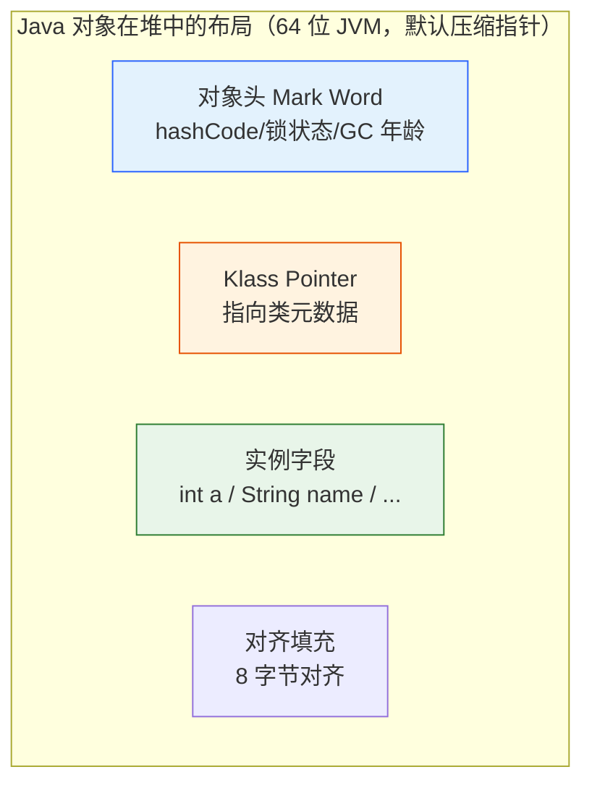
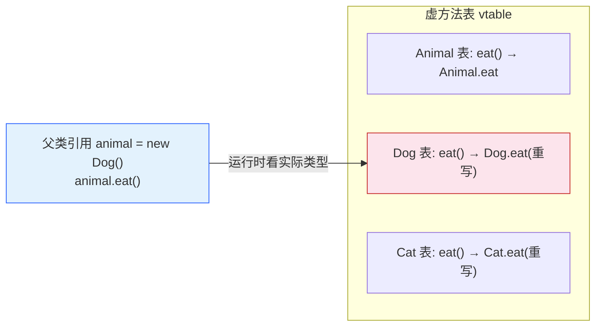
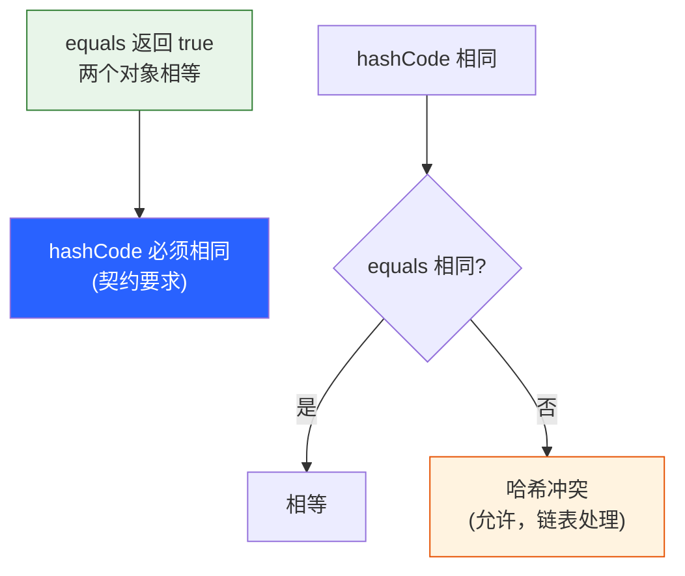

# 面向对象核心

> 前置篇目：《02-基础语法与数据类型》（类型/变量/参数传递基础）。构造器与初始化依赖"变量种类"概念；equals/hashCode 的 `==` vs `equals` 四象限在基础语法篇块 26。抽象类/接口/多态深挖见《04-抽象类接口多态》。
>
> 本篇知识点清单（30 项，按知识面五层标注，也是本篇出题的锚点）：
>
> **基础使用**：1. 类与对象 · 2. 构造器与重载 · 3. this / super · 4. static 成员 · 5. 访问修饰符 · 6. 参数按值传递 · 7. 初始化顺序
> **机制原理**：8. 对象内存布局 · 9. 重载 vs 重写 · 10. 虚方法表与动态绑定 · 11. static/字段不参与多态 · 12. 构造器链 · 13. equals 契约 · 14. hashCode 契约 · 15. toString 默认行为 · 16. clone 浅拷贝
> **高级进阶**：17. instanceof vs getClass · 18. 不可变类设计 · 19. 组合优于继承 · 20. 重写规则 5 条 · 21. 构造器勿调可重写方法
> **实战技能**：22. equals/hashCode 正确实现 · 23. getter/setter 设计 · 24. 对象生命周期 · 25. 面试连环问 5 连 · 26. hashCode 未重写事故
> **设计权衡**：27. 封装的意义 · 28. 可变 vs 不可变 · 29. 继承 vs 组合 · 30. 为什么 Java 单继承

---

## 类与对象：对象到底是什么？

**本块讲什么**：类 = 模板（图纸），对象 = 按模板造的实例（实物）——"对象 = 状态 + 行为"这句话的完整含义。

```java
class Dog {
    String name;      // 状态（字段）
    int age;
    void bark() { System.out.println(name + " 汪汪"); }   // 行为（方法）
}

Dog d1 = new Dog();   // 按 Dog 模板造一个实例
Dog d2 = new Dog();   // 另一个独立实例
```

**三个关键区分**：

1. **类 vs 对象**：类在**方法区/元空间**（一份模板），对象在**堆**（每个一份状态）。`d1.name = "旺财"` 不会影响 `d2.name`——状态是实例级的。
2. **引用 vs 对象**：`Dog d = new Dog();` 里 `d` 是引用（栈上的 8 字节地址），`new Dog()` 才是对象（堆上）。`Dog d2 = d1;` 复制的是引用，两个变量指向**同一个对象**。
3. **对象的四个组成部分**（JLS 概念层）：身份（identity，每个对象唯一）、状态（字段值）、行为（方法）、类型（所属类）。

**构造器的角色**：`new` 的三步——① 分配堆内存 ② 执行构造器（初始化状态）③ 返回引用。**字段没显式初始化时，构造器前字段已有默认值**（衔接基础语法篇块 3）。

> 边界：`new Dog()` 的 `()` 是调用无参构造器——**如果类没写任何构造器，编译器自动生成一个无参的**；一旦写了带参构造器，默认无参构造器就消失了（常见坑，见第 2 块）。

---

## 构造器：默认的、重载的、this() 链

**本块讲什么**：构造器是"初始化状态"的入口，有默认构造器、重载、this() 链三条规则。

**规则 1：默认构造器**——没写任何构造器时，编译器送一个无参构造器：

```java
class A {}                    // 有默认无参构造器
class B {
    B(int x) {}               // 写了带参构造器 → 无参构造器消失
}
A a = new A();                // ✅
// B b = new B();             // ❌ 编译错误：无参构造器不存在
```

**规则 2：构造器可以重载**（参数列表不同）：

```java
class Point {
    int x, y;
    Point() { this(0, 0); }            // 无参 → 委托给下面的构造器
    Point(int x, int y) { this.x = x; this.y = y; }
}
```

**规则 3：this() 必须在构造器第一行**——`this(...)` 调用本类其他构造器、`super(...)` 调用父类构造器，都必须是构造器的第一条语句（二者互斥）。

**为什么必须第一行？** JLS 规定：构造器必须先完成"父类部分"的初始化才能初始化自己的字段——`this(...)` 或 `super(...)` 放第一行，保证"从根到叶"的初始化顺序不被打破。

**一个隐蔽坑**：`Point() { this(0, 0); }` 里 `this(0,0)` 之后不能再有字段初始化逻辑了吗？可以——`this(...)` 调用返回后，当前构造器体继续执行，但**字段初始化（声明处的 =）发生在 this() 之前**，注意顺序（见第 7 块初始化顺序）。

> 边界：构造器**不能**被 `static`/`final`/`abstract`/`synchronized` 修饰（JLS 8.8.3）；构造器名必须与类名完全一致（含大小写）。构造器链的完整过程见第 12 块。

---

## this 和 super 到底指什么？

**本块讲什么**：`this` = 当前对象引用，`super` = "父类部分的当前对象"——它们解决的是"名字撞车"和"调用父类成员"两个问题。

**this 三种用法**：

```java
class Person {
    String name;
    Person(String name) {
        this.name = name;       // ① 区分参数与字段（遮蔽问题的官方解法）
    }
    Person() {
        this("无名");            // ② 调用本类其他构造器（必须第一行）
    }
    Person copy() {
        return this;            // ③ 返回当前对象（链式调用基石）
    }
}
```

**super 两种用法**：

```java
class Student extends Person {
    String school;
    Student(String name, String school) {
        super(name);            // ① 调用父类构造器（必须第一行）
        this.school = school;
    }
    void info() {
        super.info();           // ② 调用父类被重写的方法
    }
}
```

**一个关键区分**：`super` 不是"父类对象"——Java 对象只有一份，`super` 只是"从当前对象视角访问父类部分"的语法糖。`super == this` 不是同一概念：`super` 不能赋值、不能作为参数传递、没有 `super.super`（不能跳级访问祖父类，因为那会破坏封装）。

**实测证据**（JDK 8，字段隐藏）：父类有 `name = "Animal"`，子类有 `name = "Dog"`，`Animal a = new Dog()` 时 `a.name` 是 `"Animal"`、`((Dog)a).name` 是 `"Dog"`——**字段按声明类型绑定，this.name 在子类方法里指向子类字段**。这就是为什么重名字段要用 `this`/`super` 显式指定。

> 边界：`super()` 不写也会被编译器**隐式插入**（调用父类无参构造器）——所以父类没有无参构造器时，子类必须显式 `super(参数)`，否则编译报错。这是"继承 + 构造器"最常见的编译错误。

---

## static：类成员 vs 实例成员，谁属于谁？

**本块讲什么**：`static` 成员属于**类**（所有实例共享一份），非 static 成员属于**实例**（每个对象一份）——"静态成员不参与多态"由此而来。

```java
class Counter {
    static int total;        // 类变量：所有实例共享
    int count;               // 实例变量：每个对象一份

    static void addTotal() { total++; }   // 类方法：不依赖实例
    void addCount() { count++; }          // 实例方法
}
```

**三条硬规则**：

1. **静态方法只能访问静态成员**：`static void f() { count++; }` 编译错误——静态方法没有 `this`，不知道"哪个对象的 count"；
2. **实例方法可以访问静态成员**：`void g() { total++; }` 合法——实例方法有类上下文；
3. **静态成员通过类名访问**（`Counter.total`），用实例访问（`c.total`）也能编译但有警告——它跟实例无关，容易误导。

**static 方法的"隐藏"（实测，JDK 8）**：

```java
class Animal { static void who() { System.out.println("Animal.who"); } }
class Dog extends Animal { static void who() { System.out.println("Dog.who"); } }

Animal a = new Dog();
a.who();    // 输出 "Animal.who"！静态方法按声明类型绑定，不参与多态
```

**为什么要这样？** 多态（动态绑定）的前提是"运行时查虚方法表"，而静态方法在编译期就能确定目标（不需要实例）——JVM 直接静态绑定，所以"重写"静态方法实际是**隐藏**（hiding），不是多态。

> 边界：`static` 块的执行时机——类加载时执行一次（见第 7 块初始化顺序）。`static final` 常量在编译期就内联进使用处（`static final int MAX = 100` 在别的类里用 `MAX` 时是常量折叠，改值要重新编译所有引用方——经典坑）。

---

## 访问修饰符四档：public / protected / 默认 / private

**本块讲什么**：四个访问级别的可见范围，以及"最小可见性"原则——封装的直接落地工具。


| 修饰符             | 同类 | 同包 | 子类（跨包） | 全局 |
| ------------------ | ---- | ---- | ------------ | ---- |
| `private`          | ✅   | ❌   | ❌           | ❌   |
| （默认，无修饰符） | ✅   | ✅   | ❌           | ❌   |
| `protected`        | ✅   | ✅   | ✅           | ❌   |
| `public`           | ✅   | ✅   | ✅           | ✅   |

**三个容易记错的地方**：

1. **默认（package-private）不是 public**：没写修饰符 = 同包可见——包外不可见。很多人以为"没写就是 public"，错；
2. **protected 包含"同包可见"**：protected = private + 同包 + 跨包子类，**同包非子类也能访问**（这一点常被忽略，面试爱问）；
3. **private 修饰符与嵌套类**：外部类不能 private，但成员内部类可以是 private（见《05-内部类与枚举》）。

**原则：最小可见性**（Effective Java Item 15）：能 private 就 private，能包级就包级——**暴露面越小，将来改动越自由**。公共 API 一旦 public，就是对外契约，改签名 = 破坏兼容。

**一个经典场景**：字段一律 private + getter/setter 公开（或者干脆只暴露方法）——这就是"封装"的代码形态（第 28 块展开为什么）。

> 边界：**重写方法的访问级别不能降低**——父类 `protected` 方法，子类重写可以是 `protected` 或 `public`，但不能 `private`/默认（JLS 8.4.8.3）。这是重写规则之一（第 20 块）。

---

## 参数传递：Java 到底是不是"按值传递"？

**本块讲什么**：Java 只有按值传递（pass by value）——"引用传递"是流传最广的误解；实测证明对象参数改的是"引用拷贝指向的对象"。

**实测**（JDK 8）：

```java
static void tryChange(StringBuilder sb, int n) {
    sb.append("X");   // 改的是 sb 指向的那个对象
    n = 999;          // 改的是 n 的副本
}

StringBuilder sb = new StringBuilder("a");
int n = 1;
tryChange(sb, n);
System.out.println(sb);   // "aX"（对象被改了）
System.out.println(n);    // 1（基本类型没变）
```

**结论拆解**：

1. **基本类型**：传的是值的副本——方法内改参数，方法外不变（`n` 还是 1）；
2. **引用类型**：传的是**引用的副本**——两个引用指向同一个对象，所以 `sb.append` 能影响原对象；但如果方法里 `sb = new StringBuilder("Y")`，**只改本地引用，原对象不受影响**（这才是"按值"的证据：引用本身传不回来）。

**判断口诀**：**"能改对象内容，但改不了引用指向"**——方法里 `param = 新对象` 对外部无效，就是按值传递的铁证。

**为什么这么多人误解？** 因为"对象被方法改了"看起来像引用传递。C++ 的引用传递可以 `param = 新对象` 影响外部，Java 做不到——这是本质区别。

> 边界：`String` 是不可变的，`change(String s)` 里 `s += "x"` 实际是 `s = 新字符串`——外部引用不变（指向原字符串）。所以"字符串被方法改"从没发生过，改的是新对象。不可变的含义见第 18 块和 String 篇。

---

## 初始化顺序：静态块、字段、实例块、构造器谁先谁后？

**本块讲什么**：一个对象创建时，静态初始化、字段初始化、实例初始化块、构造器体的执行顺序——这是面试高频，也是理解"构造器里能看到什么"的基础。

**实测**（JDK 8，代码故意把实例块写在字段声明前）：

```java
class Init {
    static { System.out.println("①静态块"); }       // 类加载时，一次
    { System.out.println("③实例块（源码位置在前）"); }
    int a = initField();                            // 字段初始化
    int initField() { System.out.println("②字段初始化"); return 1; }
    Init() { System.out.println("④构造器"); }
}
new Init();
new Init();   // 再 new 一次
```

**输出**：

```text
①静态块          ← 只执行一次（类加载）
③实例块          ← 与字段初始化按源码顺序合并执行
②字段初始化
④构造器
③实例块          ← 第二次 new：静态块不再执行
②字段初始化
④构造器
```

**完整顺序规则**（JLS 12.4/12.5，含继承）：

```
1. 类加载：父类静态块 → 子类静态块（各一次）
2. 创建实例：父类字段初始化 + 父类实例块（按源码顺序）→ 父类构造器
   → 子类字段初始化 + 子类实例块（按源码顺序）→ 子类构造器
```

**两个实战推论**：

1. **静态块只执行一次**——单例、注册表、缓存预热都靠它（衔接枚举单例见《05-内部类与枚举》）；
2. **字段初始化发生在构造器体之前**——构造器里读字段拿到的是"初始化后的值"，除非字段初始化本身调用虚方法（危险！见第 21 块）。

> 边界：字段初始化和实例块的**相对顺序看源码顺序**——写在前面的先执行。这也是为什么"字段初始化里调实例方法"（如 `int a = initField()`）合法但危险：方法可能被子类重写，而子类还没初始化完（第 21 块详解）。

---

## 对象在堆里怎么排布？对象头、字段、对齐

**本块讲什么**：Java 对象在堆中的内存布局——对象头（Mark Word + Klass 指针）+ 实例字段 + 对齐填充，这是"对象占多少内存"的计算基础。



**三个部分拆解**（64 位 JVM，默认开启压缩指针/压缩类指针时）：


| 部分          | 大小           | 内容                                                                                        |
| ------------- | -------------- | ------------------------------------------------------------------------------------------- |
| Mark Word     | 8 字节         | hashCode、锁状态（偏向锁/轻量锁标记）、GC 年龄——**锁优化的主战场**（衔接《15-JVM 原理》） |
| Klass Pointer | 4 字节（压缩） | 指向类的元数据（方法区/元空间）                                                             |
| 实例字段      | 按字段类型     | 按"宽度分组"排列（int 4B、引用 4B 压缩、long 8B）                                           |
| 对齐填充      | 补到 8 的倍数  | JVM 要求对象大小是 8 的倍数（hotspot 对齐）                                                 |

**一个反直觉事实**：**字段声明的顺序不等于内存排列顺序**——HotSpot 会把字段按"long/double → int/float → short/char → byte/boolean → 引用"重排，为了对齐少浪费。所以"对象大小"不是你声明顺序的简单相加。

**算一个例子**：`class P { int x; boolean b; String s; }`（压缩指针下）：Mark Word 8B + Klass 4B + x 4B + b 1B + s 4B = 21B → 对齐 24B。**一个"看起来没多少"的对象最小 16 字节**（空对象：8+4=12 → 对齐 16）——这就是"别在循环里 new 小对象"的硬道理之一。

> 边界：对象大小可用 `JOL`（Java Object Layout）实测；字段重排（field reordering）是 HotSpot 实现细节，JLS 不保证排列顺序——依赖字段内存顺序的代码是错的。对象头里的锁状态变化（无锁→偏向→轻量→重量）是并发篇的核心话题。

---

## 重载 vs 重写：编译期和运行期谁说了算？

**本块讲什么**：重载（overload）编译期按"静态类型"选方法，重写（override）运行期按"实际类型"分派——两者常被混淆，实测一次讲透。

**实测**（JDK 8）：

```java
static void show(Animal a) { System.out.println("show(Animal)"); }
static void show(Dog d)    { System.out.println("show(Dog)"); }

Animal a = new Dog();       // 静态类型 Animal，实际类型 Dog
show(a);                    // show(Animal) —— 重载看编译期静态类型！
show((Dog) a);              // show(Dog) —— 强转后静态类型变 Dog
```

**对比表**：


| 维度     | 重载（overload）                      | 重写（override）                         |
| -------- | ------------------------------------- | ---------------------------------------- |
| 判定时机 | **编译期**（javac 按静态类型+参数选） | **运行期**（JVM 按实际类型查虚方法表）   |
| 签名要求 | 方法名同、参数列表不同                | 方法名、参数列表、返回类型（协变）都匹配 |
| 修饰符   | 无关                                  | 访问级别不降、异常不增（第 20 块）       |
| 常见坑   | 重载被继承后"就近原则"                | 参数类型变了就不是重写                   |

**重载的一个隐蔽坑——继承后的重载**：

```java
class Base { void f(int x) {} }
class Sub extends Base { void f(long x) {} }   // 这是重载，不是重写！
Sub s = new Sub();
s.f(1);   // 调 Sub.f(long)！int 1 被提升为 long 匹配更近的重载
```

`f(int)` 在父类，`f(long)` 在子类——**这不是重写**（参数不同），是"子类新增了一个重载"。调用 `s.f(1)` 时 javac 在 Sub 里找到 `f(long)`，int→long 宽化匹配，**根本不会去看父类的 f(int)**——"就近原则"（最内层作用域优先）导致父类方法被"遮挡"。用 `@Override` 可以提前发现这类错误（加了会编译报错）。

> 边界：**重写的返回类型允许协变**（子类返回更具体的类型）：父类 `Animal get()`，子类可 `Dog get()`（JDK 5+）。**构造器不能重写**，但可以重载（第 2 块）。

---

## 虚方法表：多态底层到底怎么实现的？

**本块讲什么**：多态（动态绑定）的底层是虚方法表（vtable）——每个类一张表，存方法入口地址，运行时按表查。



**机制拆解**：

1. **类加载时**：每个类生成一张虚方法表，列出继承来的 + 自己的所有虚方法，**重写的方法表项指向子类实现**（Dog 表的 eat() 指向 Dog.eat）；
2. **运行时**：`animal.eat()` 编译成 `invokevirtual` 指令，JVM 拿**实际对象的类**（Dog）查它的虚方法表，找到 eat() 的入口执行；
3. **一次查表**：虚方法调用 = 1 次表查找 + 1 次跳转，比静态调用慢一丁点——**但 JIT 的"内联缓存"（inline cache）会让重复调用同一目标时缓存入口**，热路径上虚调用几乎零开销（衔接《04-抽象类接口多态》的多态性能真相）。

**哪些方法进虚方法表**：实例方法（非 private、非 final、非 static）——`private`/`final`/`static` 方法不进表，直接静态绑定（编译期定死），这也解释了第 11 块"static 不参与多态"。

**为什么需要这张表**：调用 `animal.eat()` 时编译器不知道 animal 实际是 Dog 还是 Cat（编译期只有 Animal 类型），运行期必须"按实际类型找实现"——表就是"实际类型 → 方法入口"的索引。

> 边界：`invokevirtual`（实例方法）、`invokeinterface`（接口方法）、`invokestatic`（静态）、`invokespecial`（构造器/private/super）是四种调用指令——前两者查表（动态），后两者定死（静态）。接口方法的表更慢一点（JDK 8 接口默认方法后有所优化），这是"面向接口 vs 面向类"的性能差别来源之一。

---

## 为什么 static 方法和字段不参与多态？

**本块讲什么**：字段和静态方法"隐藏"而非"重写"——按声明类型绑定，实测证明，这是多态理解的最后一个盲区。

**实测**（JDK 8）：

```java
class Animal {
    String name = "Animal";
    static void who() { System.out.println("Animal.who"); }
}
class Dog extends Animal {
    String name = "Dog";
    static void who() { System.out.println("Dog.who"); }
}

Animal a = new Dog();
System.out.println(a.name);   // "Animal"（字段按声明类型）
a.who();                      // "Animal.who"（静态方法按声明类型）
((Dog) a).name;               // "Dog"（强转后）
```

**为什么字段不参与多态**：

1. **字段访问是编译期定址**：`a.name` 在编译期就知道是"Animal 类的 name 字段"（偏移固定），没有查表过程——JVM 不知道也不需要知道实际类型；
2. **静态方法同理**：`a.who()` 编译成 `invokestatic Animal.who`——静态方法不依赖实例，编译期直接定目标。

**"隐藏"（hiding）与"重写"（override）的区别**：字段/静态方法同名时，子类声明只是"遮住"父类的，**两者共存**（Animal.name 和 Dog.name 是两个字段）；方法重写则是"替换"——虚方法表里只有一个入口。

**实战推论（重要）**：

1. **构造器里别访问被子类隐藏的字段**：`Animal()` 里 `init()` 若被子类重写并读 `name`，读到的是子类字段（还没初始化）——第 21 块详解；
2. **静态方法别用父类引用调用**：`a.who()` 容易让人以为调用的是 Dog.who，实际是 Animal.who——**静态成员一律用类名调用**，规避误解。

> 边界：`List.size()` 是实例方法（动态）、`Collections.sort()` 是静态方法（无多态）——这就是为什么"工具类方法"都设计成 static：它们不依赖实例状态，不需要多态，用类名调最清晰。

---

## 构造器链：new Dog() 内部发生了什么？

**本块讲什么**：`new Dog()` 不是只跑 Dog 的构造器——从根父类到本类，构造器按继承链层层执行，这是"父类构造器里调了子类方法"等诡异行为的背景。

**实测**（JDK 8）：

```java
class Animal {
    Animal() { System.out.println("构造 Animal"); }
}
class Dog extends Animal {
    Dog() { System.out.println("构造 Dog"); }
}
new Dog();
// 输出：
// 构造 Animal
// 构造 Dog
```

**机制**：`Dog()` 的第一行**隐式插入 `super()`**（父类无参构造器），父类构造器又隐式插 `super()`……直到 Object——构造器链从**根到叶**执行。

**三条推论**：

1. **父类无无参构造器时，子类必须显式 `super(参数)`**（编译错误兜底，见第 3 块）；
2. **父类构造器执行完，子类字段才初始化**——所以父类构造器里如果调用了被子类重写的方法，那个方法执行时子类字段还是默认值（第 21 块的核心场景）；
3. **`this(...)` 也会先走父类链**：`Dog() { this("x"); }` → `Dog(String) { super(); ... }`——`this()` 委托最终还是落到 super 链，**根父类的构造器永远最先执行**。

**为什么必须是这个顺序？** JLS 保证"父类先就绪，子类才可用"——子类字段的初始化可能依赖父类的状态（如父类提供的常量、被继承的缓存），先父后子是逻辑必然。

> 边界：**构造器链里的多态危险**——父类构造器执行时，`this` 的实际类型已经是 Dog，调用虚方法会进 Dog 的实现，但 Dog 的字段还没初始化（全是默认值）。所以"构造器里调可重写方法"是反模式（第 21 块专门讲）。

---

## equals 契约：5 条铁律

**本块讲什么**：`equals` 不是随便写的——JLS/Object 文档规定 5 条性质，违反任何一条都可能造成集合行为诡异。

**5 条铁律**（Object 文档原文要求）：


| 性质   | 含义                           | 违反后果                     |
| ------ | ------------------------------ | ---------------------------- |
| 自反性 | `x.equals(x)` 必须 true        | 自己放进 HashSet 都找不到    |
| 对称性 | `x.equals(y)` ⟺ `y.equals(x)` | 最常被违反！a 认 b，b 不认 a |
| 传递性 | x=y 且 y=z → x=z              | 继承关系里最容易破坏         |
| 一致性 | 状态没变则结果不变             | 用了可变字段做 equals 字段   |
| 非空性 | `x.equals(null)` 必须 false    | 抛 NPE 或返回 true 都错      |

**对称性为什么最容易被破坏**——实测（JDK 8）：

```java
class Point {
    int x;
    Point(int x) { this.x = x; }
    @Override public boolean equals(Object o) {
        if (o instanceof Point) return ((Point) o).x == x;
        return false;
    }
}
class ColorPoint extends Point {
    String color;
    ColorPoint(int x, String c) { super(x); this.color = c; }
    @Override public boolean equals(Object o) {
        if (!(o instanceof ColorPoint)) return false;
        ColorPoint cp = (ColorPoint) o;
        return cp.x == x && cp.color.equals(color);
    }
}

Point p = new Point(1);
ColorPoint cp = new ColorPoint(1, "red");
System.out.println(p.equals(cp));    // true（p 只比 x）
System.out.println(cp.equals(p));    // false（cp 要求也是 ColorPoint）
```

**p.equals(cp)=true 而 cp.equals(p)=false——对称性破坏**。根因：`instanceof` 放宽了类型检查（p 认为"只要是 Point 就行"），而 ColorPoint 严格了（必须 ColorPoint）。**解决办法**（EJ Item 10 的经典方案）：要么用 `getClass()` 严格类型（第 17 块），要么"组合优于继承"（第 19 块）别让类继承破坏契约。

> 边界：`Objects.equals(a, b)`（JDK 7+）是 null 安全的 equals 包装（a.equals(b) 前判 null）——写 equals 时避免手写 null 判断逻辑出错。

---

## hashCode 契约：为什么必须和 equals 绑定？

**本块讲什么**：hashCode 和 equals 的绑定关系——"equals 相等的对象 hashCode 必须相同"，违反它，HashMap/HashSet 里的对象会"丢"。

**契约**（Object 文档）：

1. **同一对象多次调用 hashCode 必须返回相同值**（程序运行期间，equals 依据的字段没变时）；
2. **equals 相等的两个对象，hashCode 必须相同**（↔ 方向：hashCode 相同不要求 equals 相等——那是哈希冲突，允许）；
3. （推荐）equals 不等的对象，hashCode 最好不同（哈希性能）。

**违反契约的后果**——经典事故现场（第 27 块展开）：

```java
class User {
    String id;
    User(String id) { this.id = id; }
    @Override public boolean equals(Object o) {
        if (!(o instanceof User)) return false;
        return id.equals(((User) o).id);
    }
    // ❌ 没重写 hashCode
}

HashSet<User> set = new HashSet<>();
set.add(new User("1001"));
set.contains(new User("1001"));   // false！contains 先查 hashCode，hashCode 不同 → 桶都不同 → 找不到
```

`HashSet.contains` 的流程：先 `hashCode()` 定位桶，再在桶内 `equals` 比对——**hashCode 不同直接进不同桶，equals 根本没机会执行**。equals 相等但 hashCode 不同 = "相等的对象住在不同房间"。



**为什么 hashCode 用"对象身份"默认实现**：Object 默认的 `hashCode()` 基于对象内存地址（identity hash），每个 new 的对象都不同——所以**重写了 equals 就必须重写 hashCode**（反之亦然），这是"两个必须一起动"的铁律（EJ Item 11）。

> 边界：hashCode 的散列值用 `Objects.hash(...)`（JDK 7+）生成：`return Objects.hash(id, name);`——别手写 31 乘法（虽然 HashMap 源码里是 31，那是历史选择）。`hashCode` 用到的字段必须是 equals 用到的同一组（一致性要求）。

---

## toString 默认输出什么？为什么该重写？

**本块讲什么**：`toString` 的默认实现是"类名@十六进制哈希"，对调试毫无帮助；重写它是最低成本的高频收益。

**默认输出**（实测 JDK 8）：

```java
Object o = new Object();
System.out.println(o);   // java.lang.Object@1829164700 之类：类名@hashCode 十六进制
```

`Object.toString()` 实现：`getClass().getName() + "@" + Integer.toHexString(hashCode())`——**它只告诉你"这是个什么类的对象"，不告诉你"对象里有什么"**。

**为什么该重写**：

1. **日志/调试**：`logger.info("user=" + user)` 打出 `User@3f3f` 等于没打——重写后 `User{id=1001, name=张三}` 一目了然；
2. **异常信息**：异常消息里拼接对象时，toString 是唯一线索；
3. **字符串拼接**：`"user=" + user` 底层调 toString（衔接基础语法篇块 8）。

**规范姿势**（EJ Item 12）：返回"简洁、信息丰富、易读"的文本，字段按 `User{id=1001, name=张三}` 格式：

```java
@Override public String toString() {
    return "User{" + "id='" + id + '\'' + ", name='" + name + '\'' + '}';
}
```

**IDE 一键生成**：IntelliJ/Eclipse 的 Generate → toString() 会生成上面这种模板，且**自动用 `Objects.toString(field)` 处理 null**（避免 `name=null` 和 NPE 差异）。

> 边界：toString 里**别拼接敏感信息**（密码/令牌）——日志里 toString 输出会泄露；toString 里也别做耗时操作（集合 toString 会遍历元素，循环里频繁调 toString 是性能坑）。toString 与 equals 无契约关系，但好的 toString 应包含 equals 比较用的关键字段。

---

## clone：为什么默认是浅拷贝？

**本块讲什么**：`clone()` 是 Object 的 protected 方法，默认浅拷贝（只复制引用），要正确用必须实现 Cloneable 并重写——它是个设计尴尬的机制，大多数场景该用拷贝构造器。

**默认行为是浅拷贝**：

```java
class Bag implements Cloneable {
    int[] items = {1, 2, 3};
    @Override public Bag clone() {
        try {
            return (Bag) super.clone();   // 浅拷贝：items 引用被复制，数组对象还是同一个
        } catch (CloneNotSupportedException e) {
            throw new AssertionError(e);
        }
    }
}
Bag b1 = new Bag();
Bag b2 = b1.clone();
b2.items[0] = 99;
System.out.println(b1.items[0]);   // 99！b1 的数组被 b2 改了——浅拷贝的证据
```

**三个设计尴尬**：

1. **Cloneable 是标记接口**（没有方法）——它只是一个"许可标志"：没实现 Cloneable 就调 clone() 会抛 `CloneNotSupportedException`（编译期还不报，运行期才炸）；
2. **clone() 返回 Object**，必须自己强转；
3. **浅拷贝的引用字段是共享的**——要深拷贝必须自己逐字段复制（数组用 `items.clone()` 或 arraycopy，对象字段要递归 clone）。

**为什么"能用但别常用"**（EJ Item 13 的立场）：clone 绕过了构造器（不走初始化逻辑）、需要 try-catch、浅深拷贝全靠自觉——**替代方案**：拷贝构造器 `new Bag(b1)` 或静态工厂 `Bag.copyOf(b1)`，语义清晰、可深可浅、不用 Cloneable。

> 边界：`super.clone()` 对**数组**是深拷贝（数组 clone 复制元素），对**对象字段**是浅拷贝——所以 `int[] clone()` 可以直接用（JDK 数组 clone 是特例）。集合类的 copy 构造器（`new ArrayList<>(list)`）也是浅拷贝（元素共享），深拷贝要用序列化/手写。

---

## instanceof vs getClass：equals 里该用哪个？

**本块讲什么**：`instanceof`（类型兼容判断，含子类）和 `getClass()`（精确类型判断）在 equals 里的选择——决定对称性是否成立。

```java
// instanceof：是 X 或 X 的子类都算
if (o instanceof Point) { ... }

// getClass：必须是精确的 X 类
if (o.getClass() != this.getClass()) { ... }
```

**行为差异**（实测已在第 13 块展示）：


| 场景                            | `instanceof Point`                       | `getClass() == Point.class` |
| ------------------------------- | ---------------------------------------- | --------------------------- |
| `o` 是 Point                    | true                                     | true                        |
| `o` 是 ColorPoint（Point 子类） | true                                     | **false**                   |
| equals 对称性                   | 可能破坏（p.equals(cp) vs cp.equals(p)） | 保持（两边都严格要求同类）  |

**EJ Item 10 的两个方案**：

1. **用 getClass()**：`if (o == null || o.getClass() != this.getClass()) return false;`——严格同类才相等，**对称性/传递性稳**。代价：`Point(1).equals(ColorPoint(1))` 为 false，子类永远不等于父类；
2. **用 instanceof + 组合**：父类 equals 里 `if (!(o instanceof Point)) return false;` 然后比公共字段——此时**子类要复用父类 equals 并扩展字段，必然破坏对称性**（第 13 块实测），EJ 给出的终极答案是：**不要在子类里扩展 equals**（要么子类 equals 只调 super，要么改组合）。

**面试必答要点**：

```java
// 推荐的标准模板（严格类型 + 相同字段）
@Override public boolean equals(Object o) {
    if (this == o) return true;                       // 同引用，短路
    if (o == null || getClass() != o.getClass()) return false;  // 严格类型
    User user = (User) o;
    return Objects.equals(id, user.id);               // 逐字段比较
}
```

**"this == o" 的优化**：equals 第一行判 `this == o`（同一对象直接 true），省去后续字段比较——大多数 equals 调用是同引用（集合内部查找常见），这是通用优化。

> 边界：`instanceof` 左侧是 null 时直接 false（不抛 NPE）——所以 `o instanceof Point` 天然包含 null 检查（JLS 15.20.2）。getClass 方案必须显式判 null（`o.getClass()` 会 NPE）。

---

## 不可变类：怎么设计？为什么是首选？

**本块讲什么**：不可变类（对象创建后状态不可变）是 Java 设计的第一选择——String/BigDecimal/包装类都是范例，EJ Item 17 总结了设计五条。

**设计五条**（EJ Item 17）：

```java
public final class Money {                    // ① 类 final（防止子类破坏）
    private final int amount;                 // ② 字段全部 final
    private final String currency;
    public Money(int amount, String currency) {
        this.amount = amount;
        this.currency = currency;             // ③ 可变字段（无）不暴露；有则防御性拷贝
    }
    public Money add(Money other) {           // ④ 操作返回新对象，不改自身
        return new Money(this.amount + other.amount, this.currency);
    }
    public int getAmount() { return amount; } // ⑤ 只提供 getter，不提供 setter
}
```

**不可变的六大好处**：

1. **线程安全**：状态不可变 → 天然无竞态，随便共享（这是 String 线程安全的根源）；
2. **可缓存**：hashCode 可以懒计算并缓存（`Integer` 就这么干）；
3. **可安全共享**：同一对象多处引用不会互相干扰；
4. **防别名问题**：作为 Map key、Set 元素安全（equals/hashCode 不会变——违反"一致性"的最大来源就是可变字段）；
5. **可预测**：方法调用不会"偷偷改状态"；
6. **失败原子性**：操作要么成功返回新对象，要么抛异常，不会留下半改状态。

**代价**：每次"修改"都 new 对象——循环里大量中间对象（衔接 String 篇 StringBuilder 的存在意义）。

**"不可变"的常见误解**：

```java
final List<String> list = new ArrayList<>();   // final 只锁引用，不锁内容！
list.add("x");                                 // ✅ 能改！final 数组/集合只是引用不可变
```

**真正的不可变**要求"内部可变字段不外泄"——数组字段要防御性拷贝（`this.items = items.clone()`），集合用 `Collections.unmodifiableList` 包一层。**final 关键字 ≠ 不可变**，不可变是设计决策。

> 边界：JDK 9+ 的 `List.of(...)` 返回真正不可变列表（连 null 都不允许），比 unmodifiableList 更严格。不可变类通常配"静态工厂 + 缓存"（如 `Integer.valueOf` 复用缓存对象）——衔接基础语法篇块 16。

---

## 组合优于继承：什么时候用组合？

**本块讲什么**：继承是"is-a"，组合是"has-a"——EJ Item 18 说"优先组合，继承要谨慎"，因为继承脆弱的三大根源。

**脆弱根源 1：继承打破封装**——子类依赖父类实现细节：

```java
class CountingList extends ArrayList<String> {
    private int count;
    @Override public boolean add(String e) { count++; return super.add(e); }
    @Override public boolean addAll(Collection<? extends String> c) {
        count += c.size(); return super.addAll(c);   // ❌ 双重计数！
    }
}
```

`addAll` 的父类实现内部调用 `add`（每个元素一次）——子类两个方法都加 count，`addAll` 调用一次就双重计数。**父类实现细节变了，子类行为就错**（这是《08-泛型擦除原理》桥方法块提到的重写陷阱的兄弟版）。

**脆弱根源 2：父类新增方法破坏子类**——父类加了 `addAll` 或语义变化，子类没跟上就行为漂移（接口演进问题见《04-抽象类接口多态》）。

**脆弱根源 3：重写容易违反 LSP**——子类重写改变父类约定的行为（如 ArrayList 的 add 返回 boolean 语义），调用方按父类契约用就出错。

**组合方案**（EJ 的转发类模式）：

```java
class CountingSet<E> {
    private final Set<E> set = new HashSet<>();   // 组合：内部持有
    private int count;
    public boolean add(E e) { count++; return set.add(e); }
    public boolean addAll(Collection<? extends E> c) {
        count += c.size(); return set.addAll(c);   // 只调自己 count，无双重计数
    }
    public boolean contains(Object o) { return set.contains(o); }  // 转发
}
```

组合的语义完全由自己控制，**不继承父类的"内部勾连"**——addAll 计数正确。

**什么时候继承是对的**：


| 用继承                                     | 用组合                    |
| ------------------------------------------ | ------------------------- |
| 明确的 is-a（Dog is-a Animal）             | has-a（Car has-a Engine） |
| 父类为"模板骨架"（模板方法模式，见《04》） | 想复用实现但怕耦合        |
| 需要多态替换（父类引用接子类）             | 只是想要某类能力          |
| 类层次稳定、父类可被扩展                   | 父类是第三方/可能演进     |

> 边界：**"继承 + equals"是重灾区**——子类扩展父类 equals 字段必破坏对称性（第 13/17 块），EJ 的建议就是"用组合"：让子类持有一个 Point，而不是继承 Point。

---

## 重写规则 5 条：什么算合法重写？

**本块讲什么**：重写不是"方法名一样就行"——5 条硬规则决定它是不是合法重写，`@Override` 注解是防错第一道防线。

**5 条规则**（JLS 8.4.8.1/8.4.8.3）：

1. **签名匹配**：方法名、参数列表必须完全相同（参数类型不同 = 重载不是重写）；
2. **返回类型**：相同或**协变**（子类返回父类返回类型的子类型）；
3. **访问级别不降低**：父类 protected → 子类必须 protected 或 public，不能 private/默认；
4. **异常不新增**：子类抛的受检异常必须是父类声明异常的子集（可以少抛、抛更具体的，不能多抛新受检异常）；
5. **非 static**：父类实例方法不能重写为 static（反之亦然）——static 方法是隐藏不是重写（第 11 块）。

**@Override 的价值**：

```java
@Override
public String toString() { ... }   // 拼错了方法名（toStrings）→ 编译报错
```

**没加 @Override 时，拼错方法名 = 静默新增方法**——IDE 无提示，代码行为诡异（比如本意重写 equals 结果签名写成 `equals(Point o)`，变成重载，集合查找全失效）。**重写一律加 @Override**（EJ Item 40：几乎总是应该用）。

**异常规则的实战理解**：

```java
class Base {
    void f() throws IOException { ... }
}
class Sub extends Base {
    @Override void f() { ... }                 // ✅ 少抛可以
    // @Override void f() throws Exception {}  // ❌ 更宽的受检异常：编译错误
}
```

**为什么要限制？** 调用方 `try { base.f(); } catch (IOException e)` 按父类声明处理——子类若抛更宽异常，调用方 catch 不住，违背"多态替换"的安全保证（LSP）。

> 边界：**private/final/static 方法不能被重写**（final 是"禁止子类改"的显式声明）；构造器不能重写但能重载。重写方法可以加 `synchronized`（锁在子类实现上，与父类无关）。

---

## 构造器里别调可重写方法：最隐蔽的初始化事故

**本块讲什么**：父类构造器调用虚方法时，子类字段还没初始化——方法看到的是"半成品对象"，这是构造器相关的头号隐蔽坑。

**事故现场**：

```java
class Base {
    Base() { init(); }                // ❌ 构造器调可重写方法
    void init() { System.out.println("Base.init"); }
}
class Sub extends Base {
    String name = "Sub";
    @Override void init() { System.out.println("Sub.init: name=" + name); }
}

new Sub();
// 输出：
// Sub.init: name=null    ← ！name 还没初始化，是 null
// （name = "Sub" 的赋值发生在 super() 链返回之后）
```

**机制**（结合第 7/12 块）：`new Sub()` → `Sub()` 隐式 `super()` → `Base()` 里 `init()` 是虚方法，**实际类型已是 Sub** → 动态分派进 `Sub.init()` → 此时 `name` 字段还没赋值（字段初始化在父类构造器返回之后）→ 读到 null。

**为什么"看起来合法"**：编译期不报错、运行期不异常——只是读到默认值。**bug 藏在"字段恰好是默认值也没关系"的错觉里**，一旦子类字段有真实依赖就出问题。

**三条规避**（EJ Item 19：设计可继承类时的规则）：

1. **构造器只调用 private/final/static 方法**（这些不会被子类重写）；
2. **需要初始化钩子时，用文档明确标注**的 protected 方法，并在文档里写明"调用时机在子类字段初始化前"（Spring 的 afterPropertiesSet 是事后钩子，规避了这个问题）；
3. **更彻底的方案：不用继承，用模板方法之外的组合**（第 19 块）。

> 边界：同样的坑在 **clone()/readObject()** 里也存在（它们也"像构造器"）——EJ Item 13/86 明确禁止 clone/readObject 里调用可重写方法。**规则一句话：任何"构造对象"的入口里，都别碰虚方法**。

---

## equals/hashCode 怎么正确实现？IDE 模板 vs Lombok

**本块讲什么**：equals/hashCode 的正确实现模板——先掌握手写逻辑（面试要讲），再谈 IDE/Lombok 偷懒。

**手写标准模板**（getClass 严格类型方案）：

```java
@Override public boolean equals(Object o) {
    if (this == o) return true;                       // ① 同引用短路
    if (o == null || getClass() != o.getClass()) return false;  // ② 严格类型
    User user = (User) o;                             // ③ 强转
    return Objects.equals(id, user.id)                // ④ 逐字段比较（引用用 Objects.equals）
            && Objects.equals(name, user.name);
}

@Override public int hashCode() {
    return Objects.hash(id, name);                    // ⑤ 与 equals 用同一组字段
}
```

**要点清单**：

1. **equals 用到的字段 == hashCode 用到的字段**（一致性铁律）；
2. **引用字段用 `Objects.equals`**（null 安全），基本类型字段用 `==`，浮点用 `Float.compare`/`Double.compare`（不要用 ==，NaN/0.0 问题）；
3. **hashCode 用 `Objects.hash(...)`** 生成——31 乘法那套是 HashMap 源码的历史实现，业务代码直接用工具方法。

**IDE 一键生成**：IntelliJ 的 Generate → equals() and hashCode() —— 生成的模板就是上面的逻辑 + 一个 `Objects.equals` 判断（JDK 7+ 版本），**跟手写等价**，可以直接用。

**Lombok 方案**（@Data/@EqualsAndHashCode）：

```java
@Data                       // 自动生成 equals/hashCode/toString/getter/setter
class User { String id; String name; }
```

**Lombok 的坑**：① 默认用 `instanceof` 方案（对称性风险，需 `callSuper=true` 处理继承）；② 编译器依赖（注解处理器，见《10-注解》APT）；③ 生成逻辑黑盒，排查问题要先"去除 lombok 还原手写"。**建议：学习阶段手写，团队阶段 IDE/Lombok，但必须知道生成的逻辑**。

> 边界：**equals 里不要用可变字段**（一致性要求：状态变了结果必须不变）——用可变字段做 equals 依据，对象放进 HashSet 后改字段，contains 就找不到了。数据库实体（有 id 的）equals 常用"业务唯一键"而非所有字段。

---

## getter/setter：怎么设计才不是反模式？

**本块讲什么**：getter/setter 不等于封装——"字段私有 + 方法公开"只是形式，真正的封装是"暴露行为而非数据"，setter 滥用是贫血模型的根源。

**三个层次**：

```java
// 层次 1：无脑 getter/setter（贫血模型，常见但弱）
class User {
    private int age;
    public int getAge() { return age; }
    public void setAge(int age) { this.age = age; }   // 能改成负数！
}

// 层次 2：行为化封装（真正的封装）
class User {
    private int age;
    public void setAge(int age) {
        if (age < 0 || age > 150) throw new IllegalArgumentException("非法年龄: " + age);
        this.age = age;
    }
    public boolean isAdult() { return age >= 18; }    // 暴露行为，不暴露"age>=18"的判断
}

// 层次 3：不可变（第 18 块）：不提供 setter，只有构造器和行为方法
```

**为什么 setter 无脑开放是坑**：

1. **校验丢失**：`setAge(-5)` 合法——对象进入非法状态，bug 延迟到使用处才爆（fail-late）；
2. **不变量破坏**：`setBalance(负数)` 让账务对象失去"余额非负"的不变量；
3. **可变引用外泄**：`setItems(List)` 直接赋值，外部改列表 = 内部状态被改（要防御性拷贝）。

**设计建议**（务实版，不极端）：


| 场景                   | 建议                                                    |
| ---------------------- | ------------------------------------------------------- |
| 纯数据载体（DTO/POJO） | getter/setter 可以，但校验放 setter                     |
| 有业务规则的对象       | 用"行为方法"（`transfer()` 而非 `setBalance()`）        |
| 金额/核心模型          | 不可变（第 18 块）或至少 setter 带校验                  |
| 集合字段               | getter 返回不可变视图（`Collections.unmodifiableList`） |

> 边界："贫血模型 vs 充血模型"之争的实质就是 getter/setter 这层——纯数据对象（DTO/VO）贫血是对的（只是传输载体），**业务对象**（domain）贫血才是问题。判据：对象有没有"自己的业务规则"要保护。

---

## 对象生命周期：什么时候被 GC 回收？

**本块讲什么**：对象从 new 到不可达再到回收的完整旅程——GC 判活的标准是"可达性"不是"引用计数"，这是理解内存的起点（深挖见《15-JVM 原理》）。

```
new → 强引用可达（正常使用）→ 失去所有引用（不可达）→ GC 回收（时机 JVM 决定）
                                                      ↓
                                            不可预测！System.gc() 只是建议
```

**判活标准：可达性分析**——从 GC Roots（栈上引用、静态字段、JNI 引用等）出发，能到达的对象是"活的"，不能到达的是"垃圾"：

```java
void f() {
    User u = new User();     // u 是 GC Root（栈引用）→ u 可达
    u = null;                // u 不再引用对象 → 对象不可达 → 可回收
    // 方法返回后，局部变量 u 出栈，对象自动不可达
}
```

**三个实战结论**：

1. **局部变量作用域结束 = 自动不可达**（出栈），无需手动置 null（置 null 是 C 时代的习惯，Java 里只有"长生命周期容器里清引用"才有意义）；
2. **对象被回收没有固定时间**——别依赖"finalize 一定执行"（finalize 已被 JDK 9 废弃，永远别用）；
3. **不可达 ≠ 立即回收**——GC 是"批量回收"（分代收集，见《15-JVM 原理》），对象可能"死"了但还占着内存，直到触发 GC。

**内存泄漏的经典形态**（"看似可达实为垃圾"）：

```java
static List<User> CACHE = new ArrayList<>();
void add(User u) { CACHE.add(u); }   // 静态集合持有所有对象，永不回收 → 泄漏
```

静态集合、监听器注册后没注销、ThreadLocal 不 remove——都是"对象本来该死，却被长生命周期对象引用着"的泄漏形态（衔接《05-内部类与枚举》成员内部类隐式持有外部引用的泄漏）。

> 边界：**弱引用/软引用**是可控回收：`WeakReference`（GC 到就回收，缓存场景）、`SoftReference`（内存紧张才回收，大缓存场景）——衔接《15-JVM 原理》。`System.gc()` 只是"建议"，JVM 可能忽略。

---

## 面试连环问：面向对象 5 连（对着镜子自测）

**本块讲什么**：把本篇知识点压缩成 5 个面试必问题，每个问题的"高分回答骨架"——刷题前先用它自测。

**Q1：面向对象三大特性是什么？**

> 封装（信息隐藏，暴露接口不暴露实现）、继承（is-a 复用）、多态（同一接口不同实现，运行时绑定）。**加分**：多说一句"Java 里多态靠虚方法表实现"（第 10 块）。

**Q2：重载和重写的区别？**

> 重载编译期按静态类型+参数列表选方法；重写运行期按实际类型查虚方法表。**加分**：重载不是多态（编译期多态是误称），重写才是运行时多态。

**Q3：Java 是值传递还是引用传递？**

> 值传递。基本类型传值副本，引用类型传"引用的副本"——方法内改参数指向不影响外部，但能改对象内容。**加分**：给例子（第 6 块 sb/n 实测）。

**Q4：equals 和 hashCode 的关系？**

> equals 相等则 hashCode 必须相等；hashCode 相等不要求 equals。违反则 HashSet/HashMap 找不到对象。**加分**：给"重写 equals 必须重写 hashCode"的结论 + 事故例子（第 14/26 块）。

**Q5：为什么不推荐用继承？**

> 继承打破封装（父类实现细节变更影响子类）、equals 继承破坏对称性、多继承冲突。**加分**：组合优于继承（转发模式）+ 何时该用继承（第 19/29 块）。

**自测方法**：遮住答案骨架，对着镜子讲——讲不顺的就是要回炉的块。**问答复习法的核心就是"讲出来"**（SM-2 主动回忆的最强形式）。

> 边界：这 5 连是"必答骨架"，进阶追问（虚方法表细节、LSP、模板方法）在《04-抽象类接口多态》和本篇各块里。**面试别背题，要能"讲机制"**——背的答法面试官追问两句就露馅。

---

## hashCode 未重写事故：Set 里的对象"消失"了

**本块讲什么**：一个真实的典型事故复盘——重写 equals 没重写 hashCode，导致 HashMap/HashSet 里的对象"查不到"（[示意] 行业典型模式）。

**事故现场**（[示意] 行业典型模式，非亲身经历）：

> 某订单系统用 `HashSet<OrderNo>` 去重订单号，运行一段时间后发现"明明 add 过的订单号，contains 返回 false"——订单号类重写了 equals（比较业务字段），**但忘了重写 hashCode**。后果：同一订单号 new 出的对象 hashCode 不同 → HashSet 查进不同桶 → contains 永远 false → 重复订单漏判。

**代码还原**：

```java
class OrderNo {
    String value;
    OrderNo(String value) { this.value = value; }
    @Override public boolean equals(Object o) {     // ✅ 重写了 equals
        if (!(o instanceof OrderNo)) return false;
        return value.equals(((OrderNo) o).value);
    }
    // ❌ hashCode 没重写 → 用 Object 默认的"身份哈希"（每个 new 都不同）
}

Set<OrderNo> set = new HashSet<>();
set.add(new OrderNo("A001"));
set.contains(new OrderNo("A001"));   // false！明明"相等"却查不到
```

**根因**（结合第 14 块）：`contains` 流程 = `hashCode()` 定位桶 → 桶内 `equals` 比对。两个 `new OrderNo("A001")` 的 hashCode 不同 → 进不同桶 → **equals 根本没被调用**。

**修复**：

```java
@Override public int hashCode() {
    return Objects.hash(value);      // 与 equals 同字段
}
```

**排查线索**（面试/实战都值钱）：Set/Map 里"存进去找不到"→ 先怀疑 equals/hashCode 契约被违反；"HashMap 能存但遍历顺序诡异"→ hashCode 冲突严重；**"hashCode 相同但 equals 不同"是允许的**（冲突），反过来（equals 同但 hashCode 不同）才是 bug。

> 边界：**防御手段**——重写 equals 的类，IDE 会警告"未重写 hashCode"；Lombok @Data 会同时生成两者。**审计手段**：代码规约强制"equals 与 hashCode 成对出现"（阿里巴巴规约也这么要求）。

---

## 封装的意义：为什么信息隐藏是 OOP 的第一原则？

**本块讲什么**：封装不是"private 关键字"，是"暴露接口、隐藏实现"的设计原则——它是可维护性的根基。

**没有封装的代价**：

```java
// 反例：字段全公开，到处直接改
class Account {
    public double balance;      // 任何人能 balance = -100;
}
// 一处改余额，十处校验逻辑散落 → 漏一处就出错

// 正例：余额只能通过行为改变
class Account {
    private double balance;
    public void deposit(double v) {
        if (v <= 0) throw new IllegalArgumentException();
        balance += v;
    }
    public void withdraw(double v) {
        if (v > balance) throw new InsufficientFundsException();
        balance -= v;
    }
}
```

**信息隐藏的三大价值**：

1. **解耦**：调用方只知道方法签名，不知道实现——实现可以随便换（数据库换缓存、算法换更快版本），调用方零感知；
2. **不变量保护**：对象的"合法状态"（余额非负、年龄 0~150）只在对象内部维护——外部无法把对象推进非法状态；
3. **演进自由**：private 字段随便改名，public 签名动了就是破坏兼容（衔接《04-抽象类接口多态》的接口演进）。

**一个经典视角**：封装 = **"把容易变的东西藏起来，把稳定接口露出来"**——JDK 里 ArrayList 的 `elementData` 是 private（实现随便改），`get/add` 是 public（契约稳定）。这就是为什么"面向接口编程"总是和封装一起说。

**封装的反面不是继承**：继承是"类间关系"，封装是"对象内部纪律"——组合优于继承（第 19 块）的本质就是"用封装替代继承暴露内部"。

> 边界：封装有成本——每多一个公开方法就多一份兼容负担（EJ 建议"public API 越少越好"）。测试/框架有时需要反射访问 private（衔接《09-反射与动态代理》），那是"打破封装"的显式例外，要标注。

---

## 可变 vs 不可变：选型依据

**本块讲什么**：对象设计的第一问——"这个对象可变还是不可变"？两个方向的代价与收益，以及"半可变"的务实方案。

**决策依据**：


| 场景                        | 倾向             | 原因                                                   |
| --------------------------- | ---------------- | ------------------------------------------------------ |
| 值对象（Money/坐标/时间段） | **不可变**       | 语义上"值"就该不可变，天然线程安全                     |
| 实体（数据库模型）          | 可变             | 状态需要更新（但用行为方法，见第 23 块）               |
| DTO/VO（传输载体）          | 可变或不可变均可 | 无业务规则，怎么都行（现代风格偏不可变 record）        |
| 缓存/共享对象               | **不可变**       | 防别名（第 18 块）                                     |
| 高性能热路径                | 可变             | 不可变的中间对象开销大（衔接 String vs StringBuilder） |

**"可变"的正确姿势**（如果选可变）：

1. 字段 private + setter 带校验（第 23 块）；
2. 集合字段防御性拷贝/不可变视图；
3. **变更走行为方法**，不暴露字段级 setter；
4. 明确文档标注"非线程安全，勿跨线程共享"。

**"半可变"务实方案**：核心字段 final + 扩展字段可变——比如"订单号不可变、物流状态可变"。这不是标准不可变类，但实战常见，注意**equals/hashCode 只用不可变字段**（一致性铁律，第 22 块）。

**JDK 的示范**：`String`/`Integer`/`BigDecimal` 不可变（所以安全）；`StringBuilder`/`ArrayList` 可变（所以高效）——**同族双胞胎各司其职**，这就是可变性设计的教科书案例（衔接 String 篇）。

> 边界：**不可变 ≠ final 类**——final 只是防继承，不可变是"无 setter + final 字段 + 不外泄可变引用"。JDK 9+ 的 `record` 是"自动不可变"的语法糖（见《14-Java 8~21 新特性》），DTO 首选。

---

## 继承 vs 组合：终极决策表

**本块讲什么**：把第 19 块的判断整合成一张可执行的决策表——面对"要不要继承"，按顺序走三步。

**三步决策法**：

```
第一步：是 is-a 吗？           否 → 组合（结束）
第二步：能安全扩展吗？          否 → 组合
（父类非第三方？字段不暴露？重写不破坏 LSP？）
第三步：需要多态吗？            否 → 组合
                             是 → 继承（并遵守 EJ Item 19 的文档规则）
```

**完整对比**：


| 维度         | 继承                            | 组合                               |
| ------------ | ------------------------------- | ---------------------------------- |
| 关系         | is-a（子类是父类）              | has-a（持有）                      |
| 复用面       | 方法+字段全继承（含不该继承的） | 只暴露想暴露的                     |
| 多态         | ✅ 天然（父类引用接子类）       | ❌ 需接口配合（实现接口+转发）     |
| 封装         | 打破（依赖父类内部）            | 保持                               |
| 运行时替换   | ✅                              | 需要接口（面向接口编程，见《04》） |
| 过度使用后果 | 类爆炸、脆弱层级                | 类略多但稳定                       |

**JDK 里的示范**：`ArrayList extends AbstractList`（继承骨架抽象类，模板方法模式）+ 实现 `List` 接口（组合语义）——**"继承抽象类拿骨架 + 实现接口定契约"是 JDK 的标准组合拳**（《04-抽象类接口多态》展开）。

**一句话结论**：**继承是为"多态"服务的，不是为"复用"服务的**——想复用实现用组合，想要"同一接口多种行为"才用继承。

> 边界：**"is-a 就继承"是陷阱**——正方形 is-a 矩形，但继承后 setWidth 破坏正方形不变量（LSP 违反的经典案例，第 29 块反面教材）。is-a 只是必要条件，还要"子类在任何场景可安全替换父类"（里氏替换原则）。

---

## 为什么 Java 单继承？接口弥补了什么？

**本块讲什么**：Java 类只能单继承（一个父类），多继承的能力由接口承担——这是语言设计的历史与权衡（深挖见《04-抽象类接口多态》）。

**单继承的约束**：

```java
class A {}
class B {}
class C extends A, B {}   // ❌ 编译错误：类只能单继承
```

**为什么禁止多继承**：经典"菱形问题"（diamond problem）——如果 C extends A, B，而 A、B 都有 `f()`，C 继承哪个？C++ 用"虚拟继承+显式指定"解决，代价是复杂和诡异。**Java 选择简单：类单继承，接口多实现**（JDK 8 接口默认方法也引入了菱形问题，但用"类优先/显式 override"规则化解，见《04》块 11）。

**接口弥补了什么**：


| 维度 | 类继承             | 接口实现                        |
| ---- | ------------------ | ------------------------------- |
| 数量 | 1 个父类           | 多个接口                        |
| 内容 | 实现（代码复用）   | 契约（抽象方法）                |
| 关系 | is-a（强绑定）     | "能力"（can-do，如 Comparable） |
| 演进 | 改父类影响所有子类 | 新增方法默认方法兜底（JDK 8）   |

**实战形态**：`class ArrayList<E> extends AbstractList<E> implements List<E>, RandomAccess, Cloneable, Serializable`——**一个父类拿骨架，N 个接口贴标签**（RandomAccess 是标记接口）。

**为什么这么设计**（面试加分）：单继承保证"类层次是树"（清晰、无歧义），接口提供"能力的多面性"——**Java 用"实现多接口"换掉了"继承多父类"的复杂度**，代价是接口不能复用实现（默认方法 JDK 8 后才部分缓解）。

> 边界：**接口默认方法的菱形**（JDK 8+）：C implements B, D（B、D 都有 default f()）→ C 必须显式 override，否则编译错误（《04》块 11 完整规则）。**枚举隐式继承 java.lang.Enum**（《05-内部类与枚举》）。

> **一句话收尾**：面向对象篇的核心就三句——**对象 = 状态 + 行为，多态靠虚方法表，equals/hashCode 是一对铁律**。剩下的全是这三句的展开：构造器链解释"为什么父类构造器里调子类方法危险"，按值传递解释"为什么方法改不了引用指向"，单继承解释"为什么用接口补能力"。把这三句刻进脑子里，本篇的坑都能推导。
