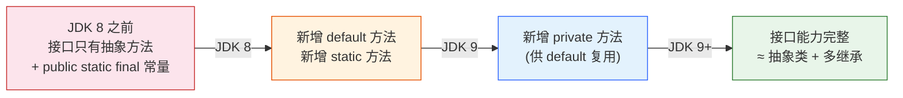
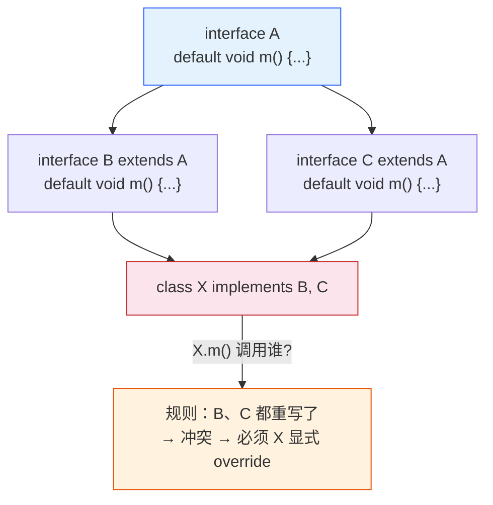
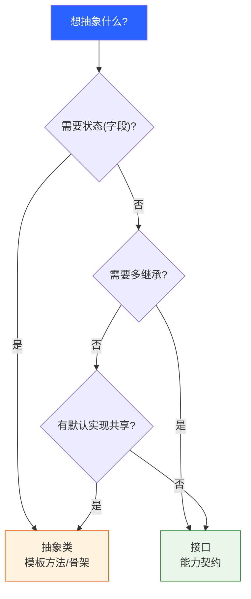

# 抽象类/接口/多态

> 前置篇目：《03-面向对象核心》（类/继承/多态/虚方法表基础）。本篇是其深化：抽象类与接口的选型、默认方法冲突规则、多态的接口形态。函数式接口衔接《13-Lambda 与 Stream》，接口常量衔接《05-内部类与枚举》。
>
> 本篇知识点清单（30 项，按知识面五层标注，也是本篇出题的锚点）：
>
> **基础使用**：1. 抽象类概念 · 2. 接口定义与实现 · 3. 接口 vs 抽象类对比 · 4. 抽象类的成员分工 · 5. default 方法 · 6. static/private 方法 · 7. 接口多态
> **机制原理**：8. 接口字节码与 invokeinterface · 9. 接口演进史 · 10. 菱形冲突三规则 · 11. 类优先规则 · 12. default 与 Object 方法 · 13. 接口多继承 vs 类单继承 · 14. 函数式接口 · 15. 标记接口 · 16. 接口常量陷阱
> **高级进阶**：17. 模板方法模式 · 18. 策略模式 · 19. 面向接口编程 · 20. 契约+骨架组合拳 · 21. 公共接口加方法的安全姿势
> **实战技能**：22. 接口设计 8 条 · 23. 多态性能真相 · 24. default 方法 4 陷阱 · 25. 静态方法继承坑 · 26. 抽象类 vs 接口决策树 · 27. 面试连环问
> **设计权衡**：28. 为什么 JDK 新 API 清一色接口 · 29. 接口该不该带实现（default 哲学）

---

## 抽象类：半成品父类，什么时候用？

**本块讲什么**：抽象类 = "不能 new 的父类"，它定义骨架（抽象方法由子类实现）+ 提供通用实现——模板方法模式的载体。

```java
abstract class Shape {
    abstract double area();          // 抽象方法：只有签名，子类必须实现

    String label() { return "Shape"; }   // 普通方法：子类直接继承使用

    Shape() { }                       // 可以有构造器（子类会调用）
}

class Circle extends Shape {
    double r;
    Circle(double r) { this.r = r; }
    @Override double area() { return Math.PI * r * r; }   // 必须实现
}
```

**实测编译断言**（JDK 8）：`new Shape()` 报错 `Tmp.A1是抽象的; 无法实例化`——抽象类不能 new，只能被继承。

**三个用途**（什么时候该用抽象类）：

1. **模板方法**：骨架锁死、钩子开放（第 17 块）；
2. **共享实现**：多个子类要复用同一段代码（如 DAO 模板的公共连接逻辑）；
3. **强制契约**：抽象方法强制子类实现（"必须会飞才能算鸟"）。

**抽象类的限制**（常考）：

| 限制 | 说明 |
|---|---|
| 不能实例化 | `new Shape()` 编译错误 |
| 抽象方法不能有方法体 | `abstract void f() {}` 编译错误 |
| 抽象方法不能 private/final/static | private 子类看不到、final 不能重写、static 无多态 |
| 抽象类可以没有抽象方法 | 全是普通方法的抽象类（纯模板）也合法 |

> 边界：抽象类**可以有构造器**（子类 super 链会调用，实测：new Circle 时输出"抽象类构造器"）——构造器存在意义是"初始化子类共享的字段"。抽象类还可以有**字段、static 成员、main 方法**——它只是"不能 new"，不是"什么都没有"。

---

## 接口：能力契约的定义与实现

**本块讲什么**：接口 = 纯契约（"能做什么"），实现类负责"怎么做"——面向接口编程的基础设施。

```java
interface Flyable {
    void fly();          // 抽象方法（接口里 public abstract 是隐式的）
}
class Sparrow implements Flyable {
    @Override public void fly() { System.out.println("麻雀飞"); }
}
class Plane implements Flyable {
    @Override public void fly() { System.out.println("飞机飞"); }
}
```

**接口的三个基础事实**：

1. **方法隐式 public abstract**：接口里写 `void fly();` 等价 `public abstract void fly();`——实现类的方法**必须 public**（重写规则：访问级别不降低）；
2. **字段隐式 public static final**：接口里写 `int MAX = 10;` 是常量，不是可变字段——接口不能有实例状态；
3. **一个类可以实现多个接口**：`class Sparrow implements Flyable, Singable`——接口是"能力标签"可以贴多个（对比类单继承）。

**接口能做什么**（JDK 8 前）与**不能做什么**：

```java
interface X {
    void abstractMethod();                          // ✅ 抽象方法
    default void defaultMethod() {}                  // ✅ 默认方法（JDK 8）
    static void staticMethod() {}                    // ✅ 静态方法（JDK 8）
    private void privateHelper() {}                  // ✅ 私有方法（JDK 9）
    int CONST = 10;                                  // ✅ 常量（隐式 static final）
    // int field = 10;                               // ❌ 不能有可变实例字段
    // 接口没有构造器、没有实例块
}
```

**实测编译断言**（JDK 8）：接口 static 方法 `C1.s()`（通过实现类调用）报"找不到符号"——**接口静态方法只能用接口名调用**（`Animal.info()`），实现类/实例都不能调。

> 边界：**实现接口 = 实现它所有抽象方法**（否则类必须声明为 abstract）。接口的抽象方法实现**必须 public**——因为接口方法本身是 public，重写不能降级。JDK 8 之前接口只有抽象方法 + 常量，能力单一（第 9 块演进史）。

---

## 接口 vs 抽象类：先看终极对比表

**本块讲什么**：接口和抽象类都能"定义契约"，但一个管能力标签、一个管骨架复用——先记对比表，再记选型原则。

| 维度 | 抽象类 | 接口 |
|---|---|---|
| 本质 | 半成品父类（is-a） | 能力契约（can-do） |
| 继承数量 | 单继承 | 多实现 |
| 字段 | 可以有实例字段 | 只能 public static final 常量 |
| 构造器 | 有（子类调用） | 无 |
| 方法 | 抽象 + 普通 + static | 抽象 + default + static + private |
| 访问级别 | 任意 | 方法隐式 public |
| 演进 | 加方法=影响子类（默认实现可选） | JDK 8 前加方法=破坏实现类；default 缓解 |
| 典型场景 | 模板方法/共享实现 | 能力契约/多态类型 |

**一句话记忆**：**抽象类 = "是什么"（骨架+共享代码），接口 = "能干什么"（契约+标签）**——JDK 里 `AbstractList` 是骨架（抽象类），`List/RandomAccess/Serializable` 是契约和标签（接口）。

**两个易混点**：

1. **"接口比抽象类更抽象"是错的**——JDK 8 后接口有了 default/static/private 方法，两者能力趋同；区别在"状态"和"多继承"；
2. **"抽象类性能更好"是误解**——多态调用两者都走虚方法表（接口走 invokeinterface 稍慢但 JIT 已优化，见第 23 块）。

**选型快速判据**（第 26 块有完整决策树）：需要字段/共享实现 → 抽象类；需要多继承/纯契约 → 接口；两者都要 → **实现接口 + 继承骨架**（第 20 块组合拳）。

> 边界：**abstract class 和 interface 都能被实现类同时用**：`class ArrayList extends AbstractList implements List`——不是二选一，是组合。判断标准是"骨架给不给实现、契约要不要多贴"。

---

## 抽象类里成员怎么分工？抽象方法 vs 普通方法

**本块讲什么**：抽象类内部的成员分工——抽象方法（强制子类实现）、普通方法（共享实现）、钩子方法（可选重写）三种角色。

```java
abstract class DataLoader {
    // ① 抽象方法：子类必须实现（"强制契约"）
    protected abstract String readRaw();

    // ② 模板方法：final 锁死流程（"骨架"）
    public final void load() {
        String raw = readRaw();              // 调用抽象方法（子类实现）
        String processed = process(raw);     // 调用钩子（默认实现，可重写）
        save(processed);
    }

    // ③ 钩子方法：默认实现，子类可选重写（"扩展点"）
    protected String process(String raw) { return raw.trim(); }

    // ④ 普通方法：共享实现（"复用代码"）
    private void save(String data) { System.out.println("已保存: " + data); }
}
```

**三种方法的角色**：

| 方法类型 | 谁实现 | 用途 |
|---|---|---|
| 抽象方法 | 子类必须实现 | 强制契约（"不同的部分"） |
| 普通方法/模板方法 | 父类实现，可 final | 共享骨架（"相同的部分"） |
| 钩子方法 | 父类默认实现，子类可重写 | 扩展点（"可选定制"） |

**设计原则**（EJ Item 19 的"设计可继承类"要求）：

1. **抽象方法少而准**——抽象方法 = 子类必须自己做的部分，越多子类负担越重；
2. **模板方法 final**——骨架锁死，防止子类重写破坏流程顺序（`load()` 加 final 就是"流程不许改，细节可以换"）；
3. **钩子方法命名规范**——`protected` + 可读名（如 `process`），文档写明"默认实现是什么、重写时注意什么"。

**一个反直觉点**：抽象类**可以没有抽象方法**——纯模板类（全部普通方法 + final 流程）也合法，用途是"禁止直接实例化、强制走子类"。反过来，**抽象方法不能在普通类里**（类含抽象方法必须是 abstract）。

> 边界：抽象类构造器里的"抽象方法调用"是第 21 块（面向对象篇）讲过的坑的接口版——`DataLoader()` 里调 `readRaw()`，子类字段还没初始化。抽象方法调用请放在模板方法（`load()`）里，不要放构造器。

---

## default 方法：接口里的默认实现（JDK 8）

**本块讲什么**：default 方法让接口能带实现——这是"给已有接口加方法不破坏实现类"的关键机制（JDK 8 给 Collection 加 stream() 的底气）。

**为什么需要 default**：JDK 8 要给所有集合加 `stream()`/`forEach()` 方法——如果接口加抽象方法，**所有实现类（含第三方）都必须改代码**，否则编译失败。default 方法提供默认实现，实现类不写也能用。

```java
interface Animal {
    void eat();                                   // 抽象方法
    default void sleep() { System.out.println("默认睡眠"); }   // 默认实现
}
class Dog implements Animal {
    public void eat() { /* 必须实现 */ }
    // sleep() 不实现 → 用默认实现（实测：Dog.sleep() 输出"默认睡眠"）
}
```

**default 方法三条规则**（实测验证）：

1. **实现类可以不重写**——直接用默认实现（实测 `new Dog().sleep()` 输出默认实现）；
2. **实现类可以重写**——重写后优先自己的实现；
3. **default 方法不能是 abstract/static**——它本身就是"有实现的方法"。

**default 方法能做什么**：方法体里可以用接口常量、调其他 default 方法、甚至可以调接口 static 方法：

```java
interface Greet {
    default String hello() { return "Hello"; }
    default String greeting(String name) { return hello() + ", " + name; }  // 调其他 default
}
```

**JDK 里的经典 default**：`Collection.stream()`、`List.sort()`、`Comparator.thenComparing()`、`Map.getOrDefault()`——都是"给老接口加新能力"的范例（第 21 块展开怎么设计）。

> 边界：**default 方法不是"接口可以有实现"的万能钥匙**——它不能访问实例字段（接口没有），只能靠接口方法交互；default 方法与抽象方法冲突时（同签名），实现类必须显式重写（第 10 块菱形规则）。

---

## 接口的 static 和 private 方法（JDK 8/9）

**本块讲什么**：接口 static 方法 = 接口自己的工具方法（必须接口名调用）；private 方法（JDK 9）= default 方法的私有助手——接口能力从"纯抽象"走向"完备"。

**static 方法（JDK 8）**：

```java
interface MathOp {
    static int add(int a, int b) { return a + b; }   // 接口的工具方法
}
MathOp.add(1, 2);        // ✅ 接口名调用
// new 实现类().add(1,2)  ❌ 编译错误：static 方法不能通过实例调用（实测"找不到符号"）
```

用途：接口自带的静态工厂/工具（`Comparator.comparing()`、`Stream.of()`、`List.of()` 都是接口 static 方法）。

**private 方法（JDK 9）**：default 方法之间的公共逻辑抽出来：

```java
interface Report {
    default String head() { return wrap("HEAD"); }
    default String body() { return wrap("BODY"); }
    private String wrap(String s) { return "[" + s + "]"; }   // 私有助手，JDK 9+
}
```

**为什么需要 private**：JDK 8 的 default 方法多了，公共逻辑没处放——只能复制粘贴或用 public static 工具（污染 API）。JDK 9 加 private 方法：**接口内部复用，不暴露给实现类**。

**对比演进**（第 9 块图）：

| 版本 | 接口能力 |
|---|---|
| JDK 8 前 | 只有抽象方法 + 常量 |
| JDK 8 | + default、+ static |
| JDK 9 | + private（private static 也行） |
| JDK 9+ | 接口能力 ≈ 抽象类（除实例字段和构造器） |

> 边界：**private 方法不能被 default 之外的地方调**（实现类看不见）；private static 方法可被 static/default 方法调。**接口 static 方法不参与继承**——子接口/实现类不会"继承"到接口的 static 方法（实测：C1.s() 找不到符号），必须接口名调用。

---

## 接口多态：父类引用能做的，接口引用也能做

**本块讲什么**：接口引用指向实现类对象，调用走动态分派——"面向接口编程"的运行时基础，与面向对象篇的虚方法表一脉相承。

```java
interface Flyable { void fly(); }

class Sparrow implements Flyable { public void fly() { /* 麻雀 */ } }
class Plane  implements Flyable { public void fly() { /* 飞机 */ } }

Flyable f1 = new Sparrow();   // 接口引用 = 父类引用的"接口版"
Flyable f2 = new Plane();
f1.fly();   // 运行时动态分派（实测：Sparrow.fly）
```

**接口多态与类多态的差异**：

| 维度 | 类多态（父类引用） | 接口多态（接口引用） |
|---|---|---|
| 声明 | `Animal a = new Dog()` | `Flyable f = new Sparrow()` |
| 调用指令 | invokevirtual（查类虚方法表） | invokeinterface（查接口实现） |
| 可见成员 | 父类声明的字段+方法 | 接口声明的成员（看不到实现类的） |
| 类型 | is-a（继承链） | can-do（能力标签） |

**实测**（JDK 8）：`Bird b = new Sparrow(); b.fly(); b.chirp();` 都动态分派到 Sparrow 实现——接口引用能看到接口及父接口声明的方法（`Bird extends Flyable`，所以 `b.fly()` 和 `b.chirp()` 都可见）。

**一个关键限制**：接口引用**只能调接口声明的方法**——`Flyable f = new Sparrow(); f.chirp();` 编译错误（chirp 不在 Flyable 里），即使 Sparrow 有 chirp。想调要强转 `((Sparrow) f).chirp()` 或声明为 Bird。

> 边界：**接口多态的强转与 instanceof**：`if (f instanceof Sparrow) ((Sparrow) f).chirp();`——与类强转同一套规则（衔接面向对象篇块 17）。接口类型做参数是"面向接口编程"的落地点（第 19 块）。

---

## 接口编译后是什么？invokeinterface 与 invokevirtual

**本块讲什么**：接口的字节码形态（ACC_INTERFACE 标志 + 方法全是 abstract）和调用指令（invokeinterface）——理解"接口为什么更灵活也稍慢"的底层。

**javac 编译接口后的 class 文件**（javap -v 可见）：

```text
interface Flyable:
  flags: (0x0601) ACC_PUBLIC, ACC_INTERFACE, ACC_ABSTRACT   ← 接口标志
  void fly();
    flags: (0x0401) ACC_PUBLIC, ACC_ABSTRACT                ← 方法都是 abstract
```

**接口方法调用指令**（实测 javap）：

```text
invokeinterface #7  // Method AbIfaceProbe$Flyable.fly:()V
```

**三种调用指令对比**：

| 指令 | 用途 | 绑定 | 性能 |
|---|---|---|---|
| `invokestatic` | 静态方法 | 编译期定死 | 最快 |
| `invokevirtual` | 实例方法（类） | 运行期查类虚方法表 | 快 |
| `invokeinterface` | 接口方法 | 运行期查接口实现 | 略慢（JDK 8 优化后接近） |
| `invokespecial` | 构造器/private/super | 编译期定死 | 快 |

**为什么 invokeinterface 曾经慢**：接口方法的实现类不确定（一个接口 N 个实现类），JVM 要查"接口方法 → 实现类方法"的映射，比类的虚方法表多一层间接。**JDK 8+ 的 JIT 内联缓存让热路径上 invokeinterface 与 invokevirtual 差距趋近于零**（第 23 块）。

**接口的常量**（编译后）：接口里的 `int MAX = 10;` 编译成 `ACC_PUBLIC, ACC_STATIC, ACC_FINAL` 字段 + 常量池条目——**接口常量是编译期常量，用它的类直接内联值**（第 16 块陷阱展开）。

> 边界：接口可以有 **嵌套类型**（成员接口/枚举/类），默认 public static。接口不能有**实例初始化块、静态初始化块**（JLS 9.3）——接口"没有状态"，所以没有初始化逻辑。

---

## 接口演进史：从纯抽象到能力完备

**本块讲什么**：接口的 25 年演进——纯抽象（JDK 1.0）→ default/static（JDK 8）→ private（JDK 9）→ 能力 ≈ 抽象类，每步都是为了解决"接口僵化"问题。



**演进动机**（"接口僵化"问题）：

| 阶段 | 问题 | 解法 |
|---|---|---|
| JDK 8 前 | 给接口加方法 = 破坏所有实现类 | 无解，只能建新接口（`List` → `ListIterator` 的教训） |
| JDK 8 | 集合要加 stream/forEach 等新能力 | **default 方法**：带默认实现，实现类不破 |
| JDK 8 | 接口工具方法没处放 | **static 方法**：接口自带的工厂/比较器 |
| JDK 9 | default 方法公共逻辑复制粘贴 | **private 方法**：接口内部复用 |

**"接口僵化"的历史教训**：JDK 1.2 想给 `List` 加功能，不敢改接口（会破坏所有实现），只能造 `ListIterator`——导致 API 分裂。**default 方法就是为根治这个问题设计的**：`Collection.stream()` 用 default 加，所有实现类零改动。

**演进后的接口 vs 抽象类**：JDK 9 后接口有 default/static/private，**唯一区别只剩"实例字段和构造器"**——所以"接口 ≈ 抽象类 + 多继承"（缺状态）。选型判断（第 26 块）也简化了：**要状态用抽象类，要灵活契约用接口**。

> 边界：接口演进是"向前兼容"的教科书——default 是"优雅地给公共接口加方法"的标准答案（第 21 块讲安全姿势）。但**default 不是免费午餐**：它带来菱形冲突（第 10 块）和"接口带实现"的争议（第 24 块陷阱）。

---

## 菱形冲突：三条解决规则

**本块讲什么**：一个类实现两个有同签名 default 方法的接口时，冲突怎么解决——三条规则按优先级裁定（实测验证）。

**冲突场景**：

```java
interface A { default void m() { /* A */ } }
interface B { default void m() { /* B */ } }

class Both implements A, B { }   // ❌ 编译错误（实测）
// 错误: 类 Both 从类型 A 和 B 中继承了 m() 的不相关默认值
```



**三条解决规则**（JLS 9.4.1，按优先级）：

**规则 1：类优先**——父类的方法（含继承的）胜过接口 default 方法（实测：`Child extends SuperClass implements I2`，`child.m2()` 输出 `SuperClass.m2`）。

**规则 2：最具体的接口胜出**——接口继承链里，"离实现类最近的接口"的 default 优先：`interface B extends A`（B 重写 m），实现 B 的类继承 B.m 而非 A.m。

**规则 3：冲突必须显式解决**——两个**无继承关系**的接口同签名 default（A.m 和 B.m），实现类**必须 override**（实测：Both 必须写 `public void m()`，否则编译错误）。

**显式解决的三种姿势**：

```java
class Both implements A, B {
    // 姿势 1：自己实现
    public void m() { System.out.println("自己实现"); }
    // 姿势 2：指定用 A 的
    public void m() { A.super.m(); }
    // 姿势 3：指定用 B 的
    public void m() { B.super.m(); }
}
```

> 边界：**抽象方法也参与规则 3**——A 有 default m()、B 有抽象 m()，实现类只需实现一次（抽象方法"赢了"，因为必须实现）。`A.super.m()` 是接口 default 的专属语法（类里没有类.super 的概念）。

---

## 类优先规则：父类方法为什么压过接口 default？

**本块讲什么**：菱形规则第一条"类优先"的机制与理由——父类的实现（哪怕是隐式继承的）永远胜过接口 default（实测验证）。

**实测**（JDK 8）：

```java
class SuperClass { public void m2() { System.out.println("SuperClass.m2"); } }
interface I2 { default void m2() { System.out.println("I2.m2"); } }

class Child extends SuperClass implements I2 { }   // 没重写 m2

new Child().m2();    // 输出 "SuperClass.m2"（父类方法胜出）
```

**为什么这样设计**（JLS 9.4.1 的动机）：

1. **兼容性**：JDK 8 之前接口没有 default，类可以自由地"恰好在父类有同名方法"——引入 default 后若让接口压过类，**已有代码行为会变**（实现类的父类方法被接口默认方法覆盖）；
2. **直觉**："我是这个类的子类，父类的实现当然优先"——类是"更具体"的声明，接口是"附加能力"。

**关键推论**：父类方法**不需要是显式重写**——哪怕是父类从它父类继承来的方法，也算"类的方法"，照样压过接口 default。

**一个容易误判的场景**：

```java
interface Runnable2 { default void run() { /* A */ } }
class Task implements Runnable2 { }        // run 用接口默认
class SpecialTask extends Task implements Runnable2 { }   // SpecialTask 继承 Task 的 run？
// 如果 Task 没重写 run → SpecialTask 继承的是接口默认（类优先规则只对"类里有方法"生效）
```

"类优先"的前提是**类里真的有该方法**；类里没有时，接口 default 正常继承。

> 边界：**抽象类里没有实现的方法不算"类方法"**——父类抽象方法 `abstract void m()` 不压接口 default（抽象方法无实现，接口 default 胜出）。判断标准："类里是否有**可用的实现**"。

---

## default 方法与 Object 方法的特殊规则

**本块讲什么**：接口不能声明与 Object 方法（equals/hashCode/toString 等）冲突的 default——这是 JLS 的硬约束，防止"接口重写 Object"的混乱。

**规则**：接口里**不能有**与 `Object` 的 public 方法同签名的 default/static 方法（JLS 9.4.1.3）：

```java
interface Bad {
    // default String toString() { return ""; }    // ❌ 编译错误
    // static int hashCode() { return 0; }         // ❌ 编译错误
    String toString();                              // ✅ 但抽象方法可以！
}
```

**为什么**：Object 方法是所有类的"根本契约"（equals/hashCode/toString 见《03-源码解析-Object源码契约》），如果接口能用 default 覆盖它们，**实现类的方法解析就乱了**——接口 default 会跟 Object 的实现打架（"类优先"规则在这里失效，因为 Object 是所有类的父类，Object 方法必须赢）。

**注意区分**：**抽象方法可以声明 toString()**（`String toString();`）——这不算冲突（抽象方法没有实现，实现类自己实现，等于把 Object 的方法再声明一遍，合法且偶尔用于"强制子类重写 toString"）。

**实战意义**：

1. **实现类里 default 与 Object 方法的关系**：接口 default 永远不会覆盖实现类从 Object 继承的 equals/hashCode/toString——Object 方法总是赢；
2. **接口里写 `default boolean equals(...)` 是编译错误**——设计接口契约时别动 Object 方法；
3. **Comparator 的 thenComparing 为什么能用 default**：因为它不叫 equals/hashCode/toString。

> 边界：这条规则的例外是**接口可以声明与 Object 同名的抽象方法**（如自定义接口声明 `String toString()` 强制契约），但这是少数场景。**实用口诀：接口契约不要碰 equals/hashCode/toString 三个名字**。

---

## 接口多继承 vs 类单继承：为什么接口可以多实现？

**本块讲什么**：类单继承（防菱形）+ 接口多实现（能力多面性）——Java 的继承设计哲学（面向对象篇块 30 深化到接口层面）。

**能力对比**：

| 维度 | 类继承 | 接口实现 |
|---|---|---|
| 数量 | 1 个父类 | 多个接口 |
| 内容 | 实现（可复用代码） | 契约（抽象/default） |
| 菱形风险 | 有（用单继承规避） | 有（用三条规则解决，第 10 块） |
| 语义 | is-a（强绑定） | can-do（能力标签） |

**为什么类必须单继承**：菱形问题的经典困境——`class C extends A, B`，A 和 B 都有 `f()` 的实现，C 继承哪个？C++ 靠"虚拟继承 + 显式指定"解决，复杂且反直觉。**Java 选择一刀切：类单继承，层次永远是树，无歧义**。

**为什么接口可以多实现**：接口的"实现"是契约（JDK 8 前纯抽象）——A 和 B 都声明 `void f()`，实现类写一个 `f()` 同时满足两者，**没有"继承哪个实现"的歧义**（抽象方法没有实现可冲突）。JDK 8 引入 default 后才出现真冲突，但三条规则（第 10 块）把复杂度控制住了。

**实战形态**（JDK 的标准姿势）：

```java
class ArrayList<E> extends AbstractList<E>
        implements List<E>, RandomAccess, Cloneable, java.io.Serializable
// 1 个父类拿骨架（AbstractList 的迭代器/增删骨架）
// N 个接口贴标签（List 契约 + RandomAccess 标记 + Cloneable + Serializable）
```

> 边界：**接口也可以继承接口**（`interface Bird extends Flyable`）——接口的多继承没有菱形实现冲突（default 冲突仍走三条规则）。接口继承接口 + 类实现 = "契约的分层组合"（实测：Sparrow implements Bird 同时实现 fly 和 chirp）。

---

## 函数式接口：只有一个抽象方法的接口

**本块讲什么**：函数式接口 = 恰好一个抽象方法的接口（可有 default/static），是 Lambda 的目标类型（衔接《13-Lambda 与 Stream》）。

```java
@FunctionalInterface
interface Runnable {
    void run();              // 唯一抽象方法
}
```

**三条规则**：

1. **恰好一个抽象方法**（default/static 不算，Object 方法不算）；
2. **@FunctionalInterface 注解是校验器**：抽象方法多于一个 → 编译错误（防"加方法破坏函数式语义"）；
3. **它是 Lambda/方法引用的目标类型**：`Runnable r = () -> System.out.println("run");`——Lambda 就是"函数式接口的匿名实现"（第 28 块衔接 Lambda 篇）。

**常见函数式接口**（JDK 8 自带）：

| 接口 | 抽象方法 | 用途 |
|---|---|---|
| `Runnable` | `void run()` | 无参无返回 |
| `Supplier<T>` | `T get()` | 供应者 |
| `Consumer<T>` | `void accept(T)` | 消费者 |
| `Function<T,R>` | `R apply(T)` | 转换 |
| `Predicate<T>` | `boolean test(T)` | 判断 |
| `Comparator<T>` | `int compare(T,T)` | 比较（default 方法最多的接口之一） |

**设计要点**（给接口加 default 方法时）：

```java
@FunctionalInterface
interface Greeter {
    String greet(String name);                       // 唯一抽象方法
    default String greetUpperCase(String name) { return greet(name).toUpperCase(); }
    static Greeter simple() { return name -> "Hi " + name; }   // 静态工厂返回 Lambda
}
```

default/static 方法再多都不影响函数式身份——**"只有一个抽象方法"是判断标准**。

> 边界：**别乱加 @FunctionalInterface**——它只校验"抽象方法是否恰好一个"，加了不校验也能用（注解是文档+校验，不是必须）。`Comparator` 是函数式接口（compare 抽象 + 十几个 default），**最复杂的函数式接口范例**。

---

## 标记接口：不带方法的"能力标签"

**本块讲什么**：标记接口（marker interface）= 没有任何方法的接口，靠"类型身份"传递语义——Serializable/Cloneable/RandomAccess 的用法与争议。

```java
interface RandomAccess { }          // 空接口
interface Serializable { }          // 空接口（JDK 源码就这么空）

ArrayList<Integer> list = new ArrayList<>();
boolean fast = list instanceof RandomAccess;   // true：ArrayList 实现了这个标记
```

**三个著名标记接口**：

| 标记接口 | 作用 | 消费方 |
|---|---|---|
| `Serializable` | 可序列化许可 | ObjectOutputStream 检查（没实现抛 NotSerializableException） |
| `Cloneable` | 可 clone 许可 | Object.clone 检查（没实现抛 CloneNotSupportedException，见《03》块 16） |
| `RandomAccess` | "支持随机访问"提示 | Collections.binarySearch 判断走随机还是迭代二分（性能分支） |

**标记接口 vs 注解**（历史对比）：JDK 5 后"标记语义"有了更灵活的替代——注解（`@Deprecated`）。但标记接口仍有两个优势：

1. **可被 instanceof 检查**（编译期类型安全）：`list instanceof RandomAccess`——注解做不到类型检查；
2. **可被继承**：实现 Serializable 的子接口自动"也是 Serializable"。

**标记接口的语义**（设计哲学）：它利用"类型系统本身"传递信息——**"实现这个接口"这个动作本身就是信息**，不需要方法。Collections.binarySearch 的实现：

```java
// 简化逻辑：RandomAccess 就二分（数组索引快），否则迭代器二分
if (list instanceof RandomAccess) { /* 按索引二分 */ }
else { /* 按迭代器二分 */ }
```

> 边界：**标记接口没有方法，实现类不需要写任何代码**——`implements Serializable` 一行就完成"许可"（序列化细节在 I/O 篇）。JDK 9 起 Serializable 被视为"危险标记"（序列化安全风险），新 API 倾向不实现——衔接《12-I/O 与 NIO》序列化部分。

---

## 接口常量陷阱：为什么接口常量是反模式？

**本块讲什么**：接口字段全是 public static final 常量——JDK 8 前常用"常量接口"，但它是被 EJ 点名的反模式（Item 22），JDK 8 后更是多余。

**常量接口（反模式）**：

```java
interface Constants {                     // ❌ 常量接口：EJ Item 22 反模式
    int MAX_SIZE = 100;
    String APP_NAME = "Demo";
}
class Service implements Constants { }    // 通过 implements 蹭常量
```

**三个问题**：

1. **命名空间污染**：`implements Constants` 把 100 个常量全塞进 Service 的命名空间——`MAX_SIZE` 裸用，来源不明，冲突难查；
2. **类型泄漏**：常量接口暴露了"Service 是 Constants 的子类型"这种无意义关系（is-a 语义被滥用成 has-a）；
3. **编译期内联**：常量在编译期被内联进使用处——**改常量值必须重新编译所有使用方**，否则还是旧值（经典坑）。

**正确姿势**：

```java
// 姿势 1：不可变类（JDK 8+）
public final class Constants {
    private Constants() {}                      // 防实例化
    public static final int MAX_SIZE = 100;
    public static final String APP_NAME = "Demo";
}

// 姿势 2：枚举（枚举常量，见《05-内部类与枚举》）
enum Size { SMALL, MEDIUM, LARGE }

// 姿势 3：接口自己的"类常量"（属于接口语义的才放）
interface Shape {
    String UNIT = "px";      // 与接口能力相关的常量可以放
}
```

**判断标准**：常量与接口能力相关（如 `Comparator.NATURAL_ORDER`）可以放接口；纯全局常量集合 → 不可变类/枚举。

> 边界：**接口常量是编译期常量内联**——`Constants.MAX_SIZE` 在编译时直接替换成 100，运行期改不了。这也是"常量接口改名/改值要全量重编译"的根源（衔接基础语法篇块 4 的 static final 内联）。

---

## 模板方法模式：抽象类骨架锁死、钩子开放

**本块讲什么**：模板方法 = 抽象类的灵魂——父类定义流程骨架（final），子类填细节（抽象方法/钩子）——"骨架锁死、细节开放"。

**模式结构**（JDK 里的 AbstractList/AbstractMap 都是这个套路）：

```java
abstract class Task {
    // 模板方法：final 锁死流程，子类不能改顺序
    public final void execute() {
        before();                  // 钩子：默认空实现，子类可选重写
        doWork();                  // 抽象方法：子类必须实现
        after();                   // 钩子
    }
    protected void before() {}     // 钩子（默认空）
    protected abstract void doWork();   // 抽象方法
    protected void after() {}      // 钩子
}

class ReportTask extends Task {
    @Override protected void doWork() { System.out.println("生成报表"); }
    @Override protected void after() { System.out.println("发送通知"); }
}
```

**三个角色**：

| 角色 | 谁写 | 特点 |
|---|---|---|
| 模板方法 | 父类 | final，锁死流程顺序 |
| 抽象方法 | 父类声明，子类实现 | 强制子类提供"核心细节" |
| 钩子方法 | 父类默认实现，子类可选重写 | 扩展点，不重写也能跑 |

**为什么模板方法要 final**：流程顺序是"骨架"，如果允许子类重写 execute()，子类可能改变顺序/漏步骤——**final 保证"契约流程不被破坏"**（衔接第 4 块"模板方法 final"）。

**JDK 范例**：`AbstractList.get(int)` 是抽象方法（子类实现），`AbstractList.iterator()` 是模板（基于 get/size 构建迭代器），`AbstractList.add()` 抛 UnsupportedOperationException（可选集合不重写）。**Spring 的 JdbcTemplate、Servlet 的 doGet/doPost 都是模板方法**。

> 边界：模板方法的坑——**钩子/抽象方法里别做重活**（会被子类重写，父类不可控）；构造器别调钩子（第 21 块面向对象篇的坑）。模板方法 vs 策略模式：模板是"继承+骨架"，策略是"组合+接口"（第 18 块）。

---

## 策略模式：接口多态的第一个实战

**本块讲什么**：策略模式 = 把"算法"封装成接口实现，运行时替换——接口多态（第 7 块）的第一个经典应用。

**模式结构**：

```java
// 策略接口（算法契约）
interface SortStrategy {
    void sort(int[] data);
}
// 具体策略 1
class QuickSort implements SortStrategy {
    public void sort(int[] data) { System.out.println("快排"); }
}
// 具体策略 2
class BubbleSort implements SortStrategy {
    public void sort(int[] data) { System.out.println("冒泡"); }
}
// 上下文（持有策略，可替换）
class Sorter {
    private SortStrategy strategy;
    Sorter(SortStrategy strategy) { this.strategy = strategy; }
    void setStrategy(SortStrategy strategy) { this.strategy = strategy; }   // 运行时替换
    void sort(int[] data) { strategy.sort(data); }
}

Sorter sorter = new Sorter(new QuickSort());
sorter.sort(data);                    // 快排
sorter.setStrategy(new BubbleSort()); // 换成冒泡
sorter.sort(data);
```

**三个角色**：策略接口（SortStrategy）+ 具体策略（QuickSort/BubbleSort）+ 上下文（Sorter）——**上下文持接口引用，策略可替换**。

**策略模式的本质**：**"算法"从"使用它的类"里抽出来**——Sorter 不关心怎么排，只依赖接口。这正是"面向接口编程"（第 19 块）的落地点。

**JDK 里的策略**：`Comparator`（排序策略，Collections.sort(list, comparator)）、`ThreadPoolExecutor` 的拒绝策略（RejectedExecutionHandler）、`Charset`/`Locale` 选择。**Lambda 化**（衔接第 13 篇）：

```java
sorter.setStrategy(data -> System.out.println("Lambda 策略"));   // 策略接口是函数式接口就能用 Lambda
```

**策略 vs 模板方法**：策略用**组合**（持有接口，可替换）；模板用**继承**（骨架锁死，细节固定）——"组合优于继承"（面向对象篇块 19）的正面教材。

> 边界：策略模式别过度——算法只有一种实现时不需要接口（YAGNI）；策略过多时配合工厂/注册表管理（衔接《09-反射与动态代理》的工厂+反射注册）。

---

## 面向接口编程：为什么接口是"最稳的依赖"

**本块讲什么**：面向接口编程 = 依赖接口、不依赖实现——解耦的工程化表达，Spring 依赖注入的思想源头。

**反面教材（依赖实现）**：

```java
class OrderService {
    private MysqlOrderDao dao = new MysqlOrderDao();   // ❌ 直接依赖具体实现
    void save(Order o) { dao.insert(o); }
    // 换 Redis 缓存 / 换测试 Mock → 改代码
}
```

**正面（面向接口）**：

```java
interface OrderDao {
    void insert(Order o);
}
class MysqlOrderDao implements OrderDao { public void insert(Order o) { /* MySQL */ } }
class MockOrderDao implements OrderDao { public void insert(Order o) { /* 内存 */ } }

class OrderService {
    private final OrderDao dao;                       // ✅ 只依赖接口
    OrderService(OrderDao dao) { this.dao = dao; }    // 构造器注入（Spring 的玩法）
    void save(Order o) { dao.insert(o); }
}

new OrderService(new MysqlOrderDao());   // 生产
new OrderService(new MockOrderDao());    // 测试，不用改 OrderService！
```

**面向接口编程的三大收益**：

1. **可替换**：实现随便换（数据库/缓存/Mock），调用方零改动——单测的核心（Mock 实现）；
2. **可扩展**：新实现类加入，老代码不动（开闭原则，衔接第 27 块）；
3. **依赖倒置**：高层（OrderService）依赖抽象（OrderDao），不依赖低层（MysqlOrderDao）——依赖倒置原则（DIP）的落地。

**判断标准**："依赖谁"决定了耦合度——**依赖接口 = 依赖"契约"（稳定），依赖实现 = 依赖"细节"（易变）**。这也是为什么 Spring 的 `@Autowired` 按类型注入、`@Qualifier` 选实现——全是面向接口的工程化。

**一个务实提醒**：面向接口不是"每个类都造接口"（YAGNI）——**有多个实现/需要替换/需要 Mock 时才抽象接口**；单一实现的类加接口是过度设计。

> 边界：接口的"变化率"决定收益——接口本身也别频繁改（第 21 块）。**Dubbo/Feign 的"接口即服务契约"**：跨进程调用的接口必须稳定，否则全链路编译失败——面向接口在分布式场景被放大（衔接《09-反射与动态代理》动态代理做 RPC）。

---

## 契约 + 骨架组合拳：JDK 的标准姿势

**本块讲什么**：AbstractXxx 系列 = "接口定义契约 + 抽象类提供骨架"的组合模式——JDK 集合框架的标准设计，同时拿到"多实现"和"复用代码"。

**ArrayList 的完整继承结构**：

```java
class ArrayList<E> extends AbstractList<E>            // 骨架：迭代器/contains/indexOf 等通用逻辑
        implements List<E>,                            // 契约：List 的完整 API 定义
                   RandomAccess, Cloneable, Serializable  // 标签
```

**为什么拆三层**（设计动机）：

1. **List 接口**：定义契约（get/size/add/iterator...），实现类多（ArrayList/LinkedList/Vector/CopyOnWriteArrayList），**接口保证"都是 List"**；
2. **AbstractList**：实现 List 的**大部分通用逻辑**（iterator/contains/indexOf 基于 get/size 模板方法实现），**子类只需实现 get/size/增删**——骨架复用；
3. **实现类**：只填自己的差异（ArrayList 数组、LinkedList 链表）。

**组合拳的价值**：

| 组件 | 作用 | 没有它会怎样 |
|---|---|---|
| 接口 List | 契约 + 多态 | 实现类无法统一替换 |
| AbstractList | 骨架复用 | 每个实现类重复写 iterator 等 100 行 |
| 具体类 | 差异实现 | — |

**JDK 里的组合拳家族**：`AbstractList`/`AbstractMap`/`AbstractCollection`/`AbstractSet`/`AbstractQueue`（老牌）；`AbstractExecutorService`（并发篇 ThreadPoolExecutor 的骨架）、`AbstractQueuedSynchronizer`（AQS，并发篇灵魂）。

**你的代码什么时候用**：自定义集合 → 继承 AbstractXxx（骨架）+ 实现接口（契约）；自定义线程池/锁 → 继承 AbstractExecutorService/AQS。**"继承抽象类拿骨架 + 实现接口定契约"是 JDK 最具复用价值的设计模式**。

> 边界：**AbstractList 的 add 默认抛 UnsupportedOperationException**——"骨架方法默认不可用，需要才重写"是骨架类的常见约定（可选操作）。注意：骨架类也是抽象类，遵守"构造器别调可重写方法"（面向对象篇块 21）。

---

## 给公共接口加方法：default 兜底还是新接口？

**本块讲什么**：公共接口（被大量实现）加方法的两个姿势——default 兜底 vs 新建接口，各自的适用场景（第 9 块演进史的实战版）。

**姿势 A：default 方法兜底**（JDK 8 标准答案）：

```java
interface Payment {
    void pay(double amount);
    // 新方法：默认抛异常 or 提供基础实现，老实现类不破
    default void refund(double amount) {
        throw new UnsupportedOperationException("该实现不支持退款");
    }
}
```

**优点**：老实现类零改动（编译通过、行为不变）。**缺点**：老实现类**静默继承**了 default——如果 default 是"抛异常"，调用时才发现不支持（fail-late）。

**姿势 B：新建接口**（老接口不动，新接口继承）：

```java
interface Payment { void pay(double amount); }
interface RefundablePayment extends Payment { void refund(double amount); }
// 新实现类 implements RefundablePayment；老实现类不动
```

**优点**：语义清晰（能力分层），**类型系统就区分了"支持退款/不支持"**。**缺点**：多一个接口；调用方要 instanceof 判断能力。

**选择标准**：

| 场景 | 姿势 |
|---|---|
| 新方法有**合理的通用默认实现** | A：default（如 Collection.stream） |
| 新方法**不是所有实现都该有** | B：新接口（能力分层） |
| 老实现类必须**显式感知**新行为 | B（default 会静默继承） |
| 只想"加个工具方法" | A：static 方法（接口自带工具，零影响） |

**JDK 的实例**：`Collection.stream()` 用 default（所有集合都该能 stream）；`AutoCloseable` 用新接口（不是所有资源都可关闭，`Closeable extends AutoCloseable` 能力分层）。

> 边界：**default 的"静默继承"是双刃剑**——老实现类如果恰好有同签名方法，类优先规则（第 11 块）让它用自己方法（安全）；但若老实现类没有，就静默用 default，行为可能不符合实现类预期。**给公共接口加方法前，先问"所有实现类都该有这能力吗"**。

---

## 接口设计 8 条：从命名到演进的规范

**本块讲什么**：接口设计的 8 条实操规范——命名、粒度、方法设计、演进（汇集本篇各块的原则，面试/评审都能用）。

1. **命名用形容词/名词**：`Comparable`/`Runnable`/`Serializable`（能力名），实现类用"实现 + 接口名"（`ArrayList implements List`）——一眼看出能力；
2. **粒度：一个接口一个能力**：`List`（有序集合）+ `RandomAccess`（随机访问）分开——能力正交，实现类按需贴标签（接口隔离原则 ISP）；
3. **方法签名：参数/返回都用接口**：`Collections.sort(List<T>)` 不依赖具体集合——面向接口编程（第 19 块）的签名层落地；
4. **少而精：接口别膨胀**：方法越多实现负担越重——用 default 承担"可选能力"，抽象方法只留"必须能力"；
5. **常量只放"接口语义相关"的**：`Comparator.NATURAL_ORDER` 可以，全局常量集合 → 不可变类/枚举（第 16 块）；
6. **接口方法的文档必须写契约**：`@throws`、前置条件、副作用——接口是契约，文档就是合同文本；
7. **演进用 default/新接口**：加方法先问"所有实现类都该有吗"（第 21 块）；
8. **@FunctionalInterface 用在单抽象方法接口**：声明"可被 Lambda 实现"（第 14 块）。

**评审示例**（好 vs 坏）：

```java
// ❌ 坏：接口膨胀 + 常量乱放
interface OrderService {
    int MAX_ORDER = 100;                  // 全局常量不该在这
    void create(Order o);
    void cancel(long id);
    void refund(long id);                 // 不是所有订单服务都能退款
    void export();                        // 导出是另一个能力
}

// ✅ 好：能力拆分 + 契约清晰
interface OrderService {
    Order create(OrderCommand cmd);
    void cancel(OrderId id);
}
interface Refundable { void refund(OrderId id); }   // 能力分层
interface Exportable { void export(ExportRequest req); }
```

> 边界：接口设计是"契约设计"——**改接口签名 = 破坏契约**，比改实现类严重得多（实现类改动只影响自己，接口改动影响所有实现+调用方）。公共接口的每次变更都要走第 21 块的"安全姿势"。

---

## 多态性能真相：虚调用真的慢吗？

**本块讲什么**：多态调用（invokevirtual/invokeinterface）的性能——理论上一查表一跳转，实际 JIT 的"内联缓存"让热路径几乎零开销（衔接面向对象篇块 10）。

**性能层级**（理论 vs 实测认知）：

| 调用方式 | 理论开销 | JIT 后 |
|---|---|---|
| invokestatic/invokespecial | 编译期定死，最低 | 最低 |
| invokevirtual（类虚方法表） | 1 次查表 + 跳转 | **内联缓存命中 ≈ 直接调用** |
| invokeinterface | 多一层间接，略慢 | 内联缓存后接近 invokevirtual |

**内联缓存（inline cache）机制**：JIT 观察到"这个调用点绝大多数时候目标是同一个方法"（如 `animal.eat()` 在循环里总调 Dog.eat），**把目标方法入口缓存到调用点**——下次直接跳转，跳过查表。多态失效（目标变化）时回退为查表，但热点代码的多态度通常很低。

**一个反直觉结论**：**面向接口编程（多态）几乎没有性能代价**——接口调用的性能顾虑是"伪优化"（premature optimization）。20 年前的说法"虚方法比普通方法慢 10 倍"早已过时。

**什么时候真的慢**：

1. **极端多态**：一个调用点目标方法几十个且频繁切换（内联缓存持续失效）；
2. **方法体太小**：虚调用开销 > 方法体执行时间（但 JIT 会内联小方法，通常没事）；
3. **逃逸分析失败 + 频繁 new**（面向对象篇块 8 的 16 字节最小对象，那才是真开销）。

**实证意识**：面试答"多态性能"的正确姿势——**先答机制（查表），再答 JIT 内联缓存优化，结论是"别为性能逃避多态，先测量"**（衔接第 27 块面试连环问）。

> 边界：`final` 方法/类的"去虚拟化"（devirtualization）——JIT 对 final/private/static 方法直接内联（不查表）。**但别为了性能乱加 final**——final 是设计意图（不允许继承），不是性能优化工具（衔接面向对象篇块 20）。

---

## default 方法 4 陷阱：静默继承、误伤、版本、命名

**本块讲什么**：default 方法的 4 个实战陷阱——每个都是"看起来正常、跑起来诡异"的现场（[示意] 行业典型模式）。

**陷阱 1：静默继承改变行为**——老实现类没重写，default 静默接管：

```java
// 某框架给接口加了 default 方法，老实现类没感知
// 行为从"没有这个方法"变成"有默认实现"——调用方以为实现类自己写的，实际是接口默认
// [示意] 行业典型：框架升级后老模块行为悄悄变化
```

**陷阱 2：误伤重载解析**——default 方法参与重载选择，可能改变已有调用的匹配：

```java
interface A { default void f(int x) {} }
class C implements A {
    void f(long x) {}          // 已有重载
    void test() { f(1); }      // 之前调 f(long)（int→long 宽化），default 出现后调 f(int)！
}
```

**陷阱 3：版本兼容假象**——default 让"编译通过"但"语义未定"：

```java
// 新接口 default 方法在 JDK N 加了实现，老代码编译过、运行走 default
// 升级 JDK 后行为可能变化——default 不是"永不破坏"，是"编译期不破坏"
```

**陷阱 4：命名冲突与误继承**——多个接口 default 同签名（菱形，第 10 块）或与父类方法意外同名：

```java
class Parent { public void log() { /* 父类日志 */ } }
interface Logger { default void log() { /* 接口日志 */ } }
class Child extends Parent implements Logger { }   // 类优先：用 Parent.log
// 本意想用接口的？不行——类优先规则不可绕过（第 11 块）
```

**规避清单**：① 给公共接口加 default 前，搜一遍实现类确认无同签名方法；② 新 default 方法名加前缀/域名区分（如 `thenComparing` 语义明确）；③ 用 default 时明确"默认实现是兜底还是通用"并写文档。

> 边界：**default 不是"给接口加方法的免费午餐"**——它把"编译期破坏"换成了"运行期语义漂移"。谨慎的团队策略：公共接口加方法优先"新接口继承"（第 21 块姿势 B），default 只用于"确实所有实现都该有默认行为"的场景。

---

## 静态方法继承坑：接口 static 方法不会被子类继承

**本块讲什么**：接口 static 方法的三不——不继承、不重写、不通过实例调用；类 static 方法"隐藏"但可继承调用（对比第 6 块，防混）。

**实测**（JDK 8 编译断言）：`C1.s()`（C1 implements I1，I1 有 static s()）→ 编译错误"找不到符号"。

**完整规则**：

| 场景 | 类 static 方法 | 接口 static 方法 |
|---|---|---|
| 子类/实现类能调用吗 | 能（继承/隐藏） | **不能**（不继承，必须接口名调用） |
| 能重写吗 | 不能（是隐藏） | 不能 |
| 调用方式 | 类名或实例（建议类名） | **必须接口名** |

```java
class Animal { static void who() {} }
class Dog extends Animal {}
Dog.who();          // ✅ 类 static 可继承调用（指向 Animal.who）

interface I { static void s() {} }
class C implements I {}
// C.s();           // ❌ 编译错误（实测）：接口 static 不继承
I.s();              // ✅ 必须接口名
```

**为什么接口 static 不继承**：类 static 方法"隐藏"依赖继承体系（is-a），而接口 static 方法是"接口自己的工具方法"——**让实现类继承接口的 static 工具会造成命名空间污染**（一个类实现 5 个接口就继承 5 组工具方法，冲突风险爆炸）。设计上明确：**接口 static = 接口自带，不属于实现类**。

**实战推论**：① 接口的工具方法（`Comparator.comparing`、`List.of`）**只能用接口名调**，别指望实现类；② 实现类想"暴露"接口工具 → 自己写 static 转发方法；③ 面试常问"接口 static 方法能通过实现类调用吗"→ 不能。

> 边界：**接口 default 方法可以被实现类继承调用**（`new Dog().sleep()` 可以），static 不行——"继承"只对实例方法（含 default）生效，static 一律不参与继承体系（衔接面向对象篇块 11）。

---

## 抽象类 vs 接口：决策树

**本块讲什么**：把本篇的选型原则汇成一张决策树——从"要什么"出发，三步选出抽象类/接口/组合（实测过的规则都在树上）。



**决策三步**：

```
第一步：需要状态（实例字段）吗？
  ├─ 是 → 抽象类（接口不能有实例字段，第 2 块）
  └─ 否 ↓
第二步：需要多继承（能力多面性）吗？
  ├─ 是 → 接口
  └─ 否 ↓
第三步：有通用实现要共享吗？
  ├─ 是 → 抽象类（模板/骨架复用）
  └─ 否 → 接口（纯契约）
```

**组合拳选项**（比二选一更强）：**继承抽象类（骨架）+ 实现接口（契约）**——JDK 的 AbstractList 模式（第 20 块）。大多数"感觉都要"的场景，正确答案是组合拳不是单选。

**决策的常见错误**：

| 错误 | 原因 | 修正 |
|---|---|---|
| 为了复用代码用继承 | 复用 ≠ is-a | 组合（面向对象篇块 19/29） |
| 因为"接口更高级"全用接口 | 没有多实现需求 | 抽象类（骨架复用更省） |
| 怕接口膨胀不敢加 default | 错误理解 default | 第 21 块安全姿势 |
| 抽象类没抽象方法 | 纯模板可接受 | 但确认"为何不许实例化" |

> 边界：**现代 Java（JDK 9+）的简化判断**：接口能力 ≈ 抽象类（除状态），所以——**要状态用抽象类，其余优先接口**（接口 + default 已覆盖 90% 场景）。JDK 里新增的并发/流 API 清一色接口 + 静态工厂（`Stream.of`、`List.of`），这就是"接口优先"趋势。

---

## 面试连环问：抽象类/接口/多态 6 连

**本块讲什么**：本篇的面试必问 6 题 + 高分回答骨架——刷题前自测，答不上来的块回去复习。

**Q1：抽象类和接口的区别？**
> 本质：抽象类 = 半成品父类（is-a，可有字段/构造器/实现），接口 = 能力契约（can-do，JDK 8 前纯抽象）。关键差异：状态（抽象类有，接口无）、多继承（类单继承 vs 接口多实现）。**加分**：JDK 8/9 后接口有 default/static/private，能力趋同，区别只剩状态和多继承。

**Q2：JDK 8 为什么引入 default 方法？**
> 解决"接口僵化"——给已有接口（如 Collection）加方法会破坏所有实现类；default 带默认实现，老实现类零改动（Collection.stream 的底气）。**加分**：代价是菱形冲突，用三条规则解决。

**Q3：菱形问题的三条解决规则？**
> 类优先（父类方法胜过接口 default）→ 最具体接口胜出 → 冲突必须显式 override（A.super.m() 指定）。**加分**：给实测例子（Child 继承 SuperClass 的方法压过接口 default）。

**Q4：接口和抽象类怎么选？**
> 需要状态/共享实现 → 抽象类；需要多继承/纯契约 → 接口；都要 → 继承骨架 + 实现接口（AbstractList 组合拳）。**加分**：JDK 9+ 接口能力≈抽象类，除状态外优先接口。

**Q5：接口的 static 方法能通过实现类调用吗？**
> 不能——接口 static 不继承，必须接口名调用（实测编译错误）。**加分**：对比类 static 方法可继承（隐藏），解释"为什么接口 static 不继承"（防命名空间污染）。

**Q6：多态调用性能如何？**
> 机制上是查虚方法表（invokeinterface 多一层），但 JIT 内联缓存让热路径≈直接调用——面向接口编程没有性能代价，别为性能逃避多态。**加分**：先测量再优化。

> 边界：这 6 连是"必答骨架"，每个追问都在本篇对应块里（default 4 陷阱、接口设计 8 条、标记接口、函数式接口）。**面试考的是"讲机制"不是"背结论"**——每条都要能现场推导（如"为什么类优先"→ 兼容性考虑）。

---

## 为什么 JDK 新 API 清一色接口？

**本块讲什么**：JDK 8 之后新增的主流 API（Stream/List.of/并发工具）几乎全部是接口 + 静态工厂，不用抽象类——接口优先的设计趋势及其深层原因。

**事实盘点**（JDK 8+ 新增 API 的形态）：

| 新 API | 形态 |
|---|---|
| `Stream` / `IntStream` | 接口 + `Stream.of()` 静态工厂 |
| `List.of` / `Set.of` / `Map.of` | 接口静态工厂（返回不可变实现） |
| `CompletableFuture` | 类（因为它需要状态：结果/回调） |
| `java.util.function.*`（Function/Predicate） | 函数式接口 |
| `HttpClient` / `HttpRequest` | 接口 + `HttpClient.newBuilder()` |
| 并发：`ExecutorService` 扩展方法 | 接口 default |

**为什么接口优先**（深层原因）：

1. **契约稳定，实现可换**：接口让 JDK 可以换实现（`List.of` 内部实现随版本优化，调用方无感知）——抽象类把实现绑死了；
2. **能力多面性**：一个类可同时是 `Stream` 又是 `AutoCloseable`——接口标签可以贴多个；
3. **default/static 补齐了能力**：JDK 9 后接口有 default/static/private，能带实现、能带工厂——抽象类"共享实现"的优势被吸收，而接口还多一个"多实现"；
4. **演进安全**：接口加方法有 default 兜底（第 21 块），抽象类加抽象方法=破坏子类。

**一个例外说明了规则**：`CompletableFuture` 是类不是接口——因为它需要**可变状态**（结果、回调链、完成标记），接口没有实例字段。**"需要状态就类/抽象类"这个判断标准依然成立**（决策树第一步，块 26）。

**对你的启示**：设计新 API/框架时，**默认接口 + 静态工厂**，除非需要状态才用类——这是 JDK 自己的选择，也是"现代 Java 设计风格"。

> 边界：接口 + 静态工厂有个小代价：**不能 new，必须工厂**——但这恰好是好设计（工厂可以返回任意实现，甚至缓存复用）。`List.of` 返回的实现类是 JDK 内部类（不可见），这正是"面向接口"的极致：**调用方只知道接口，永远不知道实现**。

---

## 接口该不该带实现？default 方法的哲学争议

**本块讲什么**：default 方法让"纯契约"的接口带上了实现——这是 Java 圈的真实争议（哲学层面），理解它才能正确使用 default。

**两种立场**：

| 立场 | 观点 | 代表 |
|---|---|---|
| 纯契约派 | 接口就该只有抽象方法——带实现破坏"接口=契约"的纯粹性，让实现类"继承"不该继承的行为 | 保守派，JDK 8 前的设计哲学 |
| 实用派 | default 是解决"接口僵化"的必要妥协——接口演进要向前兼容，纯契约做不到 | JDK 官方（引入 default 的动机） |

**争议的核心**：接口的本质是"契约"——契约声明"做什么"，default 却给了"怎么做"。实现类继承 default 时，**继承的不是契约而是实现**，这让接口从"抽象类型"变成了"部分实现类型"（趋近抽象类，第 9 块）。

**业界实践给出的答案**（不是非黑即白）：

```java
// 用法 1：default 只做"兜底异常"——能力声明，默认不支持
default void refund(double amount) {
    throw new UnsupportedOperationException("不支持退款");
}

// 用法 2：default 做"通用派生实现"——从其他方法推导
default void forEach(Consumer<? super E> action) {   // 基于 iterator 推导
    for (E e : this) action.accept(e);
}

// 用法 3：绝不 default——纯契约（新接口，能力分层）
interface Refundable { void refund(double amount); }
```

**三原则**（怎么用不踩雷）：

1. **default 只给"通用派生实现"**（从接口其他方法推导出来的，如 forEach 基于 iterator）——这种实现放接口是安全的；
2. **default 不做"业务默认值"**（各实现类语义不同）——那会静默污染实现类（第 24 块陷阱 1）；
3. **能力可选性用"新接口"表达**（Refundable）——类型系统区分能力，比 default 抛异常更优雅。

> 边界：**"接口带实现"是 Java 的务实选择，不是纯粹性的失败**——C# 接口也有默认实现（DIM，default interface methods），Go 的 interface 是隐式的——各语言都在"契约"和"演进"之间找平衡。理解争议，是为了在"default 兜底"和"新接口分层"之间做对选择（第 21 块）。

---

> **一句话收尾**：抽象类/接口篇一句话——**抽象类管"是什么"（骨架+状态），接口管"能干什么"（契约+标签），多态是运行时按实际类型找实现**；default 方法让接口活了（能演进），也带来了菱形（三条规则管住）；给接口加方法先问"所有实现类都该有这能力吗"，要状态用抽象类，其余优先接口，最稳的是"继承骨架+实现接口"的组合拳。