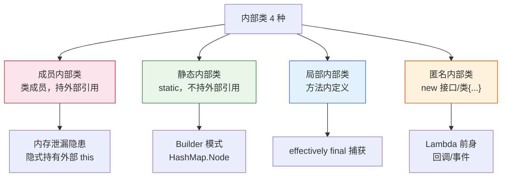
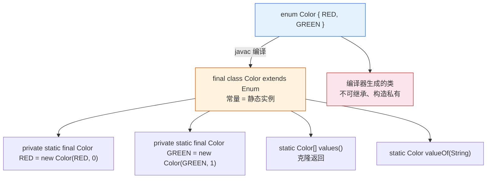
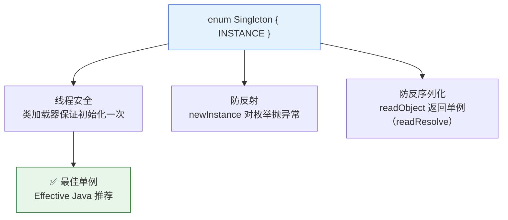

# 内部类与枚举

> 前置篇目：《03-面向对象核心》（类/this/构造器基础）、《04-抽象类接口多态》（接口/匿名类实现）。枚举的 Comparable/序列化衔接《11-集合框架体系》《12-I/O 与 NIO》；匿名类 vs Lambda 衔接《13-Lambda 与 Stream》。
>
> 本篇知识点清单（28 项，按知识面五层标注，也是本篇出题的锚点）：
>
> **基础使用**：1. 四种内部类总览 · 2. 为什么需要内部类 · 3. 成员内部类 · 4. 静态内部类 · 5. 局部与匿名内部类 · 6. 枚举基础
> **机制原理**：7. 内部类编译原理 · 8. effectively final 捕获 · 9. 内部类遮蔽 · 10. 枚举编译结构 · 11. Enum 基类源码 · 12. 枚举单例三防 · 13. values/valueOf 细节 · 14. 内部类内存泄漏 · 15. 匿名类 vs Lambda
> **高级进阶**：16. 成员 vs 静态选型 · 17. 枚举带字段与方法 · 18. 枚举实现接口 · 19. EnumMap/EnumSet · 20. Builder 模式
> **实战技能**：21. Handler 泄漏事故 · 22. 枚举 6 坑 · 23. 枚举 vs 常量/字符串 · 24. 内部类序列化 · 25. 面试连环问
> **设计权衡**：26. 枚举完胜常量 · 27. 内部类的封装价值

---

## 四种内部类：一张图看懂

**本块讲什么**：成员/静态/局部/匿名四种内部类的定位差异——按"声明位置 × 是否 static"两个维度区分。



**两个维度区分**：

| 维度 | 成员内部类 | 静态内部类 | 局部内部类 | 匿名内部类 |
|---|---|---|---|---|
| 声明位置 | 类内（无 static） | 类内（有 static） | 方法内 | new 表达式里 |
| 持外部引用 | ✅ | ❌ | ✅（外部实例） | ✅ |
| 有名字 | ✅ | ✅ | ✅ | ❌ |
| 典型用途 | 迭代器/状态机 | Builder/Node | 方法内辅助 | 回调/事件/Lambda 前身 |

**术语精确性**（Oracle 官方定义）：**嵌套类（nested class）= 静态嵌套类 + 内部类（inner class）**——"内部类"严格指非静态嵌套类，但日常口语把四种统称内部类。本篇按口语习惯四种都叫内部类，必要时标静态/非静态。

**为什么四种并存**：本质是"绑定关系"的选择——要不要持有外部实例（static 决定）、要不要命名（局部/匿名决定）、声明在哪个作用域。**每种选择都有代价**（成员内部类持引用→泄漏风险），选型逻辑见第 16 块。

> 边界：**成员内部类不能声明 static 成员**（JLS 8.1.3：内部类是实例关联的，static 成员属于类）——`class Inner { static int x; }` 编译错误（JDK 16+ 放宽为允许常量）。**外部类只能 public 或包级，内部类可以是 private**（封装能力的来源，第 27 块）。

---

## 为什么需要内部类？Oracle 给的三个理由

**本块讲什么**：内部类存在的意义——逻辑分组、增强封装、代码就近——不是语法糖，是"关联关系"的表达工具。

**理由 1：逻辑分组**（helper 类只给一个类用，就嵌进去）：

```java
class OrderService {
    // OrderValidator 只被 OrderService 用 → 嵌进去，包更清爽
    class OrderValidator {
        boolean validate(Order o) { return o.getAmount() > 0; }
    }
}
```

**理由 2：增强封装**（内部类能访问外部类的 private 成员）：

```java
class Cache {
    private int maxSize = 100;
    class Entry {                       // 内部类可以访问 private maxSize
        long getMaxSize() { return maxSize; }
    }
}
```

**理由 3：代码就近**（使用处定义，阅读连续）：

```java
void process() {
    class Processor { void run() { /* 只在 process 用 */ } }
    new Processor().run();
}
```

**一个更深的动机**：内部类隐式持有外部引用（第 7 块）——这让它天然适合"**需要访问外部状态的组件**"（迭代器要访问集合元素、状态机要读写外部状态）。JDK 的 `ArrayList.Itr`（迭代器）就是成员内部类：它直接访问 ArrayList 的 `elementData`/`modCount`（private 字段），这就是内部类"增强封装"的教科书案例。

> 边界：内部类不是"性能优化"工具——它编译后是独立类文件（第 7 块），运行时多一层引用间接，性能无差异。**选内部类是为了表达"关联关系"，不是为了省代码**。

---

## 成员内部类：outer.new Inner() 的语法与语义

**本块讲什么**：成员内部类 = "挂在外部实例上的类"——实例化必须通过外部实例（`outer.new Inner()`），且隐式持有外部引用。

**定义与实例化**（实测 JDK 8）：

```java
class Outer {
    String name = "Outer";
    class Inner {
        String getOuterName() { return name; }   // 直接访问外部字段
    }
}

Outer o = new Outer();
Outer.Inner i = o.new Inner();      // 关键语法：外部实例.new
i.getOuterName();                   // "Outer"
```

**三个机制事实**：

1. **必须外部实例才能 new**：`new Outer.Inner()` 编译错误——内部类"属于"某个外部实例；
2. **隐式持有外部引用**：编译后内部类有个 `final Outer this$0` 字段（javap 实测：`InnerEnumProbe$MemberInner(InnerEnumProbe)` 构造器带外部参数）——这就是"能访问外部私有成员"的底层原因；
3. **可以直接访问外部一切成员**（含 private）——访问外部字段时"自动用 this$0"。

**访问修饰符**：成员内部类可以 private/protected/public/包级——private 内部类只在外部类内部可用（完美封装，第 27 块）。

**JDK 范例**：`HashMap.Node`、`ArrayList.Itr`（迭代器）、`ThreadLocal.ThreadLocalMap.Entry`——都是"实现细节组件"用成员内部类（但很多是 static，见第 16 块）。

> 边界：**成员内部类不能有 static 成员**（JLS 8.1.3，JDK 16+ 只允许 static final 常量）——因为它绑定实例，没有"类级"意义。内部类里想用静态工具 → 挪到外部类或静态内部类。

---

## 静态内部类：不持外部引用的"独立"类

**本块讲什么**：静态内部类 = "为了打包方便嵌套的顶层类"（Oracle 原话）——不持有外部引用，不能访问外部实例成员（实测验证）。

**定义与实例化**（实测 JDK 8）：

```java
class Outer {
    static String staticField = "static-outer";
    String instanceField = "instance";

    static class StaticInner {
        String getStatic() { return staticField; }        // ✅ 能访问外部 static 成员
        // String getInstance() { return instanceField; } // ❌ 编译错误：不能访问外部实例成员
    }
}

Outer.StaticInner si = new Outer.StaticInner();   // 直接 new，不需要外部实例
```

**三个关键事实**：

1. **实例化不需要外部实例**：`new Outer.StaticInner()`——它跟顶层类一样用（Oracle："behaviorally a top-level class"）；
2. **不持有外部引用**：javap 实测构造器 `InnerEnumProbe$StaticInner()` **无参数**（对比成员内部类带 Outer 参数）——**没有 this$0 字段，不会造成内存泄漏**；
3. **只能访问外部 static 成员**：要访问实例成员必须通过对象引用（`outer.instanceField`，实测 Oracle 官方例子验证）。

**为什么叫"静态"**：它像 static 方法一样"不依赖实例"——外部实例和内部类实例之间**没有隐式关联**。

**典型用途**：`Builder` 模式（第 20 块）、`HashMap.Node`（static class Node，纯数据节点不需要外部引用）、`Collections` 内部的各种辅助类。

> 边界：**"静态内部类"和"成员内部类"的选型**（第 16 块）：默认优先静态内部类（不泄漏、独立）——**除非真的需要访问外部实例状态**。JDK 里大量"Node/Entry"都是 static 内部类，就是这个原因。

---

## 局部内部类与匿名内部类：方法内的两种形态

**本块讲什么**：局部内部类（有名字、方法内）和匿名内部类（没名字、new 时定义）——两者都捕获外部变量（effectively final），都是"一次性辅助"的形态。

**局部内部类**（实测 JDK 8）：

```java
void process(String msg) {
    class Logger {                    // 方法内定义，有名字
        void log() { System.out.println("LOG: " + msg); }
    }
    new Logger().log();               // 只能在本方法内用
}
```

**匿名内部类**（实测 JDK 8）：

```java
Runnable r = new Runnable() {        // 没名字：new 接口/类 + 立即定义实现
    @Override public void run() {
        System.out.println("匿名类执行");
    }
};
```

**两者对比**：

| 维度 | 局部内部类 | 匿名内部类 |
|---|---|---|
| 名字 | 有 | 无 |
| 定义 | `class X {}` 在方法内 | `new 接口(){}` 表达式里 |
| 实例化次数 | 可多次 new | 每次 new 表达式一次 |
| 捕获变量 | effectively final | effectively final |
| 典型场景 | 方法内复杂辅助 | 回调/事件/一次性实现 |

**编译产物**（实测 javac）：局部内部类 → `Outer$1LocalInner.class`，匿名类 → `Outer$1.class`（数字编号区分多个匿名类：$1、$2...）——**每个匿名/局部类都是独立类文件**（第 7 块）。

**捕获规则（effectively final）**——实测编译断言：匿名类捕获 `int x`，方法内 `x = 2` 修改后编译报错"从内部类引用的本地变量必须是最终变量或实际上的最终变量"。

> 边界：匿名内部类实现**多方法接口**要写全部方法（对比 Lambda 只适合函数式接口，第 15 块）；JDK 8 后**能 Lambda 就别匿名类**（Lambda 更轻，不生成独立类文件——invokedynamic，见《13》）。

---

## 枚举基础：enum 的定义与使用

**本块讲什么**：枚举 = 一组**类型安全**的常量集合——比 `int`/`String` 常量更安全（编译期检查）更强大（方法/字段/switch），编译后是 final class。

```java
enum Color { RED, GREEN, BLUE }        // 最简单的枚举

Color c = Color.RED;
System.out.println(c.name());          // "RED"
System.out.println(c.ordinal());       // 0（声明顺序，慎用！第 22 块）
System.out.println(c.toString());      // "RED"
```

**枚举的三个"类型安全"证据**：

1. **编译期检查**：`Color c = "RED";` 编译错误——枚举是类型，不是字符串；
2. **switch 支持**（JDK 5+）：`switch (c) { case RED: ... }`——编译器把它转成 ordinal 的 switch（第 13 块）；
3. **不能 new**：`new Color("RED")` 编译错误——构造器私有，实例只有声明的几个。

**枚举的隐含能力**（继承自 Enum 基类，第 11 块）：

| 方法 | 作用 |
|---|---|
| `name()` | 常量名字符串（与声明一致） |
| `ordinal()` | 声明序号（0 起，**别存库**，第 22 块） |
| `toString()` | 默认 = name()（可重写） |
| `values()` | 所有常量数组（编译器生成，第 13 块） |
| `valueOf(String)` | 按名字取常量（编译器生成，非法名抛 IllegalArgumentException） |
| `compareTo()` | 按 ordinal 比较（实现了 Comparable） |

**为什么枚举能 switch**：编译器把 `case RED` 编译成 `ordinal` 的整数比较（第 13 块 javap 实证）——**不是 JVM 原生支持枚举**，是编译期转换。

> 边界：**枚举常量也是对象**（每个常量是 Enum 子类的一个静态实例，第 10 块）——所以枚举可以带字段/方法（第 17 块）、实现接口（第 18 块）。`null` 不是合法枚举值（switch 枚举 null 抛 NPE，第 22 块）。

---

## 内部类编译原理：this$0 和 $1 的秘密

**本块讲什么**：内部类是"语法糖"——javac 把每个内部类编译成独立 .class 文件，通过合成字段（synthetic）实现"外部引用"和"访问私有"。

**编译产物**（实测 javac，源码只有一个文件）：

```text
InnerEnumProbe.class                ← 外部类
InnerEnumProbe$MemberInner.class    ← 成员内部类
InnerEnumProbe$StaticInner.class    ← 静态内部类
InnerEnumProbe$1LocalInner.class    ← 局部内部类
InnerEnumProbe$1.class              ← 匿名内部类（数字编号）
InnerEnumProbe$Color.class          ← 枚举
```

**合成字段 this$0**（javap 成员内部类实测）：

```text
final InnerEnumProbe this$0;                 ← 隐式外部引用！
InnerEnumProbe$MemberInner(InnerEnumProbe);  ← 构造器带外部参数
```

**成员内部类"访问外部私有字段"的底层**：javac 给外部类生成**合成访问方法**（如 `static String access$000(Outer)`，包级 bridge）——内部类通过 `this$0.access$000(...)` 访问 private 字段。**"能访问私有"不是 JVM 魔法，是编译器搭的桥**。

**合成成员（synthetic）**：`this$0`、`access$xxx` 方法都是编译器生成的——**没有源码对应物**（Oracle："synthetic constructs enable compilers to implement new features without JVM changes"）。这也解释了为什么**内部类不适合序列化**（第 24 块：合成成员随编译器实现而异）。

**匿名/局部类的编号**：`Outer$1.class` 的 `$1` 是"源文件中第 N 个匿名类"的序号——**类文件名依赖源码顺序**，改代码顺序类文件就变（这是混淆器要处理的）。

> 边界：静态内部类**没有** this$0（实测构造器无参）——这是它不泄漏的底层原因（第 14 块）。反射里 `Class.getDeclaredFields()` 能看到 this$0（它是真实字段），`isSynthetic()` 可判断合成成员（衔接《09-反射与动态代理》）。

---

## 为什么局部/匿名类捕获的变量必须 effectively final？

**本块讲什么**：局部/匿名类用外部局部变量时，变量必须"实际不可变"（effectively final）——这是"值拷贝语义"的必然要求（实测验证）。

**规则**（JDK 8+ 的 effectively final）：变量"初始化后不再赋值"就是 effectively final（`final` 可省略，行为等价）：

```java
void f() {
    int x = 1;                          // effectively final（没再赋值）
    Runnable r = () -> System.out.println(x);   // ✅ JDK 8：省略 final 也行
    // x = 2;                           // ❌ 再赋值 → 编译错误（实测）
}
```

**为什么必须不可变**（机制）：局部变量在**栈上**，方法返回就没了；内部类对象可能在方法返回后**仍存活**（被回调持有）——所以 javac 把捕获的变量**拷贝**进内部类（合成字段）。**如果允许变量在方法里被改，内部类看到的是"拷贝"还是"原值"？**——会有两份值，语义分裂。干脆规定"不可变"，拷贝值和原值永远一致，无歧义。

**等价字节码**（javac 生成的合成字段）：

```java
// 源码
int x = 1;
new Runnable() { public void run() { use(x); } };

// javac 等价物
final int x$ = 1;                          // 拷贝进内部类
new Runnable() { public void run() { use(x$); } };
```

**三个实战推论**：

1. **想"改捕获变量"怎么办**：用数组/包装对象/类的可变字段间接改（如 `int[] holder = {0}`），或重构为"新局部变量"（Lambda 捕获要求同样，第 15 块）；
2. **JDK 8 之前必须显式 final**：老代码里 `final int x = 1` 一堆 final——JDK 8 后可以删掉（行为不变）；
3. **对象引用也是"值"捕获**：捕获 `List` 引用时，引用不可变但**内容可改**（`list.add` 合法）——"effectively final"只管引用本身。

> 边界：成员内部类/静态内部类**不捕获**（它们访问的是外部实例字段/静态字段，走 this$0 或类引用，无拷贝问题）——"捕获"只发生在局部/匿名类。**Lambda 与匿名类共享这条规则**（衔接《13-Lambda 与 Stream》）。

---

## 内部类遮蔽：参数、内部类字段、外部类字段三级优先级

**本块讲什么**：内部类里名字遮蔽的三级规则——参数 > 内部类字段 > 外部类字段，用 `this`/`Outer.this` 精确指认（实测复刻 Oracle 官方例子）。

**实测**（JDK 8，Oracle ShadowTest 复刻）：

```java
int x = 0;                       // 外部类字段
class FirstLevel {
    int x = 1;                   // 内部类字段
    void f(int x) {              // 参数
        System.out.println(x);                    // 23（参数，最近）
        System.out.println(this.x);               // 1（内部类字段）
        System.out.println(FirstLevel.this.x);    // 1（同上）
        System.out.println(Outer.this.x);         // 0（外部类字段）
    }
}
```

**三级遮蔽优先级**（从近到远）：**方法参数/局部变量 > 内部类字段 > 外部类字段**——裸写 `x` 永远是最内层的那个。

**精确指认语法**：

| 想访问 | 写法 |
|---|---|
| 参数/局部变量 | 裸写 `x` |
| 内部类自己的字段 | `this.x` |
| 外部类的字段 | **`Outer.this.x`**（类名.this） |
| 外部类的方法 | `Outer.this.method()` |

**为什么需要 `Outer.this`**：内部类有两个"this"——自己的和外部类的。`this.x` 指内部类自己的，外部类的必须用 `Outer.this.x` 显式限定（这是内部类最易读错的语法点，IDE 会高亮遮蔽）。

> 边界：**遮蔽不是 bug 而是特性**——JDK 大量内部类刻意用遮蔽（`HashMap.Node.key` 与外部变量重名很少见，但迭代器里 `next()` 遮蔽外部字段常见）。规则：**遮蔽处必须加限定词**，别裸写（代码审查会抓）。

---

## 枚举编译后长什么样？javap 实锤

**本块讲什么**：enum 是语法糖——编译后是 `final class extends java.lang.Enum`，常量是静态 final 实例，values/valueOf 是编译器生成的（javap 实测）。

**源码**：

```java
enum Color { RED("#FF0000"), GREEN("#00FF00"); final String hex; Color(String h){hex=h;} }
```

**javap -p 实测**（JDK 8）：

```text
final class InnerEnumProbe$Color extends java.lang.Enum<InnerEnumProbe$Color> {
  public static final InnerEnumProbe$Color RED;      ← 常量 = 静态 final 实例
  public static final InnerEnumProbe$Color GREEN;
  final java.lang.String hex;                          ← 自定义字段
  private static final InnerEnumProbe$Color[] $VALUES; ← 内部数组
  public static InnerEnumProbe$Color[] values();      ← 编译器生成
  public static InnerEnumProbe$Color valueOf(java.lang.String);  ← 编译器生成
  private InnerEnumProbe$Color(java.lang.String);     ← 构造器私有（带 Enum 的 name/ordinal）
  static {};                                          ← 静态块：new 两个常量
}
```



**五个"编译器生成"的实锤**：

1. **final class**：枚举不能继承（`extends` 枚举编译错误）；
2. **extends Enum<Color>**：隐式继承（所以枚举不能继承别的类，但能实现接口，第 18 块）；
3. **构造器私有**：构造器签名是 `(String name, int ordinal)` 加上自定义参数——实例只有声明的几个；
4. **values()/valueOf()**：编译器生成，**不是 Enum 基类的方法**（`Enum` 里没有 values）；
5. **静态块**：类加载时 new 所有常量——**枚举常量的"单例性"由类加载保证**（线程安全，第 12 块）。

> 边界：**`$VALUES` 是私有数组，values() 返回的是它的克隆**——改 values() 返回的数组不影响枚举本身（防御性拷贝）。枚举常量定义顺序 = ordinal 顺序 = values() 顺序——**增删常量会变 ordinal**（第 22 块坑 2）。

---

## Enum 基类源码：E extends Enum<E> 是什么套路？

**本块讲什么**：所有枚举隐式继承 `java.lang.Enum<E>`——自限泛型（衔接《01-泛型擦除原理》自限泛型块）保证 compareTo 的参数是"同类型枚举"。

**Enum 基类核心字段**（JDK 17 源码）：

```java
public abstract class Enum<E extends Enum<E>> implements Comparable<E>, Serializable {
    private final String name;      // 常量名字符串
    private final int ordinal;      // 声明序号
    public final String name() { return name; }
    public final int ordinal() { return ordinal; }
    public final int compareTo(E o) { ... }   // 按 ordinal 比
    protected final Object clone() throws CloneNotSupportedException { throw ...; }
    // 注意：values()/valueOf() 不在 Enum 里！是编译器给每个枚举生成的
}
```

**自限泛型 E extends Enum<E>**（衔接《08》块 31）：`Color extends Enum<Color>`——`compareTo` 的参数类型是 `Color` 而不是任意枚举，保证"不同枚举不能互相比较"：

```java
Color.RED.compareTo(Color.GREEN);   // ✅
// Color.RED.compareTo(Day.MON);    // ❌ 编译错误：参数必须是 Color
```

**Enum 的三条设计防线**（单例性）：

1. **clone() 抛异常**：枚举不能 clone（复制枚举 = 第二个实例，破坏单例）；
2. **finalize() 是 final 空实现**：枚举不需要 finalize；
3. **readResolve() 保证反序列化单例**：反序列化时返回已存在的常量，不新建（第 12 块）。

**为什么枚举不能继承其他类**：它已经隐式继承 `Enum`（Java 单继承）——但**可以 implements 接口**（第 18 块），接口是"能力"不受单继承限制。

> 边界：`Enum` 的构造器是 `protected Enum(String name, int ordinal)`——编译器生成的枚举构造器隐式传 name/ordinal，**用户代码不能直接调**（`new Enum(...)` 编译错误）。`toString()` 默认返回 name，可重写（`name()` 是 final 不能重写——想要"显示名"重写 toString）。

---

## 枚举单例三防：为什么 enum 是最佳单例？

**本块讲什么**：枚举单例天然解决单例的三大敌人——线程安全、反射、序列化（EJ Item 3 推荐），对比其他单例写法的优势。



**三防机制**：

**防 1：线程安全**——枚举常量在**类加载时**由静态块创建（第 10 块），类加载由 JVM 保证只发生一次（线程安全无需 synchronized/lazy）。对比懒汉式单例的 double-checked locking 那套，枚举零代码。

**防 2：防反射**（实测 JDK 8）：反射调枚举构造器 `newInstance("BLUE", 2)` 抛异常——`Constructor.newInstance` 内部检查"是枚举类就抛 IllegalArgumentException"（"Cannot reflectively create enum objects"）。实测：`getDeclaredConstructor(String.class, int.class).setAccessible(true).newInstance(...)` 抛异常 ✅。

**防 3：防反序列化**——Enum 实现了 `readResolve()` 返回已存在常量，反序列化不会新建实例（对比普通单例必须自己实现 readResolve 防序列化破坏）。

**对比其他单例**（EJ Item 3）：

| 写法 | 线程安全 | 防反射 | 防序列化 | 简洁 |
|---|---|---|---|---|
| 饿汉式（static final） | ✅ | ❌ | ❌ | ✅ |
| 懒汉式（synchronized） | ✅ | ❌ | ❌ | ❌（性能） |
| 双重检查锁（DCL） | ✅ | ❌ | ❌ | ❌（复杂易错） |
| 静态内部类（holder） | ✅ | ❌ | ❌ | ✅ |
| **枚举单例** | ✅ | ✅ | ✅ | ✅✅ |

**为什么"完美的单例"仍有反对声**：枚举单例**不能懒加载**（类加载即创建）；不能用继承扩展；语义上"枚举"承载"单例"有点怪。但**对绝大多数场景，EJ 的结论就是：枚举单例是首选**。

> 边界：**需要懒加载/继承的单例别用枚举**（如需要参数的池化单例）——用 holder 静态内部类模式。枚举单例还天然可作 **switch 分支、EnumMap key**（第 19 块），单例+有限集合二合一。

---

## values() / valueOf()：编译器生成的静态方法

**本块讲什么**：values()（全部常量）和 valueOf()（按名字取）是编译器为每个枚举生成的静态方法——细节和坑都在这两个方法上。

**三个方法的行为**（实测 JDK 8）：

```java
Color[] all = Color.values();         // [RED, GREEN]（克隆，改它不影响枚举）
Color c = Color.valueOf("RED");       // RED
// Color.valueOf("BLUE");             // ❌ IllegalArgumentException（无此常量）
Color d = Enum.valueOf(Color.class, "RED");   // 基类版：等效
```

**细节 1：values() 返回克隆**——`$VALUES` 是私有数组，values() 返回 `$VALUES.clone()`——防止调用方改数组破坏枚举（防御性拷贝，实测 javap 见 `values()` 里有 clone 调用）。

**细节 2：valueOf 非法名抛 IllegalArgumentException**——不是返回 null（"找不到"用异常表达，因为"非法枚举名"是编程错误不是业务分支）。

**细节 3：values() 不是 Enum 基类方法**——`Enum` 基类没有 values()，它是编译器按枚举生成的。所以**反射拿不到 values()**（它不在基类，`Enum.class.getMethod("values")` 抛 NoSuchMethodException）——框架要用枚举全集得自己反射枚举类（衔接《09-反射与动态代理》）。

**细节 4：valueOf 基于 name() 精确匹配**——大小写敏感；`toString()` 重写后 `valueOf` 仍然用 name（不是 toString）——**"显示名重写 toString"不影响 valueOf 查找**。

**实战：数据库/JSON 映射**（第 22 块展开）：数据库存 name 还是 ordinal？**存 name**（稳定）——ordinal 随声明顺序变化，存库是灾难。

> 边界：**valueOf 与 Enum.valueOf(Class, String)** 等效——后者是基类的泛型方法（`<T extends Enum<T>> T valueOf(Class<T>, String)`）。**"遍历枚举"的惯用法是 `for (Color c : Color.values())`**——values() 每次调用都克隆新数组，热循环里可以缓存（极少需要）。

---

## 内部类内存泄漏：隐式外部引用的代价

**本块讲什么**：成员/匿名/局部内部类隐式持有外部实例（this$0）——外部对象被内部类"吊着"无法回收，这是 Android Handler 泄漏的根因（[示意] 行业典型）。

**机制**（第 7 块已证）：成员内部类编译后有 `final Outer this$0`——**只要内部类对象活着，外部对象就活着**（可达性分析从内部类可达外部）。

**泄漏场景**（[示意] 行业典型模式，Android Handler 泄漏同款）：

```java
class Activity {
    // 匿名内部类：隐式持有 Activity 引用
    Runnable task = new Runnable() {
        @Override public void run() { refreshUi(); }
    };
    void start() {
        // task 被提交到全局线程池 → 线程池持有 task → task 持有 Activity
        GlobalExecutor.submit(task);    // Activity 被"吊着"直到 task 执行完
    }
}
```

**后果**：Activity 已销毁（用户关页面），但线程池还持有 task → task 持有 Activity → **Activity 无法 GC** → 内存泄漏，页面开得多就 OOM。

**修复三板斧**：

```java
// 1. 静态内部类 + 弱引用（标准解法）
static class UiTask implements Runnable {
    private final WeakReference<Activity> ref;
    UiTask(Activity a) { ref = new WeakReference<>(a); }
    public void run() {
        Activity a = ref.get();
        if (a != null) a.refreshUi();      // 判空！Activity 可能已回收
    }
}

// 2. 取消机制：task 完成后主动清引用 / cancel()
// 3. 生命周期匹配：随 Activity 销毁 cancel 掉任务
```

**为什么静态内部类能解**：静态内部类**没有 this$0**（第 4 块实测构造器无参）——它不隐式持有外部实例，只有显式持有的字段（WeakReference 不阻止回收）。

**判断口诀**：**"非静态内部类对象活得比外部实例久，就会泄漏"**——回调、线程、监听器场景全中招。写代码先问："这个内部类对象会逃离外部实例的生命周期吗？"会 → 静态内部类 + 弱引用/显式释放。

> 边界：**静态内部类不泄漏但也没有外部访问**（第 4 块）——要访问外部状态必须显式传引用（这就把"生命周期"的决定权交给了你，而不是编译器偷偷吊着）。**"泄漏"不是内部类的 bug，是"隐式引用 + 长生命周期"的组合**——理解了 this$0 就能推导出所有泄漏场景（面试讲机制的关键）。

---

## 匿名类 vs Lambda：什么时候用哪个？

**本块讲什么**：匿名内部类和 Lambda 都能实现函数式接口——但底层机制完全不同（类文件 vs invokedynamic），选型规则一句话（衔接《13-Lambda 与 Stream》）。

**对比**（JDK 8+）：

```java
// 匿名内部类：编译成 Outer$1.class（独立类文件）
Runnable r1 = new Runnable() { public void run() { work(); } };

// Lambda：invokedynamic，不生成类文件
Runnable r2 = () -> work();
```

**六个差异**：

| 维度 | 匿名类 | Lambda |
|---|---|---|
| 编译产物 | 独立 .class（$1） | invokedynamic（无类文件） |
| this | 指向匿名类自己 | 指向**外围类**（Lambda 无 this） |
| 捕获变量 | effectively final | effectively final |
| 适用 | 任何接口/类（含多方法） | 只能函数式接口（单抽象方法） |
| 可读性 | 啰嗦 | 简洁 |
| 序列化 | 不建议（合成成员） | 不建议 |

**this 的差异（最隐蔽）**：

```java
class Handler {
    Runnable anon = new Runnable() {
        @Override public void run() {
            System.out.println(this.getClass());   // Handler$1（匿名类自己）
        }
    };
    Runnable lambda = () -> {
        System.out.println(this.getClass());       // Handler（外围类！）
    };
}
```

匿名类里 `this` 是匿名类实例（可以调匿名类自己的字段）；Lambda 里 `this` 就是外围类的 this（Lambda 没有自己的 this）——**"Lambda 是更轻的匿名类"是常见误解**，它是不同的机制。

**选型规则**：**函数式接口（单抽象方法）→ Lambda；多方法接口/需要 this 指向实现类 → 匿名类**。JDK 8 后业务代码 90% 的匿名类是"函数式接口回调"，都能换成 Lambda。

> 边界：**Lambda 的性能**——invokedynamic 首次调用有引导开销，热路径 JIT 后与匿名类无差异；**匿名类的类文件数量**（$1、$2...）在大量回调时会膨胀（每个都是独立类）。深挖见《13-Lambda 与 Stream》的 invokedynamic 原理块。

---

## 成员内部类 vs 静态内部类：选型铁律

**本块讲什么**：默认静态、需要访问外部实例状态才用成员——选型铁律 + 判断步骤（内存泄漏风险是主要考量）。

**对比**（实测证据）：

| 维度 | 成员内部类 | 静态内部类 |
|---|---|---|
| 外部引用 | ✅ 隐式持有（this$0，实测） | ❌ 无（构造器无参，实测） |
| 访问外部实例成员 | ✅ 直接访问 | ❌ 必须传对象引用 |
| 内存泄漏风险 | ✅ 高（对象活得久就泄漏） | ❌ 无 |
| 实例化 | `outer.new Inner()` | `new Outer.StaticInner()` |
| 典型场景 | 迭代器/状态机（需要外部状态） | Builder/Node/辅助类 |

**判断三步**：

```
① 需要访问外部实例的状态/方法吗？
   ├─ 不需要 → 静态内部类（无脑选它）
   └─ 需要 ↓
② 内部类对象的生命周期会超过外部实例吗？
   ├─ 会（回调/线程/缓存）→ 改设计：静态内部类 + 显式传引用（防泄漏）
   └─ 不会（只在外部方法内用）→ 成员内部类
```

**JDK 的示范**：`HashMap.Node` 是 **static**（纯数据节点，不需要外部状态，防泄漏）；`ArrayList.Itr` 是**成员**（迭代器需要访问 list 的 elementData/modCount，且迭代器生命周期 ≤ list 使用期，不泄漏）——**JDK 自己也是按铁律选的**。

**一个常见的错误直觉**："成员内部类能直接访问外部字段，方便，就用它"——**方便是方便了，this$0 也悄悄吊上了**。团队规范通常直接规定：**非静态内部类禁止逃逸出外部类**（Android 的 Lint 就是这么抓 Handler 泄漏的）。

> 边界：**局部内部类和匿名类也是"非静态"**（隐式持有外部实例）——它们的泄漏风险与成员内部类相同（第 14 块）。静态内部类**不能访问外部实例成员**（实测编译错误），这不是缺陷，是"防泄漏的代价"。

---

## 枚举带字段与方法：从常量到对象

**本块讲什么**：枚举常量是对象——可以带字段（如颜色 hex 值）、构造器参数、方法——这是枚举碾压常量类的核心能力。

**带字段的枚举**（实测 JDK 8）：

```java
enum Color {
    RED("#FF0000"), GREEN("#00FF00"), BLUE("#0000FF");
    final String hex;
    Color(String hex) { this.hex = hex; }
    String hex() { return hex; }
}
Color.RED.hex();      // "#FF0000"
```

**三个要点**：

1. **构造器参数在常量声明里传**：`RED("#FF0000")`——每个常量绑定自己的数据；
2. **字段可以 final**（推荐，枚举常量不可变）：`final String hex;`
3. **可以加方法**：普通方法、甚至抽象方法（第 18 块策略枚举）。

**实战：状态机枚举**（订单状态，最典型的枚举用法）：

```java
enum OrderStatus {
    CREATED(0, "已创建") {
        OrderStatus next() { return PAID; }
    },
    PAID(1, "已支付") {
        OrderStatus next() { return SHIPPED; }
    },
    SHIPPED(2, "已发货") {
        OrderStatus next() { return DONE; }
    },
    DONE(3, "已完成") {
        OrderStatus next() { return this; }
    };
    final int code;
    final String label;
    OrderStatus(int code, String label) { this.code = code; this.label = label; }
    abstract OrderStatus next();          // 每个常量的"下一个状态"
}
OrderStatus s = OrderStatus.CREATED;
s.next();     // PAID（多态！每个常量有自己的行为）
```

**为什么枚举能"每个常量不同行为"**：每个常量是枚举类的匿名子类实例（常量体 `{ ... }` 编译成 `Color$1`、`Color$2` 子类）——**"常量体"= 匿名内部类**（第 5 块），所以能 override 抽象方法。这是"策略枚举"的基础（第 18 块）。

> 边界：**枚举字段别用 ordinal 做业务值**（第 22 块坑 2）——状态码用显式字段（code）而不是 ordinal。**枚举构造器不能访问静态字段**（构造器执行时静态字段还没初始化完，JLS 限制）——构造器里用静态字段要小心。

---

## 枚举实现接口：策略枚举的两种姿势

**本块讲什么**：枚举可以 implements 接口——两种姿势（接口方法每个常量实现 / 枚举整体实现），策略枚举的经典应用（EJ Item 34）。

**姿势 1：每个常量各自实现**（常量体多态）：

```java
interface Operation {
    double apply(double x, double y);
}
enum BasicOperation implements Operation {
    PLUS("+")  { public double apply(double x, double y) { return x + y; } },
    MINUS("-") { public double apply(double x, double y) { return x - y; } };
    final String symbol;
    BasicOperation(String symbol) { this.symbol = symbol; }
}
BasicOperation.PLUS.apply(2, 3);    // 5.0（多态！）
```

**姿势 2：枚举整体实现**（所有常量共享一个实现，可通过 switch/字段区分）：

```java
enum Weekday implements Runnable {
    MON, TUE, WED;
    public void run() {              // 整体实现一次
        switch (this) { case MON: /* 周一逻辑 */ break; ... }
    }
}
```

**"策略枚举"的完整价值**（EJ Item 34 的核心案例——工资计算）：

```java
enum PayrollDay {
    MONDAY, TUESDAY, ..., SUNDAY;
    int pay(int hours, int payRate) {
        int base = hours * payRate;
        return base + overtimePay(hours, payRate);   // 周末/平日 overtime 不同
    }
    // 常量体里每个常量 override overtimePay → 每种日子的加班逻辑不同
}
```

**为什么枚举实现接口强**：接口让枚举"扮演角色"（Operation/Runnable）而不丢枚举特性（switch/values/单例）——**"类型安全常量 + 行为"二合一**。对比用 if-else 链判断常量（易漏分支、难扩展），策略枚举用多态替换分支（开闭原则）。

> 边界：**枚举的"常量体"继承的是枚举类，不是接口**——`PLUS { ... }` 是枚举的匿名子类（第 10 块 $1 子类）。**策略枚举 + 函数式接口**：枚举字段可以存 Lambda（`enum Op { PLUS((a,b)->a+b) ... }`，构造器参数是函数式接口）——更简洁的策略枚举（衔接《13》）。

---

## EnumMap / EnumSet：为枚举量身定做的集合

**本块讲什么**：EnumMap/EnumSet 是"用 ordinal 做索引"的专用集合——比 HashMap/HashSet 更快更省（衔接《11-集合框架体系》）。

```java
enum Day { MON, TUE, WED, THU, FRI, SAT, SUN }

// EnumMap：内部是数组（按 ordinal 索引），不用哈希
Map<Day, String> schedule = new EnumMap<>(Day.class);
schedule.put(Day.MON, "开会");

// EnumSet：内部是位向量（long），按位标记
Set<Day> weekend = EnumSet.of(Day.SAT, Day.SUN);
Set<Day> workdays = EnumSet.range(Day.MON, Day.FRI);   // MON~FRI
Set<Day> all = EnumSet.allOf(Day.class);
```

**为什么快**：

| 集合 | 内部结构 | 查找 |
|---|---|---|
| HashMap | 桶 + 哈希 | 哈希计算 + 可能冲突 |
| **EnumMap** | **数组（ordinal 索引）** | O(1) 直接下标 |
| **EnumSet** | **位向量（long）** | 位运算 |

EnumMap 的 get/put 就是 `array[ordinal]`——**连 hashCode 都不算**（比 HashMap 快且省内存）；EnumSet 一个 long 装 64 个枚举（≤64 个常量的枚举一个 long 就够，EnumSet 甚至没有对象数组）。

**为什么能用 ordinal 直接索引**：枚举常量数量固定、ordinal 稳定（不增删常量的前提下）——**这是枚举独有的优势，普通类的实例做不到**（实例数量不定）。

**JDK 用法**：`EnumMap` 常见于状态机（状态→处理器）、配置映射；`EnumSet` 常见于"一组标志"（权限集合：`EnumSet.of(Permission.READ, Permission.WRITE)`）。

> 边界：**EnumMap 的 key 不能是 null**（构造要求枚举类型，null key 抛 NPE）。**EnumSet 的迭代顺序是 ordinal 序**（不是插入序）——依赖插入序就别用。深挖（内部实现/扩容）见《11-集合框架体系》。

---

## Builder 模式：静态内部类的最佳实战

**本块讲什么**：Builder 模式（EJ Item 2）用静态内部类解决"多参数构造器"问题——静态内部类 + 链式调用 + 不可变，是内部类设计价值的集中展示。

**问题**：对象有 5+ 个可选参数，构造器重载爆炸：

```java
// ❌ 重载爆炸 / 可读性差
new Pizza(10, true, true, false, false);
// 每个参数是什么意思？顺序错了怎么办？
```

**Builder 模式**（静态内部类）：

```java
public class Pizza {
    private final int size;
    private final boolean cheese;
    private final boolean bacon;

    private Pizza(Builder b) {                     // 构造器私有
        this.size = b.size; this.cheese = b.cheese; this.bacon = b.bacon;
    }
    public static class Builder {                   // 静态内部类！
        private int size; private boolean cheese; private boolean bacon;
        public Builder(int size) { this.size = size; }       // 必填参数进构造器
        public Builder cheese(boolean v) { this.cheese = v; return this; }  // 链式
        public Builder bacon(boolean v) { this.bacon = v; return this; }
        public Pizza build() { return new Pizza(this); }
    }
}
// 用法：参数名即语义
Pizza p = new Pizza.Builder(12).cheese(true).bacon(true).build();
```

**为什么 Builder 用静态内部类**：

1. **不需要访问 Pizza 实例**（构建是"造新对象"，不是"操作已有对象"）——静态内部类铁律（第 16 块）；
2. **能访问 Pizza 私有构造器**（内部类的封装特权）——Pizza 构造器 private，Builder 仍能 new；
3. **不泄漏**：静态内部类无 this$0，Builder 对象不会吊着 Pizza 实例。

**Builder 的三个优点**：参数语义化（`.cheese(true)` 比 `true` 可读）、不可变对象（构建完成后对象不能改）、校验集中（build() 里校验参数合法性）。

**JDK 的 Builder**：`StringBuilder`（名字带 Builder 但不是这个模式）、`Stream.builder()`、`Locale.Builder`、Lombok `@Builder`（衔接《10-注解》APT）。

> 边界：**Builder 不是万能的**——参数 ≤4 个用构造器/静态工厂就够（Builder 啰嗦）；**必填参数要进 Builder 构造器**（不能全链式，防漏必填）。对比：`new Pizza.Builder(12)` 的 12 就是必填 size，链式只填可选。

---

## Handler 泄漏事故：内部类内存泄漏的完整复盘

**本块讲什么**：一个真实的行业典型事故复盘——非静态内部类被全局线程池持有，导致 Activity 无法回收（[示意] 行业典型模式，Android 社区高发）。

**事故现场**（[示意] 行业典型模式，非亲身经历）：

> 某 App 首页频繁进出，内存持续上涨最终 OOM。排查发现：`MainActivity` 里创建了一个匿名 `Runnable`（刷新 UI），提交给了**全局单例线程池**。用户反复进出页面时，线程池里的任务排着队，每个任务都持有对应 Activity 的引用（this$0）——**Activity 明明被销毁了，却因为任务引用无法 GC**，页面进出 50 次就 OOM。

**代码还原**：

```java
class MainActivity {
    void loadData() {
        GlobalExecutor.submit(new Runnable() {       // ❌ 匿名类捕获 this
            @Override public void run() { refresh(); }
        });
    }
    void refresh() { /* 更新 UI */ }
}
// 泄漏链：线程池 → Runnable → this$0 → MainActivity（无法回收）
```

**根因拆解**（结合第 7/14 块）：匿名类编译成 `MainActivity$1.class`，构造器带 `MainActivity` 参数（this$0）——**线程池持有任务 = 持有 Activity**。UI 更新的任务跑完就释放，但**排队中的任务**（线程池忙时）会一直吊着。

**修复**（三板斧齐上）：

```java
// ① 静态内部类 + 弱引用
static class RefreshTask implements Runnable {
    private final WeakReference<MainActivity> ref;
    RefreshTask(MainActivity a) { ref = new WeakReference<>(a); }
    public void run() {
        MainActivity a = ref.get();
        if (a == null) return;              // Activity 已回收，任务作废
        a.refresh();
    }
}
// ② 生命周期匹配：onDestroy 里取消/清理任务
// ③ 队列上限：线程池拒绝策略 + 任务取消标记
```

**排查方法**（内存分析）：MAT/Android Profiler 看 `MainActivity` 的引用链——被谁持有（`this$0` 字段点名了匿名类）；**"引用链里出现 $ 类名"基本就是内部类泄漏**。

> 边界：**这类泄漏不只在 Android**——任何"长生命周期持有短生命周期对象"都中招（全局缓存存回调、事件总线未注销、ThreadLocal 未清理）。规则一句话：**回调/任务/监听器一律静态内部类 + 弱引用或显式生命周期管理**——这是第 16 块铁律的实战版。

---

## 枚举 6 坑：ordinal、values 拷贝、null switch...

**本块讲什么**：枚举的 6 个高频坑——每个都是"看起来正常、跑起来出错"的现场（第 22 块实战版）。

**坑 1：ordinal 存数据库（灾难）**：

```java
// 数据库存 ordinal：增删常量 = 数据错位！
enum Status { NEW, PROCESSING, DONE }   // NEW=0, PROCESSING=1, DONE=2
// 后来在 NEW 后插入 PENDING → PENDING=1, PROCESSING=2, DONE=3
// 数据库里存的 2（原来 PROCESSING）现在变成 DONE —— 数据全错！
```
**解法**：显式字段（`code`）+ 按 code 映射（第 17 块）。

**坑 2：values() 每次返回新数组**：`for (Color c : Color.values())` 每次克隆——极端热循环可缓存（极少需要）。

**坑 3：switch 枚举 null 抛 NPE**：

```java
Color c = null;
switch (c) { case RED: ... }    // ❌ NPE！编译器转 ordinal 前先解引用
// if (c == Color.RED) 不炸；switch 炸——行为不一致
```

**坑 4：枚举常量增删顺序影响**：`values()` 顺序 = 声明顺序；序列化/比较/EnumSet.range 都依赖它——**重排常量 = 隐式行为变化**。

**坑 5：枚举不能继承（编译错误）**：`enum X extends Y` 非法（隐式 extends Enum）——想复用枚举逻辑用接口（第 18 块）。

**坑 6：name() 与显示名混淆**：数据库/JSON 存 name()（内部名），UI 显示用 toString()（可重写为中文）——**valueOf 只认 name()**，重写 toString 不影响查找（第 13 块）。

**一句话记坑**：**ordinal 别存库、switch 别喂 null、name 和显示名分开、增删常量想清楚顺序影响**。

> 边界：**枚举的序列化**（衔接《12-I/O 与 NIO》）：Java 序列化枚举只存 name（Enum 的 readResolve 返回现有常量），**反序列化不会新建实例**（单例防线之一）；但**增删常量后反序列化旧数据会 IllegalArgumentException**（valueOf 找不到）——跨版本枚举是序列化兼容的雷。

---

## 枚举 vs 常量类 vs 字符串：怎么选？

**本块讲什么**：表示"一组固定值"的三种方案对比——枚举几乎完胜，但有些场景常量类/字符串仍然合理（衔接第 23 块实战选型）。

| 维度 | 枚举 | 常量类（public static final） | 字符串常量 |
|---|---|---|---|
| 类型安全 | ✅ 编译期检查 | ❌ 任何 int/值都能传 | ❌ 拼写错误静默 |
| 值域限制 | ✅ 只有声明的 | ❌ 可传任意值 | ❌ |
| 行为绑定 | ✅ 方法/接口/状态机 | ❌ 只能 if-else 判断 | ❌ |
| switch 支持 | ✅ | ✅（int） | ✅（JDK 7+ String） |
| 数据库映射 | name/code 显式 | int 值 | 字符串 |
| 序列化安全 | ✅ 单例防线 | ❌ 普通对象 | ✅ 但无校验 |
| 可扩展 | ❌ 不能继承 | ✅ 可继承 | — |

**三个"什么时候还能用常量/字符串"**：

1. **值来自外部且不确定**（数据库读出的状态码、第三方接口的状态）——用 int/字符串接收，**再转换成枚举**做业务判断；
2. **值是"连续数字语义"**（如序号 1-100）——不是"命名集合"，用 int；
3. **跨系统协议字段**（JSON 里的字符串状态）——传输层用字符串，**业务层转枚举**（防拼写错）。

**推荐姿势**（分层）：

```java
// 传输层：字符串 "PROCESSING"
// 转换层：Status.fromCode("PROCESSING")  → 枚举
enum Status {
    PROCESSING("PROCESSING");
    final String code;
    Status(String code) { this.code = code; }
    static Status fromCode(String code) {   // 集中映射，非法值抛异常
        for (Status s : values()) if (s.code.equals(code)) return s;
        throw new IllegalArgumentException("非法状态: " + code);
    }
}
```

**结论**：**业务代码里表示"固定命名集合"一律枚举**（类型安全 + 行为绑定）；常量/字符串只出现在"与外部世界的边界"（数据库/协议/第三方），且**边界处立即转枚举**。

> 边界：**"枚举 vs 常量"的争议核心是类型安全**——`int` 常量传错值编译期不报（`setStatus(999)` 合法），枚举编译期就拦。**JDK 自己的转变**：`Calendar.MONDAY`（int 常量）被 `DayOfWeek`（枚举）取代——这就是趋势的证据（衔接《14-Java 8~21 新特性》）。

---

## 内部类序列化：为什么不建议？

**本块讲什么**：Oracle 官方明确"强烈不建议序列化内部类"——合成成员（this$0/access$xxx）随编译器实现而异，反序列化可能崩（衔接《12-I/O 与 NIO》序列化）。

**问题根源**（Oracle 文档原话）：javac 为内部类生成**合成构造**（synthetic constructs：this$0 字段、access$xxx 桥方法）——**这些合成成员没有源码对应物，且不同编译器实现可能不同**。

**后果**：

1. **反序列化需要外部实例**：成员内部类反序列化时，this$0 要指向一个外部实例——**谁提供？** 序列化框架要么要求外部实例（复杂），要么 this$0 变 null（运行时 NPE）；
2. **类文件不兼容**：换 JDK 编译器/混淆器后，合成成员结构变化，旧序列化数据反序列化失败（`InvalidClassException`）；
3. **匿名/局部类更糟**：类名带 $1（序号），源码顺序一变类名就变——序列化数据"认不出"类。

**规则**：

| 类类型 | 序列化 |
|---|---|
| 静态内部类 | ✅ 可以（无 this$0，等价顶层类） |
| 成员/匿名/局部内部类 | ❌ 不建议（Oracle 明确反对） |
| 枚举 | ✅ 安全（序列化只存 name，单例防线） |

**正确姿势**：要序列化的数据对象 → **顶层类或静态内部类**（纯数据，无外部依赖）；**DTO/VO 一律顶层类**（内部类序列化是自找麻烦）。

**枚举是例外（推荐序列化）**：枚举的序列化是**特殊的**——只序列化 name，反序列化走 `Enum` 的 `readResolve` 返回已存在常量（不新建实例）——**枚举序列化安全且天然单例**（第 12 块防线 3）。

> 边界：**"不建议"不等于"不能"**——如果你显式实现 `Serializable` 且给内部类传了外部实例，能序列化（但要小心类文件兼容）。**结论一句话：数据对象用顶层类/静态内部类，枚举随便序列化，非静态内部类别碰序列化**（衔接《12-I/O 与 NIO》的序列化机制块）。

---

## 面试连环问：内部类与枚举 6 连

**本块讲什么**：本篇的面试必问 6 题 + 高分回答骨架——每个都带"机制层"加分点。

**Q1：四种内部类的区别？**
> 成员（类成员，隐式持有外部引用 this$0）、静态（无外部引用，等价顶层类）、局部（方法内，effectively final 捕获）、匿名（无名字，new 时定义）。**加分**：javap 看到成员内部类构造器带 Outer 参数、匿名类是 $1.class。

**Q2：为什么局部/匿名类捕获的变量必须 effectively final？**
> 局部变量在栈上，内部类对象可能活得比方法久——javac 把变量拷贝进内部类（合成字段），若变量可改，"拷贝 vs 原值"语义分裂，干脆规定不可变。**加分**：对象引用是"引用不可变、内容可改"。

**Q3：成员内部类为什么能访问外部私有成员？**
> 编译后内部类有 this$0（外部引用），javac 给外部类生成合成访问方法（access$xxx）——"能访问私有"是编译器搭桥不是 JVM 魔法。**加分**：这也是内部类不适合序列化的原因（合成成员随编译器而异）。

**Q4：内部类为什么内存泄漏？怎么防？**
> 非静态内部类隐式持有外部实例（this$0），对象活得比外部久就吊住外部无法 GC（Handler 泄漏同款）。防：静态内部类 + 弱引用 / 显式生命周期管理。**加分**：静态内部类构造器无外部参数（实测），无 this$0。

**Q5：enum 编译后是什么？为什么能做单例？**
> 编译成 final class extends Enum<Color>，常量是静态 final 实例，values/valueOf 编译器生成。单例三防：类加载线程安全、反射 newInstance 抛异常（实测）、readResolve 防反序列化。**加分**：compareTo 用自限泛型 E extends Enum<E> 保证同类型比较。

**Q6：枚举存数据库存 name 还是 ordinal？**
> 存 name（或显式 code 字段），别存 ordinal——增删常量 ordinal 会变，数据错位（坑 1）。**加分**：传输层字符串 + 业务层 fromCode 转枚举的分层姿势。

> 边界：这 6 连是"必答骨架"，追问都在本篇对应块（Builder 模式、策略枚举、EnumMap、序列化）。**面试考"讲机制"——this$0、$1.class、readResolve 这些底层证据就是区分"背题"和"真懂"的分水岭**。

---

## 为什么枚举完胜常量？设计层面的总结

**本块讲什么**：把"枚举 vs 常量"从实战（第 23 块）上升到设计层面——枚举的三大设计优势如何让代码更安全、更可维护。

**优势 1：类型即约束（编译期安全）**——`Status s = 999` 编译不过 vs `int s = 999` 静默通过。**"值域限制"从运行期约定变成编译期保证**——这是"用类型系统表达约束"的典范（对比 Java 早期用 int 常量表示一切）。

**优势 2：行为随值走（多态替代分支）**——状态机枚举的 `next()`（第 17 块）、策略枚举的 `apply()`（第 18 块）——**"每个值该做什么"写在值自己身上**，替代散落的 if-else/switch（开闭原则：加一个状态改枚举，不改业务代码）。

**优势 3：单例 + 序列化安全（架构级稳定）**——枚举常量是单例（第 12 块），序列化/数据库/JSON 都有明确映射（第 13/22 块）——**"一组固定值"跨层传输时枚举最稳**。

**一个"反枚举"的声音值得知道**：枚举是"封闭集合"——值集固定（编译期定死），**需要动态扩展值集（插件/配置驱动）时枚举不合适**（用注册表/Map）。判断：**"值集在编译期就确定"→ 枚举；"值集运行时可变"→ 别用枚举**。

**JDK 的转向证据**：`Calendar.MONDAY`（int 常量）→ `DayOfWeek`（枚举）、`ResultSet.getInt` 时代的常量地狱 → 现代 API 清一色枚举/接口（衔接第 28 块"JDK 新 API 接口优先"同款趋势）——**"用类型代替魔法值"是 Java 演进的明确方向**。

> 边界：枚举不是"银弹"——**传输/协议层可以留字符串**（兼容第三方），但边界处立即转枚举（第 23 块分层姿势）。**"常量类+工具方法"能模仿枚举的部分能力，但模仿不了类型安全和值域约束**——这是本质差距。

---

## 内部类的封装价值：为什么"隐藏"是能力

**本块讲什么**：内部类把"只属于某类的辅助"藏起来——private 内部类 + 访问特权 = Java 最强的封装工具之一（第 2 块理由 2 的深化）。

**私有的力量**（外部类只能 public/包级，内部类可以 private）：

```java
public class Service {
    private class Handler implements Callback {   // private 内部类：外部世界看不见
        @Override public void onEvent() { /* 用 Service 的私有状态 */ }
    }
    public Callback getCallback() {
        return new Handler();                      // 对外只暴露接口类型！
    }
}
// 外部拿到 Callback，但不知道/不能 new Service.Handler —— 实现完全隐藏
```

**"对外暴露接口、对内藏实现"**：`getCallback()` 返回 `Callback`（接口）——外部只能调接口方法，**Handler 类本身（含它的私有细节）完全不可见**。这就是"封装"在类型层面的表达（衔接《04》面向接口编程）。

**内部类封装的三个层次**：

1. **类隐藏**：private 内部类对外不可见（对比顶层类没有 private）；
2. **成员隐藏**：外部类 private 成员，内部类可访问（封装不破坏，反而增强协作）；
3. **实现隐藏**：返回接口类型，内部实现随便换（换 Handler 实现不影响调用方）。

**JDK 的示范**：`HashMap` 的 `Node`/`TreeNode` 是包级/私有内部类——**"桶结构怎么实现"对使用者完全隐藏**，`Map` 接口才是契约。`ThreadLocal.ThreadLocalMap`（private static class）——内部存储结构完全私有。

> 边界：**内部类的封装价值 ≠ 无脑用内部类**——只给一个类用的辅助类用内部类（内聚）；多个类共享的辅助类该是顶层类/工具类（复用）。**判据：这个类只服务一个外部类吗？是 → 内部类（隐藏），否 → 顶层类（共享）**。

> **一句话收尾**：内部类与枚举篇一句话——**内部类的本质是"绑定"：成员/匿名/局部绑定外部实例（this$0），静态内部类不绑定（所以不泄漏）**；枚举的本质是"类型安全常量 + 单例"：编译成 final class、常量是静态实例、三防（线程/反射/序列化）保单例。记住"this$0 决定泄漏，枚举常量是对象"这两句，本篇的坑都能推导——存库别用 ordinal、回调用静态内部类、能 Lambda 别匿名类。
