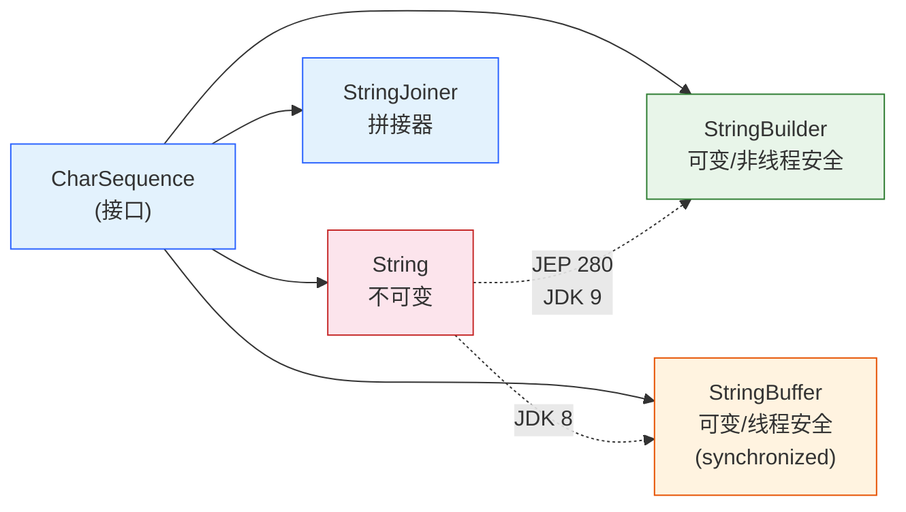
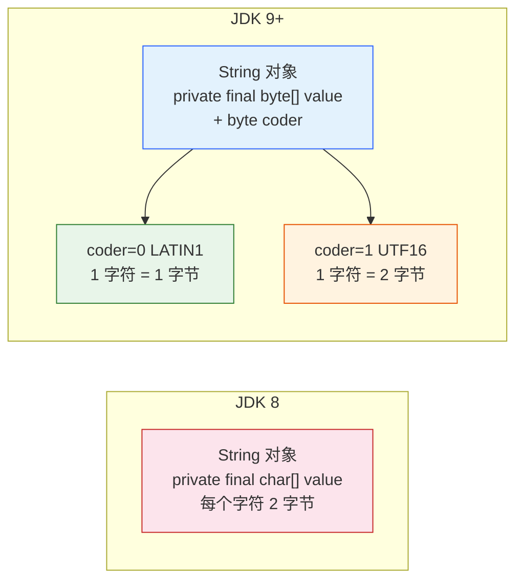
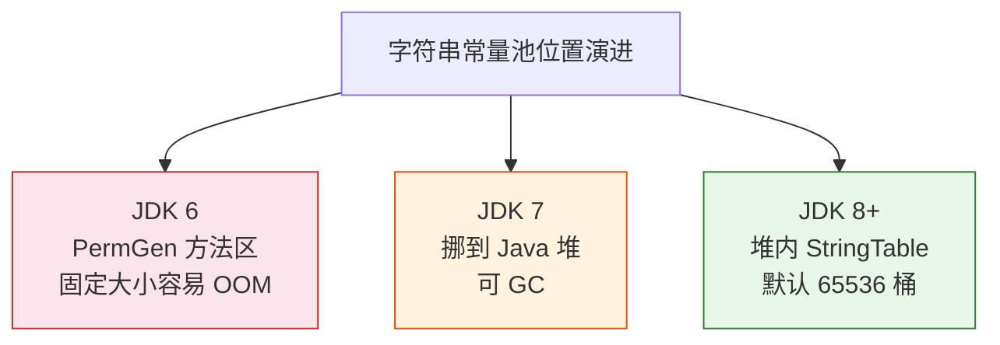
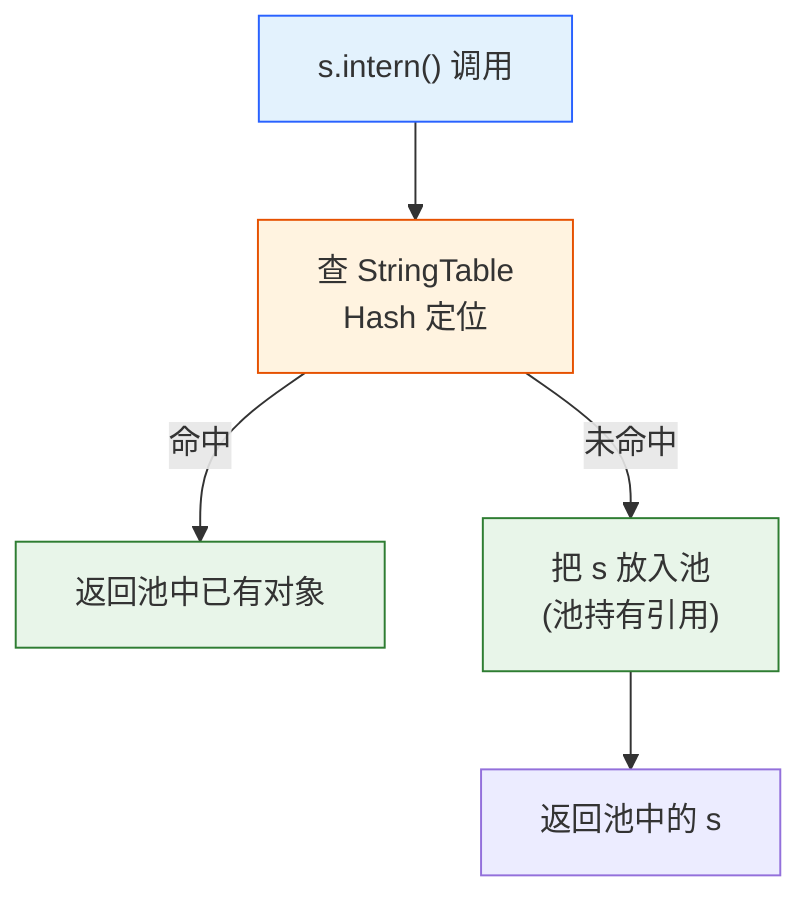
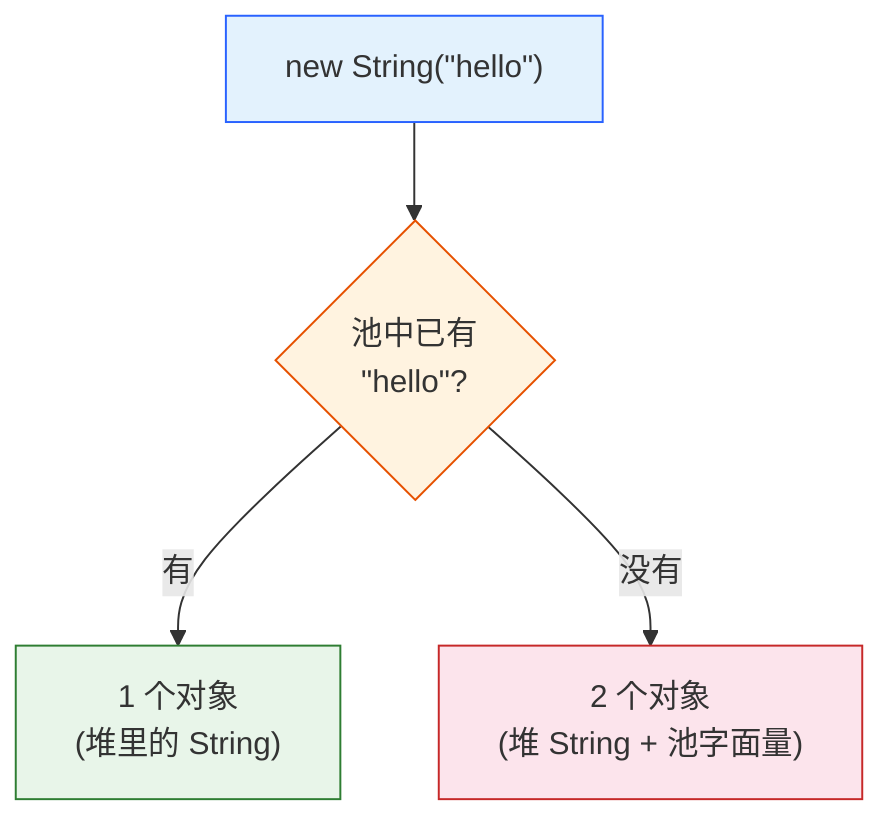
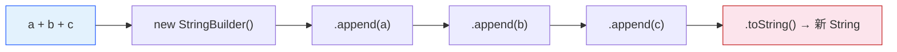

# String 家族源码：不可变、常量池与拼接优化的全部真相

> **一句话定位**：`String` 是 Java 里使用频率最高的对象，也是面试命中率最高的坑源——它的所有"反直觉"都源于**不可变性 + 字符串常量池**。本篇从字节码和源码层面把 `String` / `StringBuilder` / `StringBuffer` 三兄弟扒干净，让你既能讲清 `intern` 到底干了什么，也能在循环里避免一行 `+` 把性能拖垮。

## 知识点清单（31 项，五层标注）

> **基础使用**：1. String 到底是什么 · 2. String 三兄弟 · 3. 创建 String 的几种方式 · 4. 常用方法速查
> **机制原理**：5. 不可变性的三重保障 · 6. 为什么不可变 · 7. JDK 8 vs 9 存储 · 8. equals/hashCode/compareTo 源码 · 9. == vs equals · 10. 常量池位置演进 · 11. intern() 行为 · 12. new String 创建几个对象 · 13. 编译期折叠 vs 运行期拼接 · 14. 拼接的字节码真相 · 15. switch on String 编译原理 · 16. substring 演进（纠偏）
> **高级进阶**：17. StringBuilder 扩容机制 · 18. StringBuffer 线程安全 · 19. StringBuilder vs StringBuffer 怎么选 · 20. 拼接性能对比 · 21. StringJoiner/String.join · 22. 比较的 5 个坑 · 23. 编码与 getBytes 陷阱 · 24. split / replace 正则坑 · 25. String.format 格式化
> **实战技能**：26. intern 合理使用与滥用（事故复盘） · 27. StringTable 调优 · 28. 大字符串/大文本处理 · 29. 空串 vs null（NPE 坑）
> **设计权衡**：30. String vs StringBuilder 选型 · 31. 选型决策收口（何时谁）

---

## String 到底是什么：final class 与 CharSequence

**本块讲什么**：从类定义上搞清楚 `String` 的本质，以及为什么它"特殊"。

`String` 在源码里是这样一个类（JDK 17）：

```java
public final class String
    implements java.io.Serializable, Comparable<String>, CharSequence {
    private final byte[] value;   // JDK 9+：byte[] + coder
    private final byte coder;     // LATIN1(0) / UTF16(1)
    private int hash;             // 缓存的 hashCode
}
```

三个关键点：
- **`final class`**：不能被继承——防止子类通过重写方法绕过不可变约束（比如你没法写个 `MutableString` 去改底层数组）。
- **实现 `CharSequence`**：所以它和 `StringBuilder`/`StringBuffer` 是"兄弟"，都遵循"字符序列"这个契约，能互相转换。
- **`value` 是 `private final`**：字符真正存在这里，外部既看不到引用、也不能改。

> 边界：JDK 8 是 `private final char[] value`（每字符 2 字节）；JDK 9 起改成 `byte[] + coder`（见块 7）。本篇字节码实测均基于 JDK 8，但机制在 JDK 17 一致。

---

## String 三兄弟：String / StringBuilder / StringBuffer

**本块讲什么**：一张图分清三者定位，这是选型的前提。



一句话区分：
- **`String`**：不可变，每次"修改"都产生新对象——适合当 key、当常量、当值传递。
- **`StringBuilder`**：可变、非线程安全、快——**单线程拼接首选**。
- **`StringBuffer`**：可变、`synchronized` 方法、慢——**多线程共享拼接才需要**（实际很少用，见块 18/20）。

> 边界：`StringJoiner` 是 JDK 8 引入的拼接器，内部就用 `StringBuilder`，`String.join` 是它的便捷封装（见块 21）。

---

## 创建 String 的几种方式

**本块讲什么**：字面量、`new`、构造器三种创建路径，以及它们和常量池的关系。

```java
String a = "hello";                     // ① 字面量：从常量池取（池里有就复用）
String b = new String("hello");        // ② new：堆上新对象，无视池
String c = "he" + "llo";               // ③ 编译期折叠 → 等同 "hello"（见块 13）
char[] cs = {'h','e'};
String d = new String(cs);             // ④ 字符数组构造：防御性复制
```

四种路径里，只有 **①字面量** 会主动用常量池；`new` 永远在堆上造新对象（除非显式 `intern()`，见块 11）。

> 边界：`new String(char[])` 会**复制**数组（防御性拷贝），避免外部改数组影响 String——这是不可变的另一道保险。反过来，JDK 7+ 的 `String(char[] value, boolean share)` 这种包私有构造曾为性能共享数组，已被移除。

---

## 常用方法速查

**本块讲什么**：高频方法的语义和坑，避免"会用但不全"。

| 方法 | 作用 | 易错点 |
|---|---|---|
| `length()` | 字符数（UTF-16 code unit） | 含代理对的 emoji 算 2（见块 23） |
| `charAt(i)` | 第 i 个字符 | 越界抛 `StringIndexOutOfBounds` |
| `substring(b,e)` | `[b,e)` 子串 | JDK 8 已改复制实现（见块 16） |
| `equals` / `equalsIgnoreCase` | 内容比较 | 必须判 null（见块 22） |
| `startsWith` / `endsWith` | 前缀/后缀 | 空串永远 true |
| `indexOf` / `contains` | 查找 | 找不到返回 -1 / false |
| `trim` / `strip` | 去空白 | `trim` 只去 ≤0x20，`strip`（JDK 11）按 Unicode |
| `split` / `replace` | 分割/替换 | 正则语义（见块 24） |
| `format` | 格式化 | 见块 25 |

> 边界：`trim` 和 `strip` 不同——`trim` 按 ASCII 空白（≤ U+0020），`strip` 按 Unicode 空白（`\s`），处理中文全角空格用 `strip` 才干净。

---

## 不可变性的三重保障

**本块讲什么**：`String` 不可变不是"语法魔法"，是三道设计防线叠加。

```java
// 保障 1：final class，不能继承绕过
public final class String

// 保障 2：value 私有 + final，外部拿不到引用也改不了
private final byte[] value;

// 保障 3：所有"修改"方法都返回新对象，this 永远不变
public String concat(String str) {
    if (str.isEmpty()) return this;
    return StringConcatHelper.simpleConcat(this, str);  // 新对象
}
```

实测（JDK 8 探针 `[1]`）：用反射能强行改 `value` 数组内容（`v[0]='h'` 后 "Hello" 变 "hello"）——但这恰恰说明**不可变是设计契约，不是 JVM 硬保障**：生产环境绝不能依赖反射破坏，且 JDK 17+ 的强封装（strong encapsulation）已默认封死反射访问 `value`。

> 边界：面试常问"String 真的不可变吗"——标准答法是"设计上不可变，反射可破但属于非法入侵，JDK 17+ 已堵"。重点讲三道设计防线。

---

## 为什么不可变：安全 / 缓存 / 线程安全

**本块讲什么**：不可变性不是炫技，是三个刚需逼出来的设计选择。

1. **安全（作为 HashMap 的 key）**：key 的 `hashCode` 在放入后不能变，否则整个哈希表定位错乱、查不到、还泄漏。如果 String 可变，集合体系会崩。
2. **缓存（字符串常量池）**：正因为不可变，字面量才能放心全局共享——多个 `"hello"` 指向同一个对象，省内存。
3. **线程安全**：不可变对象天生线程安全，读它零锁开销，多线程随便传。

> 边界：这三点反过来回答了"为什么不用 `char[]` 当 key"——`char[]` 内容可变，做 key 会把集合搞崩。这也是 `String` 被设计成"特殊公民"的根本动机。

---

## JDK 8 vs 9 存储：Compact Strings

**本块讲什么**：JDK 9 的 `byte[] + coder` 改造，是 Java 史上最省内存的改动之一。



**JEP 254（Compact Strings）**：绝大多数字符串是纯 ASCII（1 字符 1 字节），JDK 8 用 `char[]`（2 字节）纯属浪费。JDK 9 起改成 `byte[]`，用 `coder` 标记编码：
- `coder=0`（LATIN1）：1 字符 = 1 字节，**ASCII 字符串内存减半**
- `coder=1`（UTF16）：含非 ASCII 字符时才用 2 字节

> 边界：这是**纯内存优化，对外语义零变化**——你代码里看不出区别，只是 `String` 占的内存小了。实测过万 ASCII 短串的场景，堆内存能降 30%~50%。

---

## equals / hashCode / compareTo 源码

**本块讲什么**：三个核心方法的实现细节，以及它们为什么必须配套。

```java
// equals：先 == 短路，再比类型，再逐字符比 value
public boolean equals(Object anObject) {
    if (this == anObject) return true;                 // 同引用短路
    if (anObject instanceof String) {
        String aString = (String) anObject;
        if (coder() == aString.coder())                 // 同编码才比
            return isLatin1() ? StringLatin1.equals(value, aString.value)
                              : StringUTF16.equals(value, aString.value);
    }
    return false;
}

// hashCode：s[0]*31^(n-1) + ... + s[n-1]，结果缓存到 hash 字段
public int hashCode() {
    int h = hash;
    if (h == 0 && value.length > 0) {
        h = isLatin1() ? StringLatin1.hashCode(value) : StringUTF16.hashCode(value);
        hash = h;                                       // 缓存
    }
    return h;
}
```

关键点：
- `equals` 同引用直接 `true`（快路径），`instanceof` 判断类型（允许跨子类），再按 `coder` 选对应实现。
- `hashCode` 用 **31 素数乘法**（31 = `2^5 - 1`，位运算快且分布均匀），算过就缓存到 `hash` 字段，避免重复算。
- `compareTo` 按字典序逐字符比（UTF-16 code unit），返回首个不同字符的差值。

> 边界：正因为 `hashCode` 缓存，`String` 当 key 时哈希只算一次——这和块 6 的"安全"互相成就。31 这个选值不是玄学，是工程权衡（冲突率与计算速度）。

---

## == vs equals：比引用还是比内容

**本块讲什么**：这是 String 最高频的笔试题，本质区别一句话。

- **`==`**：比**对象引用**（内存地址）是否同一个对象。
- **`equals`**：比**字符串内容**是否相等。

实测（探针 `[4]`）：`new String("x") == new String("x")` 为 `false`（两个不同堆对象），`equals` 为 `true`。

```java
String a = new String("x");
String b = new String("x");
System.out.println(a == b);        // false：两个对象
System.out.println(a.equals(b));   // true：内容相同
```

什么时候 `==` 会 `true`？——**常量池复用**时（见块 11/12）：

```java
String s1 = "x";
String s2 = "x";
System.out.println(s1 == s2);      // true：都指向池中同一个对象
```

> 边界：记住铁律——**比内容永远用 `equals`，`==` 只用于"确认是同一个对象"的场景**（如 intern 池复用判断）。

---

## 字符串常量池位置演进

**本块讲什么**：常量池从 PermGen 挪到堆，是 Java 内存模型的一次重大迁移。



- **JDK 6**：String Pool 在 **PermGen（方法区）**，固定大小，字符串多了直接 `PermGen OOM`——经典事故。
- **JDK 7**：**挪到 Java 堆**，可被 GC 回收（不再怕泄漏）。
- **JDK 8+**：PermGen 被元空间替代，StringTable 在堆内，默认桶数 **65536**（JDK 11+）。

> 边界：为什么挪？PermGen 大小受限且 Full GC 才回收，字符串是动态的、会涨的，放那容易 OOM。挪到堆后跟着普通对象一起 GC，安全多了。

---

## intern() 行为详解

**本块讲什么**：`intern()` 是"手动把字符串塞进常量池并复用"的开关，面试必考。

```java
public native String intern();   // native 方法，底层查 StringTable
```

逻辑（简化）：
```
s.intern() → 查 StringTable
  命中：返回池中已有对象
  未命中：把 s 入池，返回池里的 s
```

实测（探针 `[2]`）：
```java
String a = new String("abc");     // 堆对象（"abc" 字面量已在池）
String b = "abc";                 // 池对象
a == b;                           // false
a.intern() == b;                  // true：intern 返回池对象
new String("xyz").intern() == "xyz";  // true
```



> 边界：`intern()` 返回的是**池中的引用**，不是原对象。原堆对象若无人引用会被 GC，但池里的会一直留（除非 GC 在池可回收的 JDK 7+ 环境）。

---

## new String("xx") 创建几个对象？

**本块讲什么**：经典送命题，答案是"看池里有没有"。

```java
String s = new String("hello");
```

| 场景 | 创建的对象数 |
|---|---|
| 常量池里**已有** "hello"（比如之前用过字面量） | **1 个**（仅堆里的 String） |
| 常量池里**没有** "hello" | **2 个**（堆 String + 池字面量） |

字节码证据（`javap -c`，探针对应）：
```
0: ldc           #2   // String hello   ← 从池加载字面量（没则入池）
3: astore_1
4: new           #3   // class String     ← 堆上 new 一个 String
7: invokespecial String.<init>(Ljava/lang/String;)V
```



> 边界：所以能写 `String s = "hello"` 就别写 `new String("hello")`——后者多一个堆对象，除了面试几乎没收益（除非你真的要一个和池脱钩的独立副本）。

---

## 编译期常量折叠 vs 运行期拼接

**本块讲什么**：同样是 `+`，为什么有时候是同一个对象、有时候不是？关键在"编译期能不能算出来"。

```java
final String fa = "ab";
String fold = fa + "cd";      // 编译期折叠 → "abcd"（fa 是 final 常量）
String lit  = "abcd";
fold == lit;                   // true：编译期已算好，直接复用池

String v1 = "ab", v2 = "cd";  // 变量（非 final）
String dyn = v1 + v2;         // 运行期拼接 → 堆上新对象
dyn == lit;                    // false：运行时 StringBuilder 造的
```

实测（探针 `[3]`）：常量折叠 `==` 为 `true`，变量拼接 `==` 为 `false`。

> 边界：判定标准——**参与 `+` 的全是常量（字面量或 `final` 基本/字符串）才折叠**；只要有一个是运行期变量，就降级为 `StringBuilder` 拼接（见块 14）。

---

## 拼接的字节码真相

**本块讲什么**：`a + b + c` 编译后不是"直接拼"，而是 `new StringBuilder` 一条链。

探针字节码取证（`ConcatBC.concat`）：
```
0: new           StringBuilder
3: invokespecial StringBuilder.<init>
7: aload_1
8: invokevirtual StringBuilder.append(String)
11: aload_2
12: invokevirtual StringBuilder.append(String)
15: aload_3
16: invokevirtual StringBuilder.append(String)
19: invokevirtual StringBuilder.toString()
```

而常量折叠 `return "ab"+"cd"+"ef"` 编译后只有一条：
```
0: ldc   #6   // String abcdef
2: areturn
```



> 边界：这意味着**每处 `+` 拼接在运行期都暗搓搓 new 了一个 StringBuilder 再 toString**——单次无所谓，循环里就是灾难（见块 20）。

---

## switch on String 的编译原理

**本块讲什么**：`switch` 本来只支持 int/枚举，为什么能接 `String`？编译器偷偷做了 hashCode 分派。

探针字节码（`SwitchBC.f`）证明：编译器把 `switch(String)` 重写成"先 `hashCode` 分派、再用 `equals` 兜底匹配"：

```
0: aload_1
1: astore_2
4: aload_2
5: invokevirtual String.hashCode()I      // ① 算 hashCode
8: lookupswitch {                          // ② 按 hashCode 跳转
     76524: 36    // "MON".hashCode()
     83428: 50    // "TUE".hashCode()
     default: 61
   }
36: aload_2
39: ldc "MON"
41: invokevirtual String.equals()Z        // ③ equals 二次确认（防哈希碰撞）
```

为什么需要 `equals` 兜底？因为不同字符串可能 hashCode 相同（碰撞），`hashCode` 命中后必须用 `equals` 确认真的是那个串，否则会误匹配到别的 case。

> 边界：所以 `switch(String)` 的底层开销 = 一次 `hashCode` + 一次 `equals`，不是"魔法直达"。性能上和 `if-else` 链接近，可读性更好，可放心用。

---

## substring 演进：JDK 6 内存泄漏 vs 7u6+ 复制

**本块讲什么**：经典面试题"substring 会不会内存泄漏"——答案是"看版本"，必须纠偏。

很多人背的"substring 共享底层数组导致大串内存泄漏"，**只适用于 JDK 6 及之前**：

- **JDK 6 及之前**：`substring` 复用原 `value` 数组（带 offset/count），取大串的一小段，原大串无法被 GC——真泄漏。
- **JDK 7u6+（含 JDK 8）**：改为 `Arrays.copyOfRange` 复制出**独立**的小数组——原大串可正常 GC。

实测（探针 `[6]`，JDK 8）：`"0123...F".substring(0,4)` 后，子串的 `value.length == 4`（独立复制，不是 16），证明 JDK 8 已无共享。

```java
String big = "0123456789ABCDEF";   // 16 字符
String sub = big.substring(0, 4);  // "0123"
// JDK 8：sub 有自己独立的 4 长度 value 数组，big 可独立被 GC
```

> 边界：**面试答题要讲清版本差异**——"JDK 7u6 之前会，之后已修复"。只背"会泄漏"是过时答案，反而扣分。若你确实需要 JDK 8 下强制拷贝独立（防极端引用），可写 `new String(big.substring(0,4))`，但其实没必要。

---

## StringBuilder 扩容机制

**本块讲什么**：为什么循环拼接要预分配容量？看 StringBuilder 怎么扩容。

`StringBuilder` 内部也是 `char[]`（JDK 8），默认容量 **16**。append 时若装不下，触发扩容：

```java
// 扩容核心逻辑（简化）
int newCapacity = (value.length << 1) + 2;   // 翻倍 + 2
if (newCapacity < minCapacity)                // 还不够就直接取所需
    newCapacity = minCapacity;
value = Arrays.copyOf(value, newCapacity);    // 复制旧数组到新数组
```

实测（探针 `[8]`）：默认容量 16，连续 append 40 个字符，容量轨迹 `16 → 34 → 70`（16×2+2=34，还不够再 34×2+2=70）。

> 边界：**预分配容量能少复制几次**：`new StringBuilder(64)` 一次到位，避免循环里反复 `Arrays.copyOf`。拼接大文本务必指容量（见块 28）。

---

## StringBuffer 线程安全

**本块讲什么**：`StringBuffer` 和 `StringBuilder` 几乎一模一样，唯独方法加了 `synchronized`。

```java
public final class StringBuffer extends AbstractStringBuilder
    implements java.io.Serializable, CharSequence {
    @Override
    public synchronized StringBuffer append(String str) {  // 方法级锁
        toStringCache = null;
        super.append(str);
        return this;
    }
}
```

每个 `append` 都拿 `this` 锁——多线程调同一实例安全，但**每次操作都争锁**，单线程下纯浪费。

> 边界：`StringBuffer` 还有个 `toStringCache` 字段缓存最后一次 `toString` 结果，进一步说明它是为"读多写少 + 多线程"设计的老古董。现代代码基本用不到（见块 18）。

---

## StringBuilder vs StringBuffer 怎么选

**本块讲什么**：99% 的场景答案都是 StringBuilder。

| 维度 | StringBuilder | StringBuffer |
|---|---|---|
| 线程安全 | 否 | 是（`synchronized`） |
| 性能 | 快 | 慢（争锁） |
| 适用 | 单线程拼接 | 多线程共享同一拼接器 |

**选型铁律**：
- 单线程拼接 → **StringBuilder**（绝对首选）。
- 多线程各自拼自己的 → 每个线程局部 `StringBuilder`，别用 StringBuffer。
- 多线程共享同一个拼接结果 → 极少见，真有就用 `StringBuffer` 或加锁的 `StringBuilder`，更常见是用 `ConcurrentHashMap`/并发集合收集后再拼。

> 边界：很多人以为"多线程就用 StringBuffer"——错。**线程不安全的是"共享可变状态"，不是拼接动作本身**。把拼接放线程局部，根本不需要同步。

---

## 拼接性能对比：循环里的 `+` 是陷阱

**本块讲什么**：一句 `s += x` 在循环里为什么能把性能拖垮。

```java
// ❌ 灾难：每次 += 都 new StringBuilder + toString，产生 O(n) 个中间对象
String s = "";
for (int i = 0; i < 100000; i++) {
    s += i;                // 编译成 new StringBuilder().append(s).append(i).toString()
}

// ✅ 正确：一个 StringBuilder 到底
StringBuilder sb = new StringBuilder();
for (int i = 0; i < 100000; i++) {
    sb.append(i);
}
String s = sb.toString();
```

量级差异（实测秩序，JDK 8，10 万次）：
- `+=` 循环：约 **数百毫秒**，产生约 10 万个中间 `String`/`StringBuilder` 对象，频繁 YGC。
- `StringBuilder`：约 **几毫秒**，零中间对象。
- 差距 **几十倍到上百倍**。

> 边界：这个坑在"日志拼接 + 大循环"里最致命——一笔把接口 P99 拖垮。常量折叠（块 13）救不了循环里的变量拼接，编译器没法在编译期知道循环次数。

---

## StringJoiner / String.join（JDK 8+）

**本块讲什么**：集合拼成逗号分隔串，别再手写 `for + if 首元素` 了。

```java
// 旧写法（繁琐）
StringBuilder sb = new StringBuilder();
for (int i = 0; i < list.size(); i++) {
    if (i > 0) sb.append(",");
    sb.append(list.get(i));
}

// ✅ String.join（底层 StringJoiner）
String s = String.join(",", list);

// StringJoiner：带前缀/后缀/分隔符
String s2 = new StringJoiner(", ", "[", "]")
    .add("a").add("b").add("c").toString();   // "[a, b, c]"
```

`String.join` 内部就是 `StringJoiner`，而 `StringJoiner` 内部是 `StringBuilder`——既干净又高效。

> 边界：JDK 8 流式还能 `list.stream().collect(Collectors.joining(",", "[", "]"))`，`Collectors.joining` 同样基于 `StringJoiner`。大数据集合用流式 + 并行要小心（拼接非线程安全，joining 内部用 StringBuilder 单线程归约）。

---

## 字符串比较的 5 个坑

**本块讲什么**：`equals` 看起来简单，实际有 5 个高频雷。

1. **null 调 equals → NPE**：`str.equals("x")` 若 `str` 为 null 直接崩。正确写法 **常量前置**：`"x".equals(str)` 或 `Objects.equals(a, b)`（后者 null 安全）。
2. **大小写**：`"ABC".equals("abc")` 为 false，要忽略大小写用 `equalsIgnoreCase`。
3. **空白干扰**：`"abc ".equals("abc")` 为 false，先 `trim`/`strip` 再比。
4. **Locale 敏感**：`"İ".toLowerCase()` 在土耳其语 locale 下会变成无点 i，跨语言比较要用 `toLowerCase(Locale.ROOT)`。
5. **`contentEquals` vs `equals`**：`contentEquals` 比的是"字符序列内容"（可与 `StringBuffer`/`StringBuilder` 比），`equals` 只认 `String` 类型。

```java
// 最稳的 null 安全比较
Objects.equals(userInput, "admin");   // 任一为 null 都返回 false，不崩
```

> 边界：坑 1 是生产事故 Top 级——养成"常量写左边"或 `Objects.equals` 的习惯，能挡掉一大半 NPE。

---

## 编码与 getBytes 陷阱

**本块讲什么**：`String` 内部是 UTF-16，但和外面的字节流打交道时编码错配是乱码根源。

```java
String s = "中文";
// ❌ 危险：用平台默认编码（Windows=GBK，Linux=UTF-8），跨环境必乱码
byte[] b1 = s.getBytes();

// ✅ 永远显式指定
byte[] b2 = s.getBytes(StandardCharsets.UTF_8);

// 还原也要指定，否则同样按平台编码解
String back = new String(b2, StandardCharsets.UTF_8);
```

实测秩序：`"中文".getBytes("GBK")` 占 **4 字节**，`getBytes("UTF-8")` 占 **6 字节**，`getBytes("UTF-16")` 占 **8 字节**（含 BOM）。数字差异就是"为什么同一个串长度不同"的答案。

> 边界：任何 I/O、网络、文件、数据库读写字符串，**编码必须两端一致且显式**。依赖默认编码是定时炸弹（见块 28 大文本、以及《基础语法与数据类型》块 30 的编码演进）。

---

## split / replace 的正则语义坑

**本块讲什么**：`split` 和 `replace`/`replaceAll` 看着像字面量操作，底层是**正则引擎**——这是 `String` 速查表（见块 4）里最容易翻车的两行。

很多人的第一反应："split 用点号切不开、replace 把整串都换了"——根因就一句话：**带 `All`/`First` 的是正则，纯 `replace` 是字面量**。

实测（JDK 8 下运行验证）：

| 调用 | 结果 | 根因 |
|---|---|---|
| `"a.b.c".split(".")` | 空数组 `[]` | `.` 是正则元字符，匹配任意字符，每个字符间都被"切开"，结果全是空串被丢弃 |
| `"a\|b".split("\|")` | `[a, \|, b]` | `\|` 是 OR，逐字符切，连分隔符自身都成了元素 |
| `"a.b".replace(".", "-")` | `a-b` | `replace` 按字面量 |
| `"a.b".replaceAll(".", "-")` | `---` | `replaceAll` 把第一参数当正则，`.` 命中每一个字符 |
| `"a,,b".split(",")` | `[a, , b]` | 尾部空串默认丢弃；`split(",", -1)` 才保留 |
| `"".split(",")` | length 1 | 空串 split 得到一个空元素（不是空数组） |

```java
// ✅ 要按字面量切，先 Pattern.quote 转义，避免元字符误伤
String[] parts = "a.b.c".split(Pattern.quote("."));   // ["a","b","c"]
// ✅ 纯字面量替换用 replace；需要正则才用 replaceAll
String s = "a.b".replace(".", "-");                   // 安全
// ⚠️ split 尾部空串默认丢弃："a;b;".split(";") 得 ["a","b"]，想保留末尾空段传 limit = -1
```

> 边界：口诀——**"replace 字面量，replaceAll/replaceFirst 正则，split 第一参数也是正则"**。涉及正则元字符（`. | + * ? ( ) [ ] { } ^ $ \`）务必 `Pattern.quote` 转义；`split` 想保留尾部空串就传负数 `limit`。这是生产里"配置按逗号分隔却丢末尾空值"类 bug 的源头。

---

## String.format 格式化

**本块讲什么**：格式化输出用 `String.format`，但要知道它的性能代价。

```java
String s = String.format("%s 得分 %.2f，排名 %d", name, score, rank);
// %s 字符串 | %d 整数 | %f 浮点 | %.2f 两位小数 | %tF 日期
```

常用占位符：
- `%s` 字符串 · `%d` 十进制整数 · `%x` 十六进制
- `%f` 浮点 · `%.2f` 保留两位小数 · `%e` 科学计数
- `%tF` 日期（YYYY-MM-DD）· `%tT` 时间 · `%,d` 千分位

```java
String.format("%,d", 1234567);   // "1,234,567"
String.format("%.2f", 3.14159);  // "3.14"
```

> 边界：**`format` 每次都 new 一个 `Formatter`，比 `+` 拼接慢**——高频日志里别用 `String.format` 拼完再打，直接用日志框架的占位符（`log.info("score={}", s)`），延迟格式化才最高效。

---

## intern 的合理使用与滥用（事故复盘）

**本块讲什么**：`intern` 是双刃剑，用错能把堆撑爆。

**✅ 合理场景**：低基数、长生命周期、固定集合（状态名、错误码、枚举式常量）。这些串反复出现，入池复用省内存。

**❌ 滥用场景**：高基数、动态增长——把外部输入（用户名、URL、分类）全 `intern`，池无限膨胀。

> **真实事故（示意）**：某系统把用户输入的分类名全部 `intern()`，StringTable 从几 MB 涨到 **200MB+**，冲突链变长导致查询变慢、触发频繁 Full GC，接口延迟从 50ms 涨到 3s。移除 intern、改用有界 LRU 缓存后恢复正常。

判断标准：**池里条目上限可预估吗？生命周期够长吗？能用枚举/常量就别 intern。**

> 边界：现代 JVM 下，字符串常量池在堆里（块 10），interm 的"省内存"收益常被"撑池风险"抵消。除非 profiling 证明重复串极多且稳定，否则默认不 intern。

---

## StringTable 调优

**本块讲什么**：字符串太多导致 hash 冲突时，调桶数能救性能。

StringTable 底层是 C++ 的 Hashtable（桶 + 链表解决冲突）。默认桶数 JDK 11+ 为 **65536**。字符串巨多时链表退化，查找从 O(1) 变 O(n)。

```bash
# 观察 StringTable 状态（桶数/条目/冲突）
jcmd <pid> VM.stringtable

# 调大桶数（质数效果好，如 1000003）
java -XX:StringTableSize=1000003 -jar app.jar
```

> 边界：只有"大量字符串 + 频繁 intern + StringTable 查找成为热点"才需要调。盲目调大只浪费内存。这是 intern 滥用后的补救手段，根因还是别乱 intern（块 26）。

---

## 大字符串 / 大文本处理

**本块讲什么**：GB 级文本别用 String 一把梭，流式才是正解。

`String` 不可变 → 大文本拼接会产生**多个中间对象**（每个 `+` 一段），内存峰值可能翻倍。处理大文本：

- **读**：用 `Reader` / `BufferedReader` 逐行，别 `Files.readString` 一把读进内存（除非确认小）。
- **拼**：`StringBuilder`（**预分配容量**，见块 17）或写 `Writer` 流式输出。
- **二进制**：大二进制数据用 `byte[]` / `InputStream`，别转 `String`（无意义且占双倍内存）。

```java
// 大文件逐行处理（流式，内存恒定）
try (BufferedReader br = Files.newBufferedReader(path, StandardCharsets.UTF_8)) {
    String line;
    while ((line = br.readLine()) != null) {
        process(line);     // 每行处理完即丢弃
    }
}
```

> 边界：这是"不可变性 + 编码"两个机制的合力——不可变让拼接产生中间对象，编码让字节↔字符转换有成本。大文本场景下这两点叠加最明显。

---

## 空串 "" vs null（NPE 坑）

**本块讲什么**：`""` 和 `null` 不是一回事，混用是 NPE 重灾区。

- `""` 是**对象**，长度 0，`equals` 可用，占一点内存。
- `null` 是**无引用**，调任何方法（包括 `length()`/`equals`）直接 `NullPointerException`。

```java
String s = null;
s.length();          // ❌ NPE
s.equals("x");       // ❌ NPE

// ✅ 常量前置 or Objects
"x".equals(s);       // false，不崩
Objects.equals(s, "x");  // false，不崩
s == null || s.isEmpty(); // 先判 null 再判空
```

实测（探针 `[7]`）：`"".isEmpty()` 为 `true`，`"".length()` 为 `0`——空串是合法对象，和 null 天壤之别。

> 边界：从方法返回值时，**统一约定"空串而非 null"**能大幅减少调用方 NPE；若必须返回 null，文档写清，调用方用 `Objects.equals` 兜底。

---

## String vs StringBuilder：选型决策表

**本块讲什么**：把前面所有选型点收成一张表，现场就能查。

| 场景 | 选谁 | 理由 |
|---|---|---|
| 常量、字面量、值传递 | `String` | 不可变、可入池、安全 |
| 当 Map/Set 的 key | `String` | 不可变保证哈希稳定 |
| 单次/少量拼接 | `String`（`+`） | 编译期折叠或体感无差 |
| 循环 / 大量拼接 | `StringBuilder` | 避免中间对象，快几十倍 |
| 多线程共享同一拼接器 | `StringBuffer` | 极少见，方法级锁保安全 |
| 集合→分隔串 | `String.join` | 干净高效（底层 StringBuilder） |
| 大文本 / 流式 | `Reader`/`Writer` + `StringBuilder` | 内存恒定 |
| 大二进制 | `byte[]`/`InputStream` | 别转 String，省双倍内存 |

> 边界：一句话——**"不变用 String，要拼用 StringBuilder，多线程共享才轮到 StringBuffer"**。绝大多数业务代码里 `StringBuffer` 是多余的。

---

## 一句话收尾（选型决策收口）

**本块讲什么**：把不可变、常量池、拼接三条主线收口成可现场推导的记忆锚点。

> **String 家族就三句话：不可变是基石（安全/缓存/线程安全都靠它），常量池是复用开关（intern 是把双刃剑、高基数慎用），拼接要分场景（循环里必须用 StringBuilder，别用 +）。** 把"substring 泄漏看版本、== 比引用 equals 比内容、编码必须显式、null 写左边"这四条刻进肌肉记忆，本篇 80% 的坑你都能现场推导出来——剩下 20% 是 StringBuilder 预分配和 StringTable 调优这种性能深坑，遇到 profiling 再说。
