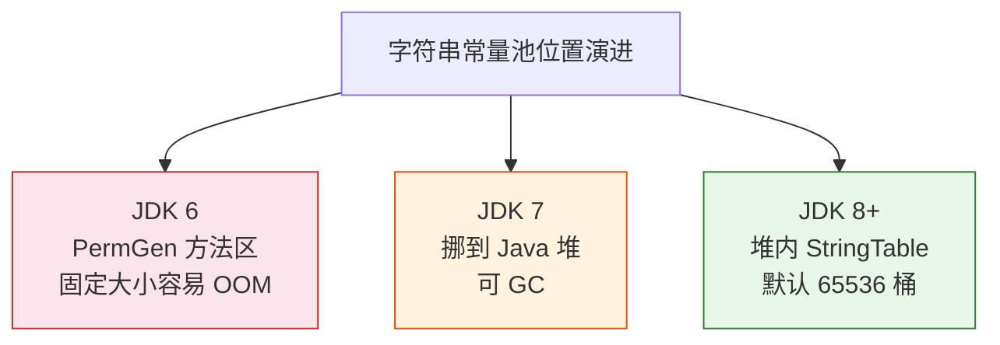

# 【源码解析】String 不可变性与常量池

## 从源码到 JVM 内存，拆解 String 的设计取舍

<span style="color:#888">Java 语言核心 · 第 06 讲延伸 · 源码专题</span>

---

## String 为什么是"特殊公民"？

String 是 Java 中使用频率最高的对象之一，它的三个特殊之处都源于**不可变性**：

- **安全**：作为 HashMap / ConcurrentHashMap 的 key，hash 不会被外部改动
- **缓存**：字面量可放心放入字符串常量池全局共享
- **线程安全**：不可变对象天然线程安全，零锁开销

> 如果 String 可变，集合的 key 会被外部篡改导致整个集合体系崩溃——这是它被设计成不可变的根本动机。

---

## String 类源码（JDK 17）：字段长什么样？

```java
public final class String
    implements java.io.Serializable, Comparable<String>, CharSequence {

    private final byte[] value;     // 真正的字符存储（JDK 9+ 改 byte[]）
    private final byte coder;       // 编码标识：LATIN1(0) / UTF16(1)
    private int hash;               // 缓存 hashCode，第一次调用时计算

    // 常用构造（省略细节）
    public String() { this.value = "".value; this.coder = "".coder; }
    public String(String original) { ... }
    public String(char[] value) { ... }   // 防御性复制

    // 常用方法
    public int length() { ... }
    public char charAt(int index) { ... }
    public String substring(int begin, int end) { ... }
}
```

**关键变化**：

- JDK 8：`private final char[] value;`——每个字符 2 字节
- **JDK 9+（JEP 254 Compact Strings）**：`byte[] value` + `coder`——纯 ASCII 字符串内存减半
- `hash` 字段缓存**第一次计算后的 hashCode**，避免重复计算

---

## 不可变性靠哪三重保障保证？

```java
// 保障 1：类被 final，不能继承（防止子类绕过不可变）
public final class String

// 保障 2：value 数组 private + final，外部拿不到引用
private final byte[] value;

// 保障 3：所有"修改"方法都返回新对象，this 永远不变
public String concat(String str) {
    if (str.isEmpty()) return this;       // 空串直接返回 this
    return StringConcatHelper.simpleConcat(this, str);  // 新对象
}

public String substring(int beginIndex, int endIndex) {
    return isLatin1()
        ? StringLatin1.newString(value, beginIndex, end - begin)
        : StringUTF16.newString(value, beginIndex, end - begin);
}
```

> 没有任何一个方法能修改 `this.value` 的内容——这是 String 不可变性的**设计保障**。（理论上反射可以改数组内容，但 JDK 17+ 的 strong encapsulation 已默认封死。）

---

## 字符串常量池的位置是怎么演进的？



**演进细节**：

- **JDK 6**：String Pool 在 PermGen（方法区），固定大小，字符串多了直接 `PermGen OOM`
- **JDK 7**：**挪到 Java 堆**，可被 GC 回收——这是历史性决策
- **JDK 8+**：PermGen 被元空间替代，StringTable 在堆内，默认桶数增大
- 调优：`-XX:StringTableSize`（JDK 11+ 默认 **65536** 桶）

---

## intern() 到底干了什么？

```java
public native String intern();   // native 方法，C++ 实现
```

```java
// HotSpot 简化逻辑
oop result = StringTable::lookup(value, hash);
if (result != NULL) {
    return result;              // 命中：返回池中已有对象
}
return StringTable::intern(value, hash);   // 未命中：入池并返回
```

**行为分情况**：

```java
String s = new String("hello");
String s1 = s.intern();           // 第一次：把 "hello" 入池，返回池对象
String s2 = "hello";              // 字面量：池中已有，直接返回池对象
System.out.println(s == s1);      // false：s 是堆对象，s1 是池对象
System.out.println(s1 == s2);     // true：都是池中同一个对象
```

---

## new String("xx") 到底创建几个对象？

```java
String s = new String("hello");
```

**两种情况，答案不同**：

| 场景 | 创建的对象数 |
|---|---|
| 常量池里**已有** "hello" | **1 个**（仅堆里的 String） |
| 常量池里**没有** "hello" | **2 个**（堆 String + 池字面量） |

**字节码证据**：

```bash
# javap -c 看 new String("hello")
0: ldc           #2   // String hello    ← 从池加载字面量
2: astore_1
3: new           #3   // class String    ← 堆上 new 一个 String
6: dup
7: aload_1
8: invokespecial String.<init>(Ljava/lang/String;)V
```

---

## StringTable 是什么结构、怎么调优？

- StringTable 本质是 **C++ 的 Hashtable**（桶 + 链表解决冲突）
- JDK 11+ 默认 65536 桶
- **容量不足**：字符串多 → 冲突严重 → 链表退化 → 查询 O(n)

**观察与调优**：

```bash
# 观察 StringTable 状态（桶数/条目数/冲突）
jcmd <pid> VM.stringtable

# 调大桶数（质数效果好，如 1000003）
java -XX:StringTableSize=1000003 -jar app.jar
```

---

## intern 到底该不该用？

**✅ 合理场景**：低基数、长生命周期的固定集合（状态名、枚举式常量）

**❌ 滥用场景**：高基数、动态增长（把外部输入都 intern → 池无限膨胀）

> 真实事故：某系统把用户输入的分类名全部 `intern()`，StringTable 从几 MB 涨到 **200MB+**，触发频繁 Full GC，接口延迟从 50ms 涨到 3s。移除 intern 改用有界 LRU 缓存后恢复。

**判断标准**：池中条目上限可预估吗？生命周期够长吗？能用枚举/常量就别 intern。

---

## 一条主线串起 String 的设计取舍

- String 不可变三重保障：**final class** + **private final byte[]** + **所有方法返回新对象**
- JDK 9+ Compact Strings：`byte[] + coder`，ASCII 内存减半
- 常量池在 **Java 堆**（JDK 7+），底层是 C++ Hashtable
- `new String("xx")` 创建 1 或 2 个对象，**看池里有没有**
- intern 是把双刃剑：**高基数场景慎用**，会撑爆堆
