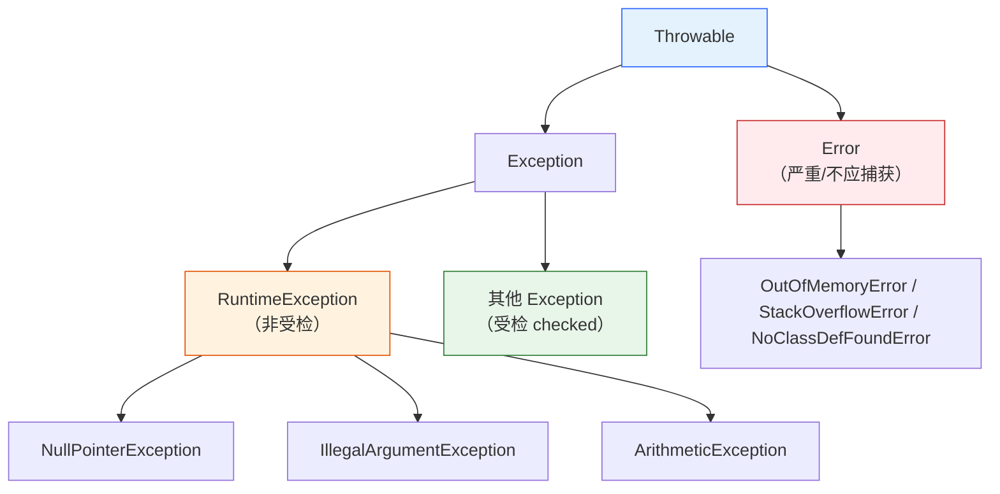
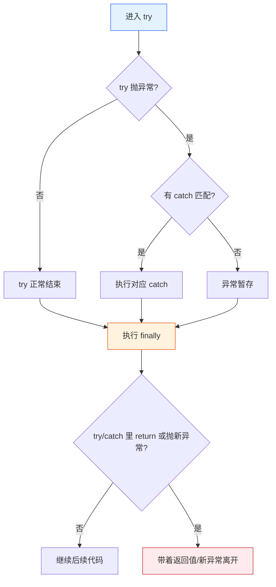
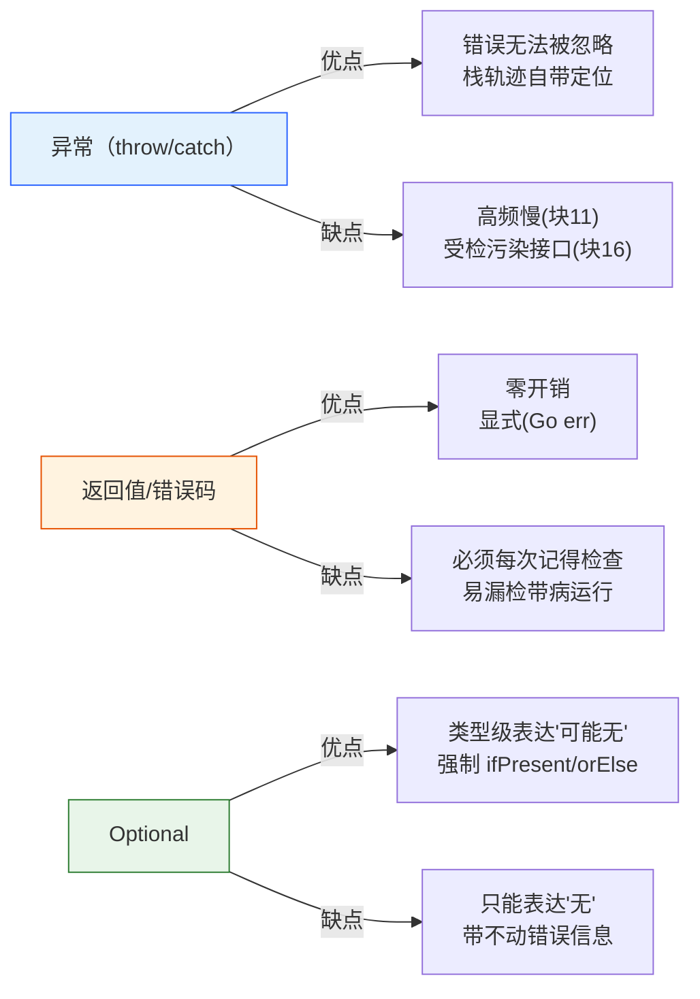

# 07 异常体系（Exception System）

<span style="color:#888">Java 语言核心 · 第 07 讲 · 机制型</span>

> **篇性切入**：异常体系常被写成"API 罗列 + 捕获模板"，本文换一条主线——**从 JVM 怎么把一个异常"抛起来、传出去、接住"的机器层视角**往下拆，再用 try-with-resources 反编译、finally/return 的字节码实证把"传说中的坑"钉死。
> **前置篇目**：建议先读 02 基础语法与数据类型（类型/字面量）、03 面向对象核心（继承/多态）——异常类本质也是类，家族树靠继承撑起。
> **篇幅预期**：本篇约 1.9 万字 / 31 块 / 约 24 分钟读完。

---

## 知识点清单（31 项，五层标注）

> **基础使用**：1. Java 为什么需要异常机制 · 2. Throwable 家族树：Error/Exception/RuntimeException 怎么分 · 3. 受检异常 vs 非受检异常 · 4. try-catch-finally 骨架与执行顺序 · 5. throw 与 throws 的区别
> **机制原理**：6. 异常在 JVM 里怎么被抛出（athrow 与异常表） · 7. 栈展开（stack unwinding）做了什么 · 8. 异常表如何定位 catch 块 · 9. finally 为什么总能执行（编译器复制） · 10. finally 与 return 的暗坑 · 11. 异常对象创建开销：fillInStackTrace 为什么慢 · 12. StackTraceElement 与栈轨迹填充 · 13. 异常传播链：cause 与 initCause/getCause · 14. 抑制机制：addSuppressed · 15. 为什么 Error/Throwable 不该被 catch
> **高级进阶**：16. 受检异常的设计意图与争议 · 17. 编译器如何处理受检异常 · 18. 异常屏蔽（被吞） · 19. NullPointerException 成因与 JDK 14+ 消息增强 · 20. try-with-resources 到底做了什么 · 21. 自定义异常怎么写 · 22. 异常的性能代价
> **实战技能**：23. 日志里怎么正确打印异常 · 24. 异常处理反模式（吞异常/流程控制） · 25. 防御式编程：fail-fast 早抛 · 26. 什么时候用受检 vs 运行时异常 · 27. 全局异常处理的边界
> **设计权衡**：28. 异常 vs 返回值/Optional · 29. 复用异常实例 vs 每次 new · 30. 异常粒度设计 · 31. 一句话收尾（异常体系选型决策收口）

---

## Java 为什么需要异常机制：异常到底是什么

**异常（Exception）= 程序正常控制流之外的一种"信号传递机制"**：当某段代码遇到它处理不了的意外状况（文件不存在、除零、空指针），它不偷偷返回一个"约定值"假装成功，而是**抛出（throw）一个对象**，把"出事了 + 出什么事"沿着调用栈一路上交，直到有人 catch 住。

为什么不直接用返回值？看对比：C 语言靠返回 `-1` / `NULL` 表示失败，调用方必须**每次都记得检查**，忘了就带着坏数据继续跑，埋下隐蔽 bug；更要命的是，一旦中途某层忘了检查，错误会被悄悄"吞"到很远才爆发，定位极难。异常把"必须处理"这件事**从约定变成强制**——要么 catch，要么让线程挂掉，不会静默带病运行。

> 一句话：异常的存在，是为了**把"错误处理"从"靠自觉"升级成"靠机制"**，让失败无法被忽略。

需要澄清一个常见误会：异常**不是用来做正常流程控制**的（见块 24）。它是给"真正的意外"准备的逃生通道，别拿它当 if-else 的替代品。

---

## Throwable 家族树：Error / Exception / RuntimeException 怎么分

Java 所有"能被抛"的东西，根上都是 `java.lang.Throwable` 的子类。家族树是这样长的（JLS 11.1）：



三条关键分界线：

1. **Throwable 自己**：能 throw、能 catch，但通常**不要直接 catch Throwable**（见块 15）。
2. **Error（错误）**：JVM 层面的严重故障，如 `OutOfMemoryError`、`StackOverflowError`、`NoClassDefFoundError`。语义上"合理的应用**不该、也通常救不回来**"，所以一般不要 catch。
3. **Exception（异常）**：应用层可预期、可恢复的意外。它再分两支：
   - **RuntimeException（非受检 / unchecked）**：编程错误（空指针、越界、非法参数），编译器**不强制**你处理。
   - **其他 Exception（受检 / checked）**：外部环境问题（IO、SQL、`InterruptedException`），编译器**强制**你 catch 或声明 throws。

> 记忆口诀："**Error 是 JVM 的锅，RuntimeException 是你的锅，受检异常是外部的锅**"。

---

## 受检异常 vs 非受检异常：编译期谁强制处理

这是 Java 异常体系里**最有争议、也最常被面试官追问**的设计点。划分标准极其简单，但后果很大：

- **受检异常（checked）**：所有 `Exception` 的直接子类里，**除了 RuntimeException 那一分支**，都是受检的。典型：`IOException`、`SQLException`、`InterruptedException`、`ParseException`。**编译器强制**：调用一个会抛受检异常的方法，你要么 `try-catch` 处理，要么在方法签名 `throws` 继续往外抛，否则**编译不过**。
- **非受检异常（unchecked）**：`RuntimeException` 及其子类 + `Error`。编译器**不强制**处理，你可以 catch 也可以不 catch，不 catch 就一路冒泡到线程顶层（最终打印堆栈、线程终止）。

为什么这么分？设计意图（见块 16）是：**受检异常 = 可恢复的意外**（文件丢了你换个路径重来），所以逼你"必须有个应对方案"；**非受检异常 = 程序 bug**（你传了 null 活该），不该靠 try-catch 兜底，而该改代码。

```java
// 受检：编译期红叉，除非 catch 或 throws
FileInputStream in = new FileInputStream("a.txt");   // throws IOException → 必须处理
// 非受检：编译器不管
int x = 1 / 0;                  // 运行时 ArithmeticException，编译期无所谓
String s = null; s.length();    // 运行时 NullPointerException，编译期无所谓
```

> 反直觉点：划分的**唯一标准**是"是不是 RuntimeException/Error 的子类"，不是"严不严重"。`OutOfMemoryError` 很致命却是 unchecked，`IOException` 相对温和却是 checked——别按严重程度记忆，按"继承树位置"记忆。

---

## try-catch-finally 的基本骨架与执行顺序

最基础的异常处理三段式：

```java
try {
    // 可能出事的代码
} catch (NullPointerException e) {
    // 捕获某类异常，做补救（catch 可以多个，子类在前父类在后）
} finally {
    // 无论 try 成功/失败/return，都执行（典型用途：释放资源）
}
```

执行顺序的**铁律**（这是后面所有坑的地基）：

1. `try` 正常跑完 → 走 `finally` → 再走 try 之后的代码。
2. `try` 抛出某异常 → 从 `catch` 列表**从上到下**匹配第一个"类型兼容"（自己或父类）的分支 → 进那个 catch → 走 `finally` → 再走后续。
3. `try` 抛的异常**没被任何 catch 接住** → 先走 `finally` → 再把异常继续往外抛。

三个极易踩的顺序细节：

- **多个 catch 必须子类在前、父类在后**：因为匹配是"第一个兼容就进"。若把 `catch (Exception e)` 放最前，`NullPointerException` 的 catch 永远到不了，编译期直接报"unreachable"（JLS 11.2.3 明确禁止）。
- **finally 永远在"离开 try 块之前"执行**，包括 try 里 return 的情况（见块 10）。
- **catch 不写 `e` 也行但几乎没意义**：`catch (InterruptedException e)` 里若不用 `e`，至少要把异常继续抛或记录，否则就成"吞异常"了（见块 24）。



---

## throw 与 throws 的区别：一个动手一个声明

两个长得像的关键字，语义完全不同，面试 80% 的人会混：

- **`throw`（无 s）：动作**——**真正抛出一个异常对象**，后面跟一个**实例**：
  ```java
  if (name == null) throw new IllegalArgumentException("name 不能为 null");
  ```
  一旦执行到 `throw`，当前方法**立即终止**，异常开始沿栈向上冒泡。

- **`throws`（有 s）：声明**——写在方法签名上，表示"**我这个方法可能会抛出这些受检异常，我自己不处理， caller 你看着办**"：
  ```java
  void load(String path) throws IOException { ... }   // 声明，不是抛
  ```
  `throws` 后面跟的是**异常类型列表**，编译期用来做受检检查；它不改变运行行为，只是把"处理责任"上移一层。

关键区别一句话：**`throw` 是"现在就扔"，`throws` 是"声明我可能会扔、不关我事"**。

再补两个边界：
- `throw` 后面必须是一个 `Throwable` 实例；`throws` 后面可以是多个类型，用逗号隔开。
- `RuntimeException` 也能 `throws` 声明，但**没必要**——因为本来就不强制 caller 处理；写出来只是文档提示。反之受检异常**必须** throws 或 catch，否则编译不过。

> 实战建议：方法只该 `throws` 它**自己产生或主动决定不处理**的异常；不要图省事 `throws Exception` 一把甩（见块 30 粒度问题）。

---

## 异常在 JVM 里是怎么被抛出的：athrow 与异常表

"抛异常"在字节码层不是魔法，就是一条指令：**`athrow`**。当你写 `throw new X()`，编译产物大致是：

```
new          // 创建异常对象（此时还没填充栈轨迹）
dup
invokespecial X.<init>   // 调构造器
athrow                  // 把栈顶异常对象抛出去
```

但 `new X()` 后面那一步**关键动作**是：构造器里会调用 `Throwable.fillInStackTrace()`（见块 11），把"此刻的调用栈"快照进异常对象。所以一个异常对象从生下来就**自带栈轨迹**——这正是你 `printStackTrace()` 能看见调用链的原因。

而"哪里接得住"这个匹配逻辑，**不在字节码指令流里，而在 class 文件的"异常表"（Exception Table）里**（见块 8）。`athrow` 只负责"把对象抛起来"，JVM 再按异常表去找该跳去哪个 catch。

> 所以完整链路是：**athrow 抛对象 → JVM 查异常表定位 catch → 栈展开清理中间栈帧（块 7）→ 进 catch 执行**。这三步合起来才是"抛出并捕获"的全过程。

---

## 栈展开（stack unwinding）：异常抛出后 JVM 做了什么

异常被 `athrow` 抛起后，JVM 不会傻站在原地，而是启动 **栈展开（stack unwinding）**：从当前方法开始，**一层层向上回退调用栈**，每退一层就：

1. 把该栈帧标记为"异常退出"（不再执行方法剩余的正常指令）。
2. 在该方法的**异常表**里查：当前抛出的异常类型，有没有覆盖我这段代码的 catch？
   - 查到了 → 停下展开，把控制权交给那个 catch 块。
   - 没查到 → 继续向上退一层（中间帧的局部变量、操作数栈被丢弃）。
3. 一直退到线程栈顶（最外层 `main`/`run`）还没人接 → 线程终止，异常交给**未捕获异常处理器（UncaughtExceptionHandler）**，默认行为就是打印堆栈到 `System.err`。

需要强调：**展开过程中，没被 catch 的中间方法代码是"直接跳过"的**——哪怕那层方法里还有一半逻辑没跑完，也不会再跑。这就是为什么"异常会把控制流从很深的地方瞬间拉到 catch 处"，跳过的中间状态如果不清理（比如已申请未释放的资源），就是资源泄漏的来源（try-with-resources 正是为治这个，见块 20）。

> 类比：栈展开像"从地下室着火，一层层往上疏散，每层看有没有消防员（catch），没有就继续上，直到楼顶"。

---

## 异常表（Exception Table）如何在字节码里定位 catch 块

前面反复提到"异常表"，它到底是什么？它就是 class 文件里每段方法附带的一张**小表**，每行描述："从字节码 PC `a` 到 `b`，如果抛出类型 `T` 的异常，就跳去 PC `c` 执行（catch 块入口）"。我本机实测 `ExTableProbe.div` 反编译结果：

```
  static int div(int);
    Code:
       0: bipush        10
       2: iload_0
       3: idiv              // 除零时这里抛 ArithmeticException
       4: ireturn
       5: astore_1          // ← catch 块入口（target）
       6: iconst_m1
       7: ireturn
    Exception table:
       from    to  target type
           0     4     5   Class java/lang/ArithmeticException
```

读这张表：`from=0, to=4` 表示"监控 PC 0~4 这段"（含 `idiv`），`target=5` 表示"一旦抛 `ArithmeticException` 就跳到 PC 5（`astore_1`，即 catch 块）"，`type` 是匹配类型。

几个值得记住的点：

- **一张表可有多行**：一个 try 里 catch 多种异常、或 catch 里再 try，会生成多行，`from/to` 区间可能重叠，JVM 按"最内层/最精确"匹配。
- **匹配按类型兼容**：抛 `ArithmeticException`，表里写 `RuntimeException` 也能接住（父类兼容），但顺序上更具体的会先命中。
- **catch 之外的异常不在表里**：不写 catch 的方法，异常表为空，athrow 直接一路展开出去。

> 这解释了为什么"catch 子类放前面"（块 4）：字节码层面就是异常表多行，匹配第一个兼容的，父类在前会挡住子类。

---

## finally 为什么总能执行：编译器把 finally 复制进了每条路径

"finally 总能执行"常被解释成"JVM 的特殊保证"，其实是**编译器的把戏**：javac 把 finally 块**复制多份**，分别塞进 try 的正常路径、每个 catch 路径、以及异常向外抛的路径（异常表的 target 也指向 finally 的副本）。所以无论哪条路离开 try，**finally 的代码都先跑一遍**。

用块 10 的 `finallyReturn` 举例，编译后的逻辑约等于：

```java
static int finallyReturn() {
    int result;          // 编译器插入的"返回值暂存槽"
    try {
        result = 1;      // try 想返回 1，先存起来
    } finally {
        return 2;        // finally 的 return：直接返回 2，result 被丢弃
    }
}
```

注意异常路径：如果 try 抛了异常，编译器生成"先执行 finally 副本、再重新抛出原异常"的代码，异常表的 target 就指向 finally 副本。这就是为什么 finally 在异常场景下也能跑——它根本不是"额外保证"，而是**每条离开路径都物理地内联了一份**。

> 明白这点后，块 10、块 18 的"暗坑"就水落石出了：finally 因为被复制进每条路径，它里面的 `return`/`throw` 会**在每条路径上都生效**，从而改变原本的返回/抛出。

---

## finally 与 return 的暗坑：finally 的 return 会覆盖 try 的 return

这是 Java 面试**经典送命题**，也是我**本机实测**确认的行为。看代码：

```java
static int finallyReturn() {
    try {
        return 1;        // try 想返回 1
    } finally {
        return 2;        // finally 的 return 生效
    }
}
```

本机 JDK 8 运行结果：

```
finallyReturn() = 2
```

**结论：finally 里的 `return` 会覆盖 try 里的 `return`**，try 想返回的 `1` 被丢弃了。原因就是块 9 说的——finally 被复制进每条路径，return 2 在那条路径上直接 return，try 的 return 1 永远走不到。

更隐蔽的变体：**finally 改返回值变量也盖不住**，因为 try 的 return 在进 finally 之前就把值暂存了：

```java
static int tricky() {
    int x = 1;
    try { return x; }      // 暂存 x=1
    finally { x = 2; }     // 改的是原变量，暂存的 1 已定
}
// tricky() 返回 1，不是 2
```

**最佳实践（铁律）**：finally 里**永远不要写 return，也不要改返回值变量**。finally 只干"释放资源"这种无返回值副作用的事。这条坑在 code review 里要重点盯。

---

## 异常对象创建的开销：fillInStackTrace 为什么慢

很多人以为"抛异常慢"是玄学，其实是**有精确因果的**：每次 `new Throwable()`（含所有 Exception/Error 子类，因为构造链路最终都会走到 `Throwable.<init>`），都会调用 **`fillInStackTrace()`**——这个方法要**遍历当前整个调用栈、把每一帧的（类名/方法名/文件名/行号）拷贝进一个 `StackTraceElement[]`**。

我本机实测（JDK 8 / Corretto 8.452，20 万次）：

```
new Throwable() x200000 耗时 59.2 ms
new Object()    x200000 耗时  1.8 ms
栈轨迹填充大约慢 33.2x
```

差距 ~33 倍，且**栈越深、填充越慢**（要复制的帧越多）。所以：

- **不要在高频热路径（循环体、每请求必走的分支）里靠抛异常做控制流**——一次 fillInStackTrace 可能几微秒到几十微秒，高频累积就是毫秒级延迟（见块 24 反模式）。
- 确有"需要异常对象但不在意栈轨迹"的场景（如某些框架内部错误码），可重写 `fillInStackTrace()` 返回 `this` 来跳过填充（JDK 自身 `SocketTimeoutException` 等内部类就这么干过），代价是失去栈轨迹、排查变难，慎用。
- 重复复用同一个异常实例也能省（见块 29），但要注意线程安全与栈轨迹被污染的风险。

---

## StackTraceElement 与栈轨迹是怎么填充的

`fillInStackTrace()` 的产物是 `StackTraceElement[]`，每个元素记录一帧：**类名 + 方法名 + 文件名 + 行号**（native 方法行号是 -2，未知是 -1）。你平时看到的堆栈长这样：

```
java.lang.NullPointerException
    at com.demo.OrderService.create(OrderService.java:42)
    at com.demo.OrderController.post(OrderController.java:18)
```

这一行行就是 `StackTraceElement` 逐个 `toString()` 的结果。`e.getStackTrace()` 返回的就是这个数组，**你可以拿它做精确诊断**：

```java
StackTraceElement top = e.getStackTrace()[0];
log.error("炸在 {}#{} 第 {} 行", top.getClassName(), top.getMethodName(), top.getLineNumber());
```

几个机制要点：

- **填充时机是构造时，不是打印时**：`printStackTrace()` 只是把已填好的数组格式化输出，所以异常一经创建栈轨迹就固定了，之后调用栈变化不影响它。
- **栈轨迹可被截断**：`setStackTrace(StackTraceElement[])` 能替换（多用于跨线程包装异常时伪造源头，如 `Future` 把工作线程异常搬到调用线程），但这是需要信任的来源，排查时要注意。
- **深度有上限风险**：极端深递归（StackOverflowError）时栈帧极多，填充/打印都很贵，且打印本身可能再次 OOM。

> 一句话：栈轨迹是异常的"黑匣子"，价值在 `getStackTrace()` 能让你**程序化定位源头**，而不只是给人看。

---

## 异常传播链：cause（根因）与 initCause / getCause

真实生产里，异常很少"裸奔"——底层抛 `SQLException`，中间层包一层 `ServiceException`，控制层再包一层 `BizException`。这时如果只打印最外层的消息，你会**丢失"根因"**，排查时摸不着头脑。

Java 的方案是 **cause（起因）链**：一个异常可以挂一个"导致我发生的另一个异常"作为 `cause`，形成链条。`Throwable` 提供：

```java
// 构造时直接传 cause（最常用、最干净）
throw new ServiceException("下单失败", sqlException);
// 或事后接：initCause（仅限 cause 还没设过时）
Throwable t = new RuntimeException("失败");
t.initCause(rootCause);
// 读取：沿 getCause() 一路往下，直到 null 就是根因
Throwable c = e;
while (c.getCause() != null) c = c.getCause();   // c = 根因
```

两个坑要记：

- **`initCause` 只能调一次**：cause 一旦设过（包括构造时传了），再调抛 `IllegalStateException`。所以优先用"构造时传 cause"的写法。
- **`printStackTrace` 会自动展开整条 cause 链**（打印 "Caused by: ..."），但如果你只 `log.error(e.getMessage())`（见块 23），链就断了。

> 设计意图：包装异常时**永远带上原始 cause**，否则等于把排查线索从根上掐断。这是"异常透明"的第一原则。

---

## 异常的"抑制"机制：addSuppressed 解决什么

前面讲的 cause 链处理"一个异常导致另一个异常"。还有一种场景：**主逻辑抛了异常 A，清理资源时又抛了异常 B，两个都是真问题，但传统写法只能留一个**。Java 7 引入 **Suppressed（抑制）异常** 解决它——把"次要的、清理阶段抛的"异常 B 挂到主异常 A 上，而不是让它把 A 盖掉。

API：

```java
try {
    throw new RuntimeException("主异常 A");
} catch (RuntimeException a) {
    RuntimeException b = new RuntimeException("清理时抛的 B");
    a.addSuppressed(b);     // 把 B 挂到 A 下，不丢
    throw a;
}
// 打印时 A 完整，且显示 Suppressed: B
```

关键边界（容易和块 18 的"异常屏蔽"搞混）：

- **Suppressed 是显式调用 `addSuppressed` 才有**，JVM 不会自动帮你挂。
- **唯一"自动"挂 Suppressed 的地方是 try-with-resources**（见块 20 / 源码解析 07）：try 块抛 A、close 抛 B 时，javac 生成代码自动 `A.addSuppressed(B)`。所以 TWR 既关了资源、又保住了两个异常。
- 反过来，块 18 的"finally 里 `throw`"是**直接把 try 的异常丢弃**，连 Suppressed 都没有——那才是真坑。

> 记忆：**Suppressed = 两个都要留（清理异常挂主异常下）；屏蔽 = 只剩一个（finally 的盖掉 try 的）**。

---

## 为什么 Error 和 Throwable 一般不该被 catch

规则很朴素：**`Error` 别 catch，`Throwable` 别 catch**。原因分两层：

1. **Error 代表 JVM 级严重故障**：`OutOfMemoryError`、`StackOverflowError`、`InternalError` 等。这类异常发生时，JVM 往往已经处于不稳定状态——你 catch 住 `OOM` 想"补救"，但堆可能已无法分配任何对象，连日志都写不出，补救代码本身就可能再抛 OOM，反而把问题搅浑。**正确做法**：让它在顶层终止，靠外部监控/重启恢复，而不是在业务代码里"优雅处理"。
2. **直接 catch `Throwable` 会连 `Error` 甚至 `ThreadDeath` 一起接住**：`ThreadDeath` 是 JVM 用来"杀线程"的信号，catch 住它却不重新抛出，会让 `Thread.stop()` 失效、线程不死；更宽泛地，catch Throwable 会吞掉所有你本不想管的东西，掩盖真实 bug。

例外（少数）：框架层（如 Web 容器、线程池）会在最外层 catch `Throwable` 防止单请求拖垮整个容器，但那是**专门的顶层兜底**，且 catch 后通常会记录 + 放弃该任务，不是"业务恢复"。

> 实战铁律：业务代码**最多 catch 到 Exception**（且最好是具体子类），绝不碰 Error / Throwable。

---

## 受检异常的设计意图与争议：Java 独有，Kotlin/Scala 取消了

为什么 Java 要发明"受检异常"这种别的主流语言没有的东西？设计者（尤其是 James Gosling 一派）的初衷是：

- **让"可恢复的意外"无法被忽略**：文件缺失、网络断开这类问题，调用方几乎总该有 Plan B（重试 / 换源 / 提示用户）。受检异常用编译强制，保证"你至少想过了"。

但这是 Java 史上**争议最大**的设计之一，反对声音很硬：

- **污染接口**：一个底层方法 `throws IOException`，签名会沿调用链一路 `throws` 向上传染，到顶层为了编译过不得不 `throws Exception`（见块 30），受检意义归零。
- **被滥用成"声明一切"**：很多库把几乎每个方法都标 `throws Exception`，等于没强制。
- **Lambda 不友好**：函数式接口的方法签名固定（如 `Function.apply` 不抛受检异常），受检异常塞不进 Lambda，得包一层 RuntimeException，非常别扭。

正因如此，**Kotlin、Scala、C#、Go 等后续语言统统不采用受检异常**——C#/Kotlin 用 unchecked 统一；Go 用"多返回值 + error"显式传递（见块 28）。Java 自己也在回调/Lambda 盛行的今天，实践中倾向于"把受检异常包成 RuntimeException 往外抛"来绕过限制。

> 结论：受检异常**理念正确、工程尴尬**。理解它为什么存在，比死记"必须 catch"更重要——也正因为尴尬，块 26 会讲"何时该用、何时该回避"。

---

## 编译器如何处理受检异常：为什么必须声明或捕获

受检检查的底层机制，是编译期对"方法可能抛出的已检查异常类型集合"做推导（JLS 11.2）：

- 每个方法有一张"**已检查异常集合**"。方法体里若出现 `throw new IOException()`，或调用了声明 `throws IOException` 的方法，IOE 就被加入这张集合。
- 编译器遍历方法体：对集合里**每个受检异常类型**，检查是否"已被 try-catch 接住（catch 类型兼容），或出现在本方法 `throws` 里"。**两者都不满足 → 编译错误**。

这就是为什么：

```java
void a() {
    readFile();        // readFile 声明 throws IOException
}                      // 编译错误：IOE 既没 catch 也没 throws
```

必须改成二选一：

```java
void a() throws IOException { readFile(); }        // 上抛
// 或
void a() { try { readFile(); } catch (IOException e) { /* 处理 */ } }
```

两个细节：

- **子类重写不能抛比父类更宽的受检异常**（JLS 8.4.8.3）——重写方法的 throws 必须是父类方法 throws 的子集，否则破坏"多态调用时 caller 只按父类签名处理"的契约。
- **unchecked 异常不在检查集合里**：`throw new NPE()` 不需要 catch 也不需要 throws，编译照过——这是 unchecked 和 checked 的硬性分水岭。

---

## 异常屏蔽（被吞）：finally 里的 throw/return 吞掉主异常

这是块 10 的姊妹坑，但后果更严重——**异常直接丢失，连 Suppressed 都没有**。我本机实测：

```java
static int finallyThrow() {
    try {
        throw new RuntimeException("来自 try 的异常");
    } finally {
        throw new RuntimeException("来自 finally 的异常");
    }
}
```

运行结果：

```
捕获到: 来自 finally 的异常
cause 为 null? true
```

`try` 抛的"来自 try 的异常"**彻底消失了**，外层只接到 finally 的那个。"来自 try 的异常"既没被 catch、也没被 addSuppressed——它就是被 finally 的 throw **物理覆盖**了。

对比块 14 的 Suppressed：TWR 之所以能保住两个异常，是因为 javac **显式调用了 `addSuppressed`**；而手写 finally 里直接 throw，没有任何机制帮你挂，原异常就丢了。这是生产里极难排查的 bug——你看到日志里 finally 的异常，却永远不知道 try 里最初发生了什么。

**铁律（与块 10 同源）**：finally 块里**只做资源释放，绝不 return、绝不 throw**。如果释放本身可能抛异常，用 try-catch 包住 finally 内部、记录后吞掉（或 addSuppressed 到主异常），而不是让它往外冒。

```java
} finally {
    try { resource.close(); }
    catch (Exception e) { log.warn("关闭失败", e); }   // 内部消化，不往外抛
}
```

---

## NullPointerException 的成因与 JDK 14+ 的消息增强

`NullPointerException` 是 Java 程序员的一生之敌（占生产异常的大头）。成因就一个：**对 `null` 引用做了"需要对象"的操作**——调方法、读字段、下标、拆箱：

```java
String s = null;
int n = s.length();        // NPE：在 null 上调 length()
Integer i = null;
int v = i;                  // NPE：拆箱 null → int
a[b].c().d;                 // 链路里任意一环为 null 都 NPE，但旧版只说 "NullPointerException"，不告诉你哪一环
```

**NPE 的消息增强（JDK 14，JEP 358）**：老版本 NPE 只打印 "java.lang.NullPointerException" 一句，长调用链 `a.b.c.d` 里到底谁为 null 全靠猜。JDK 14 起，NPE 消息会**精确定位到哪个变量/字段为 null**：

```
Exception in thread "main" java.lang.NullPointerException:
  Cannot invoke "Foo.getBar()" because the return value of "A.b().c()" is null
```

这把"猜 null"变成"读消息"，排查效率质的提升。注意：这是**运行期增强**，需要 JDK 14+，且默认开启（`-XX:+ShowCodeDetailsInExceptionMessages`，某些环境为安全默认关）。

> 根因治理（比看消息更重要）：用 `Objects.requireNonNull` 早失败（块 25）、用 `Optional` 显式表达"可能无"（块 28）、JDK 8+ 可用 `Optional.orElse`/`ifPresent` 避免裸调。空指针的本质是"用 null 当合法值"，设计上尽量让 null 不出现在接口边界。

---

## try-with-resources 到底做了什么（链接源码解析）

资源类（流、连接、锁）用完必须关，否则句柄/连接泄漏。JDK 7 的 **try-with-resources（TWR）** 把"关闭"做成语法糖：资源实现 `AutoCloseable`，写在 `try(...)` 里，编译器自动生成 `finally` 关闭逻辑，并用 **Suppressed 机制保留关闭异常**（见块 14）。

```java
try (InputStream in = new FileInputStream("a.txt")) {   // 自动 close
    byte[] data = in.readAllBytes();
}   // 编译期等于 finally { in.close(); }，且 close 抛异常会 addSuppressed 到主异常
```

它的关键机制——**反编译展开长什么样、`addSuppressed` 源码、多资源逆序关闭、自定义 AutoCloseable 的幂等原则**——我单独写了一篇源码解析（见 `md/07-源码解析-try-with-resources.md`）。主题文档这里只给结论：

- TWR = **自动关闭 + Suppressed 抑制挂载**，一次性解决"忘关 / 关闭顺序错 / 关闭异常吞掉主异常"三害。
- 多资源**逆序关闭**（后声明先关）；依赖别的资源的资源要声明在外层。
- 自定义资源：`close()` 必须**幂等**、**不吞异常**。

> 一句话：凡是 `AutoCloseable` 的资源，能用 TWR 绝不手写 `finally { close() }`——这是 Java 异常处理里性价比最高的一条纪律。

---

## 自定义异常该怎么写：命名、数据、受检与否

项目里几乎都要自定义异常（业务错误码、领域错误）。怎么写才专业？四条：

1. **命名见义 + 继承选对**：业务异常继承 `RuntimeException`（非受检，避免污染接口），名字带域，如 `OrderNotFoundException`、`PaymentRejectedException`。需要 caller 强制处理的极少数场景才继承 `Exception`（受检）。
2. **一定带 cause 构造器**：至少一个 `public XxxException(String msg, Throwable cause)` 构造器，保证根因能传进来（块 13）。
3. **携带可排查数据**：把"出错的 id / 状态码 / 现场值"作为字段，别只塞进 message 字符串——程序化消费（如返回给前端错误码）更方便：
   ```java
   public class OrderNotFoundException extends RuntimeException {
       private final long orderId;
       public OrderNotFoundException(long orderId) {
           super("订单不存在: " + orderId);
           this.orderId = orderId;     // 结构化字段，便于日志/告警
       }
   }
   ```
4. **序列化注意**：异常类若跨网络/RPC 传输，实现 `Serializable` 并声明 `serialVersionUID`，否则反序列化可能失败；`cause` 也要可序列化。

反模式：所有业务异常都用一个 `BizException` 然后靠 `code` 字段区分——初期省事，但**失去类型级 catch 能力**（你没法 `catch (OrderNotFoundException)` 精确处理），后期路由/告警都很痛苦。建议"大类用继承树分层 + 细类按业务拆分"。

---

## 异常的性能代价：高频路径抛异常有多慢

把块 11 的实测结论落到工程判断上。异常慢在 `fillInStackTrace`（~33× 于 new Object，实测 JDK 8），且**栈越深越慢**。对性能的影响分场景：

- **低频控制流（方法返回错误、请求级异常）**：抛一次几微秒到几十微秒，相对一次 DB 查询（毫秒级）可忽略，放心用异常表达错误。
- **高频热路径（循环、每请求必走的解析）**：若每次都 new 异常，假设 QPS 1 万、每次异常 10μs，就是 100ms/s 纯开销，且拖慢 GC（异常对象短命大对象）。**这种场景绝不能用异常做流程**。

量化参考（JDK 8 实测）：200k 次 `new Throwable()` ≈ 59ms，即单次 ≈ 0.3μs 只是填充本身；但若栈深 50 帧、再叠加 GC，单次可达数 μs~数十 μs。**结论不是"异常不能用"，而是"异常用于真正的意外，不用于可预期的常态分支"**。

与之呼应的是块 29 的"复用异常实例"和块 24 的"别用异常做流程控制"。性能优化的本质是：**把异常从"高频常态"挪回"低频意外"**，而不是消灭异常。

> 一句话：异常的贵是**确定且可测**的，贵的从来不是"抛"这个动作，而是"填充整条调用栈"——所以别让它进热路径。

---

## 日志里怎么正确地打印异常：别用 printStackTrace 也别只打 message

这是生产事故里**最常被骂**的一条。错误的写法两种：

```java
// 错 1：只打 message，栈轨迹全丢
log.error("下单失败: " + e.getMessage());
// 错 2：e.printStackTrace() 打到 System.err，绕开日志框架（无级别/无归档/多线程交错乱）
} catch (Exception e) { e.printStackTrace(); }
```

正确写法——**把异常对象作为最后一个参数传给日志框架**，框架会自动打印完整栈轨迹 + cause 链：

```java
log.error("下单失败, orderId={}", orderId, e);   // ✅ e 单独传，框架展开堆栈
```

要点：

- **异常对象单独传**，别拼进 message 字符串（拼进去框架就不展开堆栈了）。
- 用 **SLF4J/Logback 的占位符 `{}`**，不要 `+"` 拼接字符串——占位符在真正要打时才求值，且能正确接异常。
- 别只 `e.getMessage()`：message 往往没有堆栈，也断了 cause 链（块 13），等于把排查线索砍了。
- 异步日志（生产常态）下 `printStackTrace()` 直接写 `System.err` 会**和日志文件脱节、且多线程交错难读**，必须用日志框架统一落盘。

> 铁律：**捕获异常想记录，就 `log.error("上下文", e)` 一把传对象**，让框架替你展开堆栈——这是异常"可定位"的最后一公里。

---

## 异常处理反模式：吞异常 / 用异常做流程控制

五条高频反模式，code review 必查：

1. **空 catch（吞异常）**：`catch (Exception e) {}`——出事了当没发生，后续带着坏状态跑，排查时毫无痕迹。**任何 catch 至少要记录日志或重新抛出**。
2. **只 `printStackTrace`**（见块 23）——不落日志框架，等于没记录。
3. **用异常做流程控制**：`try { Integer.parseInt(s); } catch (Exception e) { return -1; }`——用异常表达"正常分支"（字符串不是数字本就可预期），既慢（块 11/22）又模糊语义。**该用 `tryParse`/正则预校验/Optional**。
4. **`catch (Throwable t)` 或 `catch (Exception e)` 一把抓**（见块 15/30）——覆盖面太宽，把本该向上冒泡的 bug 也吞了；且违背"精确 catch"。
5. **catch 后吞掉又返回默认值假装成功**：让调用方以为成功了，埋更深的雷。

一个真实事故类型（`[行业典型]`）：某支付回调用 `try { ... } catch (Exception e) {}` 包住验签，攻击者构造畸形请求触发异常被静默吞掉，回调"成功"返回，造成重复到账。根因就是"异常被吞=失败被当成功"。

> 收口：**异常要么被处理（记录+补救），要么被传播（重新抛出 / 包装后抛），绝不 silently 消失**。

---

## 防御式编程：fail-fast 早抛 IllegalArgumentException

"防御式编程"在异常上的核心体现是 **fail-fast（早失败）**：在方法入口**立刻校验参数**，不合法就早抛，而不是带着坏数据往里跑、在很深处炸出一个难以定位的异常。

```java
public void transfer(Account from, Account to, BigDecimal amount) {
    // 入口早校验，错误信息清晰、定位便宜
    Objects.requireNonNull(from, "from");
    Objects.requireNonNull(to, "to");
    if (amount == null || amount.signum() <= 0)
        throw new IllegalArgumentException("amount 必须为正: " + amount);
    if (from == to)
        throw new IllegalStateException("from 与 to 不能相同");
    // 后面才是正常逻辑
}
```

为什么好？

- **错误现场最近**：在调用方传参处就报错，堆栈指向真正出错的地方，而不是在 10 层调用深处的 `NullPointerException`。
- **用对异常类型**：参数非法 → `IllegalArgumentException`；对象状态不对（如未初始化就调）→ `IllegalStateException`；空 → `NullPointerException`（`Objects.requireNonNull` 会抛带字段名的 NPE）。
- **契约显式化**：方法前两行校验，等于把"前置条件"写在代码里，比注释强。

> 反例：不校验，让 `amount` 为 null 一路传到 DB 层才 NPE——排查时你要从 DB 层反推"谁传了 null"，成本差十倍。fail-fast 是"把 bug 暴露成本降到最低"的工程纪律。

---

## 什么时候用受检异常 vs 运行时异常（Effective Java 视角）

Effective Java（Bloch）Item 73 给了一条清晰准则，我压缩成可执行的判断：

- **用于"可恢复的意外条件" → 受检异常**：调用方**合理且应该**有应对方案（换路径/重试/提示用户）。典型：`IOException`（文件没了换个源）、`InterruptedException`（线程被打断，决定继续还是退出）。
- **用于"编程错误 / 不可恢复" → 运行时异常（RuntimeException）**：本就不该发生、发生了说明代码有 bug。典型：`IllegalArgumentException`、`NullPointerException`、`IllegalStateException`、`IndexOutOfBoundsException`。

落到本项目的实践建议：

- **绝大多数业务异常用 RuntimeException 子类**：业务错误（订单不存在、余额不足）不是"环境意外"，是调用方用法/状态问题，强迫 caller catch 只会污染接口（块 16/17）。包成 `RuntimeException` 子类，靠顶层全局处理（块 27）统一转错误响应。
- **只在"真有 Plan B 且希望编译强制"时用受检**：如底层 IO 组件、需要 caller 必处理的资源类异常。
- **不要 `throws Exception` / `throws Throwable`**：这是受检异常被滥用的标志（块 17/30），等于把"强制"废掉了。

> 一句话决策表：**环境/外部导致、caller 该补救 → 受检；自己 bug/状态错 → 运行时；拿不准 → 运行时**（顶层兜底更干净）。

---

## 全局异常处理：统一异常响应的边界在哪里

单条 try-catch 管局部，项目还需要"顶层统一异常处理"——把散落的异常集中转成统一的错误响应（HTTP 状态码 + 错误体），避免每个接口都手写 try-catch。以 Spring 为例：

```java
@ControllerAdvice
class GlobalExceptionHandler {
    @ExceptionHandler(OrderNotFoundException.class)
    public ResponseEntity<ErrorBody> handle(OrderNotFoundException e) {
        return ResponseEntity.status(404).body(new ErrorBody(e.getOrderId(), "订单不存在"));
    }
    @ExceptionHandler(Exception.class)            // 兜底
    public ResponseEntity<ErrorBody> handleAll(Exception e) {
        log.error("未预期异常", e);
        return ResponseEntity.status(500).body(new ErrorBody(null, "系统错误"));
    }
}
```

边界要讲清（这是本篇"语言层"该点到即止的地方，具体框架用法属 Spring 范畴）：

- **统一处理只管"对外翻译"**：把异常 → 错误响应（状态码/错误码/消息）。**业务语义（哪些异常对应哪些码）仍在业务层定义**（块 21 的自定义异常）。
- **顶层兜底必须有**：`catch (Exception)` 兜底防止任何未捕获异常裸奔到前端（泄露堆栈）。但兜底里**必须记录完整堆栈**（块 23），否则丢失线索。
- **别在全局处理里"吞"业务异常**：全局处理是"翻译"，不是"消灭"——捕获后转响应、记日志，但不假装成功。
- 纯 Java SE（无框架）环境，边界是 `Thread.setDefaultUncaughtExceptionHandler` + 主循环 try-catch，逻辑同构。

> 一句话：全局异常处理 = **最后一道翻译层**，职责是"异常 → 统一错误响应 + 留痕"，不是"替业务决定怎么恢复"。

---

## 异常 vs 返回值 / Optional：两种错误处理范式对比

Java 的异常不是唯一错误处理方式。把三种范式放一起对比（这也是 Go/Kotlin 反对受检异常的根本理由）：



选型直觉：

- **错误带"上下文/需中断控制流" → 异常**：如"文件打不开、订单状态非法"，异常自带消息+栈，且能跨多层直接中断。
- **错误只是"可能没有值" → `Optional<T>`**：如 `Map.get` 可能无、查询可能空结果，`Optional` 用类型逼你处理"无"，且不带栈轨迹开销（比为此抛异常轻）。
- **极高性能/系统编程 → 错误码/返回值**：如每请求解析、海量循环，避免 fillInStackTrace 开销（块 11/22）。

> 反直觉认知：**Optional 不是异常的替代品，是"无值"的替代品**——它表达不了"为什么错"，所以带错误信息的失败仍该用异常或带原因的结构体。别用 `Optional` 装"异常场景"。

---

## 复用异常实例 vs 每次 new：性能与正确性的取舍

块 11/22 说异常慢在 `fillInStackTrace`。一个直观的优化是**复用同一个异常实例**（预创建静态常量，不每次 new）：

```java
// 复用：省去反复 new + 填充栈轨迹
private static final IllegalArgumentException NOT_POSITIVE =
    new IllegalArgumentException("amount 必须为正");

public void check(BigDecimal amount) {
    if (amount.signum() <= 0) throw NOT_POSITIVE;   // 复用
}
```

听起来省，但有**两个真实风险**，决定它不能乱用：

1. **栈轨迹是错的**：复用的异常，其 `StackTraceElement[]` 是第一次创建时的栈——下游拿到的堆栈指向"第一次抛的地方"，不是当前调用点，**严重误导排查**。所以复用的异常必须**重写 `fillInStackTrace` 返回 this（无栈）**，或坦然接受"无栈可查"。
2. **线程安全**：异常对象本身不可变（字段 final），多线程抛同一实例一般安全；但若有人对它 `addSuppressed`/`setStackTrace` 改了内部状态，就污染共享实例，所以复用通常要配合"禁用栈轨迹 + 不改内部"。

**结论**：只在**性能极敏感、且异常信息固定、且排查靠其他手段（日志上下文/错误码）**的内部场景复用（JDK 内部类 `java.net.SocketTimeoutException` 等就这么做）。普通业务代码**宁可每次 new**，为的是"每个异常自带正确堆栈"——可定位性 >> 那点性能。

> 取舍一句话：**栈轨迹正确性是异常的第一价值，性能优化不能牺牲它**；要复用，先接受"无栈"，并用错误码/日志上下文补位。

---

## 异常粒度设计：一个方法该抛几种异常

"异常粒度"指一个方法对外暴露多少种异常类型。两个极端都坑：

- **太粗（一个 `throws Exception` 管所有）**：块 16/17 说过，受检意义归零，caller 只能 catch Exception 一把抓（块 24 反模式），无法按类型精确处理。
- **太细（一个方法 throws 八种具体异常）**：caller 要写八个 catch，接口脆弱、改动困难，且多数 caller 其实只关心"成功 or 失败 + 原因"。

合理粒度：

- **对外接口暴露"业务语义异常 + 少量致命异常"**：如订单服务抛 `OrderNotFoundException` / `InsufficientBalanceException` / `IllegalStateException`，caller 能对"常见的、要不同处理的"精确 catch；其余归到 `RuntimeException` 基类由顶层兜底。
- **同一类错误合并**：别为"库存不足/余额不足/额度不足"各造一个异常，若处理策略相同，用一个 `BizRejectedException(code=...)` + 结构化字段（块 21）更干净。
- **异常是"类型化错误"，不是"错误码枚举"**：粒度按"caller 是否需要不同应对"划分，而不是按"有多少错误种类"划分。caller 处理策略相同的，合并；处理策略不同的，拆分。

> 决策口诀：**异常类型 = caller 的应对分支数**，不是错误种类的总数。应对相同就合并，应对不同才拆分。

---

## 一句话收尾（异常体系选型决策收口）

Java 异常体系表面是"try-catch 语法"，底下是 **Throwable 继承树（Error 是 JVM 的锅、RuntimeException 是你的锅、受检是外部的锅）+ 异常表定位 catch + 栈展开传递 + fillInStackTrace 填栈轨迹** 这套机器。用好它的铁律就三条：**异常只给真正的意外、绝不静默消失（记录或传播二选一）、finally 不 return 不 throw**。把"可恢复的用受检、bug 用运行时、无值用 Optional、高频别用异常"这四句放进肌肉记忆，异常就从"面试八股"变成你代码里最稳的那层兜底。

> 小张一句到位：异常不是用来"抓"的，是用来"让失败看得见、传得出、查得到"的——**看不见的失败，才是最贵的失败**。
