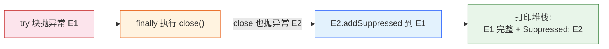

# 【源码解析】try-with-resources
## 反编译展开 与 Suppressed 抑制机制
<span style="color:#888">Java 语言核心 · 第 05 讲延伸 · 源码专题</span>
## 一、概述：为什么需要它？
**资源泄漏**是 Java 生产事故的高发区。JDK 7 之前，手动关闭资源要写大量样板代码，还容易踩坑：
- **忘关资源**：文件句柄/连接耗尽，系统慢慢卡死
- **关闭顺序错**：先关外层再关内层，反而出错
- **异常被吞**：`finally` 里 `close()` 抛异常会把 `try` 块的真实异常盖掉
> try-with-resources（TWR）是 JDK 7（JEP 129）引入的语法糖：**编译期自动生成 `finally` 关闭逻辑，并用 `Suppressed` 机制保留关闭异常**，一次性解决以上三个问题
## 二、传统写法的痛点（JDK 6 及以前）
```java
// 传统写法：读文件
InputStream in = null;
try {
    in = new FileInputStream("a.txt");
    byte[] data = in.readAllBytes();
} finally {
    if (in != null) {
        try {
            in.close();
        } catch (IOException e) {
            // 吞掉 close 异常 ← 最常见的坑
        }
    }
}
```
**三个痛点**：
- 代码 8 行起步，资源一多变成"关闭地狱"
- `close()` 异常被吞 → 关闭失败无人知晓
- 忘写 `finally` / 忘判空 → 资源泄漏
## 三、TWR 的语法与使用
```java
// JDK 7+ 的写法
try (InputStream in = new FileInputStream("a.txt")) {
    byte[] data = in.readAllBytes();
}
// 编译期自动：finally { in.close(); }
// 多个资源（逆序关闭）
try (InputStream in = new FileInputStream("a.txt");
     OutputStream out = new FileOutputStream("b.txt")) {
    // 同时使用两个资源
}
// 关闭顺序：先 out，再 in（后声明的先关）
```
**使用要求**：
- 资源必须实现 `AutoCloseable`（`Closeable` 是其子接口，约定 `close()` 抛 `IOException`）
- JDK 9+ 支持"已存在的资源变量"进 try：`try (in)`（effectively final）
## 四、编译展开：javac 到底做了什么？
以下 TWR 代码：
```java
try (Writer w = new FileWriter("log.txt")) {
    w.write("data");
}
```
等价展开成（反编译视角）：
```java
Writer w = new FileWriter("log.txt");
Throwable primary = null;          // 主异常槽位
try {
    w.write("data");
} catch (Throwable t) {
    primary = t;                    // 记主异常
    throw t;
} finally {
    if (w != null) {
        if (primary != null) {
            try { w.close(); }
            catch (Throwable t2) {
                primary.addSuppressed(t2);   // 抑制挂载
            }
        } else {
            w.close();              // 正常路径直接关
        }
    }
}
```
> **核心机制**：主异常（try 块抛的）被记录，`close()` 抛的异常通过 `addSuppressed()` 挂到主异常下 — 两个异常都不丢
## 五、Suppressed 抑制机制详解

实际打印效果：
```
java.io.IOException: write failed
    at Demo.main(Demo.java:5)
    Suppressed: java.io.IOException: close failed
        at Demo.main(Demo.java:6)
```
> 主异常 `write failed` 完整保留，`close failed` 以 `Suppressed` 形式展示 — **排查时先看主异常，再看 Suppressed**
## 六、Throwable.addSuppressed 源码（JDK 17）
```java
private static final Throwable[] EMPTY_THROWABLE_ARRAY = {};
private transient Object[] suppressedExceptions;
public final synchronized void addSuppressed(Throwable exception) {
    if (exception == this)
        throw new IllegalArgumentException(
            "Self-suppression not permitted");
    if (exception == null)
        throw new NullPointerException("Cannot suppress a null exception");
    if (suppressedExceptions == null)
        suppressedExceptions = EMPTY_THROWABLE_ARRAY;  // 懒加载哨兵
    if (suppressedExceptions == EMPTY_THROWABLE_ARRAY) {
        suppressedExceptions = new Throwable[1];        // 首次分配
        suppressedExceptions[0] = exception;
        return;
    }
    // 扩容 1 个槽位
    Throwable[] newArray =
        Arrays.copyOf(suppressedExceptions,
                      suppressedExceptions.length + 1);
    newArray[newArray.length - 1] = exception;
    suppressedExceptions = newArray;
}
```
**设计要点**：
- **懒加载**：没抑制异常时不分配数组，零开销
- **防自抑**：`exception == this` 抛异常（避免循环）
- **防 null**：抑制 null 抛 NPE
- **线程安全**：方法 `synchronized`
## 七、getSuppressed 与堆栈打印
```java
public final Throwable[] getSuppressed() {
    if (suppressedExceptions == null ||
        suppressedExceptions.length == 0) {
        return EMPTY_THROWABLE_ARRAY;      // 空数组，非 null
    }
    return suppressedExceptions.clone();   // 克隆防篡改
}
```
**关键细节**：
- 返回**克隆数组** — 外部拿到引用改不了内部状态
- 无抑制时返回**空数组**而非 null — 调用方免判空
- `printStackTrace()` 内部会调用 `getSuppressed()` 逐个打印
- `initCause()` 与 `addSuppressed()` 是两套独立机制，互不影响
## 八、多个资源的关闭顺序（源码验证）
```java
try (ResourceA a = new ResourceA();
     ResourceB b = new ResourceB()) {
    // 使用
}
// 等价于嵌套 try：
try (ResourceA a = new ResourceA()) {
    try (ResourceB b = new ResourceB()) {
        // 使用
    }
}
```
**关闭顺序推导**（从内层到外层 = 逆序）：
1. 内层 `b.close()` 先执行
2. 外层 `a.close()` 后执行
3. 任何一层关闭抛异常，都挂到"该层主异常"上
> 应用视角：**依赖别的资源的资源要声明在外面**（先建外层，再建内层），释放时先释放依赖方
## 九、自定义 AutoCloseable 的正确姿势
```java
public class DbConnection implements AutoCloseable {
    private boolean closed = false;
    @Override
    public void close() {
        if (closed) return;       // 幂等：防重复关闭
        closed = true;
        // 真正释放底层连接
    }
}
```
**三条铁律**：
- `close()` 必须**幂等**（多次调用不炸）
- `close()` 不应**吞异常**（否则抑制机制失去意义）
- 构造器抛异常时资源未创建，`try()` 不会调用 `close()`（正常，无泄漏）
## 十、常见坑与最佳实践
```java
// 坑 1：资源变量在 try() 外声明
FileInputStream in = new FileInputStream("a.txt");
try (FileInputStream in2 = in) { }   // 能用但别扭
// 直接在括号里 new 最清晰
// 坑 2：JDK 9+ 已有变量进 try
InputStream in = open();
try (in) {   // effectively final 才行
    // 编译错误：in 被修改过就不行
}
// 坑 3：AutoCloseable 的 close 抛受检异常
// 方法签名要处理（throws 或 catch）
```
**最佳实践**：
- 能用 TWR 绝不手写 finally close
- 自定义资源实现幂等 close + 不吞异常
- 排查异常先看主异常，再看 `Suppressed:`
## 小结
- TWR = **自动关闭** + **Suppressed 抑制挂载**，JDK 7（JEP 129）引入
- 编译展开 = try-finally + 主异常槽位 + `addSuppressed`
- `addSuppressed` 懒加载数组、防自抑、防 null、synchronized
- 多资源逆序关闭，依赖者先建
- 自定义资源：幂等 close、不吞异常
> 异常处理不是"catch 一下就完事"，而是**保证失败可发现、可定位、可恢复** — TWR 是这个理念的最小单元
