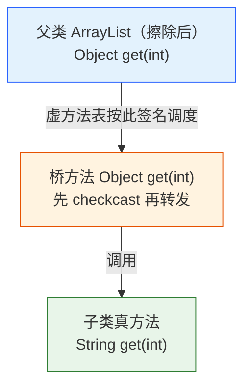
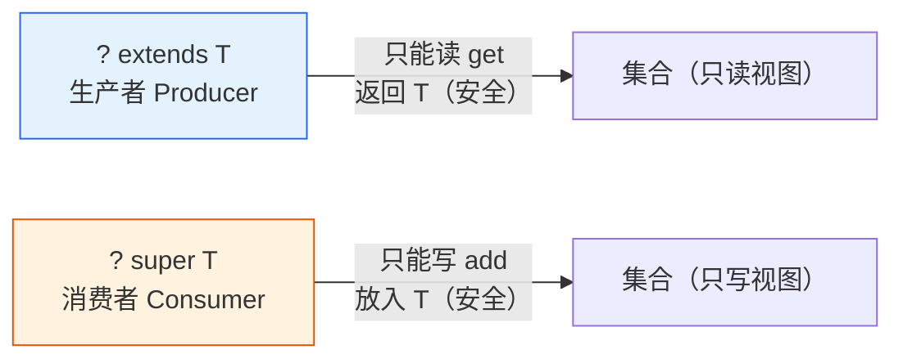

# 泛型擦除原理

> 前置篇目：无（本篇是 Java 语言基础机制，不依赖其他篇目）
>
> 本篇要回答的问题：
>
> 1. 泛型解决了什么问题？没有泛型会怎样？
> 2. `List<String>` 和 `List<Integer>` 运行时是同一个类吗？
> 3. 擦除到底擦掉了什么？是不是全丢？
> 4. 桥方法是什么？编译器为什么偷偷造它？
> 5. 为什么不能创建泛型数组？
> 6. 泛型是不变的：`List<String>` 为什么不是 `List<Object>`？
> 7. raw type（裸类型）是什么？为什么会有警告？
> 8. PECS：`? extends T` 和 `? super T` 到底怎么记？
> 9. 泛型类怎么定义？泛型接口怎么实现？泛型类能被继承吗？
> 10. 泛型方法和泛型类有什么区别？类型推断从哪来？
> 11. 开发中那些看不懂的泛型写法，怎么读？
> 12. 运行时还能拿到泛型信息吗？
> 13. 泛型有哪些高频坑？
> 14. 泛型 varargs：`@SafeVarargs` 到底在说什么？
> 15. 自限泛型：`Enum<T extends Enum<T>>` 是什么套路？
> 16. 为什么 Java 选择擦除，而 C# 却保留泛型？

---

## 泛型解决了什么问题？没有泛型会怎样？

**本块讲什么**：JDK 5 之前的"原始世界"——为什么 Java 非要有泛型不可；泛型带来的三个价值。这是整个泛型话题的起点，后面所有内容（擦除/桥方法/通配符）都是围绕它展开的。

先回到 2004 年之前。那时候集合不写泛型，长这样：

```java
List list = new ArrayList();        // 原始类型：啥都能装
list.add(new Dog());                // 装 Dog
list.add(new Cat());                // 也能装 Cat —— 编译期完全没意见

// 取出时必须强转，转错了运行期才炸
Dog dog = (Dog) list.get(0);        // 运气好
Dog dog2 = (Dog) list.get(1);       // ClassCastException —— 但这时离
                                    // "谁把它放进去的"已经十万八千里
```

**问题有三个**：

1. **强转丑且不安全**：每次取出都要强转，转错了编译器不管，运行期才炸
2. **错误延迟爆炸**：往列表塞错类型的人（`list.add(new Cat())`）不报错，报错的是**将来取出的人**——bug 甩给了最无辜的代码
3. **没有文档**：`List list` 这行什么都没表达，里面该是 Dog 还是 Cat 全靠猜

**泛型解决的正是这三件事**：


| 泛型的价值                                          | 对比没有泛型              |
| --------------------------------------------------- | ------------------------- |
| **编译期类型检查**：`List<Dog>` 塞 Cat 直接编译错误 | 运行期 ClassCastException |
| **消除强转**：`Dog d = list.get(0)` 不用转          | 每次手动`(Dog)`           |
| **自文档化**：`List<Dog>` 一眼知道该装什么          | 全靠读代码猜              |

```java
List<Dog> dogs = new ArrayList<>();
dogs.add(new Dog());            // ✅
// dogs.add(new Cat());         // ❌ 编译错误：incompatible types
Dog d = dogs.get(0);            // ✅ 不用强转
```

这就是泛型存在的全部理由——**把"类型错误"从运行期提前到编译期，把"强转"从代码里消灭**。理解了这个，后面的擦除、桥方法、通配符都是围绕"如何在编译期管住类型"展开的细节。

> 边界：泛型的类型检查是"编译期一次性"的，运行期靠的是编译器插入的强转（下一块会看到字节码证据）——所以泛型是"把错误时间提前"，不是"把错误消灭"。想通这一点，泛型就通了一半。

---

## List<String> 和 List<Integer> 运行时是同一个类吗？

**本块讲什么**：类型擦除的宏观结论——泛型只在编译期存在，运行期的类里没有泛型；以及为什么必须这样设计。

先直接给结论，别绕：**是同一个类**。`new ArrayList<String>()` 和 `new ArrayList<Integer>()` 得到的对象，`getClass()` 完全一样。

```java
List<String> a = new ArrayList<>();
List<Integer> b = new ArrayList<>();
System.out.println(a.getClass() == b.getClass());   // true
```

这不是"碰巧"，是 JVM 层面的必然。要理解它，先建立一个直觉：**泛型是一张贴纸**。

> 类比：泛型就像快递箱上的贴纸——分拣员（编译器）靠贴纸检查箱子里该装什么、不许混装；但到了运输环节（运行时），贴纸被撕掉了，所有箱子在传送带上长得一模一样。

**证据 1：javap 看字节码，类里根本没有泛型。**

把上面代码编译后 `javap -p ArrayList`，你看到的字段是（JDK 8 ArrayList 源码）：

```text
private transient Object[] elementData;   // 不是 E[]，是 Object[]
```

`ArrayList` 源码里写的是 `E[] elementData`，编译后变成 `Object[]`——泛型参数 `E` 被擦除成它的上界（无界就是 `Object`）。

**证据 2：方法签名里也没有。**

```text
public E get(int index)   →  public Object get(int index)
public boolean add(E e)   →  public boolean add(Object e)
```

**为什么必须这样设计？** 一个词：**向后兼容**。Java 泛型是 JDK 5（2004）才引入的，而 JDK 1.4 的 `ArrayList` 已经存在且不写泛型（`raw type`）。如果 JVM 级别保留泛型，JDK 5 编译出来的代码就无法和旧代码互操作。擦除方案让新代码编译后和旧代码**字节码层面完全兼容**——代价是类型安全只在编译期有效。

**编译器在调用处偷偷插入强转**：你写 `String s = list.get(0)`，编译后实际是：

```java
String s = (String) list.get(0);   // get 返回 Object，编译器插入 cast
```

所以运行时如果类型真的不对，抛的是 `ClassCastException`——这就是"泛型安全是编译期安全，不是运行期安全"的含义。

> 边界：`instanceof` 不能用于泛型类型（`list instanceof ArrayList<String>` 编译错误），因为运行时根本没有这个类型可查——正是同一原因。

---

## 擦除到底擦掉了什么？是不是全丢？

**本块讲什么**：擦除的三种规则（无界→Object、有界→上界），以及一个反直觉事实——擦除不是全丢，字节码的 Signature 属性里留着泛型的"照片"。

擦除的规则就三条：


| 场景         | 写法                                          | 擦除成             |
| ------------ | --------------------------------------------- | ------------------ |
| 无界类型参数 | `class Box<T>`                                | `Object`           |
| 有界类型参数 | `class Box<T extends Number>`                 | `Number`（上界）   |
| 多个上界     | `class Box<T extends Number & Comparable<T>>` | 第一个上界`Number` |

**Multiple Bounds（多边界）两个细节**（Oracle 教程有专门小节）：

- 类上界**必须在前**，接口上界在后：`<T extends Number & Comparable<T>>` 合法，`<T extends Comparable<T> & Number>` 编译错误（class 必须放第一）
- 擦除只取**第一个上界**：上例擦除成 `Number`——所以接口上界的信息在签名里丢了，调用处强转时要注意

**实测证据**（JDK 8 javac/javap；擦除机制自 JDK 5 定型后未变，JDK 17 行为一致）：

```java
static class Box<T extends Number> {
    T value;
}
```

编译后 `javap -v Box`，看 `value` 字段：

```text
T value;
  descriptor: Ljava/lang/Number;    // ← 擦除成上界 Number
  Signature: #7                     // TT;  ← 但 Signature 属性里还留着 T
```

看到了吗——**descriptor（运行时用的签名）是 Number，但 Signature 属性（元数据）里是 T**。这就是"擦除但不全丢"的铁证：JVM 执行时不看 Signature，但**反射可以看到**。后面"运行时怎么拿到泛型信息"那一块，全靠这个属性。

**擦除带来的第二个隐藏动作：调用处插强转。** 上面 `Box<Number>` 的 `value` 字段读出来是 Number，但如果你写 `Box<Integer>`，读字段时编译器会在调用点插入 `(Integer) cast`：

```java
Box<Integer> box = new Box<>();
Integer v = box.value;      // 编译后: Integer v = (Integer) box.value;
```

**边界**：擦除发生在**编译期**，所以：

- 同一个类中不能有"仅泛型参数不同"的重载（`void f(List<String>)` 和 `void f(List<Integer>)` 编译冲突——擦除后都是 `f(List)`）
- `catch` 不能捕获泛型异常（异常类型不参与擦除检查的运行时语义）

---

## 桥方法：编译器偷偷造的桥

**本块讲什么**：为什么子类明确父类泛型参数时，编译器会额外生成一个返回 Object 的"桥方法"；字节码证据和识别方法。

先看场景。`ArrayList<String>` 意味着父类方法签名被擦除成 `Object get(int)`，而你子类里写的是 `String get(int)`——**签名对不上，多态就断了**。编译器怎么圆？生成一个"桥"。

```java
static class StringList extends ArrayList<String> {
    @Override
    public String get(int index) { return "item" + index; }
}
```

**实测证据**：`javap -p StringList` 显示——注意，有两个 `get(int)`：

```text
class GenericProbe$StringList extends java.util.ArrayList<java.lang.String> {
  public java.lang.String get(int);   // ← 你写的
  public java.lang.Object get(int);   // ← 编译器偷偷生成的桥方法
}
```

运行时 `isBridge()` 能识别它：

```text
桥方法: public java.lang.Object GenericProbe$StringList.get(int)
```

**桥方法的执行逻辑**（字节码层面）：桥方法先做一次强转（`checkcast`），然后调用你写的 `String get(int)`：

```text
public java.lang.Object get(int);
  code: return this.get(int);   // 桥 → 真方法，编译器已在字节码里插好 checkcast
```

**为什么要这个桥？** 因为多态调度（虚方法表）是按**擦除后的签名**找方法的：调用方（比如 `ArrayList.forEach` 内部）持有 `Object get(int)` 的引用去调，如果没有桥方法，子类的 `String get(int)` 因为签名不同根本不会被调度到——**父类代码调子类实现就会调空**。桥方法的存在，让"擦除后的父类签名"和"子类的具体签名"能对接上：



> 类比：桥就是两个接口尺寸不一时，中间那块转接头——父类接口是 16A，子类实现是 10A，编译器给你焊了个 16A→10A 的转接头，两边都能插。

**边界与坑**：

- `getDeclaredMethods()` 会看到桥方法，反射遍历方法时要 `isBridge()` 过滤（框架代码常见这个 bug）
- 实现泛型接口（如 `Comparator<T>`、`Comparable<T>`）同样会生成桥方法
- 桥方法也是 `getMethods()` 与 `getDeclaredMethods()` 结果不一致的原因之一

---

## 为什么不能创建泛型数组？

**本块讲什么**：数组协变与泛型不变的冲突——这是 Java 类型系统里最拧巴的一处设计。

先看事实：下面这行编译直接报错。

```java
// T[] arr = new T[10];   // ❌ generic array creation
```

而数组和泛型的差别，一个实验说清楚：

```java
String[] strings = new String[3];
Object[] objs = strings;           // ✅ 数组是协变的：String[] 是 Object[] 的子类
objs[0] = 42;                      // ✅ 编译通过
// 运行时：ArrayStoreException！数组记得自己是 String[]，拒绝存 Integer
```

数组的"协变 + 运行时检查"是安全的：**数组在运行时知道自己存什么类型**（对象头里有），存错就抛 `ArrayStoreException`。

但泛型是擦除的——`List<String>` 运行时不知道自己存的是 String。如果允许 `T[] arr = new T[10]`：

```java
// 假设能编译（实际上不能）
List<String>[] lists = new List<String>[10];
Object[] objs = lists;             // 数组协变：List<String>[] 是 Object[] 的子类
objs[0] = new ArrayList<Integer>();// 运行时检查？擦除了，List 不记得自己是 String 的
// → 之后从 lists[0] 取 String，ClassCastException 在遥远的地方炸
```

**矛盾的本质**：数组的运行时检查需要"类型真实存在于运行时"，而泛型恰恰把它擦掉了。**一个要真身，一个没真身**——所以 Java 干脆禁止创建泛型数组，从源头堵死。

**替代方案**（按场景选）：

```java
List<String> list = new ArrayList<>(10);     // 集合，99% 场景的正解
String[] arr = new String[10];               // 已知具体类型，直接用具体数组
// 反射兜底（有 unchecked 警告，但可行）
T[] arr = (T[]) Array.newInstance(clazz, 10);
```

> 边界：`new List<String>[10]` 报错，但 `new List[10]`（裸类型）能过——然后你会收到 "unchecked" 警告。这正是泛型数组问题的妥协：raw type 绕过检查，风险自担。

---

## 泛型是不变的：List<String> 为什么不是 List<Object>？

**本块讲什么**：泛型的不变性（invariance）——这是与数组协变最根本的差别，也是理解通配符存在意义的钥匙。

先看数组：`String[]` 是 `Object[]` 的子类型（协变），所以 `Object[] o = strings` 能编译。但泛型**不协变**：

```java
List<String> strings = new ArrayList<>();
// ❌ 编译错误：incompatible types
// List<Object> objs = strings;
```

如果 `List<String>` 是 `List<Object>` 的子类型，会发生什么？——灾难：

```java
// 假设能编译（实际上不能）
List<Object> objs = strings;      // 把 String 列表当成 Object 列表
objs.add(42);                     // Integer 混进 String 列表！
String s = strings.get(0);        // ClassCastException（运行时才炸）
```

数组能协变，是因为数组**运行时检查**（`ArrayStoreException` 兜底）；泛型擦除了，运行时**没有检查**，所以编译期必须堵死——**这就是"泛型不变"的原因：擦除让运行时无检查，无检查就得编译期隔离**。

**那 `List<?>` 是什么？** 通配符是"协变的变通开关"：

```java
List<? extends Object> objs = strings;   // ✅ 通配符恢复协变：List<String> 是 List<? extends Object>
// 但代价：只能读不能写（块 7 详讲）
```

**三条规则记牢**（面试高频）：


| 表达式                                  | 含义                   | 能否编译 |
| --------------------------------------- | ---------------------- | -------- |
| `List<Object> = List<String>`           | 不变                   | ❌       |
| `List<? extends Object> = List<String>` | 协变（只读）           | ✅       |
| `List<? super String> = List<Object>`   | 逆变（只写）           | ✅       |
| `List<Object> = List<?>`                | 通配符不能赋给具体类型 | ❌       |

> 边界：这与块 4 的数组问题是一个硬币的两面——数组协变靠运行时检查兜底所以安全，泛型想协变只能靠通配符 + 限制读写。**"不变性"不是设计失误，是擦除的必然推论**。

---

## raw type（裸类型）是什么？为什么会有警告？

**本块讲什么**：不带泛型参数的原始类型（`List` 而不是 `List<String>`）、unchecked 警告的含义，以及什么时候能忍。

**raw type = 用了泛型类但不写类型参数**：

```java
List list = new ArrayList();        // raw type：JDK 5 之前的写法
list.add("hello");                  // ✅ 编译通过，没任何检查
list.add(42);                       // ✅ 也通过！这就是"不安全"的根源
String s = (String) list.get(1);    // ✅ 编译通过 → 运行时 ClassCastException
```

它**合法**（为了兼容 JDK 5 之前的代码），但编译器会给你 unchecked 警告——意思是"**你在放弃类型检查，出问题自担**"。

**什么时候合法地忍？** 两种场景：

1. **写 JDK 5 之前的老库/老代码交互层**（迫不得已）
2. **明确知道自己只是"临时借用"**（比如 `new ArrayList<>(10)` 的初始化不用 raw）

**什么时候是 bug？** 几乎所有时候。用 raw type 等于把泛型的安全网剪了：

```java
// ❌ 反模式：raw type 出现在新代码里
@SuppressWarnings("rawtypes")
public List getUsers() { ... }      // 调用方拿到 raw List，全链路失去类型信息

// ✅ 正确：写清楚参数
public List<User> getUsers() { ... }
```

**raw type 与 `List<?>` 的区别**（高频面试点）：


|            | `List`（raw）       | `List<?>`（无界通配符）                     |
| ---------- | ------------------- | ------------------------------------------- |
| 类型安全   | 无，能 add 任何东西 | 有，只能 add null                           |
| 语义       | "我不知道，也不管"  | "我知道有类型，但不知道是啥"                |
| 警告       | unchecked           | 无                                          |
| 什么时候用 | 兼容老代码          | 只读场景（`List<?> size()` 之类的只读方法） |

> 边界：泛型数组问题（块 4）里那个"能编译的 `new List[10]`"就是 raw type——它绕过了检查，换来的是 unchecked 警告和运行期风险。**一句话：新代码出现 raw type = 代码味道**。

---

## PECS：? extends T 和 ? super T 到底怎么记？

**本块讲什么**：通配符上界/下界的读写限制，以及最常用的记忆法（Producer extends, Consumer super）。

通配符的核心是**限制读写方向**，先看两条铁律（用代码说话）：

```java
// 上界通配符：只能读，不能写（除了 null）
List<? extends Number> readers = new ArrayList<Integer>();
Number n = readers.get(0);          // ✅ 读出来是 Number（实际类型是它的子类，向上转型安全）
// readers.add(42);                 // ❌ 编译错误：不知道实际是 Integer 还是 Double，不敢接

// 下界通配符：只能写，不能读（读出来只能当 Object）
List<? super Integer> writers = new ArrayList<Number>();
writers.add(42);                    // ✅ 写 Integer 安全（Integer 是 Number 子类，向上转型）
// Integer i = writers.get(0);      // ❌ 编译错误：不知道是 Number 还是 Object
Object o = writers.get(0);          // ⚠️ 只能当 Object 读
```

**为什么？** 一句直觉：

- `? extends T` 表示"**某种 T 的子类**"，具体是谁不知道——所以**能读**（读到的一定是 T，向上转型安全），**不能写**（写进去的没法保证是这个未知子类）
- `? super T` 表示"**某种 T 的父类**"，具体是谁不知道——所以**能写**（T 一定能放进它的父类容器），**不能读**（读出来不知道具体是哪个父类，只能当 Object）



**记忆法（Effective Java 第 31 条）**：**PECS = Producer Extends, Consumer Super**。

- 方法**从集合取数据**（集合是生产者）→ `? extends T`
- 方法**往集合放数据**（集合是消费者）→ `? super T`

一个标准例子，`Collections.copy(dest, src)` 的签名就是教科书：

```java
public static <T> void copy(List<? super T> dest, List<? extends T> src) {
    for (int i = 0; i < src.size(); i++)
        dest.set(i, src.get(i));
}
```

`src` 是生产者（读），`dest` 是消费者（写）——两个通配符方向相反，恰好对应读写两端。

> 边界：通配符也能做"无界" `List<?>`（只读，且不能 add 非 null），等价于"不知道任何信息"。还有"通配符捕获"（wildcard capture）——把 `List<?>` 借给泛型方法推断出具体类型。经典场景是交换元素：`swap(List<?> list, int i, int j)` 里不能直接 `list.set(i, list.get(j))`（? 不能写），解法是让泛型方法"捕获"通配符：
>
> ```java
> static void swap(List<?> list, int i, int j) {
>     swapHelper(list, i, j);        // 借给泛型方法
> }
> static <E> void swapHelper(List<E> list, int i, int j) {
>     list.set(i, list.set(j, list.get(i)));   // E 被"捕获"，能读能写
> }
> ```
>
> `List<?>` 里的 ? 在泛型方法调用时被推断为一个具体类型（编译器内部叫 `CAP#1`），读写就都合法了。知道这个模式即可，实际写框架代码才会用到。

---

## 泛型类怎么定义？泛型接口怎么实现？泛型类能被继承吗？

**本块讲什么**：泛型最基础的三件套——泛型类定义、泛型接口的两种实现方式、泛型类的两种继承姿势。

**泛型类：把类型参数写在类名后**。

```java
public class Box<T> {              // 类名后 <T>，作用域是整个类体
    private T value;

    public void set(T v) { this.value = v; }
    public T get() { return this.value; }

    // ❌ 静态成员不能用 T（块 9 细讲）
}

Box<String> box = new Box<>();     // JDK 7+ 菱形运算符，右边省类型
box.set("hello");
String s = box.get();              // 不用强转——泛型的核心价值
```

**泛型接口：实现时有两条路**——要么"继承时定死"，要么"把泛型继续传下去"：

```java
public interface Repository<T> {
    T findById(Long id);
    void save(T entity);
}

// 姿势①：实现类明确类型参数（最常见）
public class UserRepository implements Repository<User> {
    public User findById(Long id) { ... }
    public void save(User u) { ... }
}

// 姿势②：实现类继续保留泛型参数（把决定权留给下游）
public class BaseRepository<T> implements Repository<T> {
    public T findById(Long id) { ... }
    public void save(T entity) { ... }
}
// 子类：class OrderRepository extends BaseRepository<Order> —— 到这儿才定死
```

**泛型类继承：同样两种姿势**（与接口完全同理）：

```java
// 姿势①：子类明确父类泛型参数 → 子类不是泛型类
public class StringList extends ArrayList<String> { }

// 姿势②：子类保留泛型参数 → 子类仍是泛型类
public class MyList<E> extends ArrayList<E> {
    public E first() { return get(0); }
}
```

**一个高频误区**：泛型类之间没有继承关系（块 5 的不变性），但**泛型类本身可以继承**（`StringList` 继承 `ArrayList<String>`）——两者别混。前者是"类型参数的关系"，后者是"类的关系"。

**泛型类的类型参数命名惯例**（代码可读性）：


| 字母      | 惯例含义                       |
| --------- | ------------------------------ |
| `T`       | Type，任意类型                 |
| `E`       | Element，集合元素              |
| `K` / `V` | Key / Value，键值对            |
| `R`       | Return，返回值                 |
| `?`       | 未知类型（通配符，不是参数名） |

> 边界：泛型类不能被 `new` 成具体类型之外的形式（`new Box<>()` 是菱形推断，`new Box()` 是 raw type——见块 6）。

---

## 泛型方法 vs 泛型类：类型推断从哪来？

**本块讲什么**：泛型方法独立于类的泛型参数、类型推断的发生位置，以及一个最常见的错误（静态方法里用类泛型）。

泛型类把类型参数绑在**实例**上；泛型方法把类型参数绑在**方法调用**上——两者独立。经典例子：

```java
// 泛型方法：类型参数 <T> 属于方法，调用时推断
public static <T> List<T> asList(T... a) {
    List<T> list = new ArrayList<>();
    for (T t : a) list.add(t);
    return list;
}

List<String> names = asList("a", "b");   // 推断 T = String，不用写
List<Integer> nums  = GenericMethods.<Integer>asList(1, 2);  // 也可以显式指定
```

**类型推断发生在哪里？** 发生在**编译期、调用点**：javac 根据实参类型和返回值目标类型反推 `T`。上面 `asList("a","b")` 里，实参是 String → 推断 `T=String`。

**最常见的错误：静态方法想用类的泛型参数。**

```java
class Util<T> {
    // ❌ 编译错误：non-static type variable T cannot be referenced from a static context
    // static T identity(T t) { return t; }
}
```

原因很直白：**`T` 是每个实例一份的**（`Util<String>` 和 `Util<Integer>` 的 T 不同），而静态方法属于类、不属于实例——没有实例就没有 T，无从谈起。解法：改成泛型方法 `<T> T identity(T t)`，让 T 跟着调用走。

**泛型方法的类型推断三条规则**（够用就好）：

1. 从实参类型推断（`asList("a")` → String）
2. 从返回类型目标推断（`List<Integer> x = emptyList();` → Integer）
3. 推断失败时用上界兜底（`Collections.max(Collection<? extends T>)` 推断 T = Comparable 上界）

> 边界：菱形运算符 `new ArrayList<>()` 也是类型推断（目标类型推断），JDK 7 引入；`var`（JDK 10+）则是"从初始化表达式推断局部变量类型"，方向相反——一个是填泛型，一个是省类型声明。

---

## 开发中那些看不懂的泛型写法，怎么读？

**本块讲什么**：一套"拆解读法"——从外到内拆任意复杂泛型签名；用开发中最常见的三个"天书"签名练手（`Comparator<? super T>`、`Function<? super T, ? extends R>`、`TreeMap<K, V extends Comparable<? super V>>`）。

先说方法。任何复杂泛型签名，**从外到内拆四步**，别从中间看：

```
第 1 步：最外层是什么类型？→ 类 / 方法 / 变量声明
第 2 步：有几个类型参数？每个的边界是什么？（T extends X = 必须是 X 的子类）
第 3 步：通配符方向？→ ? extends = 读出（get 安全）；? super = 写入（add 安全）；裸 T = 固定
第 4 步：把实际类型代入，验证读得通
```

**案例 1：`Collections.sort(List<T> list, Comparator<? super T> c)`**（天天用）

```
读法：第二个参数是"能比较 T 或 T 的任意父类的比较器"
为什么：能比较 Animal 的比较器，当然能比较 Dog（Dog 是 Animal）——
       比较器的"能力"向下兼容，这就是 PECS 里 Consumer（消费 T）要 super
直觉：我有一堆 Dog，手上只有比较 Animal 的秤，照样能比 Dog
```

```java
class Animal { int weight; }
class Dog extends Animal { }
List<Dog> dogs = ...;
Collections.sort(dogs, (a, b) -> Integer.compare(a.weight, b.weight));
// 上面 lambda 的 Comparator<Animal> 能传给 Comparator<? super Dog> ✅
// 如果签名是 Comparator<Dog>，这个 lambda 就传不进去了
```

**案例 2：`Stream.map(Function<? super T, ? extends R> mapper)`**（Stream 里天天见）

```
读法：入参函数"接收 T 或其父类"（宽进），"返回 R 或其子类"（宽出）
为什么：map 要把 T 变成 R——输入端宽进（父类能处理子类），输出端宽出（子类能赋给父类）
直觉：函数式接口的两个类型参数，永远是"入 super、出 extends"
```

```java
List<Dog> dogs = ...;
// 传入 Function<Animal, String>（比 ? super Dog 更宽）✅
List<String> names = dogs.stream().map(d -> d.name).toList();
```

**案例 3：`TreeMap<K, V extends Comparable<? super V>>`**（Key 的自然排序）

```
读法：V（Value 类型……其实这里约束的是排序对象）必须"可比"，且比较器覆盖其父类
直觉：TreeMap 要排序，所以塞进去的东西必须"自己会排序"——String/Integer 天然满足
```

```java
TreeMap<String, Integer> map = new TreeMap<>();   // ✅ String 实现了 Comparable<String>
// TreeMap<Dog, Integer> 会编译错误：Dog 没实现 Comparable
```

**案例 4：嵌套泛型 `Map<String, List<Map<String, Integer>>>`**

```
读法：从外到内逐层剥
Map<String, List<...>>        → 外层：key 是 String，value 是 List
Map<String, List<Map<String, Integer>>>   → 内层：List 的元素是 Map，其 value 是 Integer

取值的类型链（每层 get 都返回下一层的"值类型"）：
map.get("a")                 → List<Map<String, Integer>>
map.get("a").get(0)          → Map<String, Integer>
map.get("a").get(0).get("k") → Integer
```

**案例 5：`<T extends Comparable<? super T>>`**（泛型方法 + 下界边界的组合，`Collections.max` 的签名）

```
读法：T 必须"可比"，且比较的对象覆盖 T 的父类
价值：比 <T extends Comparable<T>>（自限）更宽松——允许"父类实现了比较，子类直接用"
```

```java
// Collections.max 的完整签名
public static <T extends Object & Comparable<? super T>> T max(Collection<? extends T> coll)
// 读：① T 必须实现 Comparable ② 比较器能比 T 的父类 ③ 集合里的元素是 T 的子类
//     ④ 返回值是 T
```

**读法收口**：复杂泛型签名 = **类型参数 + 通配符方向 + 边界**。每次看到看不懂的签名，按四步从外到内拆一遍，拆完问自己三个问题——"外层是什么类型？通配符往哪边开？边界约束了什么？"——90% 的天书签名三问就能读通。

> 边界：这套读法有个前提——通配符方向（第 3 步）依赖 PECS（块 7）的理解。如果 PECS 还不熟，先回块 7 再看这里。另外，IDE（IDEA）悬停方法名会显示完整泛型签名，读代码时配合 IDE 高亮，比人肉拆快。

---

## 运行时还能拿到泛型信息吗？

**本块讲什么**：Signature 属性 + 反射 API 的组合拳——擦除之后如何"考古"出泛型。

上一块说过，擦除不全丢——**Signature 属性**里留着泛型"照片"，反射可以读。核心 API 三件套：`getGenericType()`（字段）、`getGenericReturnType()`（方法）、`getGenericSuperclass()`（父类）。

**实测证据**（接着前面的 `Box<T extends Number>`）：

```java
Field f = Box.class.getDeclaredField("value");
System.out.println(f.getType());        // class java.lang.Number   ← 运行时类型（擦除后）
System.out.println(f.getGenericType()); // T                        ← 泛型签名（Signature 属性）
```

`getGenericType()` 返回的是 `Type` 接口，最常见的是 `ParameterizedType`（参数化类型），它能拆出**实际类型参数**：

```java
class StringList extends ArrayList<String> { }

ParameterizedType pt = (ParameterizedType) StringList.class.getGenericSuperclass();
System.out.println(pt.getActualTypeArguments()[0]);   // class java.lang.String
```

这就回答了那个经典问题："**运行时能不能拿到泛型真实类型？**"——**能，但只在"泛型被写在类声明/字段/方法签名里"时能**（这些位置擦除后留了 Signature）。反过来说：**局部变量** `List<String> list = ...` 的 String 拿不到（局部变量不生成 Signature）。

**两个实战模式**：

**模式 1：TypeToken（Gson 的泛型 JSON 反序列化）**

```java
// TypeToken<T> {} 匿名子类——把泛型"冻"在类声明里
Type type = new TypeToken<List<User>>() {}.getType();
List<User> users = gson.fromJson(json, type);
// 原理：匿名类的 getGenericSuperclass() = ParameterizedType(List<User>)
//       → getActualTypeArguments() → User
```

**模式 2：Spring 的 ResolvableType（泛型解析工具）**

```java
// 泛型父类里拿到具体类型
class BaseDao<T> {
    Class<T> clazz = (Class<T>) ResolvableType
        .forClass(getClass()).getSuperType().getGeneric(0).resolve();
}
// UserDao extends BaseDao<User> → clazz = User.class
```

MyBatis、Spring Data JPA 的泛型 Mapper 全是这个套路：**"泛型写进类声明，子类继承时落定，反射 Signature 取回"**。

> 边界：Signature 是编译期写入的，所以**混淆（ProGuard/R8）会把它抹掉**——生产环境做了混淆后，反射拿泛型会失败，这是混淆的已知副作用。

---

## 泛型有哪些高频坑？

**本块讲什么**：八个最常见的泛型使用错误——每条都是编译错误或运行期事故的现场，附解法。

**坑 1：`instanceof` 不能用于泛型类型。**

```java
// ❌ 编译错误：illegal generic type for instanceof
// if (list instanceof ArrayList<String>) { }

// ✅ 只能查裸类型，然后靠元素类型自查
if (list instanceof ArrayList) { }   // 裸类型可以，但会有 unchecked 警告
```

原因不用多说了——运行时根本没有 `ArrayList<String>` 这个类型可查（块 1 的结论）。

**坑 2：强制转换的 unchecked 警告是"我在骗编译器"。**

```java
@SuppressWarnings("unchecked")
static <T> T cast(Object obj) { return (T) obj; }   // 擦除后是 (Object) obj，强转不检查

String s = cast("hello");      // 正常
Integer i = cast("hello");     // 编译通过！运行时 ClassCastException 在"使用处"才炸
```

**坑 3：静态成员不能使用类的泛型参数。**

```java
class Cache<T> {
    // ❌ 编译错误：non-static type variable T cannot be referenced from a static context
    // static T instance;
}
```

因为 `T` 属于每个实例（`Cache<String>` 和 `Cache<Integer>` 的 T 不同），静态成员没有实例上下文。解法：静态方法改用泛型方法。

**坑 4：不能有"仅泛型参数不同"的重载。**

```java
// ❌ 编译错误：name clash，擦除后都是 f(List)
// void f(List<String> list) { }
// void f(List<Integer> list) { }

// ✅ 换方法名，或用一个 List<?>
void f(List<?> list) { }
```

**坑 5：`catch` 不能捕获泛型异常。**

```java
class BizException<T> extends Exception { }   // ❌ 编译错误：generic class may not extend Throwable
```

泛型类不能继承 `Throwable`，所以"泛型异常"从根上就不存在。

**坑 6：`List<?>` 只能读不能写（非 null）。**

```java
List<?> list = new ArrayList<String>();
// list.add("x");       // ❌ 编译错误：capture of ? 无法确认类型
// list.add(null);      // ✅ 唯一能加的
String s = (String) list.get(0);   // 读出来是 Object，要自己强转
```

**坑 7：基本类型不能做类型参数。**

```java
// ❌ 编译错误：unexpected type / found: int
// List<int> nums = new ArrayList<>();

// ✅ 必须用包装类（有装箱成本）
List<Integer> nums = new ArrayList<>();   // 每个元素装箱
```

泛型参数只接受引用类型。要存基本类型有两种选择：用包装类（`List<Integer>`，有装箱开销），或用专门的值类型集合（如 Trove/`IntArrayList`，避免装箱）。JDK 的 `valhalla` 项目（值类型 + 泛型特化）正在解决这个问题，但还没落地。

**坑 8：不能创建类型参数的实例（`new T()` 是编译错误）。**

```java
static <T> T create() {
    // return new T();    // ❌ 编译错误：type parameter T cannot be instantiated directly
    return null;
}
```

原因还是擦除：运行时根本不知道 T 是什么类，怎么 new？解法：传入 `Class<T>` 用反射，或传工厂函数（`Supplier<T>`）：

```java
static <T> T create(Class<T> clazz) throws Exception {
    return clazz.getDeclaredConstructor().newInstance();   // 反射兜底
}
static <T> T create(Supplier<T> factory) {
    return factory.get();                                  // 工厂函数（更优，无反射）
}
```

> 边界：坑 4/5/7/8 都是"擦除"的直接后果——签名冲突、运行时类型缺失、不知道真实类。记住"运行时没有泛型信息"这一条，这些坑全都可以推导出来，而不是背下来。

---

## 泛型 varargs：@SafeVarargs 到底在说什么？

**本块讲什么**：泛型 + 可变参数（`List<String>...`）为何产生 unchecked 警告、堆污染是什么、`@SafeVarargs` 何时能用——Oracle 教程有专门小节，Effective Java 条目 32 整条讲它。

先看现象：下面这行代码，编译器会给你一个 unchecked 警告。

```java
static <T> List<T> combine(List<T>... lists) {
    // 编译警告：unchecked generic array creation for varargs parameter
    List<T> result = new ArrayList<>();
    for (List<T> list : lists) result.addAll(list);
    return result;
}
```

**为什么会警告？** 因为 varargs 在底层就是数组，而 `List<T>...` 擦除后要创建一个 `List[]`——**泛型数组**！块 5 说了泛型数组是禁止的，但 varargs 是语法糖、由编译器偷偷创建，绕过了禁令——代价就是 unchecked 警告。

**堆污染（heap pollution）长什么样**：

```java
// ❌ 危险：把 varargs 数组"泄露"出去
static <T> T[] leak(T... args) {
    return args;                 // 数组真实类型是 Object[]，却当成 T[] 返回
}
Object[] obj = leak("a", 1);     // T 推断为 Object，看起来没事
String[] s = leak("a", "b");     // 调用方拿到 String[] 的引用——但数组其实是 Object[]！
// s 的实际存储类型是 Object[]，之后往里塞非 String 不会在写入时报错
// 而是在遥远的读取处 ClassCastException —— 堆污染

// ✅ 安全：数组不泄露，只在方法内部读
static <T> List<T> combine(List<T>... lists) {
    List<T> result = new ArrayList<>();
    for (List<T> list : lists) result.addAll(list);   // 只读不传
    return result;                                     // 返回的是 List，不是数组
}
```

**`@SafeVarargs` 就是"我承诺这是安全的"**：

```java
@SafeVarargs          // 编译器信你，不再警告
static <T> List<T> combine(List<T>... lists) { ... }

// 标注规则（防止子类覆盖破坏保证）：
// 1. 只能是 static / final / private 方法（JDK 9+ 允许 private）
// 2. 承诺：方法内部不把 varargs 数组泄露给不可信代码
// 3. 构造器也可以标（JDK 9+）
```

**JDK 里的实际用法**（`Collections.addAll` 的签名就是教科书）：

```java
@SafeVarargs
public static <T> boolean addAll(Collection<? super T> c, T... elements)
// 读：elements 只读不泄，c 是消费端（super 方向，PECS 的活学活用）
```

> 边界：判断"能不能标 @SafeVarargs"的口诀——**数组只用不传，就能标；数组出了方法体，就不能标**。这个知识点和注解篇的 `@SafeVarargs` 章节呼应，机制在泛型这里，注解只是"信任声明"。

---

## 自限泛型：Enum<T extends Enum<T>> 是什么套路？

**本块讲什么**：自限泛型（self-bounding / CRTP）——泛型参数被自己的子类约束，Java 标准库里 `Enum`、`Comparable` 都是这么写的；看懂它，泛型就毕业了。

先看 JDK 源码里最经典的一行（`java.lang.Enum`）：

```java
public abstract class Enum<E extends Enum<E>> implements Comparable<E>, Serializable {
    private final String name;
    private final int ordinal;
    ...
    public final int compareTo(E o) { return this.ordinal - o.ordinal; }
}
```

`E extends Enum<E>` 读作：**类型参数 E 必须是"Enum 的某个子类，且这个子类把自己传给 Enum 当参数"**。别被绕晕，看具体例子：

```java
// 编译器要求：enum 类型 X 必须满足 X extends Enum<X>
public enum Day { MONDAY, TUESDAY }   // 等价于 Day extends Enum<Day>

// 于是 Enum 内部的 E 被替换成 Day：
// compareTo(Day o)   ← 而不是 compareTo(Enum o)！
```

**为什么要绕这一圈？** 三个字：**要精确类型**。如果 `Enum<E>` 没有自限，`compareTo` 就只能写 `compareTo(Enum o)`——那任意两个枚举（`Day` 和 `Color`）就能互相比较，显然荒谬。自限让 `compareTo` 的参数精确到**每个枚举自己的类型**：`Day.compareTo(Day)`、`Color.compareTo(Color)`，互不干扰。

**另一个实例：`Comparable<T>` 自比较**。JDK 源码里 `Integer implements Comparable<Integer>`——这也是自限的简化版（`Integer` 把自己传给 `Comparable`）：

```java
// 想要"只跟自己比较"，写法必须是：
public class Score implements Comparable<Score> {
    public int compareTo(Score o) { ... }   // ✅ 参数是 Score
}

// 错误示范：漏了自己
public class Score implements Comparable {       // raw！compareTo(Object) 要自己强转
    public int compareTo(Object o) { ... }       // 不安全
}
```

**自限泛型的实际价值**（不只是为了好看）：

1. **类型精确的方法签名**：`compareTo(E)` 而非 `compareTo(Enum)`，编译器挡住错误类型
2. **流式 API 返回子类**（泛型继承 + 自限的经典组合）：

```java
// 让链式调用返回子类类型（而不是父类）——Spring 的 BeanDefinitionBuilder 就这么干
public class Builder<SELF extends Builder<SELF>> {
    @SuppressWarnings("unchecked")
    protected SELF self() { return (SELF) this; }     // 强转被"自限"约束，安全

    public SELF name(String n) { ...; return self(); }  // 返回 SELF
}

class ChildBuilder extends Builder<ChildBuilder> {
    public ChildBuilder withExtra() { ...; return self(); }
}
// 用法：new ChildBuilder().name("x").withExtra()   ← withExtra 还能链上！
// 如果没有自限，name() 返回 Builder，withExtra() 就断了
```

> 边界：自限泛型看着像"绕圈"，本质是**用泛型参数表达"继承关系"**——`E extends Enum<E>` 里的 E 既是"父类的子类"，又是"父类的参数"。这是静态类型系统能表达的少数几种"模拟 F-绑定多态"的方式。看懂它，JDK 里再出现这种写法你就不会懵。

---

## 为什么 Java 选择擦除，而 C# 却保留泛型？

**本块讲什么**：两种泛型实现路线的设计权衡——没有对错，是生态约束的不同答案。

这是泛型话题的"终极追问"，值得掰开讲。


| 维度       | Java（类型擦除）                                | C#（运行时泛型/reified）                               |
| ---------- | ----------------------------------------------- | ------------------------------------------------------ |
| 泛型信息   | 编译期存在，字节码擦除（留 Signature）          | 运行时保留，`List<int>` 是真类型                       |
| 值类型支持 | 无（`List<int>` 会装箱成 Integer）              | 有（`List<int>` 零装箱，性能好）                       |
| 性能       | 强转开销（可被 JIT 消除）                       | 泛型实例 JIT 特化，无强转                              |
| 代价       | 运行时无类型、不能创建泛型数组、instanceof 受限 | JIT 为每个泛型实例生成代码（代码膨胀）、类型系统更复杂 |
| 兼容策略   | 擦除 → JDK 5 与 1.4 字节码完全兼容             | .NET 2.0 一次性大版本升级，旧代码需重新编译            |

**Java 为什么选擦除？** 一个字：**兼容**。JDK 5（2004）引入泛型时，`ArrayList` 已经存在且被全世界使用。擦除方案让新代码编译出的字节码和旧代码**结构一致**——JVM 不需要任何改动就能跑带泛型的程序。这是"语言演进不破坏生态"的极端保守选择。

**C# 为什么敢保留？** .NET 2.0（2005）引入泛型时，微软同时大版本升级了运行时（CLR 2.0）和编译器——**整个生态一起升**，没有"旧代码必须原样能跑"的硬约束。运行时泛型换来的价值是实打实的：`List<int>` 零装箱、泛型算法性能好、反射能看到真实类型。

**一句话结论**：Java 的擦除是"保住二十年的兼容性"，C# 的保留是"为了性能和类型完备性"。**没有高下，是两个生态在不同约束下各自的最优解。** Java 程序员常羡慕 C# 的 reified，但别忘了——正是擦除，让 Java 泛型能以最小代价引入并沿用至今。

> 边界：JDK 对擦除的"后悔药"也有——`valhalla` 项目（Loom 的兄弟）正在研究"值类型 + 泛型特化"（`List<int>` 不装箱），但为了兼容性只能走"可选特化"路线，且跳票多年。这是擦除路线的长期代价。

---

## 一句话收尾

> **泛型是编译期的"贴纸"：编译时管类型安全，运行时撕掉换 Object——但 Signature 属性留了张照片，反射能考古；桥方法补上擦除造成的签名断裂，PECS 管住通配符的读写方向。记不住别的，记住这三句就够了。**
