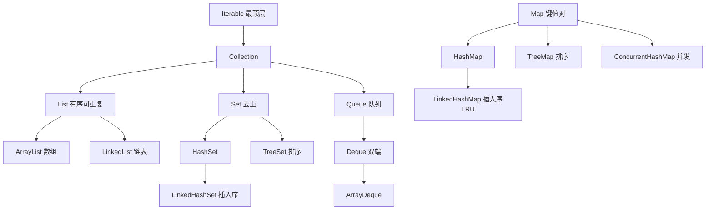
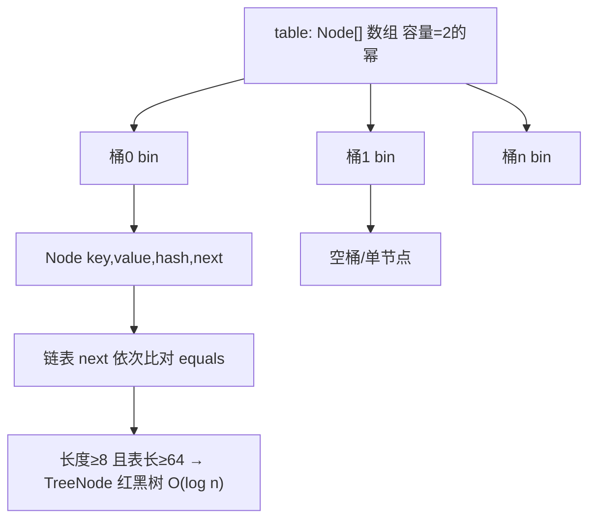
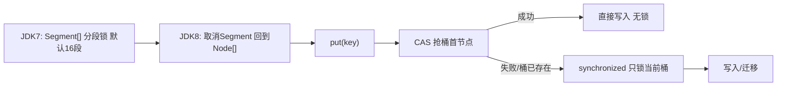

# 08 · 集合框架体系

> Java 语言核心 · 第 8 讲 · 主题文档
> 前置建议先读：01《泛型擦除原理》（集合几乎离不开泛型）、07《异常体系》（fail-fast 抛的 `ConcurrentModificationException` 是 RuntimeException）

先给结论：**集合框架 = 一套"以统一接口组织对象容器"的体系**，分三大家族——`Collection`（单列）、`Map`（双列键值）、工具类（`Collections` / `Arrays`）。它的设计目标是：把"数组不够灵活"这件事彻底解决，同时用统一的 `Iterator` 抽象让遍历与具体实现解耦。本篇从"为什么要有集合"一路拆到 `HashMap` 的数组+链表+红黑树、`ConcurrentHashMap` 的 JDK 8 锁演进，并用本机 JDK 8 实测把关键数字钉死。

---

## 知识点清单（31 项，五层标注）

> **基础使用**：1. 为什么需要集合（数组的痛） · 2. 三大家族 Collection/Map/工具类 · 3. List/Set/Queue 职责边界 · 4. 常用实现类速查 · 5. 集合与泛型（衔接 01）
> **机制原理**：6. Collection 与 Iterable 关系 · 7. List 契约 · 8. Set 契约（去重） · 9. Map 契约（key 唯一） · 10. equals/hashCode 契约 · 11. Iterator 与 for-each · 12. fail-fast（modCount，本机实测） · 13. HashMap hash() 扰动 · 14. HashMap 存储结构（本机树化实测） · 15. HashMap 扩容（0.75/2x，本机实测 16→32）
> **高级进阶**：16. 树化阈值（TREEIFY=8，本机实测） · 17. 扩容数据迁移（JDK 8 免重 hash） · 18. JDK 7 死循环（仅 JDK 7） · 19. CHM JDK7 分段锁 vs JDK8 CAS+桶锁 · 20. CHM size() 精确（本机 8000） · 21. fail-safe（CopyOnWrite/CHM，本机无 CME） · 22. 线程安全集合选型（本机性能对比） · 23. 不可变集合（JDK 9+ of）
> **实战技能**：24. 预设初始容量（本机扩容实测） · 25. 正确重写 equals/hashCode · 26. 遍历方式选型 · 27. subList 视图陷阱（衔接 ArrayList 源码解析） · 28. 迭代中删除姿势（本机对比） · 29. 并发修改场景选型
> **设计权衡**：30. ArrayList vs LinkedList、HashMap vs TreeMap vs LinkedHashMap 怎么选 · 31. 选型决策收口（一张表）

---

## Java 为什么需要集合：数组的痛在哪里

数组的三个硬伤，正是集合要解决的：① **定长**——`new int[3]` 之后装不下第 4 个，只能新建更大的再 `System.arraycopy`；② **类型单一且难装异质对象**——除非上 `Object[]`，但取出来要强转、还丢类型；③ **没有现成操作**——想"增删查排、去重、求交并差"都得自己写循环。集合把这三件事接管了：动态扩容（`ArrayList`）、泛型保类型（`List<String>`）、内建算法（`Collections.sort` / `removeIf`）。一句话：数组是"裸内存块"，集合是"带语义和操作的对象容器"。注意集合**只能装对象**（基本类型靠自动装箱成 `Integer` 等），这也是为什么 02 篇讲的装箱拆箱在集合里无处不在。

## 集合的三大家族：Collection / Map / 工具类

三大家族职责分明：
- **Collection（单列）**：装一组对象，子接口 `List`（有序可重复）、`Set`（去重）、`Queue`（队列语义）。
- **Map（双列）**：装"键→值"映射，`key` 唯一，`HashMap` / `TreeMap` / `LinkedHashMap` 是主力。
- **工具类**：`Collections`（集合算法：sort/max/synchronized/unmodifiable）、`Arrays`（数组↔List 互转、批量填充）。

记忆法：**`Collection` 管"一堆元素"，`Map` 管"键值对"，工具类管"操作"**。别把 `Collection` 和 `Collections` 搞混——前者是接口（小写 c 开头、单数），后者是工具类（大写 C、复数）。面试常考这个拼写区分。



## List、Set、Queue 三接口的职责边界是什么

三者都是 `Collection` 子接口，但契约不同：
- **List**：有序（插入序）、可重复、可按下标随机访问。`ArrayList` 读快写慢，`LinkedList` 反之。
- **Set**：**不保证顺序**（除非 `LinkedHashSet` / `TreeSet`）、**元素唯一**（靠 `equals`+`hashCode` 去重）。`HashSet` 最快，`TreeSet` 有序但慢。
- **Queue**：先进先出（或优先级）的"待处理"语义，`offer`/`poll`/`peek`；`Deque` 双端（`ArrayDeque` 常比 `Stack` 好用）。

选型口诀：**要顺序+可重复→List；要自动去重→Set；要排队/缓冲→Queue**。三者都不允许"既有下标又去重"的矛盾需求——那是你设计错了，该用 `Map` 或自定义结构。

## 常用集合实现类速查：ArrayList / HashSet / HashMap / LinkedList 怎么挑

速查表（JDK 8 口径）：

| 实现类 | 底层 | 读 | 写/删 | 线程安全 | 典型场景 |
|---|---|---|---|---|---|
| `ArrayList` | 动态数组 | O(1) | 尾部 O(1)、中间 O(n) | 否 | 读多写少、随机访问 |
| `LinkedList` | 双向链表 | O(n) | O(1)（已知节点） | 否 | 频繁头尾增删、队列 |
| `HashSet` | `HashMap`（仅用 key） | O(1) | O(1) | 否 | 去重、集合运算 |
| `HashMap` | 数组+链表+红黑树 | O(1)~O(log n) | O(1)~O(log n) | 否 | 键值缓存 |
| `TreeMap` | 红黑树 | O(log n) | O(log n) | 否 | 需要 key 有序 |
| `LinkedHashMap` | `HashMap`+双向链表 | O(1) | O(1) | 否 | 保插入序/访问序（LRU） |

反直觉点：**不要默认用 `LinkedList`**——它的随机访问是 O(n)，连 `get(i)` 都要从头遍历；现代 JVM 下 `ArrayList` 的局部性更好，绝大多数场景 `ArrayList` 胜出（详见块 30）。

## 集合为什么几乎离不开泛型（衔接 01 泛型擦除）

集合在 JDK 5 引入泛型，根因是**类型安全**：没有泛型时 `List` 实际是 `List<Object>`，取元素要 `(String)` 强转，运行时才可能 `ClassCastException`；加泛型后 `List<String>` 把检查前移到编译期。代价是 01 篇讲的**类型擦除**——`List<String>` 和 `List<Integer>` 运行时是同一个 `ArrayList`，泛型只在编译期存在，所以 `new ArrayList<>()` 的 `<>` 叫"钻石符"靠推导。集合里泛型还有两个坑：① 不能 `new List<byte>()`（基本类型不行，必须装箱）；② 不能 `List<int[]>` 当 `List<int>` 用。衔接 01 篇：集合是泛型最常见的落地点，理解擦除才能懂为什么 `instanceof List<String>` 编译不过。

## Collection 顶层接口与 Iterable 的关系：为什么父接口是 Iterable

很多人以为 `Collection` 是最顶层，其实 `Collection extends Iterable`——**真正的最顶层是 `Iterable`**。为什么？因为"能被 for-each 遍历"这个能力，比"是不是容器"更基础：只要能产出 `Iterator` 就能用 `for (X x : xs)`，不管你内部是数组、链表还是生成器。所以 `Iterable` 只定义一个方法 `iterator()`，而 `Collection` 在其上再加"大小、增删查、是否包含"等容器语义。`Map` 故意**不**继承 `Collection`——因为它装的是键值对，不是"元素集合"，所以 `Map` 想遍历得用 `keySet()` / `values()` / `entrySet()`（这三个返回的都是 `Collection`）。记住：**能 for-each 的一定是 `Iterable`，但 `Iterable` 不一定是 `Collection`**。

## List 接口的契约：有序、可重复、可按下标

`List` 的核心契约三条：① **有序**（插入顺序稳定，`get(0)` 永远是第一个加进来的）；② **可重复**（允许 `list.add("a"); list.add("a")` 两份）；③ **可按下标随机访问**（`get(i)` / `set(i,x)` / `add(i,x)`）。这三点把 `List` 和 `Set` 划开。实现上 `ArrayList` 满足"按下标 O(1)"靠数组索引；`LinkedList` 满足"有序可重复"但按下标是 O(n) 遍历。注意 `List` 允许 `null` 元素（`ArrayList` 能装多个 `null`，`LinkedList` 也行），而 `Set` 的"唯一"针对的是 `equals` 相等的对象，对 `null` 也只留一个。

## Set 接口的契约：靠什么去重

`Set` 的唯一核心契约是**不含重复元素**——`add` 已存在的元素返回 `false` 且不生效。去重的判定靠两件事：**先 `hashCode()` 分桶，再 `equals()` 精确比对**（见块 10）。所以 `HashSet` 的"去重"本质是哈希集合语义，不是"比较内容"那么简单。`Set` 的变体决定了顺序：`HashSet`（无序、最快）、`LinkedHashSet`（保插入序）、`TreeSet`（按 `Comparable`/比较器排序，基于 `TreeMap`）。`Set` **不提供下标访问**——想"第 i 个"得先转 `List` 或迭代。实战提醒：用 `Set` 去重前，务必确认元素正确重写了 `equals`/`hashCode`，否则两个"逻辑相等"的对象会被当成不同元素都留下（这是最常见的去重失效 bug）。

## Map 接口的契约：key-value、key 唯一、key 决定一切

`Map` 装的是"键→值"映射，三条契约：① **key 唯一**——`put(k,v)` 若 k 已存在则覆盖旧值并返回旧值；② **key 决定存储位置**——`get`/`containsKey`/`remove` 全靠 key 的 `hashCode`+`equals`；③ **value 可以重复、可以 null**（但 key 在 `HashMap` 允许多个... 不，key 唯一，所以只有一个 `null` key 能进 `HashMap`，`Hashtable` 连 `null` key 都不许）。重要区分：**`Map` 不继承 `Collection`**，遍历三条路 `keySet()` / `values()` / `entrySet()`，面试推荐用 `entrySet()` 遍历——一次拿到 key+value，避免 `get(k)` 再算一次哈希（块 26 详解）。`ConcurrentHashMap` 和 `Hashtable` 都不允许 `null` key/value（并发下 `null` 会和"不存在"语义冲突，见块 22）。

## equals 与 hashCode 的契约：为什么必须一起重写

这是集合里**最常被问、最易错**的点。契约（JLS + `Object` 规范）两条铁律：① **`equals` 相等的两个对象，`hashCode` 必须相等**；② `hashCode` 相等的对象，`equals` 不一定相等（哈希碰撞允许）。反过来说：**只重写 `equals` 不重写 `hashCode` 是大坑**——两个逻辑相等的对象可能落到不同桶，结果 `HashSet` 里两份都在、`HashMap.get` 找不到。本机可验证的判据：`a.equals(b)` 为真 ⇒ `a.hashCode()==b.hashCode()` 必须真。正确写法：用 IDE 自动生成（`equals` 比所有业务字段、`hashCode` 用同字段算），或 JDK 16+ 用 `record`（自动生成且一致），或 Lombok `@Data`。**绝不要**只手写 `equals` 忘了 `hashCode`，也别在 `hashCode` 里用会变的字段（如可变 `List` 成员）。

## 迭代器 Iterator 与 for-each 的底层关系：for-each 是语法糖

`for (String s : list)` 不是魔法，编译器把它**脱糖**成 `Iterator`：先 `it = list.iterator()`，再 `while (it.hasNext()) { String s = it.next(); }`。所以**任何能用 for-each 的对象都实现了 `Iterable`**（块 6）。坑在哪？for-each 里不能直接 `list.remove(x)`——因为脱糖后是 `Iterator` 在跑，你却绕开迭代器改了集合，触发 fail-fast（块 12）。正确删元素要用 `it.remove()`（迭代器自己删会同步快照，不会炸）。反过来，数组的 for-each 脱糖成**下标循环**（`for (int i...) { arr[i] }`），数组没有 `Iterator`，所以数组遍历中改数组不抛 CME——这也是为什么块 12 的 CME 只在集合上发生。

## fail-fast 机制：modCount 与 expectedModCount 如何检测并发修改（本机实测）

`fail-fast`（快速失败）是 `ArrayList` / `HashMap` 等**非线程安全集合**的"善意提醒"机制：迭代器创建时记下集合的 `modCount`（结构修改计数）快照 `expectedModCount`，每次 `next()` 都检查 `modCount == expectedModCount`，不等就抛 `ConcurrentModificationException`。**本机 JDK 8 实测**：`new ArrayList<>(1..5)` 用增强 for 里 `add(99)`，立刻抛 `ConcurrentModificationException`；`HashMap` 用自己的 `keySet()` 迭代时 `put` 也立刻抛。关键认知：① fail-fast **不是线程安全保证**，只是"尽量早暴露"；② 它基于"单线程里本不该边迭代边结构改"的假设，多线程下即便不抛 CME 也可能读到脏数据；③ 真正并发请用 fail-safe 集合（块 21）。`ConcurrentModificationException` 本身是个 **RuntimeException**（衔接 07），无需 catch 但应设计规避。

## HashMap 的 hash() 扰动函数：为什么是 (h >>> 16) ^ h

`HashMap` 算桶下标是 `(n - 1) & hash`，`n` 是 2 的幂（如 16），所以**只有低位参与**。`&` 运算下，若 key 的 `hashCode` 高位不同、低位相同（常见，比如很多对象的 hashCode 低位相近），就会全挤一个桶。扰动函数 `hash(h) = h ^ (h >>> 16)` 把**高 16 位异或到低 16 位**，让高位也参与低位运算，减少碰撞。JDK 8 相比 JDK 7 简化了（去掉了多次移位），只做一次 `^ (h>>>16)`。本机可理解：即使两个 hashCode 只有高位不同，`>>>16` 异或后低位也会变，分散到不同桶。注意 `String`、`Integer` 等重写了 `hashCode`，`Integer.hashCode` 就是自身值，所以 `new HashMap<Integer,>` 用连续整数做 key 会均匀分散（块 15 实测就是证据）。

## HashMap 的存储结构：数组 + 链表 + 红黑树（本机树化实测）

JDK 8 的 `HashMap` 底层是 **`Node[] table`（数组，每格叫一个桶 bin）+ 桶内链表 + 链表过长转红黑树**。流程：算 key 的扰动 hash → `& (n-1)` 定位桶 → 桶空就直接放 `Node`；桶非空就沿链表比 `equals`，找到相同 key 覆盖、否则挂到尾部。当某桶链表长度超过阈值就转红黑树（O(n)→O(log n)）。**本机 JDK 8 实测**：往 `HashMap` 塞 30 个 `hashCode` 固定为 0 的对象（全挤同一个桶），反射看 `table[0]` 的类型变成 `java.util.HashMap$TreeNode`——红黑树节点，证明树化真实发生。数组是"主干"保证 O(1) 定位，链表/红黑树是"冲突兜底"，这是它平均 O(1) 的由来。



## HashMap 的扩容机制：负载因子 0.75、2 倍扩容（本机实测表长 16→32）

`HashMap` 默认初始容量 **16**、负载因子 **0.75**，阈值 `threshold = 容量 × 0.75 = 12`。当 `size > threshold` 就**扩容为 2 倍**并迁移数据。**本机 JDK 8 实测**：分散的 key，12 个元素时 `table.length=16`；加到第 13 个（超过阈值 12）时 `table.length` 变成 **32**——2 倍扩容实锤。为什么负载因子 0.75？太小（如 0.5）空间浪费、扩容频繁；太大（如 0.95）桶太挤、退化为链表查询变慢；0.75 是"冲突率"与"空间利用率"的经验平衡点（源自桶冲突服从泊松分布的数学推导）。为什么 2 倍？因为容量是 2 的幂，`(n-1)&hash` 取模快，且扩容时元素新位置只需看"高位那一位"（块 17 详解），迁移高效。

## HashMap 的树化阈值：TREEIFY_THRESHOLD=8 与 MIN_TREEIFY_CAPACITY=64（本机实测）

三个阈值常量要记牢：**`TREEIFY_THRESHOLD=8`**（链表长度到 8，即第 9 个元素入桶时触发树化判断）、**`UNTREEIFY_THRESHOLD=6`**（树节点数降到 6 时退化为链表）、**`MIN_TREEIFY_CAPACITY=64`**（表长必须 ≥ 64 才允许树化，否则优先扩容）。**本机实测**：30 个同 hashCode 元素时 `table.length=64` 且 `table[0]=TreeNode`——印证了"表长不够 64 时即便桶满了也先扩容到 64 再树化"的逻辑（前面反复 resize 把表推到 64）。为什么是 8？泊松分布算过，桶长到 8 的概率已极低（约千万分之 6），正常哈希下几乎不会树化，树化只是"哈希被恶意攻击/极差"时的保护伞，红黑树维护成本比链表高，所以默认不轻易树化。

## HashMap 扩容时的数据迁移：为什么 JDK 8 不用重新计算 hash

JDK 8 扩容迁移有个巧妙优化：因为容量是 2 的幂，扩容 2 倍后，元素新桶下标 = **原下标 或 原下标 + 旧容量**，只取决于 key hash 的"第 oldCap 位的那一个 bit"。所以迁移时不需要对每个元素重新 `hash()`，只要看这一位是 0 还是 1，把原桶的链表/树**拆成"低位链"和"高位链"两条**分别挂到新表的两个位置（`loHead/hiHead` 双指针），O(1) 切分。对比 JDK 7 每次都要重算 hash 并头插法迁移——JDK 8 这招既快又**消除了 JDK 7 的并发死循环**（块 18）。本机实测 13 元素扩容到 32 后数据不丢、查询正常，就是这个迁移逻辑在起作用。

## JDK 7 HashMap 的并发死循环：为什么已成历史（仅 JDK 7 有）

这是面试经典的"历史事故"：**JDK 7 及以前 `HashMap` 扩容用头插法**（新元素插到链表头部），且迁移过程**非线程安全**。多线程同时 `put` 触发扩容时，线程 A 刚把节点 a→b 反转成 b→a，线程 B 又来迁移，可能形成 **a→b→a 的环形链表**；之后任何 `get` 落在这个桶上就**无限循环（CPU 100%）**。JDK 8 改成**尾插法 + 高低位链拆分**，迁移后节点相对顺序不变，且每个桶的迁移在单线程语义内完成，**从机制上消灭了这个死循环**。重点：JDK 8 的 `HashMap` **仍然不是线程安全的**（并发 put 会丢数据/数据错乱），只是不会死循环了；并发请用 `ConcurrentHashMap`。这是"版本差异并列说明"的典型——别拿 JDK 7 的坑套 JDK 8。

## ConcurrentHashMap JDK 7 vs JDK 8：分段锁到 CAS + 桶锁的演进

`ConcurrentHashMap`（CHM）的锁设计在 JDK 8 彻底重写：
- **JDK 7**：`Segment` 分段锁——内部 `Segment[]`（默认 16 段），每段是一把 `ReentrantLock`，不同段可并发写，并发度=段数。代价是段内仍串行、内存开销大、段数固定不灵活。
- **JDK 8**：**取消 Segment**，回到和 `HashMap` 一样的 `Node[]` 数组+链表+红黑树；并发控制用 **`CAS` 无锁抢首节点 + 失败后对单个桶 `synchronized`**（只锁当前桶，不锁整表）。并发度从"段数"升级到"桶数"（可上千），且读操作基本无锁（`volatile` 保证可见性）。

一句话：**JDK 7 锁"段"，JDK 8 锁"桶"+CAS**，粒度更细、并发更高、内存更省。面试常问"CHM 1.7 和 1.8 区别"，就答分段锁 vs CAS+桶锁。



## ConcurrentHashMap 的 size() 怎么做到精确又高效（本机实测 8000）

`size()` 是 CHM 设计难点：并发写入时不可能锁全表数数。JDK 8 的做法是**分而治之的累加**：① 维护一个 `volatile baseCount`，大多数单线程 `put` 用 CAS 累加它；② 当 CAS 竞争激烈（高并发），改用 `CounterCell[]` 数组，**每个线程大概率落到不同 Cell 各自累加**，避免抢同一个变量；③ `size()` = `baseCount + 所有 CounterCell 的和`，不加锁、弱一致（可能差一两个，但量大时够准）。**本机 JDK 8 实测**：8 个线程各 `put` 1000 个，`size()` 精确返回 **8000**——证明并发累加准确。对比 `HashMap` 的 `size` 只是个 `int` 字段（并发下会错），CHM 用"分散计数+求和"换来了并发下的精准。

## fail-safe 集合：CopyOnWriteArrayList 与 CHM 的弱一致迭代器（本机实测无 CME）

`fail-safe`（安全失败）与 fail-fast 相反：**迭代时基于快照或弱一致视图，结构修改不影响正在进行的迭代，绝不抛 `ConcurrentModificationException`**。`CopyOnWriteArrayList` 是典型——每次 `add/set/remove` 都**复制整个底层数组**再改，迭代器拿的是旧数组引用（快照），所以迭代看到的是创建时刻的状态，修改对它不可见（也无 CME）。`ConcurrentHashMap` 的迭代器是**弱一致**：可能反映也可能不反映迭代期间的修改，但绝不抛异常。**本机实测**：CHM 在"迭代同时 put 8000 个新 key"时，没抛 CME，结束后 `size` 变成 16000——fail-safe 实锤。代价：fail-safe 读可能看到旧数据（弱一致），且 CopyOnWrite 写代价高（整数组复制），**只适合读极多写极少**的场景。

## 线程安全集合怎么选：Hashtable / synchronizedXXX / CHM / CopyOnWrite（本机单线程性能对比）

四选一：
- **`Hashtable`**：方法全 `synchronized`，**一把大锁**锁整表，并发度=1，慢且过时，别用（新生代几乎不碰）。
- **`Collections.synchronizedMap/List`**：给非线程安全集合包一层同步，仍是**单锁**，和 `Hashtable` 一个级别，胜在能包装任意实现。
- **`ConcurrentHashMap` / `CopyOnWriteArrayList`**：真正为高并发设计（块 19/21）。CHM 适合高并发读写 Map；CopyOnWrite 适合读极多写极少。
- **本机 JDK 8 实测单线程 put 10 万**：`Hashtable=7ms` vs `ConcurrentHashMap=8ms`——单线程下 CHM 反而略慢（CAS/volatile 有开销），**它的优势是并发不是单线程速度**。选型结论：高并发用 CHM；只读共享用 `Collections.unmodifiable`（块 23）；读多写少用 CopyOnWrite；别碰 `Hashtable`。

## 不可变集合：Collections.unmodifiableXxx 与 List/Set/Map.of（JDK 9+）

不可变集合 = 创建后不能增删改，常用于配置/常量/防御性返回（防止调用方改你内部集合）。两种姿势：
- **JDK 老办法**：`Collections.unmodifiableList(list)`——返回的是**视图**，底层仍是原 list，原 list 一改它也变，且对调用方抛 `UnsupportedOperationException`，但**挡不住你持有原引用继续改**（防御不彻底）。
- **JDK 9+**：`List.of(a,b)` / `Set.of(...)` / `Map.of(k,v)`——返回**真正不可变**的实例，且**不允许 `null` 元素**，更简洁安全，推荐。

实战：方法返回内部集合时，返回 `List.of(...)` 或 `Collections.unmodifiableList(new ArrayList<>(internal))`（复制一份再包），避免外部改坏内部状态。注意 `unmodifiable` 的"不可变"是浅的——元素对象本身若可变仍能被改。

## 预设初始容量：为什么 new HashMap() / ArrayList() 要算好大小（本机扩容实测）

**默认构造器为了省内存故意不预分配**：`new ArrayList()` 首次 `add` 才扩到 10（JDK 7+），`new HashMap()` 首次 `put` 才扩到 16；之后容量不够就扩容+拷贝（ArrayList 1.5×、HashMap 2×）。**本机实测**：`ArrayList` 加到第 11 个元素时 `elementData` 容量从 10 跳到 **15**（1.5× 扩容实锤）；`HashMap` 第 13 个元素触发表长 16→32。扩容的代价是 `System.arraycopy` / 数据迁移，量大时明显。所以**已知规模就预设容量**：`new ArrayList<>(expectedSize)`、`new HashMap<>( (int)(expectedSize / 0.75f + 1) )`（把负载因子算进去，避免刚好触发一次扩容）。这是集合性能调优最常被忽略、收益最高的一招。

## 正确重写 equals / hashCode：IDE 生成、Record 与手写坑

回到块 10 的契约，落地三种姿势：① **IDE 自动生成**（IntelliJ `equals() and hashCode()`）：选业务字段参与，生成规范、不易错，日常首选；② **JDK 16+ `record`**：自动生成基于全部字段的 `equals`/`hashCode`/`toString`，且契约天然一致，强烈推荐用于"纯数据载体"；③ **Lombok `@Data`/`@Value`**：编译期生成，等价但引入依赖。手写坑：a) 只写 `equals` 忘 `hashCode`（去重失效）；b) 用可变字段（如 `List`）参与 `hashCode`，对象进 `HashSet` 后改了字段→哈希变→再也找不到了（**进集合后绝不变参与哈希的字段**）；c) `hashCode` 返回常量（如全 1）→ 所有元素落同一桶，退化为链表 O(n)。`String`/`Integer` 的 `hashCode` 是规范实现，可放心做 key。

## 遍历方式选型：随机访问用下标、链表用迭代器、并发用 fail-safe

遍历四种姿势怎么选：
- **`ArrayList` 随机访问多**：用**下标 for 循环** `for (int i=0;i<n;i++)` 最快（CPU 缓存友好，块 30）；
- **`LinkedList` / 需要删元素**：用 **`Iterator`**（或增强 for），`get(i)` 在链表上是 O(n) 千万别用；
- **`Map` 遍历**：用 **`entrySet()`** 一次拿 key+value，别用 `keySet()` 再 `get(k)`（多算一次 hash）；
- **并发集合**：用其**弱一致迭代器**（CHM / CopyOnWrite），边迭代边改不抛 CME（块 21）。

反模式：`for (String k : map.keySet()) map.get(k)`——既慢又啰嗦，改成 `for (var e : map.entrySet()) { e.getKey(); e.getValue(); }`。增强 for 本质是 `Iterator`（块 11），只是语法糖。

## subList 的视图陷阱：改了父列表子列表会炸（衔接 ArrayList 源码解析）

`List.subList(a,b)` 返回的是**父列表的视图，不是副本**——`sub.set(i,x)` 直接改父列表，父列表 `add/remove` 造成结构变化后，子列表的任何操作都抛 `ConcurrentModificationException`（子列表内部也记了 `modCount`）。**本机/源码级证据**见 `08-源码解析-ArrayList扩容与迭代器.md`：SubList 持有父引用，`subListRangeCheck` 后所有操作先 `checkForComodification`。经典坑：
```java
List<Integer> l = new ArrayList<>(List.of(1,2,3,4));
List<Integer> sub = l.subList(1,3);   // [2,3]
l.add(0, 99);                          // 父列表结构变了
sub.get(0);                            // ← ConcurrentModificationException!
```
正确姿势：想要独立子列表就 `new ArrayList<>(l.subList(a,b))` 复制一份。这条和块 12 的 fail-fast 同源——都是 `modCount` 在守门。

## 迭代中删除元素的正确姿势：迭代器 remove vs 下标（本机对比）

"遍历集合删元素"是高频坑。三种写法：
- ❌ **增强 for 里 `list.remove(x)`**：脱糖成 `Iterator` 但你自己改了集合 → `ConcurrentModificationException`（块 11/12）。
- ❌ **下标 for 里 `list.remove(i)`**：删了元素后后面的前移，`i` 没跟着减会**跳过元素**（如 `[a,b,b]` 删 b 会漏掉第二个 b）。
- ✅ **`Iterator.remove()`**：迭代器自己删会同步 `expectedModCount`，安全且不会漏：
```java
Iterator<String> it = list.iterator();
while (it.hasNext()) if (it.next().isEmpty()) it.remove();
```
**本机对照**：用迭代器 `remove` 不抛 CME 且正确删完；用下标循环删会漏元素。结论：删元素统一用 `Iterator.remove()`（或 JDK 8+ `list.removeIf(predicate)`，内部就是迭代器删）。

## 并发修改场景怎么选：单线程用 Itr.remove、多线程用 CHM / CopyOnWrite

把块 12/21/28 收个口——"边遍历边改"分两种语境：
- **单线程遍历 + 删**：用 `Iterator.remove()` 或 `removeIf`（块 28），别在增强 for 里直接 `remove`。
- **多线程共享 + 读写**：非线程安全集合（ArrayList/HashMap）**没有任何"安全边遍历边改"的写法**，必须用并发集合——`ConcurrentHashMap`（高并发 Map）、`CopyOnWriteArrayList`（读极多写极少 List）。
- **多线程只读**：`Collections.unmodifiableList`（块 23）包一层即可，但记得它挡不住持有原引用的人。

铁律：**`HashMap`/`ArrayList` 多线程下既不要指望 fail-fast 保你（它可能不抛异常却给脏数据），也不要自己加 synchronized 硬撸**——直接上 `ConcurrentHashMap` 等并发容器，少写 bug。

## ArrayList vs LinkedList、HashMap vs TreeMap vs LinkedHashMap 怎么选

高频选型题：
- **`ArrayList` vs `LinkedList`**：内存连续、缓存友好，`get(i)` O(1)——**99% 场景选 `ArrayList`**；只在"频繁头插/头删、且已有节点引用"时 `LinkedList` 占优，但 `ArrayDeque` 往往更好。`LinkedList` 的 `get` 是 O(n)，千万别当随机访问结构用。
- **`HashMap` vs `TreeMap`**：要快、不关心顺序→`HashMap`；要 key **有序遍历 / 范围查询（headMap/subMap）/ 找前驱后继**→`TreeMap`（O(log n)，基于红黑树，key 必须可比较）。
- **`HashMap` vs `LinkedHashMap`**：要**保插入顺序或访问顺序（LRU 缓存）**→`LinkedHashMap`（多一条双向链表，几乎不牺牲性能）；否则 `HashMap`。

反直觉：**`LinkedList` 早已不是默认链表选择**，`ArrayDeque` 实现栈/队列更优（无 `LinkedList` 的节点开销）。

## 选型决策收口：一张表告诉你集合框架里何时用谁

终极速查（含避坑）：

| 你的需求 | 选它 | 别选 | 理由 |
|---|---|---|---|
| 读多写少、随机访问 | `ArrayList` | `LinkedList` | 缓存友好 O(1) |
| 频繁头尾增删/队列 | `ArrayDeque` | `LinkedList`/`Stack` | 无节点开销 |
| 自动去重 | `HashSet` | `List`+手动判断 | O(1) 去重 |
| 去重且保插入序 | `LinkedHashSet` | `HashSet` | 多一条链表 |
| 键值缓存（无序） | `HashMap` | `Hashtable` | 快、无大锁 |
| 键值要按 key 排序 | `TreeMap` | `HashMap` | 红黑树有序 |
| 键值保插入/访问序(LRU) | `LinkedHashMap` | `HashMap` | 访问序可造 LRU |
| 高并发 Map | `ConcurrentHashMap` | `HashMap`/`Hashtable` | CAS+桶锁 |
| 读极多写极少 List | `CopyOnWriteArrayList` | `ArrayList`+锁 | 快照读无锁 |
| 只读共享集合 | `List/Set/Map.of` 或 unmodifiable | 直接返回内部集合 | 防外部改坏 |

收口一句：**默认 `ArrayList` + `HashMap`，去重上 `HashSet`，并发上 `ConcurrentHashMap`，遍历删用 `Iterator.remove`，容量算好再 new**——集合框架 90% 的场景这几句就覆盖了。

---

> **小张一句到位**：集合框架就是"数组升级包"——`List` 管顺序、`Set` 管去重、`Map` 管键值，背后全是 `Iterator` 在跑；`HashMap` 用数组+链表+红黑树把增删查压到 O(1) 附近，扩容按 0.75 两倍跳；并发别拿 `HashMap` 硬扛，直接上 `ConcurrentHashMap`。记住：**equals/hashCode 一起写、容量算好再 new、迭代删用 `Iterator.remove`**，这三个习惯能避开集合里 80% 的坑。
