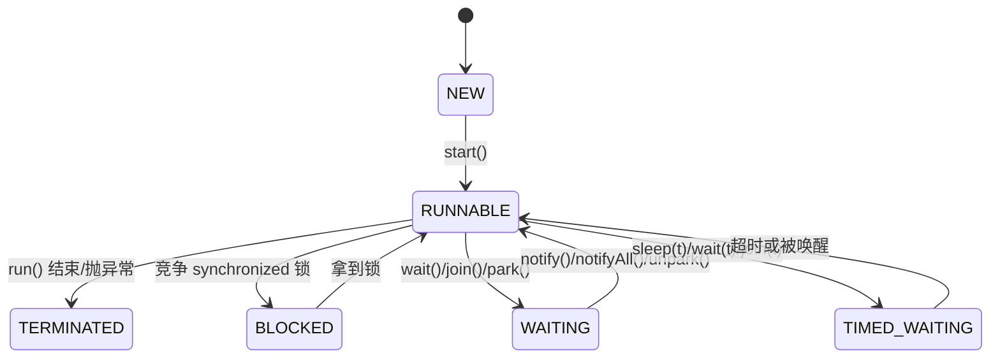
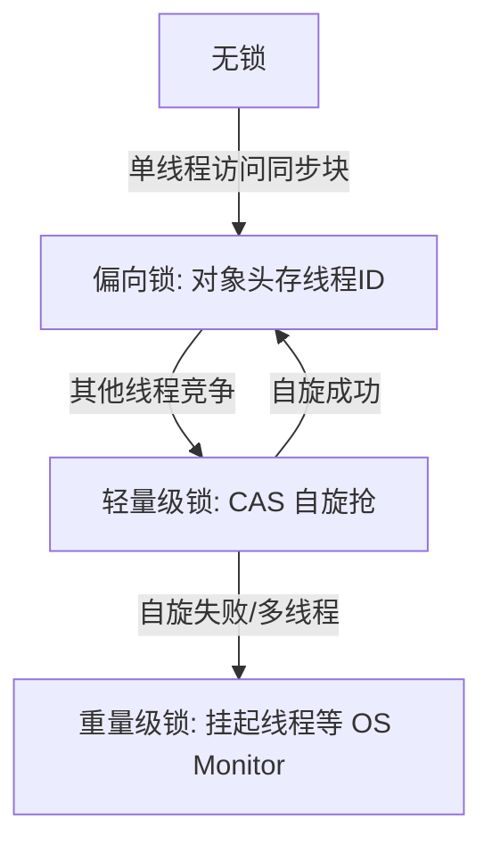
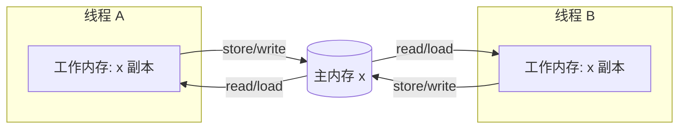
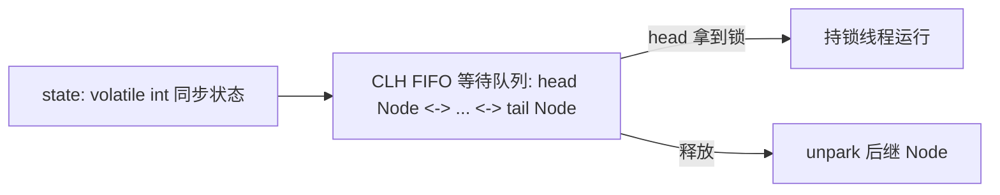
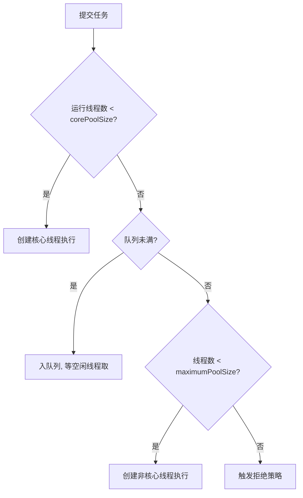

# 09 并发编程

> **前置篇目**：建议先读《02 基础语法与数据类型》（线程相关语法、自动装箱对并发计数的坑）、《07 异常体系》（线程池拒绝/中断抛的异常）、《08 集合框架体系》（ConcurrentHashMap 已在集合篇讲透，本篇只做并发语义衔接与选型）。
>
> **篇性切入**：本篇用「**正确性 → 可见性/原子性/有序性 → 工具 → 线程池/AQS 机器层**」的递进讲法，区别于已交付篇的"容器语义 / 异常机器层"视角。并发的坑大多不在"不会写"，而在"以为线程安全其实不是"。

## 知识点清单（五层标注 · 出题锚点）

- **基础使用**：创建线程 4 种方式〔2〕、start/run 区别〔3〕、sleep/yield/join〔5〕、synchronized 三种用法〔9〕、CountDownLatch/CyclicBarrier〔25〕、Semaphore/Phaser〔26〕、Executors 四工厂〔29〕、Future/CompletableFuture〔30〕
- **机制原理**：线程 6 状态〔4〕、中断机制〔6〕、安全三要素〔7〕、竞态 i++〔8〕、锁升级〔10〕、对象头 Mark Word/Monitor〔11〕、volatile 底层屏障〔13〕、JMM〔14〕、happens-before〔15〕、CAS〔17〕、AQS 框架〔23〕、AQS 应用〔24〕、线程池七参数〔27〕、线程池流程/拒绝〔28〕、ThreadLocal 原理〔31〕、死锁四条件〔32〕
- **高级进阶**：volatile 不保原子〔12〕、双检锁 volatile〔16〕、ABA/AtomicStampedReference〔18〕、LongAdder 分段〔19〕、ReentrantLock 高级特性〔20〕、Condition〔21〕、读写锁/StampedLock〔22〕
- **实战技能**：中断的正确处理〔6〕、双检锁单例〔16〕、线程池参数配置与拒绝策略选型〔27/28〕、ThreadLocal 内存泄漏与线程池串号〔31〕、死锁避免〔32〕、并发容器选型〔33〕
- **设计权衡**：并发没有银弹〔1〕、锁升级的代价〔10〕、公平 vs 非公平〔20〕、Executors 的隐患 vs 手写 ThreadPoolExecutor〔29〕、先正确再性能〔34〕

---

## 为什么需要并发：多核红利与它的代价

单核时代靠提升主频榨性能，但主频撞上功耗墙后，CPU 走向多核（现在笔记本 8 核、服务器 64 核是常态）。**并发的本质是让多个核同时干活**，把"串行 10 秒"压成"8 核并行约 1.3 秒"。但红利不是免费的：

- **正确性代价**：多线程共享可变状态时，会冒出单线程绝不会有的 bug——竞态、可见性失效、指令重排。这些 bug 不可复现、上线才炸。
- **复杂度代价**：你需要锁、原子类、线程池、并发容器，心智负担陡增。
- **性能代价**：锁有开销（用户态↔内核态切换）、上下文切换吃 CPU、伪共享拖慢缓存。

一句话：**并发是"用复杂度换吞吐"的买卖**。小张一句到位——能单线程跑完就别开线程，真要并发，先把"正确性"焊死，再谈性能。

---

## 创建线程的 4 种方式：Runnable、Thread、Callable+Future、线程池

1. **继承 `Thread`**：重写 `run()`，`new MyThread().start()`。缺点：Java 单继承，类被锁死不能再继承别的；且"任务"和"线程"耦合。
2. **实现 `Runnable`**：`new Thread(runnable).start()`。任务与线程解耦，可复用、可提交给线程池。最常用。
3. **实现 `Callable<V>`**：`call()` 有返回值、能抛受检异常，配合 `FutureTask` 或线程池 `submit()` 拿结果。
4. **线程池 `ExecutorService`**：`executor.submit(runnable/callable)`。生产环境**唯一推荐**方式——线程是重资源（默认 1MB 栈），复用线程避免频繁创建销毁。

```java
// 方式2：Runnable
new Thread(() -> System.out.println("hello")).start();

// 方式3：Callable + FutureTask
FutureTask<Integer> ft = new FutureTask<>(() -> 1 + 2);
new Thread(ft).start();
System.out.println(ft.get()); // 3

// 方式4：线程池（生产必用）
ExecutorService pool = Executors.newFixedThreadPool(4);
Future<Integer> f = pool.submit(() -> 1 + 2);
```

**选型**：临时演示用 1/2；要返回值/异常用 3；任何正式代码用 4，不要 `new Thread().start()` 裸跑（见〔29〕Executors 的坑）。

---

## `start()` 和 `run()` 到底差在哪

这是面试高频题，答错率极高。**`start()` 才真正启动新线程**，`run()` 只是普通方法调用。

- `start()`：向 JVM 注册线程、分配栈、由 OS 调度，新线程起来后**自动调用** `run()`。一个 `Thread` 只能 `start()` 一次，第二次抛 `IllegalThreadStateException`。
- `run()`：如果你直接 `thread.run()`，没有新线程，就在**当前线程**同步执行 `run()` 体，和调普通方法没区别。

```java
Thread t = new Thread(() -> System.out.println(Thread.currentThread().getName()));
t.run();   // main        <- 在当前线程执行
t.start(); // Thread-0    <- 新线程执行（注意 start 后不能重复调）
```

**为什么不能重复 start**：线程结束进入 TERMINATED 后生命周期不可逆，`start()` 内部检查 `threadStatus` 非 0 就抛异常。源码层见〔11〕对象头/线程状态机。

---

## 线程的 6 种状态与流转：从 NEW 到 TERMINATED

JVM 规范（JLS 2.19 / `java.lang.Thread.State`）定义 **6 种状态**，不是操作系统那套"就绪/运行"二分：

| 状态 | 含义 | 进入时机 |
|---|---|---|
| `NEW` | 已创建未启动 | `new Thread()` |
| `RUNNABLE` | 可运行（含正在跑 + 等 CPU） | `start()` 后 |
| `BLOCKED` | 等 `synchronized` 监视器锁 | 竞争内置锁被阻塞 |
| `WAITING` | 无限等待 | `wait()` / `join()` / `LockSupport.park()` |
| `TIMED_WAITING` | 限时等待 | `sleep(t)` / `wait(t)` / `join(t)` / `parkNanos` |
| `TERMINATED` | 执行完毕 | `run()` 正常结束或抛异常 |



**关键纠偏**：`RUNNABLE` 包含"正在 CPU 上跑"和"就绪等 CPU"两种，Java 不区分；`BLOCKED` 只对应 `synchronized`，而 `ReentrantLock` 的等待是 `WAITING/TIMED_WAITING`（因为底层是 `park`），别混。查死锁用 `jstack` 看 `BLOCKED` + 持锁链。

---

## `sleep()`、`yield()`、`join()` 三兄弟的区别

三者都和"让出/等待"有关，但语义完全不同：

- **`sleep(long)`**：当前线程**休眠**指定毫秒，不释放锁（包括 `synchronized` 和 `ReentrantLock`），进入 `TIMED_WAITING`。`InterruptedException` 可被打断。
- **`yield()`**：暗示调度器"我愿让出 CPU"，但**不保证**让出，也不释放锁，线程仍在 `RUNNABLE`。基本是摆设，生产很少用。
- **`join()`**：`t1.join()` 表示**当前线程**等到 `t1` 死为止，进入 `WAITING`（`join()` 内部是 `while(isAlive()) wait()`）。用于"等子线程跑完再继续"。

```java
Thread t = new Thread(() -> { /* ... */ });
t.start();
t.join();        // 主线程阻塞，直到 t 结束
System.out.println("t 跑完了");
```

**踩坑**：`sleep()` 在 `synchronized` 块里不会释放锁，如果误以为"睡一觉别的线程能进来"就错了——别的线程照样被挡在锁外。

---

## 中断机制：`interrupt()`、`isInterrupted()` 与 `Thread.interrupted()` 的坑

Java 没有"强制杀线程"的 API（太危险，会破坏锁和资源），只有**协作式中断**：设一个标志位，由线程自己决定何时退出。

- `thread.interrupt()`：给目标线程打中断标志（`true`），若目标正处于 `wait/sleep/join` 等阻塞，**会抛 `InterruptedException` 并清除标志**。
- `thread.isInterrupted()`：读标志，**不清除**。
- `Thread.interrupted()`：**静态方法**，读**当前线程**标志并**清除**（调一次变 `false`）。

```java
Thread t = new Thread(() -> {
    while (!Thread.currentThread().isInterrupted()) {
        // 干活
    }
    System.out.println("被中断，干净退出");
});
t.start();
t.interrupt(); // 设标志，循环下次检查到就退
```

**两大经典坑**：
1. **吞掉 `InterruptedException`**：`catch (InterruptedException e) {}` 不处理，标志已被清除，上层永远感知不到中断，线程"假死"。正确做法：要么在 catch 里 `Thread.currentThread().interrupt()` 恢复标志，要么往上抛。
2. **误用 `interrupted()`**：它是静态且清除标志，曾在非当前线程上调会清错线程的标志，导致中断信号丢失。读别人线程标志用 `isInterrupted()`。

---

## 线程安全三要素：原子性、可见性、有序性

"线程安全"这四个字，拆开就是三条性质，缺一条就可能出事：

- **原子性**：操作不可被中途打断，要么全做要么全不做（如 `i++` 不是原子的，含读-改-写三步）。
- **可见性**：一个线程改了共享变量，其他线程能**立刻看到**（CPU 有缓存，不保证自动刷回主存）。
- **有序性**：程序代码顺序与实际执行顺序一致（编译器和 CPU 会**指令重排**优化，单线程下无感知，多线程下会翻车）。

| 性质 | 出问题现象 | 解法 |
|---|---|---|
| 原子性 | 计数少、更新丢 | `synchronized`、原子类、锁 |
| 可见性 | 改了别的线程看不到 | `volatile`、`synchronized`、锁（解锁前刷主存） |
| 有序性 | 半初始化对象、重排踩坑 | `volatile`（禁止重排）、`synchronized`（串行临界区） |

`volatile` 保可见性+有序性但不保原子性；`synchronized` 三者都保（但重）。理解这三是看懂后面所有工具的前提。

---

## 竞态条件：`i++` 为什么不是原子的（实测）

`i++` 看起来一行，实际是**读-改-写三步**：`int temp = i; i = temp + 1;`。多线程同时跑就丢更新。我用 Corretto 8.452 跑了探针：

```
[race] 2线程各+=200000 期望=400000 实际=261668 丢失更新=138332
[race] AtomicInteger 对照 实际=400000 (期望=400000)
```

**丢了约 34% 的更新**！原因：线程 A 读 `i=100` 后还没写，线程 B 也读 `i=100`，俩都写 101，一次自增被吞了。`AtomicInteger` 用 CAS 保原子，结果精确 400000。

```java
// 危险
int count = 0;
new Thread(() -> { for (int k=0;k<200000;k++) count++; }).start();
// 安全
AtomicInteger safe = new AtomicInteger();
new Thread(() -> { for (int k=0;k<200000;k++) safe.incrementAndGet(); }).start();
```

**举一反三**：任何"读-改-写"或"检查-执行"（如 `if(map.get(k)==null) map.put(k,v)`）都不是原子的，必须用原子类或锁保护。小张一句到位——看到共享可变计数，先想"它原子吗"。

---

## `synchronized` 的三种用法：锁实例、锁类、锁代码块

`synchronized` 是 JVM 内置锁（管程/Monitor），保证同一时刻只有一个线程进临界区，且**自动释放**（包括抛异常）。三种写法锁的对象不同：

```java
// 1. 实例方法：锁当前实例 this
public synchronized void method() { /* 临界区 */ }

// 2. 静态方法：锁 Class 对象（全局唯一，相当于类级锁）
public static synchronized void staticMethod() { /* 临界区 */ }

// 3. 代码块：锁指定对象，粒度最细、最推荐
public void block() {
    synchronized (this) { /* 只包必要代码 */ }
    synchronized (Lock.class) { /* 锁类 */ }
}
```

**关键认知**：
- 锁 `this` 和锁 `Lock.class` 是**两把不同的锁**，互不互斥——别以为静态和非静态方法会互相挡。
- **锁对象要用 private final 引用**：千万别锁 `String` 常量池对象或 `Integer` 缓存对象（`Integer.valueOf(1)` 是同一个缓存实例），会让锁范围意外扩大到全应用，引发莫名阻塞。
- 代码块粒度越细越好，把 `synchronized` 只包真正共享变量的读写。

---

## `synchronized` 的锁升级：偏向锁→轻量级锁→重量级锁

JDK 6 起 `synchronized` 不再是"一上来就沉重锁"，而是**自适应升级**，目的是在无竞争时几乎零开销：



- **偏向锁**：假设"一直就一个线程用"，对象头 Mark Word 记线程 ID，后续进入免 CAS。JDK 6 引入，**但 JDK 15 起默认废弃并禁用**（`-XX:-UseBiasedLocking`，JDK 16 彻底移除），因为维护偏向锁的成本在现代多核上常大于收益。所以面试别再默认"偏向锁是常态"。
- **轻量级锁**：有竞争但冲突少，线程用 CAS 自旋抢锁，避免立刻进内核，适合锁持有极短。
- **重量级锁**：竞争激烈，自旋失败，线程被挂起交给 OS Monitor（互斥量）调度，涉及**用户态↔内核态切换**，开销最大（微秒级）。

**设计权衡**：升级不可逆（只能升不能降），是"乐观→悲观"的渐进策略。高竞争下重量级锁的上下文切换才是性能杀手。

---

## `synchronized` 的底层：对象头 Mark Word 与 Monitor

HotSpot 对象在堆里分三块：**对象头（Mark Word + 类型指针）、实例数据、对齐填充**。锁状态就编码在 **Mark Word**（64 位下 8 字节）里：

- 无锁/偏向锁：存哈希、分代年龄、偏向线程 ID
- 轻量级锁：存指向线程栈里"锁记录"的指针
- 重量级锁：存指向 OS **Monitor（管程）**对象的指针

重量级锁的 Monitor 是 C++ 的 `ObjectMonitor`，内含**_owner（持锁线程）、_EntryList（阻塞队列）、_WaitSet（wait 队列）**。一个线程进 `synchronized`：
1. 抢 `_owner`，抢到即持锁；
2. 抢不到进 `_EntryList` 阻塞（对应 `BLOCKED` 状态）；
3. 调 `wait()` 进 `_WaitSet`，被 `notify()` 唤醒后回到 `_EntryList` 重新抢。

**源码层深挖**见 `09-源码解析-AQS与ReentrantLock.md`（对比 AQS 的 CLH 队列）。理解 Mark Word 才知道"为什么锁是对象级别的、为什么锁 String 常量危险"。

---

## `volatile` 解决可见性与有序性，但不保证原子性

`volatile` 是轻量同步原语，干两件事：

1. **可见性**：写 `volatile` 变量会立刻刷回主内存，读会跳过 CPU 缓存直接从主存取，保证"一个线程改，别的线程马上看到"。
2. **有序性（禁止重排）**：在 `volatile` 写前后插入内存屏障，禁止编译器和 CPU 把写之前的代码重排到写之后（建立 happens-before）。

**但它不保证原子性**——`volatile int i; i++;` 两个线程跑照样丢更新（读-改-写三步之间仍可被切入）。所以 `volatile` 适合"**一个写线程、多个读线程**"的状态标志场景（如 `volatile boolean running`），不适合计数。

```java
// 正确用法：状态开关
private volatile boolean running = true;
// 写线程
void shutdown() { running = false; }
// 读线程（多个）
void work() { while (running) { /* 干活 */ } }
```

**反例**：`volatile int count; count++;` 仍非线程安全，计数必须用 `AtomicInteger` 或锁。小张一句到位——`volatile` 管"看没看到"，不管"加没加对"。

---

## `volatile` 的底层：内存屏障与 happens-before

`volatile` 的魔法靠**内存屏障（Memory Barrier）**实现，JVM 在字节码/机器码层面插入：

- **写后**：`StoreStore` 屏障，保证 `volatile` 写之前的普通写先刷盘，再写 `volatile` 变量。
- **读前**：`LoadLoad` 屏障，保证 `volatile` 读之后的普通读不会重排到读之前。
- 在 x86 上，由于强内存模型，`volatile` 写只需一个 `lock` 前缀指令（如 `lock addl`），既刷缓存行又相当于全屏障，开销比想象中小。

`volatile` 还参与 **happens-before**：**对 `volatile` 变量的写，happens-before 后续对该变量的读**。这个规则是"可见性"的正式表述，也是双检锁单例正确性的根基（见〔16〕）。

**举一反三**：`volatile` 的可见性只对**它自己**这个变量生效；它**不能**让"一组普通变量的写"整体对其他线程可见。要保证一组操作的整体可见性/原子性，用锁或 `AtomicReference` 包成对象。

---

## JMM 内存模型：主内存与工作内存

Java 内存模型（JMM，JSR-133）抽象出**主内存（所有线程共享）**和**工作内存（每个线程私有，存变量副本）**：



线程不能直接改主内存，要先 `read/load` 到工作内存改完，再 `store/write` 回主内存。问题就在这"副本"——**线程 A 改了没写回，或写了但线程 B 还在用旧副本，就出现可见性 bug**。

JMM 不规定具体怎么实现，只规定**什么时候必须可见**（即下面的 happens-before）。JMM 的核心价值：在"程序员想要的顺序"和"编译器/CPU 想要的优化"之间画线。

---

## happens-before 八大规则：并发安全的契约

happens-before 是 JMM 的"可见性契约"：**如果 A happens-before B，则 A 的操作结果对 B 可见，且 A 看起来先于 B 发生**。八大规则：

1. **程序次序**：单线程内，前面的操作 hb 后面的。
2. **管程锁**：`unlock` hb 后续对同一锁的 `lock`（所以 `synchronized` 保可见性）。
3. **volatile**：写 hb 后续读。
4. **线程启动**：`thread.start()` hb 该线程的任何动作。
5. **线程终止**：线程所有动作 hb 其他线程检测到它结束（`join()` 返回）。
6. **中断**：`interrupt()` hb 被中断线程感知到中断。
7. **传递性**：A hb B 且 B hb C，则 A hb C。
8. **final 字段**：对象构造里对 `final` 字段的写，hb 于该对象被其他线程可见（防止构造期间重排泄露引用）。

**实战意义**：只要你的并发代码能套进这八条之一，就不需要额外同步；套不进就可能出 bug。小张一句到位——写并发先问"这个结果 hb 别人了吗"，答不出就该加锁/volatile。

---

## 双检锁单例为什么必须用 `volatile`

经典双检锁（DCL）单例，少了 `volatile` 是**错的**：

```java
class Singleton {
    private static volatile Singleton instance; // 关键 volatile
    private Singleton() {}
    public static Singleton get() {
        if (instance == null) {              // 第一次检查
            synchronized (Singleton.class) {
                if (instance == null) {      // 第二次检查
                    instance = new Singleton(); // 非原子！
                }
            }
        }
        return instance;
    }
}
```

`new Singleton()` 实际三步：**①分配内存 ②初始化对象 ③把引用赋给 `instance`**。编译器和 CPU 可能重排成 ①→③→②。若线程 A 走到 ③ 但 ② 还没执行，此时 `instance` 非 null 但对象是"半成品"；线程 B 在第一次检查看到 `instance != null`，直接返回一个**未初始化的对象**——空指针/数据错乱。

`volatile` 禁止 ② ③ 重排，保证"引用可见时对象一定初始化完"。这是 happens-before 规则 3 的直接应用。`09-源码解析-线程池ThreadPoolExecutor.md` 里也用到类似的初始化可见性考量。

---

## CAS 是什么：比较并交换的原子指令

CAS（Compare-And-Swap）是 CPU 原子指令（`cmpxchg`），语义：**"若内存值 == 期望值，则更新为新值，返回成功；否则什么都不做，返回失败"**，整个过程不被打断。Java 通过 `Unsafe.compareAndSwapInt` 暴露，原子类底层全靠它。

```java
// 伪码：自旋 CAS 自增
public void increment(AtomicInteger v) {
    int old;
    do {
        old = v.get();                 // 读当前值
    } while (!v.compareAndSet(old, old + 1)); // 期望 old，改成 old+1
}
```

**优点**：无锁，避免线程挂起/切换，低竞争下极快。
**缺点**：高竞争下大量线程空转重试（CAS 自旋消耗 CPU），即"ABA"问题（见〔18〕）。CAS 是乐观锁思想：先试，失败再试，而不是上来就排队。

---

## CAS 的 ABA 问题与 `AtomicStampedReference`

CAS 只比"值"，不比"值的变化过程"。**ABA**：变量从 A 改成 B 又改回 A，CAS 看到还是 A 就以为"没变过"，其实中间被人动过——在涉及"指针/引用/状态机"的场景会出逻辑 bug（如链表节点被删又加回，CAS 误判无变化导致结构错乱）。

解法：**加版本号/戳**，每次改值版本+1，比较时连版本一起比。

```java
// 带版本戳的引用
AtomicStampedReference<Node> ref = new AtomicStampedReference<>(head, 0);
int[] stamp = new int[1];
Node cur = ref.get(stamp);          // 同时拿到值+版本
// CAS：值和版本都匹配才成功
ref.compareAndSet(cur, newHead, stamp[0], stamp[0] + 1);
```

`AtomicStampedReference` 用 `Pair(reference, stamp)` 解决 ABA；还有 `AtomicMarkableReference`（只标记"是否已改动过"，不记次数）。小张一句到位——CAS 比的是"快照"，要防"改回原样"就用版本戳。

---

## 原子类家族：`AtomicInteger` 与 `LongAdder` 分段累加

JUC 原子类分四类：**基本型**（`AtomicInteger/Long/Boolean`）、**引用型**（`AtomicReference`）、**数组型**（`AtomicIntegerArray`）、**字段更新器**（`AtomicIntegerFieldUpdater`，反射改 volatile 字段，省对象开销）、**累加器**（`LongAdder/LongDoubleAdder`）。

**`LongAdder` 是解决高并发计数的杀手锏**。它不用一个全局 `AtomicLong` 让大家抢，而是搞**多个 Cell 分段计数**（类似 ConcurrentHashMap 的分段思想），线程各自累加自己段，`sum()` 时把所有段+base 加起来。代价是 `sum()` 不是精确瞬时值（并发累加中），但吞吐爆炸高。

我实测（8 线程各 +300 万，共 2400 万）：

```
[adder] AtomicLong=218ms 结果=24000000
[adder] LongAdder = 25ms  结果=24000000
```

**LongAdder 快约 8.7×**！因为它用 `@Contended` 注解避免 Cell 间的**伪共享**（False Sharing，多个 Cell 在同一缓存行被不同核反复 invalidate）。**选型**：低并发/要精确读用 `AtomicLong`；高并发纯计数（如 QPS 统计、调用次数）用 `LongAdder`。

---

## `ReentrantLock`：可重入、公平/非公平、可中断、可超时

`ReentrantLock` 是 `Lock` 接口的实现，比 `synchronized` 更灵活：

- **可重入**：同一线程可重复加锁，内部记 `holdCount`，解锁次数要配平。
- **公平/非公平**：构造 `new ReentrantLock(true)` 是公平锁（按排队顺序，防饥饿但吞吐低）；默认**非公平**（允许插队，吞吐高，可能饿死）。
- **可中断**：`lockInterruptibly()` 等锁时能被 `interrupt()` 唤醒抛异常，避免死等。
- **可超时**：`tryLock(1, SECONDS)` 拿不到就放弃，是**避免死锁的利器**。
- **`unlock()` 必须放 `finally`**：否则异常时锁不释放，整个临界区永久锁死。

```java
Lock lock = new ReentrantLock();
lock.lock();
try {
    // 临界区
} finally {
    lock.unlock(); // 必须 finally 释放
}
```

**对比 synchronized**：`synchronized` 自动释放、不能用 tryLock 超时、不能中断等待、只能块级；`ReentrantLock` 反之。底层全靠 AQS（见〔23〕）。

---

## `Condition`：比 `wait/notify` 更灵活的条件等待

`synchronized` + `wait/notify` 只能有一个等待队列，且 `notify()` 随机唤醒一个，容易"唤醒错误线程"。`ReentrantLock` 的 `Condition` 解决这问题：**一个锁可以 new 多个 Condition，精准唤醒某一类等待者**。

```java
ReentrantLock lock = new ReentrantLock();
Condition notEmpty = lock.newCondition();
Condition notFull  = lock.newCondition();

// 消费者
lock.lock();
try {
    while (queue.isEmpty()) notEmpty.await();  // 等"非空"
    queue.poll();
    notFull.signal();                            // 精准唤醒生产者
} finally { lock.unlock(); }
```

经典应用是**有界阻塞队列**：生产者等 `notFull`、消费者等 `notEmpty`，互不误唤醒。底层 `Condition` 也是 AQS 的等待队列（`await` 把线程加入 Condition 队列，`signal` 转回同步队列）。这是 `ArrayBlockingQueue` 的实现原理（见〔33〕）。

---

## 读写锁 `ReadWriteLock` 与 `StampedLock` 乐观读

**`ReentrantReadWriteLock`**：读读共享、读写/写写互斥。适合"读多写少"（如配置中心、缓存），读并发度远高于互斥锁。

```java
ReadWriteLock rw = new ReentrantReadWriteLock();
rw.readLock().lock();    // 多个读可同时持
rw.writeLock().lock();   // 写独占
```

**`StampedLock`（JDK 8）**更猛：提供**乐观读**——`tryOptimisticRead()` 不真加锁，只读版本戳，读完用 `validate(stamp)` 校验期间有无写发生；没写就免锁读完，有写就退化为悲观读锁。

```java
long stamp = lock.tryOptimisticRead();
int x = data.x; int y = data.y;
if (!lock.validate(stamp)) {            // 期间被写过
    stamp = lock.readLock();            // 退化读锁重读
    try { x = data.x; y = data.y; } finally { lock.unlockRead(stamp); }
}
```

**代价**：`StampedLock` 不可重入、用错易死锁，且它是"为性能极致"设计的，普通场景 `ReentrantReadWriteLock` 更稳。

---

## AQS 框架：`state` + CLH 等待队列 + 独占/共享

`AbstractQueuedSynchronizer`（AQS）是 JUC 的**底座**，JDK 里 `ReentrantLock`、`Semaphore`、`CountDownLatch`、`ReentrantReadWriteLock`、`ThreadPoolExecutor` 的 `Worker` 全基于它。核心三件套：

- **`state`**：一个 `volatile int` 同步状态，语义由子类定（如 ReentrantLock 用它记重入次数，Semaphore 用它记剩余许可数）。
- **CLH 队列**：一个 FIFO 的**双向等待队列**（Node 连 head↔tail），抢不到锁的线程包成 Node 入队、`park` 挂起。
- **独占/共享模式**：`tryAcquire/tryRelease`（独占，如锁）与 `tryAcquireShared/tryReleaseShared`（共享，如信号量、闭锁）。



流程：`acquire()` 先 `tryAcquire` 抢 `state`，成功就走；失败 `addWaiter` 入队、`acquireQueued` 自旋+CAS 前驱+`park` 挂起；`release()` 改 `state` 并 `unpark` 后继。**源码级深挖见 `09-源码解析-AQS与ReentrantLock.md`**。

---

## AQS 的应用：ReentrantLock、Semaphore、CountDownLatch 怎么复用它

AQS 是"模板方法"：它管队列和阻塞，子类只填空 `try*` 几个钩子，就得到不同同步器——这就是"一次写底座，处处复用"：

- **ReentrantLock**：`state` = 重入次数。独占模式，`tryAcquire` 用 CAS 把 state 0→1（非公平可插队），重入则 state++；`tryRelease` state-- 到 0 才真释放。
- **Semaphore**：`state` = 剩余许可数。`tryAcquireShared` 用 CAS 减许可，不够就进队列；`release` 加回许可并唤醒。
- **CountDownLatch**：`state` = 计数器。`countDown()` 把 state 减 1，`state==0` 时唤醒所有等 `await()` 的线程（共享模式，全部放行）。
- **CyclicBarrier**：不基于 AQS，用的是 `ReentrantLock` + `Condition` 自己实现（见〔25〕）。

**价值**：你也能基于 AQS 写自己的同步器（如"最多 N 个线程进临界区"），不用从零造轮子。小张一句到位——JUC 看着一堆类，底下就一根 AQS 脊梁。

---

## `CountDownLatch` 与 `CyclicBarrier` 的区别

两者都让线程"互相等"，但语义相反：

- **`CountDownLatch`**：**一个/多个线程等另外 N 个线程干完**。`countDown()` 倒数，到 0 时所有 `await()` 放行。**一次性**，倒数到 0 不能重置。
- **`CyclicBarrier`**：**N 个线程互相等，都到齐才一起继续**（如并行计算分片，各自算完在 barrier 汇合）。**可循环**（reset 或自动重开），到齐时可触发一个 `barrierAction`。

```java
// 等 3 个子任务完成
CountDownLatch latch = new CountDownLatch(3);
for (int i=0;i<3;i++) new Thread(() -> { doTask(); latch.countDown(); }).start();
latch.await(); // 主线程等 3 个全完

// 3 个线程到齐才继续
CyclicBarrier barrier = new CyclicBarrier(3, () -> System.out.println("都到齐了"));
for (int i=0;i<3;i++) new Thread(() -> { phase1(); barrier.await(); phase2(); }).start();
```

**选型**："主等从"用 Latch；"从等从汇合"用 Barrier。实测：Latch 在"并行任务 + 汇总"场景极好用（见 `09-源码解析-线程池ThreadPoolExecutor.md` 的并行聚合）。

---

## `Semaphore` 限流与 `Phaser` 阶段性 barrier

- **`Semaphore`（信号量）**：控制**同时访问的线程数**，典型用途是**限流**（如数据库连接池、API 并发上限）。`acquire()` 拿许可（没有就等），`release()` 还。

```java
Semaphore sem = new Semaphore(10); // 最多 10 个并发
sem.acquire();
try { callExternalApi(); } finally { sem.release(); }
```

- **`Phaser`（JDK 7）**：`CyclicBarrier` 的升级版，支持**动态注册/注销参与方**和**多阶段（phase）**同步，适合"分阶段的 fork/join"任务（如第一阶段 N 人，第二阶段有人退出）。比 CyclicBarrier 灵活但复杂。
- **`Exchanger`**：两个线程在同步点**交换数据**（如生产者把缓冲交给消费者），用的少。

**举一反三**：限流除了 Semaphore，还有 Guava `RateLimiter`（令牌桶，按速率）、Sentinel（熔断限流）。Semaphore 是"并发数"限流，RateLimiter 是"速率"限流，别混。

---

## 线程池 `ThreadPoolExecutor` 的七大参数

生产环境**必须手写 `ThreadPoolExecutor`**，理解七个参数才能配得对：

1. **`corePoolSize`**：核心线程数，常驻不回收（除非 `allowCoreThreadTimeOut`）。
2. **`maximumPoolSize`**：最大线程数（含核心）。
3. **`keepAliveTime` + `unit`**：非核心线程空闲存活时间，超时就回收。
4. **`workQueue`**：任务队列，`ArrayBlockingQueue`（有界）、`LinkedBlockingQueue`（默认无界）、`SynchronousQueue`（不存，直接交线程）。
5. **`threadFactory`**：线程工厂，建议自定义命名（排查 `jstack` 时一目了然）+ 守护线程设置。
6. **`handler`**：拒绝策略（见〔28〕）。

```java
new ThreadPoolExecutor(
    4, 8, 60L, TimeUnit.SECONDS,
    new ArrayBlockingQueue<>(100),
    new NamedThreadFactory("biz-pool"),
    new ThreadPoolExecutor.CallerRunsPolicy());
```

**配置经验**：CPU 密集 → 核心≈核数；IO 密集（如调接口、查库）→ 核心可开到核数×2~10。队列**必须用有界队列**，否则可能 OOM（见〔29〕）。

---

## 线程池提交流程与四种拒绝策略

提交一个任务 `execute(runnable)` 的完整决策链：



注意顺序：**先扩核心 → 再入队 → 再扩最大 → 最后拒绝**。实测（核心 2/最大 4/队列 2，提交 10）：接受 6（2 核心 + 2 队列满后扩到 4 线程接了 2 个）、**拒绝 4**。

四种拒绝策略：
- **`AbortPolicy`（默认）**：抛 `RejectedExecutionException`，最安全（ fail-fast 让你知道配置错了）。
- **`CallerRunsPolicy`**：调用者线程自己跑，减缓提交速度，不丢任务但拖慢提交方。
- **`DiscardPolicy`**：静默丢弃，最危险（任务凭空没了）。
- **`DiscardOldestPolicy`**：丢掉队列里最老的，塞新任务。

**选型**：重要业务用 `CallerRunsPolicy` 或自定义"落盘+告警"；千万别用静默丢弃。

---

## `Executors` 四个工厂方法的坑

`Executors` 下的便捷工厂**生产环境禁止使用**（阿里 Java 规约明令），原因都是"隐藏参数导致失控"：

| 工厂 | 隐患 |
|---|---|
| `newFixedThreadPool(n)` | 核心=最大=n，**队列 `LinkedBlockingQueue` 无界（≈21 亿）**，任务积压 → **OOM** |
| `newSingleThreadExecutor()` | 同上，单线程 + 无界队列 → OOM |
| `newCachedThreadPool()` | 核心 0、最大 `Integer.MAX_VALUE`，**来一个任务建一个线程** → 线程爆炸耗尽资源 |
| `newScheduledThreadPool(n)` | 最大 `Integer.MAX_VALUE`，定时任务多时线程爆炸 |

```java
// 反例（危险）
ExecutorService p = Executors.newFixedThreadPool(10); // 队列无界，OOM 隐患
// 正例（手写，可控）
new ThreadPoolExecutor(10, 10, 0L, MILLISECONDS,
    new ArrayBlockingQueue<>(1000),  // 有界！
    new ThreadPoolExecutor.CallerRunsPolicy());
```

**踩坑实录**：曾有人用 `newFixedThreadPool` 跑批量任务，上游洪峰把队列撑到几百万，老年代爆满 Full GC 卡死。**永远手写 `ThreadPoolExecutor` + 有界队列 + 合理拒绝策略**。

---

## `Future`、`Callable` 与 `CompletableFuture` 异步编排

- **`Callable`/`Future`**：`submit(callable)` 返回 `Future`，`get()` 拿结果，但 `get()` **阻塞**到完成，且**一堆 future 只能逐个 `get`**，没法"谁先完先处理"。
- **`CompletionService`**：`take()` 按"完成顺序"返回 future，解决"先完成先消费"。
- **`CompletableFuture`（JDK 8，强烈推荐）**：声明式异步编排，支持链式 `thenApply/thenAccept`、组合 `thenCombine`、异常 `exceptionally`、并行 `allOf/anyOf`，把回调地狱变流水线。

```java
CompletableFuture.supplyAsync(() -> queryA())     // 异步
    .thenApplyAsync(a -> a + queryB())            // 串联
    .thenAccept(System.out::println)
    .exceptionally(ex -> { log.error("炸了", ex); return null; });

// 等所有并行任务
CompletableFuture.allOf(f1, f2, f3).join();
```

**踩坑**：`CompletableFuture` 默认用 `ForkJoinPool.commonPool()`，IO 密集型任务会被共用池拖慢，**务必传自定义线程池**：`supplyAsync(() -> ..., bizPool)`。我实测线程池相关流程见 `09-源码解析-线程池ThreadPoolExecutor.md`。

---

## `ThreadLocal` 原理与内存泄漏（线程池串号踩坑）

`ThreadLocal` 给**每个线程存独立副本**，经典用途是"同一请求链路透传上下文"（如 userId、traceId），避免层层传参。原理：每个 `Thread` 有个 `ThreadLocalMap`，key 是 `ThreadLocal` 实例（**弱引用**），value 是你要存的副本（**强引用**）。

**内存泄漏根源**：线程结束，`ThreadLocal` 对象被 GC（key 弱引用没了），但 **value 是强引用、且线程没结束就一直挂着**；在**线程池**场景线程常驻不销毁，value 永远不释放 → 泄漏。更严重的是**串号**：线程池复用线程，A 请求设了 `userId=1` 没 `remove()`，B 请求拿到同一线程，读到 `userId=1`——**越权/数据错乱事故**。

```java
private static final ThreadLocal<String> CTX = new ThreadLocal<>();
try {
    CTX.set(traceId);
    // ... 业务
} finally {
    CTX.remove(); // 必须！否则线程池串号 + 泄漏
}
```

**源码级深挖见 `09-源码解析-ThreadLocal内存泄漏.md`**。小张一句到位——`ThreadLocal` 用完不 `remove()`，等于埋雷。

---

## 死锁：四个必要条件、检测与避免

**死锁** = 多个线程互相持有对方要的锁，永久卡住。四个必要条件（全满足才死锁）：
1. **互斥**：资源不可共享。
2. **占有且等待**：持着锁还等别的锁。
3. **不可抢占**：锁不能被强制夺走。
4. **循环等待**：A 等 B、B 等 A 的环形链。

**避免手段**：
- **破坏循环等待**：**所有线程按固定全局顺序加锁**（如统一先锁 id 小的对象）。这是最实用的一招。
- **`tryLock(timeout)`**：拿不到超时放弃，回退重试，避免永久等（见〔20〕）。
- **减少锁粒度/锁合并**：尽量一把锁干完，或用 `StampedLock` 乐观读减少持锁时间。
- **检测**：`jstack <pid>` 看 `Found one Java-level deadlock`，会列出持锁线程和等待链。

```java
// 按对象 id 升序加锁，杜绝环形等待
Object first = a.id < b.id ? a : b;
Object second = a.id < b.id ? b : a;
synchronized (first) { synchronized (second) { /* ... */ } }
```

---

## 并发容器选型：CHM、CopyOnWriteArrayList、BlockingQueue 家族

别再 `HashMap`/`ArrayList` 裸奔多线程，按场景选 JUC 容器（集合篇已深挖 CHM，这里做并发语义衔接与选型）：

- **`ConcurrentHashMap`**：高并发读写 Map，分段/CAS + 桶头锁（JDK 8 起），读几乎无锁。**注意 `compute/putIfAbsent` 里别做耗时操作**（锁着桶）。衔接集合篇。
- **`CopyOnWriteArrayList/Set`**：**写时复制整份数组**，读无锁极快、写极慢（每次复制）。只适合**读极多写极少**（如监听器列表、配置白名单）。迭代器弱一致、不抛 CME。
- **`BlockingQueue` 家族**：
  - `ArrayBlockingQueue`：有界、数组、可选公平，**生产消费首选**（见〔21〕Condition 实现）。
  - `LinkedBlockingQueue`：链表、默认无界，**别在 Executors 外裸用无界版**（OOM）。
  - `SynchronousQueue`：不存元素，直接手递手，配 `CachedThreadPool` 用。
  - `PriorityBlockingQueue`：优先级堆，无界。
  - `DelayQueue`：按延迟时间出队，做定时重试/缓存过期。
- **`ConcurrentLinkedQueue`**：无锁 CAS 队列，高并发少阻塞。

**选型口诀**：Map 高并发 → CHM；读多写少列表 → COW；生产者消费者 → 有界 `ArrayBlockingQueue`；定时 → `DelayQueue`。

---

## 一句话收尾：并发没有银弹，先是正确性再谈性能

并发的全部知识点，最后收成三条：**① 先保证正确**（原子/可见/有序三要素，能用 `volatile`/原子类就用，不行上锁）；**② 工具选型看场景**（低竞争 CAS、高竞争 LongAdder、互等靠 AQS 系、线程池必须手写有界）；**③ 性能是结果不是手段**——锁升级、分段、非阻塞都是"减少争用"，别为了炫技提前优化。最贵的 bug 永远是"线上偶发、本地不复现"的并发问题，靠的是把 happens-before 想清楚、把 `ThreadLocal.remove()` 写进 `finally`、把线程池队列设成有界。小张一句到位——并发写对了是工程，写错了是玄学，宁可慢点也要先对。
