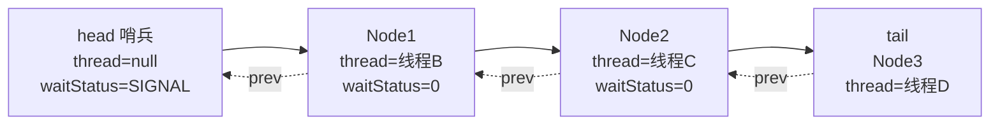
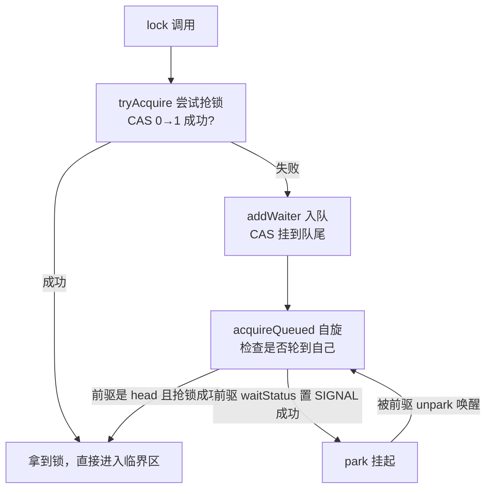

# 09 源码解析 · AQS 与 ReentrantLock（机器层深挖）

> **前置知识**：建议先读 [09-并发编程.md](09-并发编程.md) 的 `5.1 ReentrantLock：可重入 / 公平 / 中断 / 超时`、`5.2 Condition：比 wait/notify 更灵活`、`5.4 AQS 框架：state + CLH 等待队列`、`5.5 AQS 的应用：Semaphore / CountDownLatch 怎么复用它`（结论层），本篇扒 **OpenJDK 8（Corretto 8.452）源码**：AQS 的 state 和 CLH 队列到底是什么、`lock()` 一路走到 `park()` 经历了什么、为什么 ReentrantLock 竞争失败的线程状态是 WAITING 而 synchronized 是 BLOCKED、公平锁凭什么公平、Condition 的 await/signal 怎么在 AQS 队列之间搬家。
>
> 实测环境（本篇所有探针数字）：**Corretto 8.452 / Windows 11 / i7-12700 / 16G**；探针源码在 `_probe/AQSProbe.java`。

## 目录（纯文本，锚点待软件实测后启用）

1. 一、AQS 总览（1.1–1.2）
2. 二、核心字段：state 与 CLH 队列（2.1–2.3）
3. 三、加锁流程 acquire（3.1–3.3）
4. 四、释放流程 release（4.1）
5. 五、ReentrantLock 细节（5.1–5.3）
6. 六、Condition：第二个等待队列（6.1）
7. 七、AQS 的其它应用：Semaphore / CountDownLatch（7.1）
8. 收尾：核心方法对照表 + 关键设计思想 + 面试 Q&A

---

## 一、AQS 总览

### 1.1 AQS 是什么：一个"可复用的锁骨架"

> **说明**：`AbstractQueuedSynchronizer`（AQS，JDK 1.5 引入，作者 Doug Lea）是 JUC 锁的**公共底座**：ReentrantLock、Semaphore、CountDownLatch、ReentrantReadWriteLock 全部建立在它之上。它只做两件事——**管一个 `volatile int state`（锁状态）** + **管一条 CLH 等待队列（排队线程）**，其余"什么是锁、怎么算拿到锁"全部留给子类。

```java
// AbstractQueuedSynchronizer（JDK 8，核心字段节选）：
public abstract class AbstractQueuedSynchronizer
        extends AbstractOwnableSynchronizer {
    private volatile int state;              // ★ 锁状态：子类自己定义含义
    private transient volatile Node head;    // ★ CLH 队列头（哨兵，不存线程）
    private transient volatile Node tail;    // ★ CLH 队列尾
    // 模板方法（final，子类不可改）：
    public final void acquire(int arg) { ... }     // 加锁骨架
    public final boolean release(int arg) { ... }  // 释放骨架
    // 钩子方法（protected，子类必须/可选实现）：
    protected boolean tryAcquire(int arg) { throw new UnsupportedOperationException(); }
    protected boolean tryRelease(int arg) { throw new UnsupportedOperationException(); }
    protected int tryAcquireShared(int arg) { ... }
    protected boolean tryReleaseShared(int arg) { ... }
    protected boolean isHeldExclusively() { ... }
}
```

> **结论**：**AQS = 模板方法模式**——骨架（排队、park、唤醒）已经写好且 final，子类只需回答"我什么时候算拿到锁"（tryAcquire/tryRelease）。**这也是"框架设计"的教科书案例：不变的流程上提，变化的规则下沉**。

### 1.2 设计哲学：把"等待"从"自旋"里解放出来

> **说明**：`09-源码解析-CAS与原子类.md` 里讲过：CAS 自旋适合临界区极短的场景，高竞争下空转烧 CPU。AQS 的答案：**抢锁用 CAS（快路径），抢不到就 park 挂起（慢路径）**——把"忙等"换成"睡等"，线程不再消耗 CPU，由前一个持锁者释放时 unpark 唤醒。

| 机制 | 竞争失败行为 | CPU 占用 | 适用 |
|---|---|---|---|
| CAS 自旋（原子类内部） | 空转重试 | 高（烧核） | 临界区极短、竞争低 |
| **AQS（park 挂起）** | 排队 + 挂起，被唤醒再抢 | 近 0 | 通用锁，竞争可高可低 |
| synchronized 重量级 | 进 Monitor 阻塞（BLOCKED） | 近 0 | 同步块 |

> **关键**：AQS 的完整路径 = **CAS 尝试（用户态，ns 级）→ 失败入队（CAS 维护队列）→ park 挂起（内核态，μs 级）→ 释放者 unpark（内核态）→ 重新 CAS 抢**。前两步在用户态快速失败，只有真正竞争才付出内核代价——**这就是"乐观在前、悲观兜底"的工程范本**。

---

## 二、核心字段：state 与 CLH 队列

### 2.1 state：一个 volatile int 撑起所有锁语义

> **说明**：`state` 的含义**完全由子类定义**——这是 AQS 能复用的关键。三种经典语义：

| 子类 | state 含义 | 0 表示 |
|---|---|---|
| **ReentrantLock** | 持有次数（可重入计数） | 无锁 |
| **Semaphore** | 剩余许可数 | 无许可 |
| **CountDownLatch** | 剩余倒计数 | 计数归零，门打开 |

操作 state 的三个方法（JDK 8）：

```java
// AQS（JDK 8，state 三件套）：
protected final int getState() { return state; }                      // volatile 读（x86 免费）
protected final void setState(int newState) { state = newState; }     // volatile 写
protected final boolean compareAndSetState(int expect, int update) {
    return unsafe.compareAndSwapInt(this, stateOffset, expect, update); // CAS（见 CAS 篇）
}
```

> **结论**：**state = volatile + CAS**（可见性 + 原子更新），与原子类同一套组合拳（见 `09-源码解析-CAS与原子类.md` 3.1）。本机实测 state 随 lock/unlock 精确流转（`AQSProbe.java`，反射读取）：

```
// 实测输出（Corretto 8.452）：
[state] initial state=0                ← 无锁
[state] after lock() state=1           ← 拿到锁
[state] after 2nd lock() (reentrant) state=2   ← 重入一次，计数+1
[state] after 1 unlock state=1         ← 释放一次，计数-1
[state] after 2nd unlock state=0       ← 全部释放，真正无锁
```

### 2.2 CLH 队列：双向链表的"排队叫号"

> **说明**：CLH（Craig-Landin-Hagersten）队列是 AQS 的"排队叫号系统"——**每个竞争失败的线程变成一个 Node 挂在链表尾**。JDK 8 的 Node 是双向链表节点：

```java
// AbstractQueuedSynchronizer.Node（JDK 8，字段节选）：
static final class Node {
    volatile int waitStatus;      // 节点状态：0 / CANCELLED / SIGNAL / CONDITION / PROPAGATE
    volatile Node prev;           // 前驱
    volatile Node next;           // 后继
    volatile Thread thread;       // 排队的线程（head 哨兵为 null）
    Node nextWaiter;              // Condition 队列指针 / 独占-共享标记
    // 常量：
    static final int CANCELLED = 1;      // 取消排队（超时/中断放弃）
    static final int SIGNAL   = -1;      // 后继需要我释放时唤醒
    static final int CONDITION = -2;     // 在 Condition 等待队列里
    static final int PROPAGATE = -3;     // 共享锁传播（CountDownLatch 等）
    static final Node SHARED = new Node(); // 共享模式标记
    static final Node EXCLUSIVE = null;    // 独占模式标记
}
```

> **注意（head 是哨兵）**：**head 不存线程**（thread=null），只是一个"已拿锁者"的占位；真正的排队线程从 head.next 开始。新线程入队永远挂在 tail 后面（`prev` 指向旧 tail），用 CAS 保证并发入队不丢节点。

CLH 队列结构一张图：



> **结论**：**排队的本质 = 在双向链表尾 CAS 插入节点 + 挂起自己**。队列本身不保证公平（入队顺序才公平），"公平锁"的公平性来自入队前的检查（见 5.2）。

### 2.3 waitStatus 状态机：SIGNAL 的"接力棒"语义

> **说明**：每个 Node 的 `waitStatus` 表达"我接下来的义务"，其中 **SIGNAL（-1）是核心**——**一个节点处于 SIGNAL，表示"我释放时会唤醒我的后继"**。它的设立让唤醒变成"接力棒"：每个持锁者只负责唤醒排在自己后面的那一个。

```java
// waitStatus 流转（语义）：
// 0（初始）→ 被前驱设为 SIGNAL(-1)：前驱承诺"我释放时唤醒你"
//          → CANCELLED(1)：本线程放弃（超时/中断），把自己从队列摘除
//          → CONDITION(-2)：本线程在 Condition 等待队列（见第六章）
//          → PROPAGATE(-3)：共享模式下向后传播唤醒（CountDownLatch 用）
```

> **结论**：**SIGNAL 不是"排队信号"，而是"前驱的承诺"**——`shouldParkAfterFailedAcquire` 的核心工作就是**把前驱的 waitStatus 从 0 改成 SIGNAL**，改成功才敢 park（否则可能"睡着了没人叫"）。理解这一点，AQS 的唤醒机制就通了。

---

## 三、加锁流程 acquire

### 3.1 acquire 四步：教科书级的加锁骨架

> **说明**：`ReentrantLock.lock()` 的完整调用链（javap 实证）：`lock() → sync.lock() → acquire(1)`。AQS 的 `acquire` 是四步流水线（JDK 8）：

```java
// AbstractQueuedSynchronizer.acquire（JDK 8）：
public final void acquire(int arg) {
    if (!tryAcquire(arg) &&                       // ① 先试抢（子类定义规则）
        acquireQueued(addWaiter(Node.EXCLUSIVE), arg)) {  // ② 失败→入队 ③ 排队+park
        selfInterrupt();                          // ④ 中断标记补偿（见 3.3）
    }
}
```



> **结论**：**acquire = 一次 CAS 快路径 + 一条队尾排队慢路径**。tryAcquire 成功则全程用户态；失败则最多付出一次 park/unpark 的内核代价。

### 3.2 addWaiter：并发入队怎么不丢节点

> **说明**：多个线程同时竞争失败，都要入队——**并发下"挂到队尾"必须原子**。JDK 8 用 `enq` 的 CAS 自旋保证：

```java
// AbstractQueuedSynchronizer（JDK 8，节选）：
private Node addWaiter(Node mode) {
    Node node = new Node(Thread.currentThread(), mode);
    Node pred = tail;
    if (pred != null) {                          // 快路径：直接 CAS 挂尾
        node.prev = pred;
        if (compareAndSetTail(pred, node)) {     // CAS：只有没人抢先时成功
            pred.next = node;
            return node;
        }
    }
    enq(node);                                   // 慢路径：自旋直到挂上
    return node;
}

private Node enq(final Node node) {
    for (;;) {
        Node t = tail;
        if (t == null) {                         // 队列还是空的 → 先建 head 哨兵
            if (compareAndSetHead(new Node())) continue;
        } else {
            node.prev = t;
            if (compareAndSetTail(t, node)) {    // CAS 抢"队尾"位置，失败重来
                t.next = node;
                return node;
            }
        }
    }
}
```

> **注意**：`node.prev = pred;` 写在 CAS **之前**（先断好前驱再抢位置），CAS 失败重试时 prev 会被重新赋值——**这是无锁队列的标准写法："先接上前驱，再 CAS 抢占队尾"**。head 哨兵的懒创建（第一次入队时）也是经典细节。

### 3.3 acquireQueued：自旋、park 与中断补偿

> **说明**：入队后进入 `acquireQueued`——**自旋等待"轮到我了"**。核心循环（JDK 8）：

```java
// AbstractQueuedSynchronizer.acquireQueued（JDK 8，节选）：
final boolean acquireQueued(final Node node, int arg) {
    boolean failed = true;
    try {
        boolean interrupted = false;
        for (;;) {
            final Node p = node.predecessor();          // 看前驱
            if (p == head && tryAcquire(arg)) {         // ★ 前驱是 head → 轮到我了，再抢一次
                setHead(node);                          // 抢到 → 自己变 head（哨兵化）
                p.next = null;                          // 旧 head 出队
                return interrupted;
            }
            if (shouldParkAfterFailedAcquire(p, node) &&// 前驱置 SIGNAL（2.3 的承诺）
                parkAndCheckInterrupt()) {              // park 挂起；醒来检查中断
                interrupted = true;                     // 记下中断，但不在这里抛
            }
        }
    } finally {
        if (failed) cancelAcquire(node);                // 异常/取消 → 摘除自己
    }
}
```

> **关键（两个反直觉点）**：
> ① **"轮到我了"的判断是"前驱是 head"**——head 是"已拿锁者"的哨兵，只有排在最前面的节点才有资格再抢，这就是**队列的 FIFO 公平性来源**（与锁是否 fair 无关，排队内是严格 FIFO 的）。
> ② **中断不立即抛**：`parkAndCheckInterrupt` 返回 true 只记录 `interrupted=true`，等真正拿到锁后才在 acquire 里 `selfInterrupt()` 补偿中断。**原因：AQS 拿锁是"先到先得"，不能因为中断破坏队列秩序**——这就是"可中断获取（lockInterruptibly）"要走独立路径的原因。

---

## 四、释放流程 release

### 4.1 release：只唤醒一个人，唤醒最前面那个

> **说明**：释放比获取简单得多——tryRelease 把 state 减到 0 后，**只 unpark 队头后面的第一个节点**（`head.next`），让排最久的人先醒。JDK 8：

```java
// AbstractQueuedSynchronizer.release（JDK 8）：
public final boolean release(int arg) {
    if (tryRelease(arg)) {                     // 子类实现：state 减到 0 = 真正释放
        Node h = head;
        if (h != null && h.waitStatus != 0)    // head 有 SIGNAL 承诺 → 有人要叫
            unparkSuccessor(h);
        return true;
    }
    return false;                              // 还没释放完（可重入没归零）
}

// ReentrantLock.Sync.tryRelease（JDK 8）：
protected final boolean tryRelease(int releases) {
    int c = getState() - releases;
    if (Thread.currentThread() != getExclusiveOwnerThread())
        throw new IllegalMonitorStateException();   // 非持锁者释放 → 违法
    boolean free = false;
    if (c == 0) {                              // 归零 = 真正释放
        free = true;
        setExclusiveOwnerThread(null);         // 清空持锁线程
    }
    setState(c);
    return free;
}
```

> **注意（unpark 的顺序）**：`unparkSuccessor` 从 head 开始**往后找第一个非 CANCELLED 的节点**唤醒——因为队头可能有人超时取消（CANCELLED）了，要跳过。**唤醒只给一个人**（不像 notifyAll），被唤醒者醒后还要在 acquireQueued 里**重新 CAS 抢锁**（不保证一定抢到——可能被非公平的新来者插队，见 5.2）。

> **结论**：release 的完整路径 = **state 归零（用户态）→ unpark head.next（内核态一次）**。可重入锁"释放一次 state=2→1"时 tryRelease 返回 false，**不唤醒任何人**——只有最后一次归零才唤醒——这就是"重入 N 次要释放 N 次"的源码依据。

---

## 五、ReentrantLock 细节

### 5.1 可重入：state 计数实测 0→1→2→1→0

> **说明**：ReentrantLock 的可重入 = **state 计数**：同线程再 lock，state+1（不排队）；unlock，state-1，归零才算真释放。上一章实测已经展示，这里看源码怎么"认自己人"（JDK 8 非公平 tryAcquire）：

```java
// ReentrantLock.Sync.nonfairTryAcquire（JDK 8）：
final boolean nonfairTryAcquire(int acquires) {
    final Thread current = Thread.currentThread();
    int c = getState();
    if (c == 0) {                                   // 无锁 → 直接抢
        if (compareAndSetState(0, acquires)) {
            setExclusiveOwnerThread(current);       // 记录持锁线程
            return true;
        }
    } else if (current == getExclusiveOwnerThread()) {  // ★ 已经是自己 → 重入
        int nextc = c + acquires;
        if (nextc < 0) throw new Error("Maximum lock count exceeded");
        setState(nextc);                            // 计数 +1（非 CAS：自己是持锁者，无人竞争）
        return true;
    }
    return false;
}
```

> **结论**：**重入路径不走 CAS**（持锁者独占，无竞争，直接 setState 即可）——所以可重入几乎零开销。`setExclusiveOwnerThread` 记录持锁线程是"认自己人"的关键：**state>0 且 owner==current 才是重入，否则就是竞争失败**。

### 5.2 公平 vs 非公平：一次 CAS 的差别

> **说明**：公平锁与非公平锁的差别**只在 tryAcquire 之前**（JDK 8）：

```java
// ReentrantLock 非公平锁 lock()（JDK 8）——先 CAS 抢一把再说：
final void lock() {
    if (compareAndSetState(0, 1))          // ★ 插队：不看队列，直接抢
        setExclusiveOwnerThread(Thread.currentThread());
    else
        acquire(1);                        // 抢不到才排队
}

// 公平锁 lock()（JDK 8）——直接 acquire，tryAcquire 里检查排队：
public final void acquire(int arg) { ... }
protected final boolean tryAcquire(int acquires) {
    ...
    if (c == 0) {
        if (!hasQueuedPredecessors() &&    // ★ 公平性关键：队列里有人排队 → 我不抢
            compareAndSetState(0, acquires)) { ... }
    }
    ...
}

// hasQueuedPredecessors（JDK 8）：队里是否有人排在我前面
public final boolean hasQueuedPredecessors() {
    Node t = tail, h = head;
    Node s;
    return h != t &&                       // 队列非空（至少两人）
        ((s = h.next) == null ||           // 且队首节点还没就绪（race 窗口）
         s.thread != Thread.currentThread()); // 或队首不是自己
}
```

> **注意（非公平锁为什么"不公平"却更快）**：非公平锁允许新线程**插队**——如果锁恰好刚释放（CAS 0→1 成功），新线程**免去 park/unpark 一次内核往返**，而队里睡着的线程醒了还要再抢一次。**插队成功的都是"正好赶上释放瞬间"的线程**，代价是队里的老线程可能被多饿一会儿。实测公平锁获取顺序严格 FIFO（`AQSProbe`）：

```
// 实测输出（Corretto 8.452）：
[fair] acquisition order (fair lock) = ABC    ← 公平锁：A、B、C 严格按入队顺序拿锁
```

> **结论**：**公平锁 = 入队前检查 hasQueuedPredecessors（多一次队列读取）+ 杜绝插队**；非公平锁 = 先 CAS 抢一把（一次机会），抢不到再排队。**性能上非公平通常更好（吞吐优先），公平锁保证"先到先得"（延迟优先）**——默认用非公平，除非业务必须按申请顺序。

### 5.3 线程状态实证：WAITING vs BLOCKED

> **说明**：这是面试必考对比——**synchronized 竞争失败 = BLOCKED（Monitor 阻塞队列），ReentrantLock 竞争失败 = WAITING（AQS park 挂起）**。本机实测（`AQSProbe.contentionState`）：

```java
// AQSProbe.java —— 主线程持锁，让 loser 线程抢锁失败（节选）：
ReentrantLock lock = new ReentrantLock();
lock.lock();                                  // 主线程拿锁
Thread t = new Thread(lock::lock, "loser");
t.start();
Thread.sleep(300);                            // 等 loser 失败入队 + park
System.out.println("loser state=" + t.getState());
```

```
// 实测输出（Corretto 8.452）：
[state] loser (ReentrantLock) thread state=WAITING   ← AQS park → WAITING
// 对照：synchronized 场景（见 09-源码解析-synchronized与对象头.md 5.2 的 StateProbe）：
//       A=WAITING（wait()） B=TIMED_WAITING（sleep） C=BLOCKED（抢 synchronized 锁失败）
```

> **关键**：**同样是"等锁"，BLOCKED 与 WAITING 是两种实现**——synchronized 的失败线程进 Monitor 的 `_EntryList`（BLOCKED）；ReentrantLock 的失败线程被 `LockSupport.park()`（底层 `Unsafe.park`，WAITING）。**jstack 排查时：看到一堆 WAITING 在 `park` 上 = AQS 锁竞争；看到 BLOCKED 在 `monitor` 上 = synchronized 竞争**——这是区分两类锁的一眼技巧。

---

## 六、Condition：第二个等待队列

### 6.1 await/signal：在"锁队列"和"条件队列"之间搬家

> **说明**：`Condition` 是 AQS 的"第二个队列系统"：**等待队列（CLH）管"抢锁"，条件队列（Condition 内部单向链表）管"等条件"**。`await()` 把持锁线程从锁队列搬到条件队列并释放锁；`signal()` 把条件队列队头搬回锁队列。一个锁可以有多个 Condition（多条件），这是 synchronized 的 wait/notify 做不到的。

```java
// ConditionObject（AQS 内部类，JDK 8 语义）：
public class ConditionObject implements Condition {
    private transient Node firstWaiter;   // 条件队列头（单向，Node.nextWaiter 链接）
    private transient Node lastWaiter;

    // await：把当前线程封装成 CONDITION 节点挂到条件队列，释放锁，park
    public final void await() throws InterruptedException {
        Node node = addConditionWaiter();     // ① 入条件队列（waitStatus=CONDITION）
        int savedState = fullyRelease(node);  // ② 释放持有的锁（state 归零）
        while (!isOnSyncQueue(node))          // ③ 不在锁队列 → park（等 signal）
            LockSupport.park(this);
        // ④ 被 signal 搬到锁队列、重新抢到锁后，从这里继续
    }

    // signal：把条件队列队头搬到锁队列（waitStatus CONDITION→0，enq 到 CLH 尾）
    public final void signal() {
        if (!isHeldExclusively()) throw new IllegalMonitorStateException();
        Node first = firstWaiter;
        if (first != null) doSignal(first);   // 搬第一个，唤醒它去抢锁
    }
}
```

> **注意（关键语义）**：① **await 必须释放锁**（`fullyRelease` 把 state 归零）——否则别人进不了临界区调不了 signal，直接死锁；② **signal 不直接给锁**，只是"搬到锁队列排队"，真正拿到锁还要等前驱释放；③ **signal 前必须持锁**（`isHeldExclusively` 校验），否则抛异常——和 wait/notify 必须在 synchronized 块里是同一规则。**多条件价值**：`ArrayBlockingQueue` 用 `notEmpty`/`notFull` 两个 Condition——生产者只唤醒消费者、消费者只唤醒生产者，避免"唤醒错人"的空转。

---

## 七、AQS 的其它应用：Semaphore / CountDownLatch

### 7.1 共享模式：一份模板，两种倒计时

> **说明**：Semaphore 和 CountDownLatch 用的是 AQS 的**共享模式**（`acquireShared/releaseShared`）——和独占模式（ReentrantLock）的区别是：**独占一次放行一人，共享一次放行多人**。

```java
// Semaphore（JDK 8，信号量：state = 剩余许可）：
protected final int tryAcquireShared(int acquires) {
    for (;;) {
        int available = getState();
        int remaining = available - acquires;
        if (remaining < 0 || compareAndSetState(available, remaining))
            return remaining;               // ≥0 成功（拿到许可）；<0 失败（继续排队）
    }
}
protected final boolean tryReleaseShared(int releases) {
    for (;;) {
        int current = getState();
        int next = current + releases;
        if (compareAndSetState(current, next)) return true;  // 还许可
    }
}

// CountDownLatch（JDK 8，倒计数：state = 剩余计数）：
protected int tryAcquireShared(int acquires) {
    return (getState() == 0) ? 1 : -1;      // 计数归零 = 门开，全部放行（-1 则继续等）
}
protected boolean tryReleaseShared(int releases) {
    for (;;) {
        int c = getState();
        if (c == 0) return false;           // 已归零
        int nextc = c - 1;
        if (compareAndSetState(c, nextc)) return nextc == 0;  // 归零瞬间才唤醒
    }
}
```

> **注意（PROPAGATE 的用途）**：共享模式释放后要**传播唤醒**（`setHeadAndPropagate`）——CountDownLatch 计数归零时，**所有等待线程一起被放行**（而不是像独占模式只唤醒一个），这就是 `Node.PROPAGATE`（-3）状态存在的意义。**Semaphore 的"许可"、CountDownLatch 的"计数"，本质都是 state 上的 CAS 增减——一套模板，两种语义**。

> **收尾一句话**：AQS 的机器层 = "一个 volatile int（state）+ 一条双向链表（CLH）+ 一个模板方法骨架"；它把"抢锁、排队、挂起、唤醒"的脏活全干了，留给子类的只有 tryXxx 四个钩子——看懂 acquire/release 两条路径，JUC 半壁江山就通了。

---

## 收尾：核心方法对照表 + 关键设计思想 + 面试 Q&A

### 核心方法对照表

| 方法 | 作用 | 关键实现 |
|---|---|---|
| `acquire(int)` | 独占加锁骨架 | tryAcquire → addWaiter → acquireQueued |
| `addWaiter/enq` | 入队 | CAS 挂队尾，head 哨兵懒创建 |
| `acquireQueued` | 排队自旋 | 前驱==head 才抢；park 前先置 SIGNAL |
| `shouldParkAfterFailedAcquire` | 前驱置 SIGNAL | 0→-1，改成功才 park |
| `release` | 独占释放 | tryRelease 归零 → unpark head.next |
| `tryAcquire/tryRelease` | 子类钩子 | ReentrantLock 计数 / Semaphore 许可 |
| `compareAndSetState` | state 原子更新 | Unsafe CAS |
| `hasQueuedPredecessors` | 公平性检查 | 队里有人排前面 → 不插队 |

### 关键设计思想（编号列表）

1. **模板方法模式**：骨架 final、钩子下沉——框架把 80% 的复杂度（排队/park/唤醒）一次性写好，业务只回答"什么叫拿到锁"。
2. **乐观在前、悲观兜底**：先 CAS 快路径，失败才 park——多数竞争在用户态一两百 ns 内解决。
3. **SIGNAL 接力棒**：每个节点只承诺唤醒后继一个，唤醒成本 O(1) 且精确。
4. **公平是策略不是结构**：队列天然 FIFO，公平锁只是入队前多查一眼 hasQueuedPredecessors。
5. **可重入用计数不用排队**：state 既是"锁状态"又是"重入深度"，归零才算真释放。

### 面试题 Q&A

**Q1：AQS 加锁的完整流程？公平锁和非公平锁的差别？**
> 完整流程：tryAcquire 尝试（CAS state 0→1）→ 失败 addWaiter 入 CLH 队列尾（CAS 保证并发安全）→ acquireQueued 自旋（前驱是 head 才有资格再抢）→ 前驱置 SIGNAL 后 park 挂起 → 被 unpark 后重新 CAS。差别只在入口：非公平锁 lock() 先 `compareAndSetState(0,1)` 抢一把（插队机会），抢不到才 acquire；公平锁直接 acquire，tryAcquire 里 `hasQueuedPredecessors()` 发现队列有人排队就不抢。实测公平锁获取顺序严格 ABC。

**Q2：为什么 ReentrantLock 竞争失败的线程是 WAITING 而不是 BLOCKED？**
> synchronized 失败线程进 Monitor 的 _EntryList，状态是 BLOCKED；ReentrantLock 失败线程被 `LockSupport.park()`（Unsafe.park）挂起，状态是 WAITING（且堆栈停在 park 上）。本机实测：ReentrantLock loser 线程 state=WAITING；对照 synchronized 的 StateProbe 三线程是 A=WAITING（wait）/B=TIMED_WAITING（sleep）/C=BLOCKED（等锁）。jstack 里 WAITING 在 park = AQS 锁，BLOCKED 在 monitor = synchronized。

**Q3：可重入是怎么实现的？为什么重入路径不走 CAS？**
> ReentrantLock 的可重入 = state 计数 + owner 记录。tryAcquire 里：`c==0` 且 CAS 成功 → 拿锁；否则检查 `current == getExclusiveOwnerThread()`——是同一线程就 `state = c + 1`（重入）。重入路径不走 CAS 是因为持锁者是独占的，没有竞争，直接 setState 即可。释放时每次 -1，归零才算真释放（tryRelease 返回 true 才 unpark）。实测 state：0→lock→1→2nd lock→2→unlock→1→unlock→0。

**Q4：Condition 的 await/signal 和 wait/notify 本质区别？**
> wait/notify 只有一个隐式条件队列，且必须配 synchronized；Condition 是 AQS 的显式条件队列（CONDITION 节点单向链表），一个锁可以 new 多个 Condition（多条件）。await 会把持锁线程挂到条件队列并 fullyRelease 释放锁，然后 park；signal 把队头节点搬回 CLH 锁队列（不直接给锁）。典型应用：ArrayBlockingQueue 的 notEmpty/notFull 两个 Condition 分工唤醒，避免 notifyAll 唤醒错人的惊群。

---

> **互链**：本篇为 [09-并发编程.md](09-并发编程.md) 的 `5.1/5.2/5.4/5.5` 块机器层深挖；AQS 的 CAS 基础（compareAndSetState）见 `09-源码解析-CAS与原子类.md`；synchronized 的 Monitor 队列（BLOCKED 状态）见 `09-源码解析-synchronized与对象头.md`；线程池 Worker 的锁与队列见 `09-源码解析-线程池ThreadPoolExecutor.md`；CHM 的共享锁（LongAdder 式计数）见 `09-源码解析-并发容器.md`。
