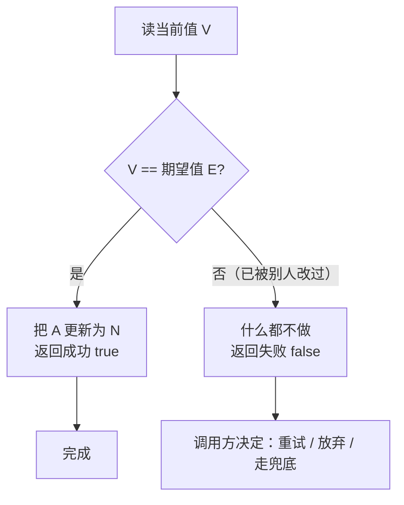

# 09 源码解析 · CAS 与原子类（机器层深挖）

> **前置知识**：建议先读 [09-并发编程.md](09-并发编程.md) 的 `4.1 CAS 是什么：比较并交换的原子指令`、`4.2 CAS 的 ABA 问题与 AtomicStampedReference`、`4.3 原子类家族：AtomicInteger 与 LongAdder 分段累加`（结论层），本篇扒 **HotSpot/OpenJDK 8（Corretto 8.452）机器层**：CAS 凭什么"不加锁也线程安全"、`cmpxchg` 指令怎么工作、AtomicInteger 的自旋循环长什么样、LongAdder 为什么能比 AtomicLong 快近 8 倍、ABA 问题在真实代码里长什么样。
>
> 实测环境（本篇所有探针数字）：**Corretto 8.452 / Windows 11 / i7-12700 / 16G**；探针源码在 `_probe/CASProbe.java`、`_probe/ConcurrentProbe.java`。

## 目录（纯文本，锚点待软件实测后启用）

1. 一、CAS 基础（1.1–1.3）
2. 二、机器层：Unsafe 与 cmpxchg（2.1–2.3）
3. 三、原子类家族（3.1–3.4）
4. 四、ABA 问题（4.1–4.3）
5. 五、实战与踩坑（5.1–5.2）
6. 收尾：核心概念对照表 + 关键设计思想 + 面试 Q&A

---

## 一、CAS 基础

### 1.1 CAS 是什么：一条"比较并交换"的原子指令

> **说明**：CAS（Compare-And-Swap，比较并交换）是一个**原子操作**：`CAS(内存地址 A, 期望值 E, 新值 N)` —— 只有当 **A 当前的值 == E** 时，才把 **A 更新为 N**，并返回成功；否则什么都不做，返回失败。关键是"**比较 + 交换"这两个动作在硬件层面是一个不可分割的整体**（一条指令），不存在"比完被人插队"的窗口。

CAS 单次操作流程：



生活类比：**自助储物柜换锁**——你要把柜子换上新锁，规则是"只有柜子还是我之前看到的那把旧锁（期望值）时，我才换；如果已经被别人换了（值变了），我就不换，重新看看现在是什么"。**整个"看锁+换锁"是一气呵成的**，不会出现"我看完锁、别人换了锁、我按旧锁把新锁装上"的错乱。

```java
// CAS 语义（伪代码）——注意这是"一条指令"级别的原子，不是三步：
boolean compareAndSwap(Address addr, Object expect, Object update) {
    if (load(addr) == expect) {      // ① 比较
        store(addr, update);         // ② 交换
        return true;
    }
    return false;                    // 失败：值已变，啥也不做
}
// ↑ ①②之间绝无其他线程插队的可能——硬件保证
```

> **结论**：CAS 是**无锁并发（lock-free）的基石**——它让"检查 + 更新"不再需要锁的排他性，代价是**失败后要自己决定怎么办**（通常：重试）。

### 1.2 为什么需要 CAS：synchronized 的重量级代价

> **说明**：回顾 `09-源码解析-synchronized与对象头.md` 的结论：锁竞争一旦升级到重量级，线程要进内核态 park/唤醒，单次代价跳 2~3 个数量级（CAS ~1–10ns vs 阻塞唤醒 ~1–10μs）。CAS 的价值就在这：**竞争不激烈时，一次 CAS 就搞定，全程用户态、无 syscall、无上下文切换**。

| 维度 | synchronized（重量级） | CAS（无锁） |
|---|---|---|
| 竞争失败时 | 阻塞 + 内核态 park/唤醒 | 用户态自旋重试 |
| 单次代价 | ~μs 级（futex + 切换） | ~ns 级（一条指令） |
| 死锁风险 | 有 | 无（没有持锁等待） |
| 公平性 | 天然排队 | 不保证（可能饿死） |
| 适用竞争强度 | 高竞争 | 低~中竞争 |

> **注意（反直觉）**：**CAS 不是免费的**。高竞争下所有线程疯狂自旋重试，CPU 空转发热，吞吐反而比锁差——所以 LongAdder 用"分段"规避竞争，`ThreadPoolExecutor` 的高竞争路径该用锁还是用锁。**无锁是"竞争不激烈时的最优解"，不是万能解**。

### 1.3 乐观锁 vs 悲观锁：两种并发哲学

> **说明**：CAS 背后是**乐观锁哲学**——"默认没人抢，抢了再说（失败重试）"；synchronized 是**悲观锁哲学**——"默认会有人抢，先锁死再说"。数据库的乐观锁（version 字段）和 Java 的 CAS 是同一思想的两个实现：

```java
// 数据库乐观锁（对照 Java CAS）：UPDATE ... SET balance=balance-100,
//   version=version+1 WHERE id=1 AND version=5;   -- 受影响行数=0 则重试
// Java 侧等价物：
AtomicInteger version = new AtomicInteger(5);   // 版本号
// 读余额+版本 → 业务计算 → CAS(期望版本, 新版本) 失败则重读重试
```

> **结论**：乐观锁适合**读多写少、冲突概率低**的场景（CAS、数据库 version）；悲观锁适合**写密集、冲突必然发生**的场景（转账扣款、库存扣减的强一致要求）。Java 里两者可以混用：**并发容器内部大量用 CAS，外层业务仍用 synchronized/ReentrantLock 保证复合操作的原子性**。

---

## 二、机器层：Unsafe 与 cmpxchg

### 2.1 Unsafe：Java 到硬件的"后门"

> **说明**：CAS 不是 Java 关键字，Java 通过 `sun.misc.Unsafe` 暴露硬件能力——这个类叫"不安全"，因为它能直接操作内存地址、绕过所有安全检查。JDK 8 里原子类全部建立在 Unsafe 之上：

```java
// sun.misc.Unsafe（JDK 8，关键方法签名）：
public final native boolean compareAndSwapInt(Object o, long offset,
                                              int expected, int x);
public final native boolean compareAndSwapLong(Object o, long offset,
                                               long expected, long x);
public final native Object compareAndSwapObject(Object o, long offset,
                                                Object expected, Object x);
// o + offset：定位字段在对象内的内存偏移（valueOffset 由静态块算出）
// 原子类构造时把字段偏移算好，之后 CAS 直接按偏移操作内存
```

> **注意**：`compareAndSwapInt` 是 **native 方法**——Java 声明，C++ 实现，最终落到 CPU 指令。这就是"Java 无锁并发"的完整链路：**Java 原子类 → Unsafe native → HotSpot C++ → CPU cmpxchg 指令**。JDK 9+ 开始用 `VarHandle` 逐步替换 Unsafe（API 更安全），但 JDK 8 是 Unsafe 一统天下。

### 2.2 cmpxchg：x86 上 CAS 的硬件实现

> **说明**：x86 的 CAS 指令叫 **`cmpxchg`（Compare and Exchange）**，配合 **`lock` 前缀**在多核下原子执行。OpenJDK 8 的落地代码（`hotspot/src/os_cpu/linux_x86/vm/atomic_linux_x86.inline.hpp`）：

```cpp
// HotSpot 语义（openjdk8 atomic_linux_x86.inline.hpp，关键路径）：
template<>
inline jint Atomic::cmpxchg(jint exchange_value,
                            volatile jint* dest,
                            jint compare_value) {
    // LOCK_IF_MP：多核时加 lock 前缀（单核不需要，指令本身原子）
    // cmpxchgl：比较并交换 32 位 —— 硬件层面"比较+交换"一条指令完成
    __asm__ volatile (LOCK_IF_MP(%4) "cmpxchgl %1,(%3)"
                      : "=a" (exchange_value)
                      : "r" (exchange_value), "a" (compare_value),
                        "r" (dest), "r" (mp)
                      : "cc", "memory");
    return exchange_value;
}
```

> **结论**：**`lock cmpxchg` 一条指令 = Java 的 CAS**。`lock` 前缀把指令变成"原子"（总线锁/缓存锁，同时带全屏障副作用——见 volatile 篇的 StoreLoad），`cmpxchg` 完成"比较 E、相等则写 N"。这就是为什么 CAS 是"用户态一条指令"级别——它根本没有进内核。

### 2.3 javap 实证：incrementAndGet 的完整调用链

> **关键**：本机 `javap -c -p java.util.concurrent.atomic.AtomicInteger` 实测（Corretto 8.452）：

```
public final int incrementAndGet();
    Code:
       0: getstatic     #3     // Field unsafe:Lsun/misc/Unsafe;
       3: aload_0
       4: getstatic     #4     // Field valueOffset:J        ← 字段内存偏移
       7: iconst_1
       8: invokevirtual #8     // Method sun/misc/Unsafe.getAndAddInt:...
      11: iconst_1
      12: iadd
      13: ireturn
// 链路：incrementAndGet() → Unsafe.getAndAddInt() → compareAndSwapInt() native → cmpxchg
```

**JDK 8 里 `getAndAddInt` 的真实实现**（`Unsafe.java`，自旋 CAS 的教科书）：

```java
// sun.misc.Unsafe（JDK 8）—— getAndAddInt 的循环：
public final int getAndAddInt(Object o, long offset, int delta) {
    int v;
    do {
        v = getIntVolatile(o, offset);        // ① 读当前值（volatile 读）
    } while (!compareAndSwapInt(o, offset, v, v + delta));
    // ② CAS(期望=v, 更新=v+delta)：失败说明被别人改了 → 重读重试
    return v;
}
// incrementAndGet = getAndAddInt(this, valueOffset, 1) + 1
```

> **结论（记忆锚点）**：原子类的"自增"不是一步到位，而是 **"读 → CAS → 失败重读再 CAS"的乐观循环**——**在低竞争下循环几乎一次就过（所以快），高竞争下循环空转（所以慢）**。这个循环形态（do-while CAS）是手写无锁代码的通用模板。

---

## 三、原子类家族

### 3.1 AtomicInteger 源码拆解：valueOffset 与 volatile value

> **说明**：`AtomicInteger` 的字段设计是"**volatile 存值 + Unsafe 操作**"的典范（JDK 8）：

```java
// java.util.concurrent.atomic.AtomicInteger（JDK 8，节选）：
public class AtomicInteger extends Number implements java.io.Serializable {
    private static final Unsafe unsafe = Unsafe.getUnsafe();
    private static final long valueOffset;          // value 字段的内存偏移（构造时算死）

    static {
        try {
            valueOffset = unsafe.objectFieldOffset      // 反射拿字段偏移
                (AtomicInteger.class.getDeclaredField("value"));
        } catch (Exception ex) { throw new Error(ex); }
    }

    private volatile int value;                     // ← 值本身 volatile：读免费（x86）

    public final int get()               { return value; }                    // volatile 读
    public final void set(int newValue)  { value = newValue; }                // volatile 写
    public final boolean compareAndSet(int expect, int update) {
        return unsafe.compareAndSwapInt(this, valueOffset, expect, update);   // CAS
    }
    // 注意：get 只是 volatile 读，没有锁 —— 读路径零开销
}
```

> **说明（为什么 value 要 volatile）**：CAS 保证"写"原子，但**不保证"读"看到最新值**——value 加 volatile 后，`get()` 就是 x86 上免费的 volatile 读，读方必然看到最新已提交的写。**volatile（可见性）+ CAS（原子更新）= 原子类的完整语义**。

### 3.2 原子类家族全图：引用/数组/字段更新器

> **说明**：原子类不止 AtomicInteger，按被操作对象分四类（全部基于同一套 Unsafe CAS）：

| 类型 | 代表类 | 用途 |
|---|---|---|
| **基本类型** | `AtomicInteger` / `AtomicLong` / `AtomicBoolean` | 计数器、标志位、ID 生成 |
| **引用类型** | `AtomicReference<V>` / `AtomicMarkableReference` / `AtomicStampedReference` | 对象整体原子替换（如缓存引用）、ABA 对抗 |
| **数组** | `AtomicIntegerArray` / `AtomicLongArray` / `AtomicReferenceArray` | 数组元素级原子操作（volatile 数组的替代品） |
| **字段更新器** | `AtomicIntegerFieldUpdater` / `AtomicLongFieldUpdater` / `AtomicReferenceFieldUpdater` | 不改造类就给已有字段加原子操作（反射 + CAS） |

```java
// 字段更新器：改造已有类，避免为原子性动数据结构（JDK 8）：
class Account {
    volatile int balance;                        // 字段本身 volatile
    static final AtomicIntegerFieldUpdater<Account> U =
        AtomicIntegerFieldUpdater.newUpdater(Account.class, "balance");
    boolean tryDeduct(int amount) {
        return U.compareAndSet(this, balance, balance - amount);   // 原子扣减
    }
}
```

> **结论**：选型口诀——**计数用 AtomicInteger/Long，整体替换用 AtomicReference，数组元素用 Atomic*Array，动不了源码的字段用 FieldUpdater**。它们内核全是 `compareAndSwap*`，没有第二种魔法。

### 3.3 LongAdder vs AtomicLong 实测：27ms vs 214ms

> **说明**：高竞争下 AtomicLong 的自旋循环空转，LongAdder 换思路——**分段累加**。本机实测（`ConcurrentProbe.java`，8 线程各加 300 万次，共 2400 万次）：

```java
// ConcurrentProbe.java —— 8 线程 x 300万次 increment 耗时对比（节选）
// AtomicLong：单值 CAS 循环
AtomicLong al = new AtomicLong();
// ... 8 线程各跑 300万次 al.incrementAndGet()
// LongAdder：分段累加
LongAdder la = new LongAdder();
// ... 8 线程各跑 300万次 la.increment()
```

```
// 实测输出（Corretto 8.452 / Win11 / i7-12700 / 16G）：
[adder] 8线程 各+3000000 共24M
[adder] AtomicLong=214ms 结果=24000000
[adder] LongAdder =27ms 结果=24000000
// 2400 万次：AtomicLong 214ms（约 8.9ns/次）vs LongAdder 27ms（约 1.1ns/次）≈ 7.9 倍
```

> **关键**：结果都精确等于 2400 万（CAS 循环保证不丢），但 LongAdder 快 7.9 倍——**高竞争场景选型直接用 LongAdder，代价是 sum() 是"近似汇总"（非强一致快照），且内存占用更高**（Cell 数组）。

### 3.4 LongAdder 分段累加原理：Striped64 与伪共享隔离

> **说明**：LongAdder 继承 `Striped64`（JDK 8），核心是"**base + Cell[]**"双轨：

```java
// Striped64（JDK 8，LongAdder 的父类，节选语义）：
// 低竞争：直接 CAS 到 base（和 AtomicLong 一样，快路径）
// 高竞争：扩容成 Cell[] 数组，每个线程用 hash 落到一个 Cell，各加各的（互不打架）
// 求和 sum()：base + 遍历所有 Cell 累加
@sun.misc.Contended   // ← 关键：Cell 用注解对齐到独立缓存行，防伪共享
static final class Cell {
    volatile long value;
    Cell(long x) { value = x; }
    final boolean cas(long cmp, long val) {
        return UNSAFE.compareAndSwapLong(this, valueOffset, cmp, val);
    }
}
```

```java
// LongAdder.add() 的核心逻辑（JDK 8，语义版）：
public void add(long x) {
    Cell[] as; long b, v; int m; Cell a;
    if ((as = cells) != null || !casBase(b = base, b + x)) {   // ① 先试 base（快路径）
        // ② base CAS 失败 → 落到某个 Cell 上累加（分散竞争）
        // ③ 都失败 → 扩容 cells 数组（2 倍扩容，上限 CPU 数）
    }
}
```

分段架构一张图钉死：

```mermaid
flowchart TD
    subgraph 低竞争快路径
        T1[线程1] -->|"CAS base+1 成功"| B[base 计数器]
        T2[线程2] -->|"CAS base+1 成功"| B
    end
    subgraph 高竞争分段路径
        T3[线程3] -->|"base CAS 失败 → hash 落槽"| C1[Cell[0] 独立缓存行]
        T4[线程4] -->|"base CAS 失败 → hash 落槽"| C2[Cell[1] 独立缓存行]
        T5[线程5] -->|"base CAS 失败 → hash 落槽"| C3[Cell[2] 独立缓存行]
    end
    B -->|"sum() 汇总"| S[结果 = base + 所有 Cell 累加]
    C1 --> S
    C2 --> S
    C3 --> S
```

> **注意（为什么 Cell 要 @Contended）**：如果两个 Cell 挤在同一个 64 字节缓存行，线程 A 写 Cell[0]、线程 B 写 Cell[1]，**两个核的缓存行互相失效（伪共享），性能反而崩**。`@sun.misc.Contended`（JDK 8，需 `-XX:-RestrictContended` 才对本进程生效）把每个 Cell 填充到独立缓存行。**这就是"高并发性能优化 = 缓存行隔离"的活教材**。

> **结论**：LongAdder 的思想一句话——**"打不过就分地盘"：全局竞争太激烈，就按线程分片，各算各的账，最后汇总**。对应业务场景：高并发计数（PV/UV、流量统计、限流计数），但**不适合需要精确中间值**的场景（sum() 不是强一致快照）。

---

## 四、ABA 问题

### 4.1 ABA 是什么：CASProbe 盲 CAS 实测

> **说明**：CAS 只比较"值是否等于期望值"，**不关心值是否"变过"**——如果值从 A 变成 B 又变回 A，CAS 会认为"没变过"，成功通过。这就是 **ABA 问题**。本机实测（`CASProbe.java`）：

```java
// CASProbe.java —— ABA 现场：T1 读到 A 后 sleep，T2 做 A→B→A，T1 醒来 CAS
AtomicInteger ai = new AtomicInteger(100);
// T1：int expect = ai.get();  → 100
//     sleep(300ms)
//     ai.compareAndSet(expect, 200)   ← 期间 T2 已完成 100→50→100
// T2：ai.compareAndSet(100, 50);  ai.compareAndSet(50, 100);
```

```
// 实测输出（Corretto 8.452）：
[aba-ai] T2 did 100->50->100 (ABA)
[aba-ai] T1 CAS(100->200) result=true current=200   ← ABA 发生了，CAS 盲成功！
```

> **注意（危害场景）**：ABA 在"值语义"场景无害（计数器 A→B→A 结果没差），但在"**引用语义**"场景致命——比如无锁栈：T1 弹出节点 X 时先记录 head=X，T2 期间弹出 X 又把 X 压回去（X 的内容已被改），T1 CAS 成功——但 X 已经不是原来的 X 了，栈结构被破坏。

### 4.2 AtomicStampedReference：用版本号识破 ABA

> **说明**：解决 ABA 的标准工具是 **`AtomicStampedReference`——给引用配一个"邮票"（stamp），每次修改必须同时更新邮票**，ABA 里值回到 A 但邮票已经变过，CAS 一比对邮票就知道"变过"。本机实测：

```java
// CASProbe.java —— AtomicStampedReference 版：stamp 0→1→2，T1 的 CAS 失败
AtomicStampedReference<Integer> ref = new AtomicStampedReference<>(100, 0);
// T2：CAS(100→50, stamp 0→1)；CAS(50→100, stamp 1→2)   ← 值回到100，但 stamp 已到 2
// T1：CAS(100→200, stamp 0→1)  ← stamp 不匹配（当前是 2），失败！
```

```
// 实测输出（Corretto 8.452）：
[aba-stamped] T2 did 100->50->100, stamp 0->1->2
[aba-stamped] T1 CAS(100->200, stamp 0) result=false current=100 stamp=2  ← 识破！
```

> **结论**：**值会伪装，版本号不会**。`AtomicMarkableReference` 是阉割版（stamp 只有 boolean：是否被改过）；真需要"防 ABA 的引用 CAS"就用 `AtomicStampedReference`。

### 4.3 其它防 ABA 思路：标记位、不可变、锁

> **说明**：除了版本号，还有几条工程思路（按场景选）：

| 思路 | 做法 | 适用 |
|---|---|---|
| **版本号（stamp）** | 每次修改 stamp+1，CAS 同时比值和 stamp | 引用/结构型 CAS（AtomicStampedReference） |
| **标记位** | 只关心"是否被动过"→ boolean 标记 | 只需要防"被改过"的弱校验 |
| **不可变对象 + 引用替换** | 对象构造后不可变，CAS 只替换引用 | 配置快照、缓存条目（无锁栈/队列） |
| **上锁** | 直接用锁包住整个操作 | 复合操作/强一致要求，别硬凹无锁 |

> **注意（工程判断）**：**多数业务代码根本到不了 ABA 这层**——计数器、状态标志没有 ABA 危害；**只有"结构复用"的无锁数据结构（栈/队列/链表）才必须防**。面试会考，写代码前先判断场景。

---

## 五、实战与踩坑

### 5.1 手写自旋锁：CAS 实现一个完整锁

> **说明**：理解了 CAS 就能手写一个"可工作的锁"（教学用，生产别用——公平性、可重入、park 优化都没有）：

```java
// SpinLock.java —— CAS 自旋锁（教学演示，生产勿用）
public class SpinLock {
    private final AtomicInteger state = new AtomicInteger(0);   // 0=空闲 1=占用

    public void lock() {
        // 自旋：CAS 0→1 成功才拿到锁，失败继续转
        while (!state.compareAndSet(0, 1)) {
            // 可加 Thread.yield() 让出 CPU（高竞争时）
        }
    }
    public void unlock() {
        state.set(0);                       // 释放：写回 0（volatile 写，立即可见）
    }
    // 用法：
    //   SpinLock lock = new SpinLock();
    //   lock.lock();  try { /* 临界区 */ } finally { lock.unlock(); }
}
```

> **注意（自旋锁的坑）**：① 不可重入——同一线程再 lock() 会死锁（CAS 0→1 永远失败）；② 无公平性——后到线程可能插队；③ 高竞争下 CPU 空转烧核。**JDK 的锁不用它是因为有 AQS 的 park 机制**（见 `09-源码解析-AQS与ReentrantLock.md`）——自旋只用在临界区极短的场合（如 `LongAdder` 内部）。

### 5.2 真实踩坑：原子类不是万能、getAndSet 的妙用

> **说明（三个高频坑）**：

```java
// 坑1：原子类只保证"单次操作"原子，"先检查后执行"仍要锁
AtomicInteger stock = new AtomicInteger(10);
if (stock.get() > 0) {                    // 检查
    stock.decrementAndGet();              // 执行 —— 两步之间可能已卖光 → 超卖！
    // 正确：stock.updateAndGet(v -> v > 0 ? v - 1 : v) 或 CAS 循环里判断
}

// 坑2：AtomicInteger 的"复合业务判断"别拆成多个原子操作 —— 用 updateAndGet 一次搞定
stock.updateAndGet(v -> v >= 5 ? v - 5 : v);   // 一次 CAS 循环内完成"判断+扣减"

// 坑3（妙用）：AtomicReference 的 getAndSet 做"一次性消费"（如抢占任务）
AtomicReference<Task> current = new AtomicReference<>(task);
Task mine = current.getAndSet(null);      // 拿任务并把槽位置空 —— 单次 CAS 语义
if (mine != null) { /* 只有我抢到了 */ }
```

> **结论（选型口诀）**：**"读-改-写"能合成一次 CAS 循环就用原子类；跨字段/多步业务逻辑必须上锁**。原子类解决的是"单变量的原子更新"，不是"业务事务"——别拿它硬凹分布式锁/事务。

> **收尾一句话**：CAS 的机器层 = "一条 `lock cmpxchg` 指令 + 一个失败重试循环"；它把并发从"阻塞排队"降维成"乐观重试"，代价是把竞争压力转嫁给 CPU——原子类家族就是围绕这条指令的十八般武艺。

---

## 收尾：核心概念对照表 + 关键设计思想 + 面试 Q&A

### 核心概念对照表

| 概念 | 一句话 | 关键数字/证据 |
|---|---|---|
| CAS | 一条原子指令：比较 + 交换 | x86 `lock cmpxchg` |
| Unsafe | Java 到硬件的 native 后门 | `compareAndSwapInt` 签名 |
| 调用链 | 原子类 → Unsafe → C++ → cmpxchg | javap 实证 |
| getAndAddInt | "读 → CAS → 失败重试"循环 | JDK 8 Unsafe 源码 |
| AtomicInteger | volatile value + CAS | 读路径零开销 |
| LongAdder | base + Cell[] 分段累加 | 8 线程 24M 次：27ms vs 214ms（7.9×） |
| 伪共享 | Cell 挤同一缓存行互相失效 | @sun.misc.Contended |
| ABA | 值 A→B→A，CAS 盲成功 | CASProbe: result=true |
| AtomicStampedReference | 引用 + 版本号 | CASProbe: result=false |

### 关键设计思想（编号列表）

1. **乐观优先**：默认没冲突，冲突就重试——把内核态阻塞换成用户态自旋，单次代价降 2~3 个数量级。
2. **volatile + CAS 分工**：volatile 管可见性（读路径免费），CAS 管原子更新，合起来才是原子类的完整语义。
3. **循环是自旋锁的原型**：所有无锁数据结构都是 do-while CAS 的变体——理解了循环，就理解了 lock-free 的骨架。
4. **打不过就分地盘**：LongAdder 用分段把全局竞争拆成局部竞争，用空间换吞吐。
5. **值会伪装，版本不会**：ABA 的本质是"状态退化"，版本号让每一次变化都留下痕迹。

### 面试题 Q&A

**Q1：CAS 是怎么实现原子性的？Java 里完整调用链是什么？**
> CAS 靠硬件指令实现原子性：x86 上是 `lock cmpxchg`，lock 前缀保证多核下比较+交换不可分割。Java 调用链：原子类的 compareAndSet → `sun.misc.Unsafe.compareAndSwapInt`（native）→ HotSpot C++ 的 `Atomic::cmpxchg` → CPU `cmpxchg` 指令。javap 实测 incrementAndGet 最终调到 `Unsafe.getAndAddInt`。

**Q2：AtomicInteger 的 incrementAndGet 是怎么保证线程安全的？高竞争下会怎样？**
> 底层是 `getAndAddInt` 的 do-while 循环：volatile 读当前值 → CAS(期望值, 期望值+1)，失败说明被别的线程改了，重读重试。低竞争下一次通过（快）；高竞争下所有线程循环空转（CPU 空烧、吞吐下降）——这就是高竞争场景要换 LongAdder 的原因。实测 8 线程 2400 万次：AtomicLong 214ms vs LongAdder 27ms，差 7.9 倍。

**Q3：什么是 ABA 问题？AtomicStampedReference 怎么解决？**
> ABA：CAS 只比值，值从 A 变 B 又变回 A 时，CAS 误判"没变过"而成功。对"值语义"无害，对"引用/结构语义"致命（如无锁栈节点复用）。解决：AtomicStampedReference 给引用配版本号 stamp，每次修改 stamp+1，CAS 同时比对值和 stamp。实测：普通 AtomicInteger 的 ABA CAS 返回 true（盲成功），stamped 版本返回 false（识破）。

**Q4：LongAdder 为什么比 AtomicLong 快？有什么代价？**
> AtomicLong 是单一 value 的 CAS 循环，高竞争下所有线程抢一个变量；LongAdder 用 base + Cell[] 分段：低竞争走 base 快路径，高竞争各线程落到独立 Cell 上累加（@Contended 防伪共享），最后 sum() 汇总。代价：sum() 是弱一致快照（非精确中间值）、内存占用更高。适合高并发计数统计，不适合需要精确值的场景。

---

> **互链**：本篇为 [09-并发编程.md](09-并发编程.md) 的 `4.1/4.2/4.3` 块机器层深挖；CAS 的可见性前提（volatile 读）见 `09-源码解析-volatile与内存屏障.md`；AQS 的 `compareAndSetState` 就是 CAS 的框架级应用，见 `09-源码解析-AQS与ReentrantLock.md`；并发容器的无锁路径（CHM 的 CAS 插入、LongAdder 式计数）见 `09-源码解析-并发容器.md`。
