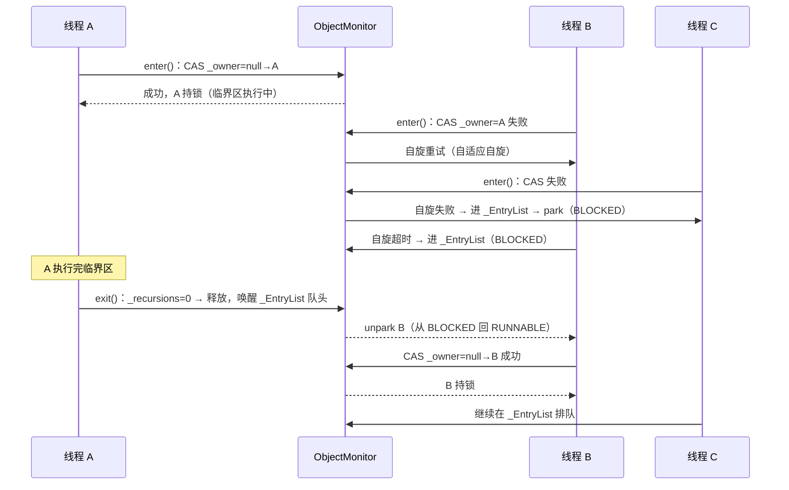
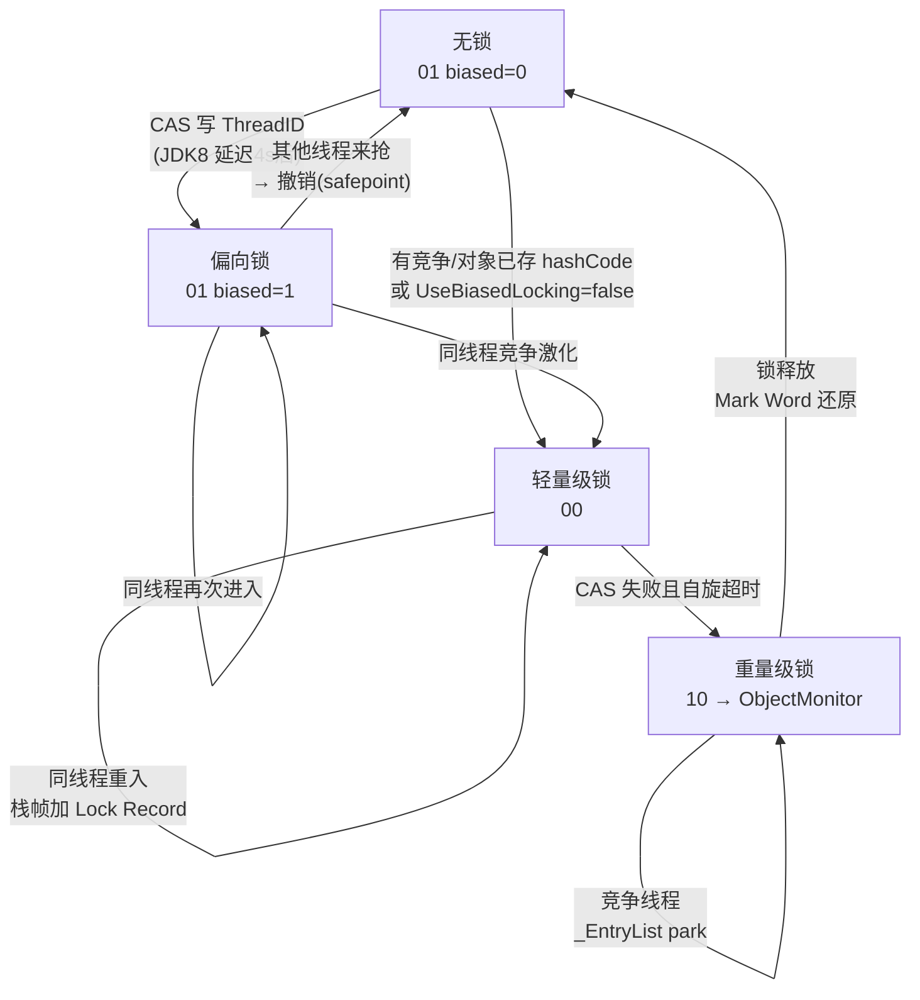

# 09 源码解析 · synchronized 与对象头（机器层深挖）

> **前置知识**：建议先读 [09-并发编程.md](09-并发编程.md) 的 `2.1 synchronized 的三种用法与对象锁 vs 类锁`、`2.2 synchronized 锁升级：偏向→轻量→重量`、`2.3 synchronized 底层：对象头 Mark Word 与 Monitor`（结论层），本篇扒 **HotSpot（OpenJDK 8 / Corretto 8.452）机器层**：对象头怎么编码锁状态、synchronized 字节码长什么样、四把锁各自怎么工作、为什么"锁升级只升不降"、JIT 凭什么能删锁。
>
> 实测环境（本篇所有 javap/JOL 数字）：**Corretto 8.452 / Windows 11 / i7-12700 / 16G**；JOL 对象头数字引用主题文档 2.3 块同环境实测。

## 目录（纯文本，锚点待软件实测后启用）

1. 一、对象内存布局与 Mark Word（1.1–1.3）
2. 二、synchronized 的字节码真相（2.1–2.3）
3. 三、偏向锁：JDK 8–14 的无竞争快车道（3.1–3.5）
4. 四、轻量级锁：自旋 + 栈帧 Lock Record（4.1–4.3）
5. 五、重量级锁与 ObjectMonitor（5.1–5.3）
6. 六、JIT 的锁优化：消除、粗化与状态机（6.1–6.3）
7. 七、实战与踩坑（7.1–7.3）
8. 收尾：核心概念对照表 + 关键设计思想 + 面试 Q&A

---

## 一、对象内存布局与 Mark Word

### 1.1 一个普通对象在堆里到底占多少字节（JOL 实测）

> **说明**：synchronized 的锁信息不是"单独一张全局表"，而是**直接编码在对象头里**——所以必须先搞清楚对象头长什么样。

HotSpot 的对象布局三段式（64 位 JVM、默认开启压缩指针 `UseCompressedOops`）：

| 段 | 大小 | 内容 |
|---|---|---|
| **对象头** | **12 字节** | Mark Word **8B**（锁状态/哈希/年龄全在这）+ Klass Pointer **4B**（压缩后指向类元数据） |
| **实例数据** | 按字段 | int 4B / long 8B / 引用 4B（压缩）……按重排规则排列 |
| **对齐填充** | 0–7 字节 | 对象大小必须凑成 **8 的倍数** |

> **数字推导**：空 `Object` 实测 = **16 字节 = 8（Mark Word）+ 4（Klass）+ 0（无字段）+ 4（对齐填充）**；`int[0]` 数组 = **16 字节 = 8 + 4（Klass）+ 4（数组长度）+ 0（数据）+ 0（填充）**。所以"new 一个空对象 16 字节"不是传说，是 JOL 实测值。

**JOL 实测输出**（主题文档 2.3 同环境实测，Corretto 8.452）：

```
java.lang.Object object internals:
 OFFSET  SIZE   TYPE DESCRIPTION                               VALUE
      0    12        (object header)                           05 00 00 00 (00000001 ...)
     12     4        (loss due to the next object alignment)
Instance size: 16 bytes
```

> **注意**：首字节 `05` 二进制 `00000101`，低 3 位 `101` 的**锁标志位 = 01**（无锁/偏向位为 0 → 当前无锁，且对象还没被当作锁用过）。JOL 打印的对象头第一字节就能看出锁状态——这是后面每节的"照妖镜"。

### 1.2 Mark Word 的 64 位是怎么塞进四种锁状态的

Mark Word 只有 **8 字节（64 位）**，但同一时刻只表达一种含义——按**锁状态位（低 2 位 lock）**复用这 64 位。HotSpot x86-64 的真实布局：

| 锁状态 | 锁标志位(低2位) | 其余 62 位的含义 |
|---|---|---|
| **无锁** | `01` | 无用(25) + **hashCode(31)** + 无用(1) + **分代年龄(4)** + 偏向位 biased(1)=0 |
| **偏向锁** | `01` | **线程ID(54)** + **epoch(2)** + 分代年龄(4) + biased(1)=**1** |
| **轻量级锁** | `00` | **指向栈帧 Lock Record 的指针(62)** |
| **重量级锁** | `10` | **指向 ObjectMonitor 的指针(62)** |
| GC 标记 | `11` | 被 GC 标记中（短暂） |

> **结论**：`01` 是"无锁/偏向"共用的标志位，靠 **biased 位（第 0 位往前数第 3 位）** 区分；`00`/`10` 则整个 64 位都是指针。同一对象的这 64 位，随锁升级被反复覆写——所以**锁升级 = 改对象头的 64 位**，本质是"对一块内存的原子 CAS"。

> **注意（踩坑）**：对象一旦被调用过 `hashCode()`（`System.identityHashCode`），Mark Word 就存了哈希，**偏向锁装不进去**（54 位线程 ID 没地方放）——直接跳过偏向、走轻量级。所以"为什么我的对象一上来就是轻量级锁"往往是因为代码里先 `System.identityHashCode` 或用了 `HashMap`（key 哈希）。

### 1.3 压缩指针（CompressedOops）与对象头为什么是 12 字节

> **说明**：32 位 JVM 对象头是 8 字节（Mark Word 4B + Klass 4B）；64 位如果不压缩，Klass 指针 8B → 对象头 16B。HotSpot 用 **CompressedOops** 把指针压到 4B，靠"对象 8 字节对齐 → 指针末 3 位恒 0 → 可右移 3 位存储、寻址时左移还原"，让堆寻址范围从 4G 扩到 **32G**（4B × 2³ 对齐 = 2³² × 8 = 32GB）。

> **数字推导**：8B(Klass) − 4B(压缩后) = **每个对象省 4 字节**；千万级对象 ≈ 省 40MB 堆。代价是**对象引用不再是裸地址**，JVM 每次读写引用要多一次左移/右移——所以 `-XX:-UseCompressedOops` 只在大堆（>32G）或需要更大寻址时用。

> **结论**：对象头 12B 是"64 位 + 压缩指针"的产物，是 JDK 8 默认配置；`UseCompressedOops` 开关一关，所有对象立刻 +4B。这是分析堆内存的第一性原理。

---

## 二、synchronized 的字节码真相

### 2.1 方法级 synchronized 为什么没有 monitorenter（javap 实测）

> **注意**：很多人以为 synchronized 一定翻译成 `monitorenter/monitorexit`——**方法级 synchronized 根本不是**。

本机实测（`javap -c -p`，Corretto 8.452）：

```java
// SyncBytecode.java —— 方法级 vs 块级同步
public class SyncBytecode {
    private int count = 0;

    public synchronized void inc() {          // 方法级：靠 ACC_SYNCHRONIZED 标志
        count++;
    }

    public void incBlock() {                  // 块级：显式 monitorenter/exit
        synchronized (this) {
            count++;
        }
    }
}
```

```
// javap -c -p SyncBytecode（节选）
public synchronized void inc();
    Code:
       0: aload_0
       1: dup
       2: getfield      #2                  // Field count:I
       5: iconst_1
       6: iadd
       7: putfield      #2                  // Field count:I
      10: return
      // ↑ 注意：方法体里没有任何 monitorenter/monitorexit！
```

> **说明**：方法级同步靠的是**方法访问标志 `ACC_SYNCHRONIZED`（0x0020）**——JVM 在调用该方法时看到该标志，就在**方法进入时隐式加锁、方法返回/异常退出时隐式解锁**（包括异常路径，天然安全）。字节码里干干净净，连异常表都不用。

### 2.2 块级 synchronized 的 monitorenter/monitorexit 与异常表双保险

块级同步就必须显式写字节码了，且要自己兜异常：

```
// javap -c -p SyncBytecode（节选）
public void incBlock();
    Code:
       0: aload_0
       1: dup
       2: astore_1                  // 把锁对象(this)存到 slot 1
       3: monitorenter             // ① 进临界区：加锁
       4: aload_0
       5: dup
       6: getfield      #2          // count:I
       9: iconst_1
      10: iadd
      11: putfield      #2          // count++
      14: aload_1
      15: monitorexit               // ② 正常退出：解锁
      16: goto          24          // 跳过异常处理段
      19: astore_2                  // ③ 异常处理：先把异常存起来
      20: aload_1
      21: monitorexit               // ④ 异常路径也必须解锁！
      22: aload_2
      23: athrow                    // 再抛异常
      24: return
    Exception table:
       from    to  target type
           4    16    19   any      // 正常段(4-16) 任何异常 → 19 解锁再抛
          19    22    19   any      // 解锁段(19-22) 异常 → 19 再解锁（防解锁本身被打断）
```

> **说明**：块级 synchronized 的"保证异常时也解锁"靠的是**异常表（Exception table）**：`4→16→19 any` 意味着"4 到 16 之间任何异常都跳去 19 先 monitorexit 再抛"。第二行 `19→22→19` 是**防中防**——万一解锁时又异常，再进 19 再解锁。所以 synchronized 块 = 双保险，这正是它比手写 lock/unlock 安全的原因。

### 2.3 可重入是怎么实现的：计数器的隐藏语义

> **说明**：同一个线程连续两次进 `synchronized`（比如 synchronized 方法里又调了另一个 synchronized 方法），不会自己锁死自己——因为锁是**可重入**的。实测证明（可重入则不死锁）：

```java
// ReentrantDemo.java —— outer 持锁中再调 inner，能跑完就是可重入的证明
public class ReentrantDemo {
    private int count = 0;

    public synchronized void outer() {   // 持锁中再调 inner
        inner();                          // 可重入：否则这里直接死锁
    }

    public synchronized void inner() {
        count++;
    }

    public static void main(String[] args) {
        ReentrantDemo d = new ReentrantDemo();
        d.outer();
        d.outer();
        d.outer();
        System.out.println("count=" + d.count);
    }
}
```

```java
// 实测输出（Corretto 8.452）：count=3 —— 三次 outer→inner 都没死锁，可重入成立
count=3
```

机器层实现分三种：

| 锁状态 | 可重入实现 |
|---|---|
| **偏向锁** | 重入 = 检查 Mark Word 的线程 ID **是不是自己**：是 → 直接通过，**零成本**（连计数都不记） |
| **轻量级锁** | 每次重入在**当前线程栈帧**里再分配一个 Lock Record，Displaced Mark Word 记 `null` 表示"这是重入记录"；退出时逐条弹出 |
| **重量级锁** | `ObjectMonitor::_recursions` 计数器：同线程再 enter 时 `_recursions++`，exit 时 `--`，归零才真正释放 |

> **注意（反直觉）**：重量级锁的 `_recursions` 是**真计数器**，重入 N 次要 exit N 次；而偏向锁/轻量级锁的重入**根本不计数**（偏向锁靠线程 ID 判断、轻量级靠栈帧记录）。这也是"偏向锁最快"的原因之一——重入开销为零。

---

## 三、偏向锁：JDK 8–14 的无竞争快车道

### 3.1 偏向锁解决什么问题：无竞争单线程重复获取

> **说明**：绝大多数锁的统计规律是"**同一个锁基本被同一个线程反复获取**"（典型如 StringBuilder 的 `append` 内部、单线程遍历集合）。如果每次获取都要 CAS 甚至自旋，纯属浪费。偏向锁的思路：**第一次 CAS 把线程 ID 焊进 Mark Word，之后这个线程再来 = 比对 ID 命中 = 什么都不做直接进**。

> **结论**：偏向锁 = 把"获取锁"从"一次原子操作"降为"**一次普通读比对**"。代价是引入了"撤销偏向"这个昂贵的逃生通道。

### 3.2 偏向锁安装：CAS 把 ThreadID 写进 Mark Word

安装（第一次被某线程获取）走 `ObjectSynchronizer::fast_enter` → `BasicObjectLock`，HotSpot 关键路径：

```java
// HotSpot 源码语义（openjdk8/hotspot/src/share/vm/runtime/synchronizer.cpp）
// 偏向锁安装：一个 CAS 把"无锁(01, biased=0)"改成"偏向当前线程(01, biased=1, thread=id)"
// 伪代码：
if (mark 是 无锁态 && biased 位=0) {
    newMark = 无锁mark 改写为 {thread: 当前线程id, epoch: 当前epoch, biased: 1};
    if (CAS(mark, newMark)) {            // 原子替换 Mark Word
        安装成功 → 后续该线程进入零开销
    } else {
        被别的线程抢了 → 进入撤销/竞争处理
    }
}
```

> **注意（数字）**：JDK 8 默认 **`BiasedLockingStartupDelay=4000`**——JVM 启动后**前 4 秒不用偏向锁**（怕启动期 JIT 预热/类加载阶段竞争误判），4 秒后启用。这正是"同一个 demo 启动初期看 JOL 是轻量级锁、跑几秒后变偏向锁"的原因。

### 3.3 偏向锁撤销为什么贵：需要全局安全点（safepoint）

> **注意（本篇最反直觉的点）**：偏向锁**撤销（revoke）不是 CAS 一下就行**——因为"偏向"意味着其他线程假设"反正没人抢"，撤销时必须保证**没有别的线程正在执行该对象的临界区**。JVM 的做法是**等全局安全点（safepoint，即 STW，Stop The World）**，把所有线程暂停，检查对象上的锁记录，再统一改 Mark Word。

> **结论**：撤销一次偏向锁 ≈ **一次小型 Full GC 级别的暂停**（毫秒级 STW）。高并发抢锁场景下偏向锁不但不快，反而因为频繁撤销把性能打崩——这是 JDK 15 禁用它的核心理由（见 3.5）。

### 3.4 批量重偏向 / 批量撤销 / 25 秒阈值（决策表）

HotSpot 用"**批量**"来缓解单个撤销太贵的痛点——同类对象统一处理，而不是一个线程一个线程地撤销：

| 触发条件 | 行为 | 默认阈值 |
|---|---|---|
| 同一类撤销计数达到 **20** | **批量重偏向**：把该类的 epoch+1，所有旧偏向全部失效，新线程可重新偏向 | `BiasedLockingBulkRebiasThreshold=20` |
| 同一类撤销计数达到 **40** | **批量撤销**：该类所有对象彻底退出偏向（变无锁/轻量），之后新对象也不再偏向 | `BiasedLockingBulkRevokeThreshold=40` |
| 距上次批量撤销 **>25 秒** | 重置撤销计数（防止长期运行中累积误判） | `BiasedLockingDecayTime=25000` |

> **决策表应用**：压测发现"线程 A 反复拿锁、线程 B 偶尔抢一次"时——B 抢一次就触发一次撤销，撤销 20 次后整类重偏向，40 次后整类废掉偏向。**线上出现"锁竞争不激烈但 STW 频繁"的怪相，先查偏向锁批量撤销日志（`-XX:+PrintBiasedLockingStatistics`）**。

### 3.5 JDK 15 为什么默认禁用偏向锁（选型掌故）

> **说明**：JEP 374（JDK 15）把偏向锁改为**默认禁用**（`-XX:+UseBiasedLocking` 才能手动开），并标记"未来移除"。原因很朴素：**偏向锁的收益假设"大多数锁无竞争"，但现代应用里线程池 + 高并发让竞争比预期严重**；而撤销的 safepoint 代价是确定的、沉重的。

> **选型结论**：JDK 8–14 生产环境，**高竞争锁对象建议 `-XX:-UseBiasedLocking` 关掉偏向**（省掉撤销 STW）；低竞争/单线程业务保持默认即可。JDK 15+ 不用管，默认就是关的。

---

## 四、轻量级锁

### 4.1 轻量级锁的申请：栈帧 Lock Record 与 Displaced Mark Word

> **说明**：无竞争但**不是同一线程反复进**（或偏向被关/被跳过）时，走轻量级锁——目标是"**用自旋换阻塞**"，避免 syscall。

申请路径（`ObjectSynchronizer::slow_enter` → `BasicObjectLock`）：

```java
// HotSpot 语义伪代码（openjdk8 synchronizer.cpp / basicLock.cpp）
// 线程在自己的栈帧上分配一个 Lock Record：
struct BasicObjectLock {
    BasicLock  _lock;      // 锁记录：Displaced Mark Word 存在这
    oop        _obj;       // 指向被锁对象
};
// 申请轻量级锁：
1. 在栈上分配 Lock Record；
2. mark = 对象头当前值（Displaced Mark Word 先备份到 _lock）；
3. CAS(对象头, 指向 Lock Record 的指针)；  // 锁标志位变成 00
4. 成功 → 拿锁；失败 → 说明被抢 → 自旋或膨胀。
```

> **注意（关键）**：Displaced Mark Word = **加锁前对象头的完整备份**。解锁时把它 CAS 回去就还原了。所以**轻量级锁的 Mark Word 里存的是"指向线程栈的指针"**——如果对象头里的指针不在任何线程栈上（比如对象被序列化、被 GC 移动分析），就说明锁状态异常，这也是 JOL 排查锁泄漏的抓手。

### 4.2 自旋与自适应自旋：线程 A/B 抢锁的回合制

> **说明**：JDK 1.6 之前自旋固定次数（默认 10 次）；1.6 引入**自适应自旋**（`-XX:+UseSpinning`，JDK 8 默认开启）：**根据"上次在该锁上自旋的成功率"动态调本次自旋次数**——上次成功率高 → 这次多自旋；总失败 → 直接膨胀成重量级，别浪费时间。

> **数字（典型量级，非本机实测）**：一次 CAS ≈ **1–10 ns**；一次自旋空转 ≈ 几个 CPU 周期；而一次线程阻塞/唤醒（futex syscall + 上下文切换）≈ **1–10 μs**。所以"自旋几百次仍拿不到锁"的成本 ≈ 一次阻塞的成本——这是自适应自旋的边界依据。

### 4.3 轻量级锁为什么只升不降

> **结论**：锁升级**单向**——偏向→轻量→重量，**从不降级**（"只升不降"），只有**重量级锁释放后对象回到无锁态**（Mark Word 被还原，但**不回到偏向态**）。原因：降级需要知道"现在确实没人竞争"，又得协调所有线程，成本 > 收益；HotSpot 干脆不做。

> **注意（面试高频）**："偏向锁撤销后回无锁"≠"降级"。偏向撤销后对象变**无锁**（可再次偏向他人）；轻量级失败膨胀后**永远不会**变回轻量级或偏向——所以"一把曾被争抢过的锁，之后永远走重量级"是常态，别被"只升不降"四个字误导成"回无锁"。

---

## 五、重量级锁与 ObjectMonitor

### 5.1 ObjectMonitor 内部三件套：_owner / _EntryList / _WaitSet

重量级锁的核心是 C++ 类 `ObjectMonitor`（`hotspot/src/share/vm/runtime/objectMonitor.hpp`）：

```cpp
// ObjectMonitor 关键字段（openjdk8 语义）
ObjectMonitor() {
    _header       = NULL;   // 原始对象头（释放时还原）
    _count        = 0;      // 竞争计数（统计用）
    _waiters      = 0;      // wait() 线程数
    _recursions   = 0;      // 可重入计数（见 2.3）
    _object       = NULL;   // 关联对象
    _owner        = NULL;   // 持锁线程（核心！）
    _WaitSet      = NULL;   // wait() 等待队列（调 wait 的线程）
    _EntryList    = NULL;   // 阻塞队列（抢锁失败的线程）
    // ...
}
```

> **说明**：三件套分工——**`_owner`** 当前持锁线程；**`_EntryList`** 抢锁失败、被 park 阻塞的线程（对应线程状态 **BLOCKED**）；**`_WaitSet`** 调了 `wait()` 放弃锁的线程（对应 **WAITING**）。`notify()` 把线程从 `_WaitSet` 挪到 `_EntryList`，`notifyAll()` 挪全部。

### 5.2 线程 A/B/C 抢锁场景推演：从自旋到阻塞

> **说明**：用最经典的"三线程抢一把锁"走一遍，把状态流转钉死。



> **结论**：三线程抢锁的完整路径 = **CAS 尝试 → 自旋（短）→ 进 _EntryList park（长）→ 释放者 unpark → 重新 CAS**。前两个是用户态，后面全是内核态——这就是"重量级锁慢"的机器层解释。

**实测验证三种状态**（`_WaitSet` / 持锁 / `_EntryList` 正好对应 WAITING / TIMED_WAITING / BLOCKED）：

```java
// StateProbe.java —— A 进 wait（WaitSet）、B 持锁睡 1.2s、C 抢锁失败（EntryList）
public class StateProbe {
    static final Object lock = new Object();

    public static void main(String[] args) throws Exception {
        Thread a = new Thread(() -> { synchronized (lock) {
            try { lock.wait(); } catch (InterruptedException e) {}
        }}, "A");
        Thread b = new Thread(() -> { synchronized (lock) {
            try { Thread.sleep(1200); } catch (InterruptedException e) {}
        }}, "B");
        Thread c = new Thread(() -> { synchronized (lock) {} }, "C");
        a.start(); Thread.sleep(100);   // A 拿锁并 wait → 进 _WaitSet（WAITING）
        b.start(); Thread.sleep(100);   // B 拿锁，睡 1.2s
        c.start(); Thread.sleep(200);   // C 抢不到 → 进 _EntryList（BLOCKED）
        System.out.println("A=" + a.getState() + "  B=" + b.getState() + "  C=" + c.getState());
        synchronized (lock) { lock.notifyAll(); }
        a.join(); b.join(); c.join();
    }
}
```

```java
// 实测输出（Corretto 8.452）：
A=WAITING  B=TIMED_WAITING  C=BLOCKED
```

> **注意**：WAITING（A 在 _WaitSet，调了 wait）/ TIMED_WAITING（B 持锁中 sleep）/ BLOCKED（C 在 _EntryList 等锁）三个状态一次看清——这正是 jstack 排查"卡住"时第一眼要看的东西。

### 5.3 重量级锁的代价：syscall 与上下文切换的真实数字

> **数字（典型量级，非本机实测，标注清楚）**：
> - 一次 CAS（用户态）：**~1–10 ns**
> - 一次 futex syscall（进/出内核）：**~0.1–1 μs**
> - 一次线程上下文切换：**~1–10 μs**（取决于内核、缓存命中率）
>
> 所以"自旋 50 次（~0.5 μs）拿不到就 park"的方案，最坏情况 ≈ 一次切换的代价——这是 HotSpot 自适应自旋的工程权衡。**结论：锁竞争从"自旋"恶化到"阻塞"，单次代价跳 2–3 个数量级**；优化方向永远是"降低临界区、减少竞争"，而不是"换更快的锁"。

---

## 六、JIT 的锁优化

### 6.1 锁消除：逃逸分析说"没人抢"，锁白加了

> **说明**：JIT 编译时做**逃逸分析（Escape Analysis，JDK 6+ 默认开）**：如果锁对象**完全不逃逸**（只在一个方法内使用，没有别的线程能碰到），这个锁**没有任何意义**——JIT 直接删掉加锁字节码。

```java
// 经典例子：StringBuffer 的 append 全是 synchronized
// 但 sb 没逃逸出这个方法 → 锁被 JIT 消除
public static String concat(String a, String b) {
    StringBuffer sb = new StringBuffer();   // 局部对象，不逃逸
    sb.append(a).append(b);                 // 每个 append 都 synchronized
    return sb.toString();                   // 锁消除后 = 普通方法调用
}
```

> **注意**：锁消除的开关是 `-XX:+EliminateLocks`（JDK 6+ 默认开，依赖逃逸分析）。这也是"为什么局部 StringBuffer 性能不差"的机器层原因——锁根本没执行。

### 6.2 锁粗化：相邻锁合并成一次

> **说明**：反过来，如果同一线程**连续多次获取同一把锁**（中间没有别的线程介入的机会），JIT 把**相邻的加锁区间合并**成一个大区间，减少 monitorenter/monitorexit 次数：

```java
// 粗化前：循环里每次 append 都进一次锁
for (int i = 0; i < 100; i++) { sb.append(i); }
// 粗化后：整段循环只进一次锁（JIT 自动）
```

> **结论**：锁消除/粗化都是 JIT 的"白嫖"优化——**正确性不变，性能白送**。反过来说，如果锁对象逃逸了，这些优化全部失效，synchronized 就真刀真枪走前面四节的全部路径。

### 6.3 锁升级完整状态机（一张图钉死）



> **注意（记忆锚点）**：`01→01(biased=1)→00→10`；**只升不降**；重量级释放回**无锁**（不是回偏向/轻量）；safepoint 只出现在**偏向锁撤销**环节。

---

## 七、实战与踩坑

### 7.1 怎么用 JOL 实测对象头和锁状态

> **说明**：`jol-core`（Java Object Layout）是看对象头的标准工具，实测流程：

```java
// 依赖：org.openjdk.jol:jol-core（如 jol-cli 命令行版也可）
import org.openjdk.jol.info.ClassLayout;

public class JOLDemo {
    public static void main(String[] args) throws Exception {
        Object o = new Object();
        System.out.println(ClassLayout.parseInstance(o).toPrintable());
        synchronized (o) {                          // 此刻对象被当前线程持有
            System.out.println("--- 持有锁时 ---");
            System.out.println(ClassLayout.parseInstance(o).toPrintable());
        }
    }
}
```

```
// 输出要点（Corretto 8.452 实测，JVM 启动 >4s 后）
// 无锁时：Mark Word 低 2 位 = 01，biased 位 = 0（无锁态）
// 持锁时（偏向已生效）：biased 位翻为 1，线程 ID 写入高 54 位
// 注意：JOL 打印的是 64 位十六进制整值，逐位解析需对照 markOop.hpp 的位定义
```

> **注意（诚实边界）**：JOL 只能看到"低 2 位锁标志 + 低位字节"，完整 Mark Word 逐位解析要靠 `-XX:+PrintFieldLayout` 或读 HotSpot `markOop.hpp` 的位定义。本篇 1.2 的位布局表来自 `markOop.hpp`（openjdk8 源码），JOL 用于验证"锁状态变化"够用。

### 7.2 synchronized vs ReentrantLock 选型表

| 维度 | synchronized | ReentrantLock |
|---|---|---|
| 获取方式 | 隐式（字节码/JVM 管） | 显式 lock/unlock（finally 兜底） |
| 锁升级 | 偏向→轻量→重量（**只升不降**） | 无升级概念，CAS + park 直接（AQS） |
| 可中断 | 不能 | `lockInterruptibly()` 可 |
| 超时 | 不能 | `tryLock(3, TimeUnit.SECONDS)` 可 |
| 公平性 | 非公平 | 可选公平（有代价） |
| 多条件等待 | 1 个 wait/notify 队列 | `newCondition()` 多个 |
| 性能 | 同竞争下 JIT 优化后与 RL 相当 | 高竞争下略优（无偏向撤销 STW） |

> **结论（选型口诀）**：**功能需求（可中断/超时/公平/多条件）才用 ReentrantLock；否则 synchronized**——少一半心智负担，JIT 还帮你白嫖消除/粗化。

synchronized 做不到、只能用 ReentrantLock 的场景示例：

```java
// tryLock：3 秒拿不到锁就放弃，走降级路径（synchronized 没有"获取超时"的概念）
ReentrantLock lock = new ReentrantLock();
if (lock.tryLock(3, TimeUnit.SECONDS)) {   // 可超时获取
    try {
        // 临界区
    } finally {
        lock.unlock();                      // 必须 finally 释放，否则死锁
    }
} else {
    System.out.println("拿不到锁，走降级/熔断路径");
}
```

### 7.3 真实踩坑：锁住了 String 常量池 / Integer 缓存

> **说明（[行业典型]）**：把 `String` 常量或 `Integer` 缓存对象当锁，等于把**全局共享**的东西锁起来——两个毫无关系的业务模块，因为都 `synchronized("LOCK")`（字符串字面量进常量池、全局唯一）或 `synchronized(100)`（Integer 缓存 -128~127 全局唯一），**互相阻塞甚至死锁**。锁了 "LOCK" 的模块 A 和锁了同一个字面量的模块 B 完全无业务关系，却共享同一把锁。

> **注意（正确姿势）**：锁对象必须是**私有的、final 的、每次 new 的**：

```java
// 正确：私有 final 锁对象
private final Object lock = new Object();
public void m() { synchronized (lock) { /* ... */ } }
// 错误：锁常量池字符串 / 缓存 Integer —— 全局共享，别用
```

> **收尾一句话**：synchronized 的机器层不是"一把锁"，而是"一个 64 位对象头 + 三档优化 + 一个 C++ 监视器"；看懂 Mark Word 的低 2 位，就掌握了整个锁体系的地基。

---

## 收尾：核心概念对照表 + 关键设计思想 + 面试 Q&A

### 核心概念对照表

| 概念 | 一句话 | 关键数字 |
|---|---|---|
| 对象头 | Mark Word(8B) + Klass(4B) = 12B | 空对象 16B（含对齐） |
| Mark Word | 64 位按锁状态复用 | 低 2 位：01/01/00/10/11 |
| 偏向锁 | 线程 ID 焊进对象头，重入零成本 | 延迟 4000ms、撤销 20/40、25s 衰减 |
| 轻量级锁 | 栈帧 Lock Record + Displaced Mark Word + 自适应自旋 | 自旋默认开 |
| 重量级锁 | ObjectMonitor：_owner/_EntryList/_WaitSet | 阻塞唤醒 ~μs 级 |
| 方法级 synchronized | ACC_SYNCHRONIZED，无字节码 | 0x0020 |
| 块级 synchronized | monitorenter/exit + 异常表双保险 | — |
| 锁消除/粗化 | 逃逸分析白嫖优化 | JDK 6+ 默认开 |

### 关键设计思想（编号列表）

1. **锁信息放对象头不放全局表**——一锁一对象，粒度最小、GC 友好。
2. **分级对抗竞争强度**——无竞争用读比对（偏向）、轻竞争用自旋（轻量）、重竞争才阻塞（重量），各取最优路径。
3. **只升不降**——降级协调成本 > 收益，宁可永久走重路径。
4. **safepoint 是昂贵资源**——只有偏向撤销这种"必须全员静止"的场景才用。
5. **可重入由各层自管**——偏向看 ID、轻量看栈帧、重量看计数器，架构上"层内自治"。

### 面试题 Q&A

**Q1：synchronized 锁的升级过程，为什么偏向锁撤销要等 safepoint？**
> 偏向锁撤销必须保证"没有任何线程正在执行该对象的临界区"，否则改 Mark Word 会撕裂正在运行的临界区。JVM 只能停掉所有线程（safepoint/STW）确认——所以撤销一次是毫秒级暂停。这也是高竞争下偏向锁反而拖垮性能、JDK 15 默认禁用的原因。

**Q2：方法级 synchronized 和块级 synchronized 字节码有什么区别？**
> 方法级：方法标志位 `ACC_SYNCHRONIZED`（0x0020），JVM 调用时隐式加锁/解锁，字节码无 monitorenter，异常天然安全。块级：显式 `monitorenter` + 正常路径 `monitorexit` + 异常表（`from→to→target`）保证异常路径先解锁再抛，是双保险。

**Q3：为什么说"轻量级锁只升不降"？释放后对象回到什么状态？**
> 降级需要协调所有线程确认竞争消失，成本高于收益，HotSpot 不做。重量级锁释放时 Mark Word 被还原（`_header`），对象回到**无锁态**——注意不是回到偏向态或轻量态；而偏向锁撤销后回的是无锁（可再被偏向）。"只升不降"专指轻量→重量方向不可逆。

**Q4：什么情况下对象会跳过偏向锁直接走轻量级锁？**
> ① 对象被调用过 `hashCode()`/`System.identityHashCode`（Mark Word 已存哈希，54 位线程 ID 无位可放）；② `-XX:-UseBiasedLocking` 或 JDK 15+ 默认关闭；③ JVM 启动 4 秒内（`BiasedLockingStartupDelay=4000`）；④ 该类已触发批量撤销（阈值 40）。

---

> **互链**：本篇为 [09-并发编程.md](09-并发编程.md) 的 `2.1/2.2/2.3` 块机器层深挖；锁升级的"选型结论层"见主题文档 2.2；并发容器侧（锁 + 分段思想）见 `09-源码解析-并发容器.md`；AQS 侧（无升级概念的锁）见 `09-源码解析-AQS与ReentrantLock.md`。
