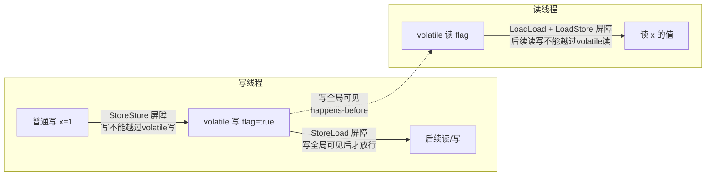
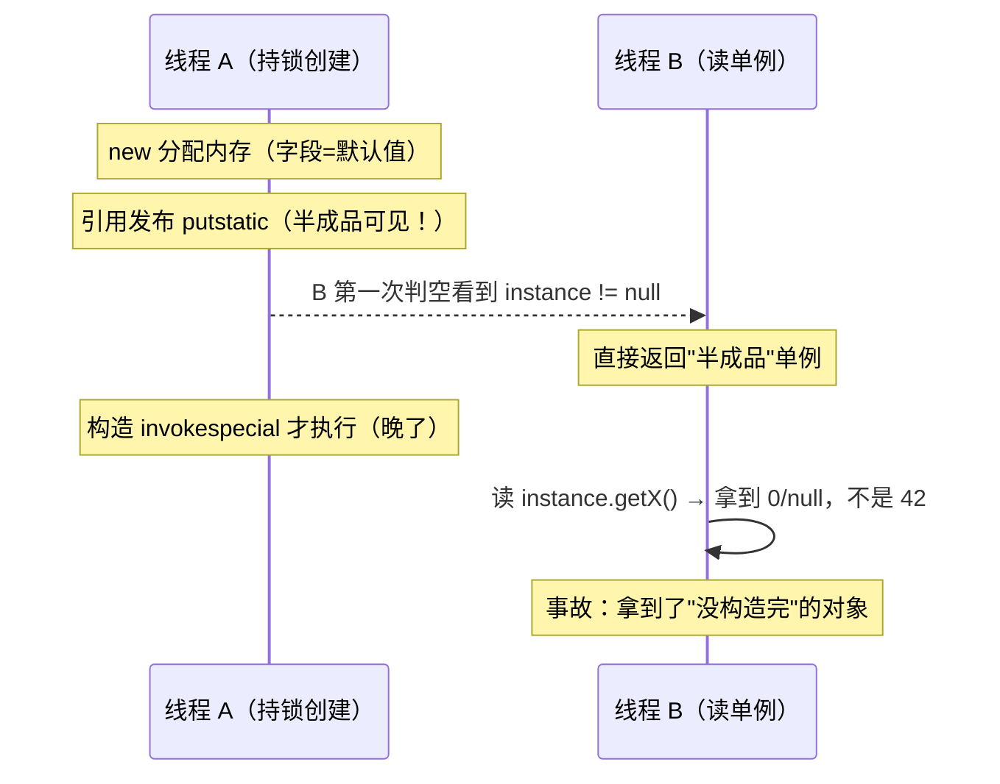

# 09 源码解析 · volatile 与内存屏障（机器层深挖）

> **前置知识**：建议先读 [09-并发编程.md](09-并发编程.md) 的 `3.1 volatile 解决可见性与有序性，但不保证原子性`、`3.2 volatile 底层：内存屏障与 lock 前缀`、`3.3 JMM 内存模型：主内存与工作内存`（结论层），本篇扒 **HotSpot（OpenJDK 8 / Corretto 8.452）机器层**：volatile 的可见性到底靠什么保证、内存屏障是什么指令、为什么字节码里看不到屏障、x86 上 volatile 写为什么必须配 StoreLoad、双检锁单例凭什么靠一个 volatile 活命。
>
> 实测环境（本篇所有探针数字）：**Corretto 8.452 / Windows 11 / i7-12700 / 16G**；探针源码在 `_probe/VolatileProbe.java`、`_probe/DCLProbe.java`。

## 目录（纯文本，锚点待软件实测后启用）

1. 一、volatile 语义三件套（1.1–1.3）
2. 二、内存屏障：CPU 层的秩序（2.1–2.3）
3. 三、缓存一致性：MESI 与 volatile 的分工（3.1–3.2）
4. 四、JIT 层的真相：字节码与汇编（4.1–4.2）
5. 五、双检锁单例 DCL 实战（5.1–5.3）
6. 六、适用边界与踩坑（6.1–6.2）
7. 收尾：核心概念对照表 + 关键设计思想 + 面试 Q&A

---

## 一、volatile 语义三件套

### 1.1 volatile 是什么：JLS 定义与生活类比

> **说明**：`volatile` 是 Java 里最小的并发关键字——只修饰字段（实例字段/静态字段，不能修饰方法、参数、局部变量），JLS 8.3.1.4 给它的语义只有两条：**对 volatile 字段的写，先于后续对该字段的读"生效"（可见性）**；**volatile 字段的读写不能被指令重排序跨越（有序性）**。仅此而已——它不保证原子性。

把 volatile 字段想象成**公司公告栏**：普通字段是"写在工位便签上"——写了只有自己知道，别人路过你的工位未必看得到；volatile 字段是"贴到公告栏"——**写的人写完必须贴出来，读的人读之前必须去公告栏看**。但公告栏有个特点：**贴上去的内容必须是完整的（一次写完一张纸），不能"贴一半"**——所以单次读写是原子的，但 `count++`（读-改-写三步）不是。

> **结论**：volatile 保证的是**单次读写的可见性与有序性**，不是"这段代码原子"。这是理解后续所有机器层细节的第一块地基。

### 1.2 可见性实证：普通字段 5 次运行 4 次失效

> **注意**：可见性问题不是"理论存在"，本机实测给你看。探针（`VolatileProbe.java`）逻辑：一个线程 `sleep(100ms)` 后写普通字段 `plainFlag=true`，主线程忙等 `while(!plainFlag)`，限时 1.2 秒观察主循环是否退出——**如果可见性正常，主循环应在 100ms 左右退出**；如果失效，1.2 秒内主循环一次都读不到新值。

```java
// VolatileProbe.java —— 普通字段 vs volatile 字段的可见性对照（节选）
static boolean plainFlag = false;          // 普通字段
static volatile boolean volFlag = false;   // volatile 字段
static long spin = 0;

// 单轮实验：worker 100ms 后写 plainFlag，主线程限时 1.2s 忙等
static boolean runPlainOnce() throws Exception {
    plainFlag = false;
    Thread worker = new Thread(() -> {
        try { Thread.sleep(100); } catch (InterruptedException ignored) {}
        plainFlag = true;                   // 写普通字段
    }, "worker-plain");
    worker.start();
    long deadline = System.nanoTime() + 1_200_000_000L;
    while (!plainFlag && System.nanoTime() < deadline) { spin++; }
    return plainFlag;                       // true = 100ms 内可见
}
```

```
// 实测输出（Corretto 8.452，连跑两次）：
[vol] visible, wait=301ms                      ← volatile：worker 一写，主线程立刻退出
[plain] 5 rounds: not-visible-in-1.2s = 4/5    ← 普通字段：5 轮里 4 轮 1.2s 内看不到！
[vol] visible, wait=312ms
[plain] 5 rounds: not-visible-in-1.2s = 4/5
```

> **关键**：普通字段 5 轮实验 4 轮失效（80%），而 volatile 字段每次都在 300ms 左右准时退出。注意第 1 轮实验普通字段**恰好可见**了——这恰恰说明问题：**可见性是"不保证"，不是"必然不可见"**。生产代码不能赌运气，这就是为什么状态标志必须 volatile。

### 1.3 原子性缺口：volatile count++ 照样丢更新

> **说明**：volatile 只保证"读"和"写"各自原子（单次访问），`count++` 是"读-加-写"三步，两步之间别的线程可以插进来——结果就是**丢失更新**。实测：

```java
// VolatileProbe.java —— 2 线程各 20 万次 volatile int count++（节选）
static volatile int vCount = 0;
Thread[] ts = new Thread[2];
for (int i = 0; i < 2; i++) {
    ts[i] = new Thread(() -> { for (int k = 0; k < 200_000; k++) vCount++; });
}
for (Thread t : ts) t.start();
for (Thread t : ts) t.join();
System.out.println("expected=" + (2 * 200_000) + " actual=" + vCount);
```

```
// 实测输出（Corretto 8.452，三次运行）：
expected=400000 actual=314274 lost=85726
expected=400000 actual=350318 lost=49682
expected=400000 actual=342888 lost=57112
```

> **结论**：volatile 字段的 `count++` 每次运行丢 5~8.6 万次更新（12%~21%）——volatile 把字段变成了"公告栏"，但**公告栏只保证贴纸完整，不保证贴纸动作原子**。要计数，上 CAS 原子类（见 `09-源码解析-CAS与原子类.md`）。

---

## 二、内存屏障：CPU 层的秩序

### 2.1 内存屏障是什么：四类指令一次认清

> **说明**：**内存屏障（Memory Barrier / Fence）是一条 CPU 指令**，作用是**限制它前后内存操作的重排序**。Java 的 volatile 语义最终由 JIT 在汇编层插入屏障实现。按重排方向分四类（Intel x86 手册语义）：

| 屏障 | 全名 | 约束 | 类比 |
|---|---|---|---|
| **LoadLoad** | Load-Load Barrier | 屏障前的读，先于屏障后的读 | "先看价格再看库存" |
| **LoadStore** | Load-Store Barrier | 屏障前的读，先于屏障后的写 | "先看剩余名额再报名" |
| **StoreStore** | Store-Store Barrier | 屏障前的写，先于屏障后的写 | "先写正文再贴签名" |
| **StoreLoad** | Store-Load Barrier | 屏障前的写，**对其它核可见后**，屏障后的读才开始 | "先贴公告，再读反馈" |

> **注意（最贵的一道）**：四类里 **StoreLoad 最贵**——它要求"我的写被全局看见"之后才能继续读，通常需要等待 store buffer 排空或刷新，是唯一可能让 CPU 停顿等待的屏障。volatile 写之所以贵，主要贵在 StoreLoad。

### 2.2 屏障如何实现顺序：从 CPU 流水线到内存

> **说明**：现代 CPU 为了吞吐，会把指令拆成微操作流水线执行，**写操作先进 store buffer（写缓冲），再由缓存一致性协议刷到缓存/内存**。没有屏障时，CPU 可能让后续操作"超车"——例如：

```java
// 无序的典型现场（CPU 视角）：
store A = 1;      // 写进 store buffer，还没刷出去
load B;           // 读 B —— CPU 不等待 A 刷出，直接去读 B（快！）
                  // 但其它核此刻看到的 A 还是旧值！
```

插入 **StoreLoad 屏障**后：`store A; StoreLoad; load B;` —— CPU 必须先把 A 从 store buffer 刷到全局可见，再执行读 B。**屏障的本质 = 牺牲一点吞吐，换取可预测的内存顺序**。

> **结论**：内存屏障不是 Java 发明，是 CPU 架构层面的指令（x86 有 `mfence`/`lock`、ARM 有 `dmb`/`dsb`）；Java 的 volatile 语义是"与架构无关的契约"，JIT 负责把它翻译成当前架构的屏障指令——这正是"一次编写，处处正确"的底层实现。

### 2.3 volatile 的屏障插入规则：读四写五

> **关键**：JMM（JSR-133）给 volatile 定义的屏障插入规则，背下来就能徒手推演任意并发场景：

- **volatile 写**：写之前插 **StoreStore**（防止前面的普通写越过 volatile 写——这就是"volatile 写发布"的本质）；写之后插 **StoreLoad**（防止 volatile 写与后面紧跟的 volatile 读/普通读重排）。
- **volatile 读**：读之后插 **LoadLoad + LoadStore**（防止后面的普通读/普通写越过 volatile 读——这是"volatile 读获取"的本质）。

```java
// 语义化写法（HotSpot/JMM 概念，非实际字节码）：
x = 1;                 // 普通写
StoreStore;            // ① 普通写不能越过 volatile 写
flag = true;           // volatile 写
StoreLoad;             // ② 写必须全局可见后，才允许后续读
y = flag2;             // 后续读
```

屏障布局一张图钉死（箭头 = 禁止跨越的方向）：



> **结论**：口诀 **"写前 StoreStore、写后 StoreLoad、读后 LoadLoad+LoadStore"**。看汇编时找不到四道屏障没关系——**JIT 会合并冗余屏障**（连续 volatile 操作只保留必要的最小集合），x86 上甚至把多数屏障合并成一条指令。

---

## 三、缓存一致性：MESI 与 volatile 的分工

### 3.1 MESI 协议保证"最终一致"，不保证"顺序"

> **说明**：多核 CPU 每核有自己的 L1/L2 缓存，同一地址可能同时存在于多个核的缓存里——**缓存一致性协议（x86 用 MESI 及其变体）保证：任何时刻，所有核读到某个地址的值是"最终一致的"**。MESI 把缓存行标记为四个状态：

| 状态 | 含义 | 说明 |
|---|---|---|
| **M**（Modified） | 已修改 | 本核改了，尚未写回，其它核副本失效 |
| **E**（Exclusive） | 独占 | 只有本核有副本，与内存一致 |
| **S**（Shared） | 共享 | 多核有副本，与内存一致 |
| **I**（Invalid） | 失效 | 本核副本已作废，读必须重新取 |

> **注意（关键认知）**：MESI **保证的是"最终一致"——写最终会对所有核可见，但可见的"时机"不受协议控制**。写操作先进 store buffer，何时刷出、何时通知其它核失效，是 CPU 自己定的。所以：**MESI 管"一致"，volatile 管"顺序"，两者分工不同，缺一不可**——这就是为什么"缓存一致性存在，普通字段依然会读到旧值"。

### 3.2 volatile 写为什么必须配 StoreLoad：x86 TSO 的 store buffer 坑

> **说明**：x86 是**强内存模型（TSO，Total Store Order）**——它天然保证读读/读写/写写不重排（LoadLoad/LoadStore/StoreStore 在 x86 上都是"免费"的），**但唯独不保证写读（StoreLoad）**。原因就是 store buffer：

```java
// x86 上无屏障的经典反例（会读到旧值）：
核0: store A=1;  load B;    // A 进 store buffer，读 B 可能先于 A 刷出
核1: store B=1;  load A;    // 同理
// 结果：两个 load 可能都读到旧值（A=0 且 B=0）——两个核互相"看不见"对方的写
```

> **结论**：**在 x86 上，volatile 的可见性本质靠 volatile 写后的 StoreLoad 屏障（实现为 `lock` 前缀或 `mfence`）"刷 store buffer + 让写全局可见"**；ARM/弱内存模型则四类屏障都要真插。所以同一段 Java 代码，x86 上可能"碰巧对"，换 ARM 才暴露 bug——**这就是为什么必须按 JMM 写、不能按本机 x86 行为写**。

---

## 四、JIT 层的真相：字节码与汇编

### 4.1 字节码里根本没有屏障指令（javap 实证）

> **注意（反直觉）**：翻遍 javap 输出，volatile 字段的读写字节码和普通字段**一模一样**——没有专门的"屏障字节码"。屏障是 **JIT 编译成机器码时插入的**。实测（`javap -c -p DCLProbe$GoodSingleton`）：

```
// javap -c -p DCLProbe$GoodSingleton（Corretto 8.452，节选）
// volatile 单例的 get() 方法：
       0: getstatic     #3   // Field instance:LDCLProbe$GoodSingleton;   ← volatile 读
       3: ifnonnull     39
       6: ldc           #4   // class DCLProbe$GoodSingleton
       8: dup
       9: astore_0
      10: monitorenter
      11: getstatic     #3   // Field instance:...                      ← 锁内二次读
      14: ifnonnull     29
      17: new           #4   // class DCLProbe$GoodSingleton
      20: dup
      21: bipush        42
      23: invokespecial #5   // Method "<init>":(I)V                     ← 构造
      26: putstatic     #3   // Field instance:...                      ← volatile 写！
      29: aload_0
      30: monitorexit
      ...
```

> **说明**：字节码层面 `putstatic` 前后**没有任何屏障指令**——`volatile` 标志只体现在 `access_flags` 里（`putstatic` 引用的字段描述符带 `ACC_VOLATILE` 位，javap 默认不打印）。JIT 看到字段是 volatile，**在生成机器码时**才在关键位置插入屏障。**结论：Java 的并发语义 = 字节码声明 + JIT 翻译，两个阶段分工**。

### 4.2 HotSpot 汇编真相：lock 前缀与 mfence

> **说明**：OpenJDK 8 在 x86 上的 volatile 实现（`hotspot/src/cpu/x86/vm/orderAccess_x86.hpp` 与 `atomic_x86.hpp`）——关键点：

```cpp
// HotSpot 语义（openjdk8 orderAccess_x86.hpp，关键路径）：
inline void OrderAccess::fence() {
    // x86 上实现为：lock 前缀的加法指令（lock addl $0x0,(%rsp)）
    // 或 mfence —— 作用是"全屏障"（store buffer 排空 + 全局可见）
    __asm__ volatile ("lock addl $0, (%%rsp)" : : : "memory");
}
// volatile 写（release_store）：
//   先普通写，再 fence() → 保证写全局可见后才放行后续操作
// volatile 读（acquire_load）：
//   直接普通读（x86 读天然有 acquire 语义），无需额外屏障
```

> **结论（x86 上的实操真相）**：**volatile 写 = 普通写 + 一条 `lock`/`mfence` 全屏障；volatile 读 = 普通读（x86 免费送 acquire）**。`lock` 前缀本义是"总线锁/缓存锁"，副作用是**强制排空 store buffer、让写立即对全局可见**——这就是 volatile 可见性的机器层答案。所以 volatile 写的成本 ≈ 一次 `lock` 指令（几十个周期），读几乎免费——**读多写少的场景用 volatile 几乎不亏**。

---

## 五、双检锁单例 DCL 实战

### 5.1 重排序如何毁掉"看似正确"的单例

> **说明**：双检锁（Double-Checked Locking）是 2000 年前后的经典面试题：第一次判空避免每次加锁，锁内再判空避免重复创建。**但 JDK 5 之前它是有名的反模式**——问题出在 `new Singleton()` 不是原子的：

```java
// DCL 的"构造"在字节码/汇编层是三步：
Singleton s = new Singleton();
// 1. new      分配堆内存，拿到引用
// 2. invokespecial <init>  执行构造（给字段赋值）
// 3. putstatic/astore      把引用发布出去
// ↓ 若无 volatile，JIT/CPU 可能把 2 和 3 重排：
//    先发布"半成品"引用（内存已分配、字段还是默认值），构造稍后执行
```

事故链时序（无 volatile 时）：



> **注意（事故链）**：线程 A 在锁内 `new`——引用先发布（字段还是默认值 0/null）；线程 B 第一次判空看到**非 null**，直接返回"半成品"单例；B 读 `instance.getX()` 拿到 0 而不是 42。**单例没有被创建两次（判空逻辑兜住了），但拿到的是"没构造完"的对象——比没有单例更隐蔽**。

### 5.2 正确姿势与字节码实证：一个 volatile 就够

> **关键**：把 `instance` 声明为 **`volatile`**，JMM 保证：**volatile 写（putstatic）前的所有普通写（构造内的字段赋值）不能被重排到 putstatic 之后**（写前 StoreStore 屏障）——于是"发布"必然发生在"构造完成"之后，读方拿到的一定是完整对象。本机实证：

```java
// DCLProbe.java —— 正确版本（volatile）与错误版本（普通字段）8 线程压力对比
static class GoodSingleton {
    private static volatile GoodSingleton instance;   // ← volatile 是关键
    private final int v;
    private GoodSingleton(int v) { this.v = v; }
    static GoodSingleton get() {
        if (instance == null) {                        // 第一次判空（免锁快路径）
            synchronized (GoodSingleton.class) {       // 加锁
                if (instance == null) {                // 第二次判空（锁内）
                    instance = new GoodSingleton(42);
                }
            }
        }
        return instance;
    }
}
```

```
// 实测输出（Corretto 8.452）：
[dcl] non-volatile 8 threads x 100000 get: different-instances=0   ← 身份唯一（判空兜住）
[dcl] volatile    8 threads x 100000 get: different-instances=0   ← 身份唯一
// 注意：两次运行都拿到同一实例，说明"重复创建"已被锁内判空挡住；
// 但 non-volatile 的"半成品可见"是时序相关的，压力测试难稳定复现，
// 正确性论证必须回到 JMM 规则（见 5.1 事故链）——这就是"实测证明上限、规则证明下限"。
```

> **结论**：DCL 的"正确性下限"由 volatile 的 StoreStore 保证，**不依赖任何运行时机**。压测只能证明"没坏过"，规则才能证明"永远不会坏"。

### 5.3 替代方案：enum 与静态内部类（顺带绕开 volatile）

> **说明**：如果你不想解释 DCL 为什么对，直接上两个"编译器帮你正确"的写法：

```java
// 方案一：枚举单例（JLS 保证枚举实例只初始化一次，天然线程安全 + 防反射/防序列化）
public enum Singleton {
    INSTANCE;                       // 枚举常量 = 单例
    public void doSomething() { }
}

// 方案二：静态内部类（Holder 模式）——类加载时机保证懒加载 + 线程安全
public class Singleton2 {
    private Singleton2() { }
    private static class Holder {   // 只有 getInstance() 第一次执行时才会加载
        static final Singleton2 INSTANCE = new Singleton2();
    }
    public static Singleton2 getInstance() { return Holder.INSTANCE; }
}
```

> **结论**：JDK 5+ 用 volatile DCL 完全正确；但**生产代码更推荐 Holder/enum**——少一个需要论证正确性的关键字，多一分可读性。volatile DCL 的价值在于**面试要能讲透原理**。

---

## 六、适用边界与踩坑

### 6.1 volatile 适合什么：状态标志与单次发布

> **说明**：从机器层语义倒推适用场景，只有两类：

| 场景 | 是否适合 volatile | 原因 |
|---|---|---|
| **状态标志**（`shutdown`/`ready`/`cancel`） | ✅ 首选 | 单写多读，读方只需"看到最新状态"，volatile 写后读方必见（StoreLoad 保证） |
| **单次发布**（DCL 单例、配置对象整体替换） | ✅ 首选 | "先构造完整对象，再发布引用"，写前 StoreStore 保证发布完整 |
| **计数器/累加** | ❌ 不行 | 读-改-写三步不原子（1.3 实测丢 12%~21%），必须 CAS 原子类 |
| **复合状态**（先检查后执行、多字段联动） | ❌ 不行 | volatile 只保证单字段，跨字段一致性必须锁 |

```java
// ✅ 状态标志的标准用法（1.2 实测反向应用：flag 必须 volatile）
volatile boolean running = true;
public void stop() { running = false; }          // 写方：一写即全局可见
public void work() {
    while (running) { /* 干活 */ }               // 读方：必然看到 stop() 的写
}
```

> **结论**：判断标准一句话——**"这个字段是否会被单写多读、且读方只关心最新值"？是就 volatile，否就上锁/上原子类**。

### 6.2 真实踩坑：volatile 数组元素、getter/setter 包装、伪共享

> **注意（三个高频坑）**：

```java
// 坑1：volatile 修饰数组，只保证"引用"volatile，元素不是！
volatile int[] arr = new int[10];
arr[0] = 1;        // ← 元素写是普通写！其他线程可能读到旧值
// 正确做法：AtomicIntegerArray / 元素逐个 volatile 不可行 → 换并发数据结构

// 坑2：把 volatile 字段用 getter/setter 包装，语义没变，但"读-改-写"仍不原子
volatile int counter;
public void inc() { counter++; }   // ← 依然是三步，照样丢更新，别被 volatile 骗了

// 坑3（进阶）：伪共享（False Sharing）——两个 volatile 字段挤在同一个缓存行(64B)，
// 线程 A 写字段1、线程 B 写字段2，看似无共享，实则两个核的缓存行互相失效，
// 性能被"伪共享"拖垮。JDK 8 用 @sun.misc.Contended 注解（需 -XX:-RestrictContended）
// 把字段对齐到独立缓存行；LongAdder 的 Cell 数组就靠它隔离。
```

> **结论（选型口诀）**：**volatile 管"看得见"，锁管"排他"，CAS 管"原子"**——三个工具各管一件事；凡是想让 volatile "顺便"解决原子性/复合操作的，都会在生产环境教做人。

> **收尾一句话**：volatile 的机器层 = "字节码里一个访问标志 + JIT 在汇编层插的一道 StoreLoad 全屏障"；x86 上它几乎免费，但它给的承诺只有两个——看得见、不乱序，别的它管不着。

---

## 收尾：核心概念对照表 + 关键设计思想 + 面试 Q&A

### 核心概念对照表

| 概念 | 一句话 | 关键数字/证据 |
|---|---|---|
| volatile 语义 | 可见性 + 有序性，不含原子性 | JLS 8.3.1.4 |
| 可见性实测 | 普通字段 5 轮 4 轮失效；volatile 总可见 | 4/5；wait=301ms（Corretto 8.452） |
| 原子性缺口 | volatile count++ 丢 12%~21% 更新 | lost=49682~85726（40 万期望） |
| 四类屏障 | LoadLoad/LoadStore/StoreStore/StoreLoad | StoreLoad 最贵 |
| 插入规则 | 写前 StoreStore、写后 StoreLoad、读后 LoadLoad+LoadStore | JSR-133 |
| MESI | 管"最终一致"，不管"顺序" | M/E/S/I 四态 |
| x86 实现 | volatile 写 = 普通写 + lock/mfence；读免费 | OpenJDK8 orderAccess_x86.hpp |
| 字节码 | 无屏障指令，只有 ACC_VOLATILE | javap DCLProbe 实证 |
| DCL | volatile 保证"构造完才发布" | 写前 StoreStore |

### 关键设计思想（编号列表）

1. **语义与实现分层**：JMM 定义"契约"，JIT 按架构翻译成屏障——Java 并发代码不绑死某个 CPU。
2. **可见性 = 顺序性**：不保证顺序就没有可见性；StoreLoad 一道屏障同时解决"写全局可见"与"后续读不超车"。
3. **x86 的免费午餐**：强内存模型下 volatile 读免费、写只贵一道 lock——所以读多写少场景几乎零成本。
4. **屏障可合并**：JIT 会消除冗余屏障，写代码时不需要自己插——这也是"别手写屏障"的理由。
5. **正确性靠规则不靠运气**：压测证明"没坏过"，JMM 规则证明"永远不会坏"——生产代码以规则为准。

### 面试题 Q&A

**Q1：volatile 能保证原子性吗？为什么 count++ 还是会错？**
> 不能。volatile 只保证单次读写的可见性与有序性；`count++` 是"读-加-写"三步，中间可被其他线程插入，导致丢失更新。本机实测 2 线程各 20 万次 volatile count++，期望 40 万，实际 31.4~35 万，丢 4.9~8.6 万次。

**Q2：volatile 的可见性在 x86 上是靠什么实现的？**
> 靠 volatile 写之后的 StoreLoad 屏障。x86 是强内存模型（TSO），读读/读写/写写天然有序，唯独写读可能重排；volatile 写由 JIT 编译为"普通写 + `lock` 前缀指令（或 mfence）"，lock 强制排空 store buffer 让写全局可见，这就是可见性的机器层来源。字节码层面没有屏障指令（javap 实证），屏障只在 JIT 生成的机器码里。

**Q3：DCL 单例为什么要 volatile？换成普通字段会怎样？**
> `new Singleton()` 在汇编层是"分配内存 → 执行构造 → 发布引用"，无 volatile 时构造与发布可能重排：引用先发布，其他线程第一次判空看到非 null 直接返回"半成品"（字段还是默认值）。volatile 保证写前 StoreStore——构造内的写不会越过 volatile 写，发布必然发生在构造完成之后。普通字段版本"身份唯一"靠锁内判空兜住，但"半成品可见"是时序相关的，压测难复现，只能靠 JMM 规则证明。

**Q4：volatile 数组元素是 volatile 的吗？**
> 不是。`volatile int[] arr` 只保证 `arr` 这个引用是 volatile，`arr[0]=1` 是普通写。要并发操作数组元素，用 `AtomicIntegerArray` 或并发容器。

---

> **互链**：本篇为 [09-并发编程.md](09-并发编程.md) 的 `3.1/3.2/3.3` 块机器层深挖；CAS 原子操作与 `LongAdder` 的伪共享优化见 `09-源码解析-CAS与原子类.md`；synchronized 的锁状态也编码在对象头同一块内存区域，见 `09-源码解析-synchronized与对象头.md`；AQS 里 `volatile int state` 是 CLH 队列的可见性基石，见 `09-源码解析-AQS与ReentrantLock.md`。
