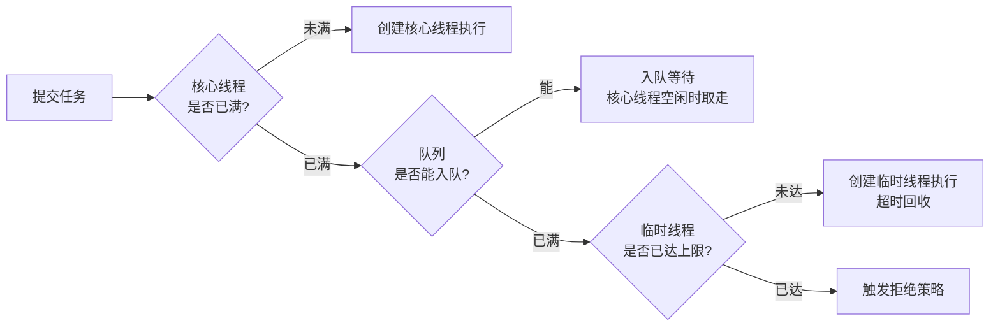
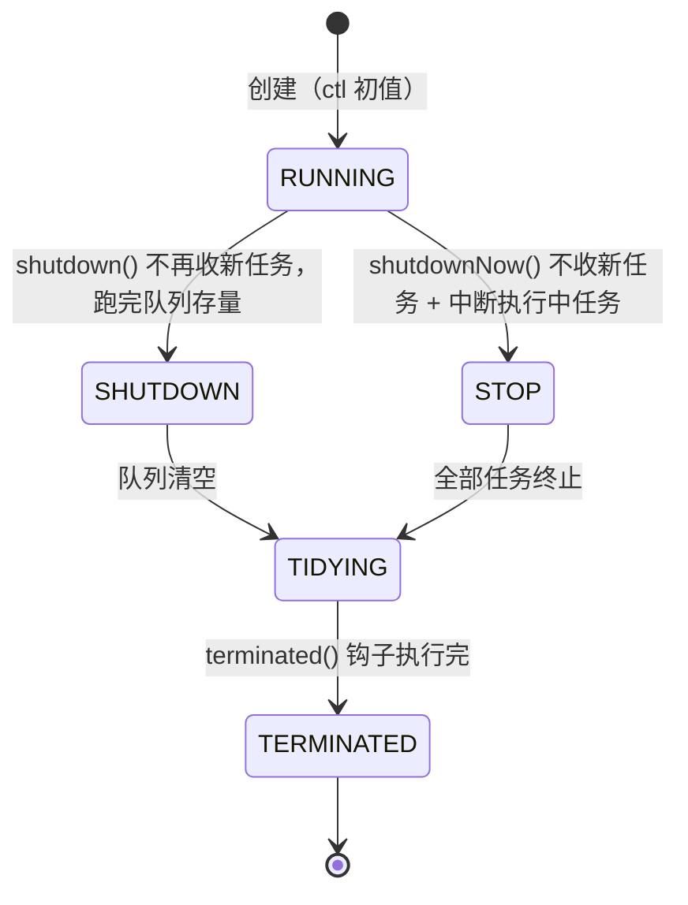

# 09 源码解析 · 线程池 ThreadPoolExecutor（机器层深挖）

> **前置知识**：建议先读 [09-并发编程.md](09-并发编程.md) 的 `6.1 线程池 ThreadPoolExecutor 七大参数`、`6.2 线程池提交流程与四种拒绝策略`、`6.3 Executors 四个工厂方法的坑`（结论层），本篇扒 **OpenJDK 8（Corretto 8.452）源码**：`ctl` 一个 int 怎么同时装"状态 + 线程数"、`execute()` 四步走每一步在干什么、`addWorker` 怎么保证并发下不超建线程、Worker 为什么继承 AQS、`runWorker` 的 while 循环为什么是"线程复用"的本质、`getTask` 的超时销毁怎么触发。
>
> 实测环境（本篇所有探针数字）：**Corretto 8.452 / Windows 11 / i7-12700 / 16G**；探针源码在 `_probe/TPEProbe.java`、`_probe/ConcurrentProbe.java`。

## 目录（纯文本，锚点待软件实测后启用）

1. 一、线程池的设计目标（1.1–1.2）
2. 二、构造函数与四大拒绝策略（2.1–2.2）
3. 三、ctl：一个 int 装两样东西（3.1–3.2）
4. 四、execute 提交流程（4.1–4.2）
5. 五、Worker 与线程复用（5.1–5.3）
6. 六、线程池状态机（6.1）
7. 七、Executors 的坑与参数实战（7.1–7.2）
8. 收尾：核心方法对照表 + 关键设计思想 + 面试 Q&A

---

## 一、线程池的设计目标

### 1.1 为什么需要线程池：创建线程是"重"操作

> **说明**：Java 线程 = 操作系统线程（1:1 模型，HotSpot 经典实现）。创建一个线程要：分配线程栈（默认 **1MB**，`-Xss` 可调）+ 内核创建 TCB + 调度器登记……**几十微秒级**；而一个任务的执行往往只有几百微秒甚至更短——**"创建线程的成本 > 任务本身"** 是高频短任务场景的核心矛盾。

| 操作 | 典型量级 | 说明 |
|---|---|---|
| 线程创建 | ~10–100 μs | 栈分配 + 内核 TCB + 调度登记 |
| 线程切换 | ~1–10 μs | 上下文保存/恢复 + 缓存冷 |
| 线程销毁 | ~10–100 μs | 内核回收 + 栈释放 |
| 一次 CAS | ~1–10 ns | 对照：用户态无锁操作 |

> **结论**：**池化 = 把"创建/销毁"成本摊到多次复用上**。线程池的核心目标就两个——**① 复用线程（省创建/销毁）② 队列缓冲（削峰填谷，任务来不及处理先排队）**。

### 1.2 核心思想：复用 + 缓冲，一张图看懂

> **说明**：线程池的完整数据流 = **提交 → 核心线程 → 队列 → 临时线程 → 拒绝**（四级台阶，见 4.1 的 execute 流程）：



> **注意（反直觉）**：**核心线程满了之后，任务先去队列，而不是立刻建临时线程**——临时线程（非核心）只在"核心满 + 队列满"时才创建。这是"缓冲优先于扩张"的设计：**优先让任务排队消化，避免盲目扩线程**（扩线程有内存/切换成本）。实测（`TPEProbe`，core=1/max=2/queue=2）：

```
// 实测输出（Corretto 8.452）：
[flow] task#0 running on pool-1    ← 核心线程 pool-1 执行
[flow] task#3 running on pool-2    ← task#1、#2 先入队；task#3 触发创建临时线程 pool-2
[flow] task#4 REJECTED (AbortPolicy)  ← 队列满(2) + 线程满(2) → 拒绝第 5 个
[flow] task#1 running on pool-1
[flow] task#2 running on pool-2
// 5 个任务：核心 1 + 队列 2 + 临时 1 + 拒绝 1 —— 四级台阶全走了一遍
```

---

## 二、构造函数与四大拒绝策略

### 2.1 七大参数：每个参数管一级台阶

> **说明**：`ThreadPoolExecutor` 最全的构造函数有 7 个参数，每个对应一条设计决策：

```java
public ThreadPoolExecutor(
        int corePoolSize,                  // ① 核心线程数：常驻，不回收（allowCoreThreadTimeOut 除外）
        int maximumPoolSize,               // ② 最大线程数：核心 + 临时上限
        long keepAliveTime,                // ③ 临时线程空闲存活时间
        TimeUnit unit,                     // ④ 时间单位
        BlockingQueue<Runnable> workQueue, // ⑤ 任务队列（缓冲）
        ThreadFactory threadFactory,       // ⑥ 线程工厂（命名/daemon/优先级）
        RejectedExecutionHandler handler)  // ⑦ 拒绝策略（四级台阶全满时）
```

| 参数 | 作用 | 常见取值 |
|---|---|---|
| corePoolSize | 常驻线程数 | CPU 密集 N+1 / IO 密集 2N（见 7.2） |
| maximumPoolSize | 线程数上限 | 与队列容量配合（队列有界时才有意义） |
| keepAliveTime | 临时线程回收时间 | 常见 30–60s |
| workQueue | 缓冲队列 | 有界 ArrayBlockingQueue（推荐）/ 无界 LinkedBlockingQueue（慎用） |
| threadFactory | 线程命名 | 必须命名（排查 jstack 时救命） |
| handler | 拒绝策略 | 默认 AbortPolicy（抛异常） |

> **结论**：**参数的本质 = 四级台阶（核心→队列→临时→拒绝）的每一级门槛**。core 管常驻、queue 管缓冲、max 管上限、handler 管溢出。

### 2.2 四种拒绝策略：溢出时的四种态度

> **说明**：当"核心满 + 队列满 + 线程满"三满，提交的第 N+1 个任务触发拒绝策略。JDK 内置四种（JDK 8）：

| 策略 | 行为 | 适用 |
|---|---|---|
| **AbortPolicy**（默认） | **抛 `RejectedExecutionException`** | 必须感知丢失（默认，推荐显式捕获） |
| **CallerRunsPolicy** | 提交者（调用线程）自己执行 | 降速：让生产者亲自干活，自然限流 |
| **DiscardPolicy** | 静默丢弃 | 可容忍丢任务（日志/统计） |
| **DiscardOldestPolicy** | 丢弃队列最旧任务，再尝试提交 | 追求"最新任务优先" |

```java
// 实测：AbortPolicy 下超额任务抛异常（ConcurrentProbe.java，核心2/最大4/队列2）
// 提交 10 个 100ms 任务 → 队列(2) + 线程(4) 共容纳 6 个，第 7 个起被拒
```

```
// 实测输出（Corretto 8.452）：
[reject] 核心2/最大4/队列2 提交10任务 -> 接受=6 拒绝=4
// 容量 = 核心2 + 队列2 + 临时2 = 6；10 - 6 = 4 个触发 AbortPolicy
```

> **注意（生产选型）**：**默认 AbortPolicy 会让业务直接抛异常**——如果不想让一次峰值拖垮主流程，用 CallerRunsPolicy（让调用方执行，天然背压）；**Discard 系策略要慎重**，静默丢任务等于丢数据。拒绝策略是对外的最后一道闸，**应该配套监控告警**（拒绝次数 > 0 就报警）。

---

## 三、ctl：一个 int 装两样东西

### 3.1 ctl 位布局：高 3 位状态 + 低 29 位线程数

> **说明**：线程池把"**运行状态（5 种）**"和"**线程数（0~CAPACITY）**"**塞进一个 AtomicInteger**——高 3 位存状态，低 29 位存线程数。好处：**状态与线程数可以在一次 CAS 里原子更新**（比如 shutdown 时状态变了线程数没变，不会撕裂）。JDK 8 的位布局：

```java
// ThreadPoolExecutor（JDK 8，ctl 布局）：
private final AtomicInteger ctl = new AtomicInteger(ctlOf(RUNNING, 0));
private static final int COUNT_BITS = Integer.SIZE - 3;   // 29
private static final int CAPACITY   = (1 << COUNT_BITS) - 1;  // 低 29 位全 1 = 536870911

// 三种位运算（背下来，所有状态判断都靠它）：
private static int runStateOf(int c)     { return c & ~CAPACITY; }  // 高 3 位
private static int workerCountOf(int c)  { return c & CAPACITY; }   // 低 29 位
private static int ctlOf(int rs, int wc) { return rs | wc; }        // 合并
```

本机实测（`TPEProbe.ctlBits`）：

```
// 实测输出（Corretto 8.452）：
[ctl] COUNT_BITS=29 CAPACITY=536870911 (max workers)
[ctl] RUNNING   =-536870912        ← 高3位 111 + 低29位 0
[ctl] SHUTDOWN  =0
[ctl] STOP      =536870912
[ctl] TIDYING   =1073741824
[ctl] TERMINATED=1610612736
[ctl] ctl(3 workers)=-536870909 runStateOf=-536870912 workerCountOf=3
[ctl] ordering check: -536870912 < 0 < 536870912 < 1073741824 < 1610612736 -> true
```

> **关键**：**状态值的大小顺序（RUNNING < SHUTDOWN < STOP < TIDYING < TERMINATED）被用作状态机的天然判断**——"新状态 >= 旧状态"即"生命周期向前走"（见第六章）。一个 ctl 的 CAS = 一次原子地改状态 + 改线程数，**这是并发线程池不用锁维护全局状态的基石**。

### 3.2 为什么这样设计：状态与线程数的原子性

> **说明**：如果不把状态和线程数放一起，会出什么问题？想象 `shutdown()` 要改状态、`addWorker` 要加线程数——**两个字段分开放，就得加锁保护**；放一起后，一次 `compareAndSet(ctl, ...)` 同时完成两者，无锁且原子：

```java
// 典型原子切换（JDK 8）：
private void advanceRunState(int targetState) {
    for (;;) {
        int c = ctl.get();
        if (runStateAtLeast(c, targetState) ||       // 已经 >= 目标状态 → 不操作
            ctl.compareAndSet(c, ctlOf(targetState, workerCountOf(c))))  // 只改高 3 位，线程数原样保留
            break;
    }
}
// shutdown() 就是 advanceRunState(SHUTDOWN) + 中断空闲线程 —— 全程无锁，靠 ctl CAS
```

> **结论**：**位压缩（bit-packing）是并发数据结构的经典技巧**——用一次 CAS 表达"两个相关状态量的联合更新"，省掉锁，还天然原子。理解了 ctl，线程池所有的 `runStateAtLeast/workerCountOf` 判断就都通了。

---

## 四、execute 提交流程

### 4.1 execute 四步：核心→队列→临时→拒绝

> **说明**：`execute(Runnable)` 是提交任务的入口，JDK 8 的四步判断（与 1.2 的流程图一一对应）：

```java
// ThreadPoolExecutor.execute（JDK 8，完整）：
public void execute(Runnable command) {
    if (command == null) throw new NullPointerException();
    int c = ctl.get();
    // ① 线程数 < 核心线程数 → 创建核心线程（firstTask 直接执行）
    if (workerCountOf(c) < corePoolSize) {
        if (addWorker(command, true))
            return;
        c = ctl.get();                       // addWorker 失败（如已 shutdown）→ 重新读状态
    }
    // ② 状态 RUNNING 且队列能入队 → 入队（缓冲）
    if (isRunning(c) && workQueue.offer(command)) {
        int recheck = ctl.get();             // ★ 双重检查
        if (!isRunning(recheck) && remove(command))  // 入队后线程池关了 → 移除并拒绝
            reject(command);
        else if (workerCountOf(recheck) == 0)        // 队列有任务但一个线程都没有 → 补一个
            addWorker(null, false);
    }
    // ③ 队列满 → 尝试建临时线程
    else if (!addWorker(command, false))
        reject(command);                     // ④ 临时线程也建不了（满/关闭）→ 拒绝
}
```

> **注意（双重检查的用意）**：任务入队后，线程池可能刚好被 `shutdown()`——**入队成功 ≠ 任务会被执行**，所以必须 `recheck`：状态不对就 `remove` 再 `reject`。这就是为什么"execute 之后任务也可能没执行"——**提交者必须处理拒绝/关闭的边界**。

### 4.2 addWorker：并发下怎么保证不超建

> **说明**：`addWorker` 是"建线程"的原子入口，分两部分：**Part 1 用 CAS 把 workerCount+1（抢"建线程名额"）**；**Part 2 真正 new Worker 并 start**。Part 1 的抢名额循环是防超建的关键（JDK 8）：

```java
// ThreadPoolExecutor.addWorker Part1（JDK 8，节选语义）：
private boolean addWorker(Runnable firstTask, boolean core) {
    retry:
    for (;;) {
        int c = ctl.get();
        int rs = runStateOf(c);
        // 状态检查：shutdown 之后不再接受新任务（core=true 且 firstTask==null 的例外是补线程）
        if (rs >= SHUTDOWN && !(rs == SHUTDOWN && firstTask == null && !workQueue.isEmpty()))
            return false;
        for (;;) {
            int wc = workerCountOf(c);
            if (wc >= CAPACITY || wc >= (core ? corePoolSize : maximumPoolSize))
                return false;                      // 超上限 → 不建
            if (compareAndSetWorkerCount(wc, wc + 1))  // ★ CAS 抢名额成功
                break retry;                      // 名额到手，跳出两层循环
            c = ctl.get();                        // 被抢/状态变了 → 重读重试
            if (runStateOf(c) != rs) continue retry;   // 状态变了 → 回外层重新判断
        }
    }
    // Part 2：new Worker(firstTask) → workers.add(w) → w.thread.start()
    //（Part 2 失败会 rollback：workerCount-1 + 尝试终结，防止"名额占了线程没建成"）
}
```

> **关键（并发正确性）**：多线程同时 `execute` 时，**所有线程都在抢同一个 workerCount 的 CAS**——成功者建线程，失败者重读重试。`compareAndSetWorkerCount` 保证了"**线程总数绝不超过 maximumPoolSize**"（即使 1000 个线程同时提交）。这就是无锁并发里"**名额制**"的标准写法：**先抢配额，再干实事，失败回滚**。

---

## 五、Worker 与线程复用

### 5.1 Worker 是什么：AQS + Runnable 的合体

> **说明**：线程池里的"线程"不是裸 Thread，而是包装类 **`Worker`**（内部类）。它继承 AQS（见 `09-源码解析-AQS与ReentrantLock.md`）实现了一把**不可重入的独占锁**，同时实现 Runnable 作为任务载体：

```java
// ThreadPoolExecutor.Worker（JDK 8，字段与设计）：
private final class Worker extends AbstractQueuedSynchronizer implements Runnable {
    final Thread thread;            // 真正的工作线程
    Runnable firstTask;             // 首个任务（可能为 null：从队列取）
    volatile long completedTasks;   // 完成任务计数

    Worker(Runnable firstTask) {
        setState(-1);               // 初始 state=-1：禁止中断（running 前不可打断）
        this.firstTask = firstTask;
        this.thread = getThreadFactory().newThread(this);  // 用线程池工厂创建
    }
    public void run() { runWorker(this); }   // 线程启动后执行 runWorker（见 5.2）
    // AQS 实现：state 0=空闲 1=执行中 —— 用于"执行任务时禁止 shutdownNow 中断"
    protected boolean tryAcquire(int unused) {
        if (compareAndSetState(0, 1)) { setExclusiveOwnerThread(Thread.currentThread()); return true; }
        return false;
    }
}
```

> **注意（为什么 Worker 要继承 AQS）**：`shutdownNow()` 要中断所有线程，但**正在执行任务的线程不能被误中断**（任务可能正要提交数据库事务）——Worker 的 AQS 锁（state 0→1）标记"正在执行"，`interruptWorkers` 只中断**没拿到锁（state=0）**的空闲线程。**用"锁状态"表达"忙碌状态"，是 Doug Lea 的经典设计**。

### 5.2 runWorker：while 循环就是线程复用的本质

> **说明**：`runWorker` 是每个工作线程的主循环——**一个线程执行完一个任务，不退出，继续从队列取下一个任务**。这就是"线程复用"的机器层真相（JDK 8）：

```java
// ThreadPoolExecutor.runWorker（JDK 8，核心循环）：
final void runWorker(Worker w) {
    Thread wt = Thread.currentThread();
    Runnable task = w.firstTask;
    w.firstTask = null;
    w.unlock();                       // 允许中断（对应构造里 state=-1）
    boolean completedAbruptly = true;
    try {
        // ★ 复用核心：task 取一个执行一个，取不到(getTask 返回 null)才退出
        while (task != null || (task = getTask()) != null) {
            w.lock();                 // 执行中加锁：禁止 shutdownNow 中断
            try {
                task.run();           // 真正执行用户任务
            } finally {
                w.unlock();
            }
            task = null;              // 执行完置空 → 下次从 getTask() 取
            w.completedTasks++;
        }
        completedAbruptly = false;
    } finally {
        processWorkerExit(w, completedAbruptly);  // 退出：收尾 + 按需补线程
    }
}
```

实测线程复用（`TPEProbe.threadReuse`，2 线程执行 6 任务）：

```
// 实测输出（Corretto 8.452）：
[reuse] task#0 -> reuse-1
[reuse] task#1 -> reuse-2
[reuse] task#3 -> reuse-2      ← reuse-2 已经执行第 3 个任务
[reuse] task#2 -> reuse-1
[reuse] task#5 -> reuse-1      ← reuse-1 执行第 4 个任务
[reuse] task#4 -> reuse-2
// 6 个任务只有 2 个线程：同一个线程串行执行多个任务 = 复用
```

> **结论**：**"线程池"的字面意思就是这里**——`while (task != null || (task = getTask()) != null)` 一行代码：**线程不随任务结束而销毁，而是循环取任务**。`getTask()` 返回 null（见 5.3）才会跳出循环、线程才真正退出。

### 5.3 getTask：取任务 + 超时回收的触发器

> **说明**：`getTask` 决定"线程是继续干活还是退休"——**核心线程用 `take()`（没任务就阻塞等），临时线程用 `poll(keepAliveTime)`（超时没任务就返回 null → 线程退出）**：

```java
// ThreadPoolExecutor.getTask（JDK 8，节选语义）：
private Runnable getTask() {
    boolean timedOut = false;
    for (;;) {
        int c = ctl.get();
        // 状态检查：shutdown 且队列空 / stop → 线程数-1 并返回 null（线程退休）
        if (runStateAtLeast(c, SHUTDOWN)
            && (runStateAtLeast(c, STOP) || workQueue.isEmpty())) {
            decrementWorkerCount();
            return null;
        }
        int wc = workerCountOf(c);
        // ★ timed = 临时线程（wc > core）或允许核心超时（allowCoreThreadTimeOut）
        boolean timed = allowCoreThreadTimeOut || wc > corePoolSize;
        if ((wc > maximumPoolSize || (timed && timedOut))
            && (wc > 1 || workQueue.isEmpty())) {
            if (compareAndDecrementWorkerCount(c))
                return null;                  // ★ 返回 null → runWorker 退出 → 线程销毁
        }
        try {
            // 临时线程：poll(keepAliveTime) 超时返回 null → timedOut=true 下次判退出
            Runnable r = timed ? workQueue.poll(keepAliveTime, NANOSECONDS)
                               : workQueue.take();   // 核心线程：take 一直阻塞等
            if (r != null) return r;
            timedOut = true;
        } catch (InterruptedException retry) { timedOut = false; }
    }
}
```

> **注意（keepAliveTime 的完整链路）**：**临时线程的回收 = `poll(keepAliveTime)` 超时返回 null → timedOut=true → 下一轮循环 CAS 线程数-1 → 返回 null → runWorker 跳出 while → processWorkerExit 销毁线程**。所以 `keepAliveTime` 不是"定时器到点就杀"，而是"**空闲时间超过 keepAliveTime 的那次 poll 超时**"才触发——**线程只在"取不到任务"时才有机会退休**。

---

## 六、线程池状态机

### 6.1 五状态流转：RUNNING → SHUTDOWN → STOP → TIDYING → TERMINATED

> **说明**：线程池生命周期 5 个状态（数值大小有序，见 3.1 实测），状态只能向前走（`runStateAtLeast` 判断）：



| 状态 | 收新任务 | 处理队列 | 中断执行中 | 触发 |
|---|---|---|---|---|
| **RUNNING** | ✅ | ✅ | ❌ | 初始状态（高 3 位 111） |
| **SHUTDOWN** | ❌ | ✅ | ❌ | `shutdown()`：优雅关闭 |
| **STOP** | ❌ | ❌ | ✅ | `shutdownNow()`：立即关闭 |
| **TIDYING** | ❌ | 清空 | — | 线程数为 0，执行 `terminated()` |
| **TERMINATED** | ❌ | — | — | `terminated()` 完成，`awaitTermination` 返回 |

> **注意（面试高频坑）**：**shutdown 和 shutdownNow 的本质区别 = 是否中断执行中的任务**——shutdown 等队列跑完（不打断正在执行的任务），shutdownNow 中断所有 Worker（只中断空闲的？不——`interruptWorkers` 中断所有没持有 Worker 锁的，正在执行的靠 5.1 的锁保护）。**调用 shutdown 后新任务会被拒绝（RejectedExecutionException）**，老任务正常收尾。

---

## 七、Executors 的坑与参数实战

### 7.1 Executors 四个工厂方法的坑

> **说明**：`Executors` 提供四个快捷工厂，**全是"省事但不安全"的默认值**（生产不推荐直接用）：

| 工厂方法 | 队列 | 坑 |
|---|---|---|
| `newFixedThreadPool(n)` | **无界** LinkedBlockingQueue | 队列无限 → 任务堆积 OOM |
| `newSingleThreadExecutor()` | 无界 LinkedBlockingQueue | 同上（单线程版） |
| `newCachedThreadPool()` | SynchronousQueue（不缓存） | 线程数无上限（最大 Integer.MAX_VALUE）→ 疯狂建线程 OOM |
| `newScheduledThreadPool(n)` | 延迟队列 | 默认无界 + 无界队列 → 堆积风险 |

```java
// 三个必背的坑（面试连环问）：
// 坑1：newFixedThreadPool 用无界队列 —— 提交 1 亿个任务，队列吃掉所有内存 → OOM
ExecutorService pool = Executors.newFixedThreadPool(10);   // 生产别用！
// 坑2：newCachedThreadPool 线程数无上限 —— 短任务风暴时每秒新建成千上万线程
ExecutorService pool2 = Executors.newCachedThreadPool();   // 线程数上限 = Integer.MAX_VALUE
// 坑3：都缺省命名 —— jstack 只能看到 pool-1-thread-1，不知道是谁的业务
```

> **结论（生产姿势）**：**一律 `new ThreadPoolExecutor(...)` 手写参数**——有界队列（ArrayBlockingQueue）+ 命名工厂（ThreadFactory 带业务前缀）+ 明确拒绝策略。`Executors` 工厂只适合 Demo/测试。

### 7.2 参数怎么定：CPU 密集 vs IO 密集

> **说明**：参数估算没有银弹，但有两个经典基准（经验值，需压测验证）：

| 场景 | 核心线程数 | 依据 |
|---|---|---|
| **CPU 密集** | **CPU 核数 + 1** | 线程数 ≈ 核数，+1 防缺页/偶发停顿空窗 |
| **IO 密集** | **2 × CPU 核数**（或按阻塞比） | 线程在 IO 等待时不占 CPU，多开线程并行 IO |

```java
// 经验公式（IO 密集更精确版：CPU 核数 × (1 + 等待时间/计算时间)）
// 例：CPU 核 8，任务 80% 时间在等 IO → 8 × (1 + 0.8/0.2) = 8 × 5 = 40
int cores = Runtime.getRuntime().availableProcessors();
int cpuIntensive = cores + 1;                                  // CPU 密集
int ioIntensive = cores * 2;                                   // IO 密集（简化版）
int ioPrecise = (int) (cores * (1 + waitTime / computeTime));  // IO 密集（阻塞比版）
```

> **注意（三个配套决策）**：① **队列必须有界**（无界 = OOM 敞口），容量参考"峰值积压量"；② **拒绝策略要配套监控**（拒绝次数告警）；③ **核心线程数 ≠ 越大越好**——超过核数太多，线程切换开销吃掉收益，吞吐反而下降（可用压测画曲线）。**先按公式起量，再用压测校准**。

> **收尾一句话**：线程池的机器层 = "一个位压缩的 ctl（状态+线程数）+ 一条有界队列 + 一个抢名额的 addWorker + 一行 while 复用循环"；它把线程的创建、复用、回收、拒绝全部工程化——用好它的前提是先想清楚"任务是什么类型、峰值多大、能不能丢"。

---

## 收尾：核心方法对照表 + 关键设计思想 + 面试 Q&A

### 核心方法对照表

| 方法 | 作用 | 关键实现 |
|---|---|---|
| `execute(Runnable)` | 提交任务四步走 | 核心→队列（双重检查）→临时→拒绝 |
| `addWorker` | 建线程（抢名额+start） | CAS workerCount+1，超上限拒绝 |
| `runWorker` | 线程主循环（复用） | while (task != null || (task = getTask()) != null) |
| `getTask` | 取任务/超时回收 | take（核心）/ poll(keepAliveTime)（临时） |
| `processWorkerExit` | 线程收尾 | 移除 Worker + 按需补线程 |
| `shutdown/shutdownNow` | 关闭 | 状态流转 + 中断空闲/执行中 Worker |
| `ctl` 位运算 | 状态+线程数合一 | runStateOf/workerCountOf/ctlOf |

### 关键设计思想（编号列表）

1. **复用优先于创建**：while 循环让线程"干完接着干"，创建/销毁成本摊到无数次复用上。
2. **缓冲优先于扩张**：核心满先入队，队列满才扩临时线程——扩线程有成本，排队更便宜。
3. **名额制防超建**：先 CAS 抢 workerCount，再建线程，失败回滚——并发下线程数绝不超上限。
4. **位压缩原子性**：状态 + 线程数合一个 int，一次 CAS 联合更新，无锁且不撕裂。
5. **状态即策略**：5 状态数值有序，生命周期判断退化成大小比较；Worker 的 AQS 锁把"忙碌"变成可中断性判断。

### 面试题 Q&A

**Q1：线程池提交一个任务，完整流程是什么？**
> execute 四步：① 线程数 < corePoolSize → addWorker 建核心线程直接执行；② 状态 RUNNING 且队列能入队 → 入队缓冲，随后 recheck 双重检查（状态变了就 remove+reject，没线程就补一个）；③ 队列满 → addWorker 建临时线程（firstTask=command, core=false）；④ 临时线程也建不了（达到 maximumPoolSize 或已关闭）→ 拒绝策略。实测 core=1/max=2/queue=2 提交 5 个：1 核心 + 2 入队 + 1 临时 + 1 拒绝。

**Q2：ctl 为什么要状态和线程数放一个 int？位运算怎么拆？**
> 高 3 位状态 + 低 29 位线程数（COUNT_BITS=29，CAPACITY=536870911）。放一起的好处：状态与线程数能在一次 CAS 里原子更新（如 shutdown 改状态不动线程数），无需加锁。拆法：runStateOf(c)=c & ~CAPACITY（高 3 位），workerCountOf(c)=c & CAPACITY（低 29 位），ctlOf(rs,wc)=rs|wc。实测：RUNNING=-536870912（高 3 位 111）、SHUTDOWN=0、STOP=536870912……状态值大小有序，生命周期判断 = 大小比较。

**Q3：线程复用是怎么实现的？keepAliveTime 怎么触发回收？**
> 复用靠 runWorker 的 while 循环：`while (task != null || (task = getTask()) != null)` —— 一个线程执行完任务继续从队列取，取不到才退出。回收链路：临时线程 getTask 用 `poll(keepAliveTime)`，超时返回 null → timedOut=true → 下一轮 CAS 线程数-1 → 返回 null → runWorker 跳出 → processWorkerExit 销毁。核心线程用 take() 一直阻塞等，不回收（除非 allowCoreThreadTimeOut）。实测 6 个任务只有 reuse-1/reuse-2 两个线程执行。

**Q4：Executors 的工厂方法有什么坑？生产上怎么配？**
> newFixedThreadPool/newSingleThreadExecutor 用无界 LinkedBlockingQueue（任务堆积 OOM）；newCachedThreadPool 线程数无上限（Integer.MAX_VALUE）；都缺省线程命名。生产姿势：手写 ThreadPoolExecutor + 有界 ArrayBlockingQueue + 命名 ThreadFactory + 明确拒绝策略（AbortPolicy 配告警或 CallerRunsPolicy 背压）。线程数估算：CPU 密集 N+1、IO 密集 2N（或 N×(1+等待/计算)），再用压测校准。

---

> **互链**：本篇为 [09-并发编程.md](09-并发编程.md) 的 `6.1/6.2/6.3` 块机器层深挖；Worker 的锁继承自 AQS，见 `09-源码解析-AQS与ReentrantLock.md`；execute 的 CAS 抢名额与原子类同源，见 `09-源码解析-CAS与原子类.md`；队列（ArrayBlockingQueue 的有界缓冲与双 Condition）见 `09-源码解析-并发容器.md`；ThreadLocal 在线程池里的串号坑见 `09-源码解析-ThreadLocal内存泄漏.md`。
